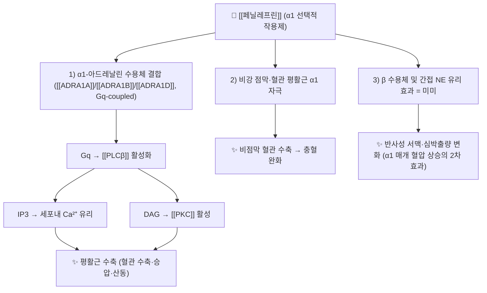

![[페닐레프린_낱알.jpg|540]]
> [그림 1: 식약처 의약품안전나라]

# 🔬 [[페닐레프린]] (Phenylephrine, C₉H₁₃NO₂ / (1R)-1-(3-하이드록시페닐)-2-(메틸아미노)에탄-1-올)

> **핵심 3줄 요약 (Key Summary)**:
> - 🌿 기원 본초 & 화학 계열: **합성 교감신경흥분제(합성 아민계)**. 천연 본초 함유 성분이 아니라 **에페드린(마황 유래) · 에피네프린(부신수질 유래) 골격을 참고해 설계된 합성 phenethylamine계 아민**이다. 즉 특정 [[본초]]의 지표성분이 아니며, [[마황]](Ephedra) 유래 [[에페드린]]과 **약리 계열(교감신경흥분제)** 을 공유할 뿐이다.
> - 🎯 핵심 분자 표적 & 조절 경로: **α₁-아드레날린성 수용체([[ADRA1A]], [[ADRA1B]], [[ADRA1D]]) 선택적 작용제**. Gq 단백질 → [[PLCβ]] → IP₃/DAG → 세포내 Ca²⁺ 상승 및 [[PKC]] 활성 → 혈관·비점막 평활근 수축. β 수용체 작용은 미미하고, 간접적 노르에피네프린 유리 효과도 거의 없다.
> - 🩺 주요 약리 활성 & 질환 치료 기전: **혈관 수축(승압·국소 지혈·산동)**, **비점막 혈관 수축에 의한 충혈 완화(비충혈제거)**, **마취 중 저혈압 교정**, 수술 중 동공확대(mydriasis) 유지. α₁ 자극으로 인한 말초혈관 저항 상승이 핵심 기전이다.
> - ⚠️ 독성·생체이용률 한계 & 상호작용: **경구 생체이용률이 낮고 변동성이 크며(장벽·간의 MAO 및 황산화 대사), 정맥 투여 시 반감기가 짧아 반복 투여가 필요**하다. 반사성 서맥·심박출량 감소, 말초허혈·조직괴사 위험, [[MAO 억제제]]·삼환계 항우울제·[[옥시토신]] 병용 시 중증 고혈압 위험이 있다.

---

## 📌 목차
1. [기본 화학 정보 & 분자 구조식 (Chemical Identity)](#1-기본-화학-정보--분자-구조식-chemical-identity)
2. [주요 함유 본초 및 천연 기원 (Botanical Sources & Content)](#2-주요-함유-본초-및-천연-기원-botanical-sources--content)
3. [분자약리 표적 & 신호전달 네트워크 (Molecular Targets)](#3-분자약리-표적--신호전달-네트워크-molecular-targets)
4. [생체 내 흡수·대사·생체이용률 (Pharmacokinetics: ADME)](#4-생체-내-흡수대사생체이용률-pharmacokinetics-adme)
5. [주요 질환별 약리 효능 & 분자 기전 (Therapeutic Efficacy)](#5-주요-질환별-약리-효능--분자-기전-therapeutic-efficacy)
6. [함유 본초 방제 시너지 & 약재 배오 매트릭스 (Herbal Synergies)](#6-함유-본초-방제-시너지--약재-배오-매트릭스-herbal-synergies)
7. [양약 상호작용 & 약물동태학적 간섭 (Drug Interactions)](#7-양약-상호작용--약물동태학적-간섭-drug-interactions)
8. [💡 사용자 진료실 핵심 필기 & 임상 응용 팁 (Melt-In & High-Yield)](#8--사용자-진료실-핵심-필기--임상-응용-팁-melt-in--high-yield)
9. [출처 및 학술 참고 문헌 (References)](#9-출처-및-학술-참고-문헌-references)
---
## 1. 기본 화학 정보 & 분자 구조식 (Chemical Identity)

> [!abstract]+ 🧪 3D 약리 분자 구조 (Interactive 3D Viewer)
> <iframe src="https://molecule-viewer-rho.vercel.app/?cid=6041" width="100%" height="450px" frameborder="0" allow="webgl" style="border-radius: 8px;"></iframe>

| 항목 | 상세 내용 |
| :--- | :--- |
| **IUPAC 명칭** | (1R)-1-(3-hydroxyphenyl)-2-(methylamino)ethan-1-ol |
| **분자식 / 분자량** | C₉H₁₃NO₂ / 167.21 g/mol (염산염: C₉H₁₃NO₂·HCl, 203.67 g/mol) |
| **PubChem CID** | [6041](https://pubchem.ncbi.nlm.nih.gov/compound/6041) |
| **CAS 등록 번호** | 59-42-7 (free base) / 61-76-7 (염산염, Phenylephrine HCl) |
| **화학 골격 분류** | **합성 phenethylamine계 교감신경흥분 아민** — 천연 2차 대사산물이 아니라 아드레날린(에피네프린) 골격을 모방한 합성 유도체. 벤젠환 3번 위치에 **m-하이드록실기**를 가진 점이 [[에피네프린]](3,4-디하이드록시) 및 [[에페드린]](β-하이드록시 없음)과의 구조적 차이점이다. |
| **물리화학적 성상** | 백색 결정성 분말(염산염). **소수성 낮고 친수성(LogP ≈ –0.3)**, 물에 잘 녹음. 광·열에 비교적 안정. 키랄 탄소 1개를 가지며 약리 활성은 (R)-(−) 時體(L-phenylephrine)에 집중된다. |
| **식물 내 생합성 경로** | **해당 없음(합성 화합물)**. 자연계의 phenylpropanoid/alkaloid 생합성 경로로 생성되지 않으며, 공업적으로는 3-하이드록시아세토페논을 출발물질로 하는 환원성 아민화 등으로 합성한다. |

> 📎 참고: 분자 구조식 이미지는 별도 제공분이 없어 본 노트에는 **낱알(제품) 이미지만** 수록하였다.

---

## 2. 주요 함유 본초 및 천연 기원 (Botanical Sources & Content)

**페닐레프린은 특정 본초의 지표성분이 아니다.** 이 성분은 [[마황]](Ephedra) 유래 [[에페드린]]이나 부신수질 유래 [[에피네프린]]과 **같은 교감신경흥분제 계열**에 속하는 **합성 의약품 성분**이므로, 한약재의 "함유 함량(%)" 개념이 적용되지 않는다. 아래 표는 **계열 비교용 참고**이며, 페닐레프린 자체의 본초 함량은 **"해당 없음"**이다.

| 함유 본초 (한글/한자) | 기원 식물학적 명칭 (과명 / 학명) | 주요 함유 약용 부위 | 지표 함량 (%) | 한의학적 귀경 및 약효 특성 |
| :--- | :--- | :--- | :--- | :--- |
| [[마황]] (麻黃) | 마황과 / *Ephedra sinica* 등 | 초질경(줄기) | 에페드린류 **약 0.5~2%** (문헌별 편차, **본 노트 인용 논문 범위 외 → 근거 미확인**) | 폐·방광경 / **발한해표, 선폐평천, 이수소종** — 교감신경흥분제 계열의 대표 천연 기원 |
| [[에피네프린]] (부신수질 유래) | 척추동물 부신수질 | – (동물 유래) | – | 교감신경 말초작용 아민 — 페닐레프린의 구조적 원형 |
| **[[페닐레프린]]** | **합성(공업 합성품)** | – | **해당 없음 (합성 성분)** | α₁ 선택적 합성 작용제 |

> ⚠️ 위 표의 한약 본초 함량 수치는 본 노트에 제공된 PubMed 문헌에서 확인된 값이 아니므로 **근거 미확인**으로 표시하였다. 천연 본초 함량 데이터가 필요하면 별도 약전/생약학 문헌을 참조할 것.

---

## 3. 분자약리 표적 & 신호전달 네트워크 (Molecular Targets)

### 1) 핵심 분자 표적 (Molecular Targets)
* **α₁-아드레날린 수용체 선택적 작용**: 페닐레프린은 **Gq 결합형 α₁ 수용체(ADRA1A/B/D)** 를 직접 자극하여 [[PLCβ]]–IP₃/DAG–Ca²⁺ 신호축을 활성화한다. 이로 인해 혈관 평활근 세포내 Ca²⁺ 농도가 상승하고 **[[MLCK]](myosin light chain kinase)** 를 통한 수축이 유발된다. 조직 표본 실험에서 α₁ 작용제인 페닐레프린이 **랫트 대동맥 절편(isolated rat aorta)의 수축을 유발**한다는 것이 확인되었으며, [[클로로퀸]](chloroquine)이 이러한 수축을 억제하는 것으로 보고되었다(PMID: 40429701).
* **혈관외 α₁ 표적**: α₁ 수용체는 혈관뿐 아니라 **비점막 정맥동(capacitance vessel)**, 동공확대근(홍채 산대근), 골조직 등에도 분포한다. 흥미롭게도 **조기 골절 가골(fracture callus)** 조직에서도 α₁ 작용제인 페닐레프린이 **능동적 수축(active contraction)** 을 유발한다는 실험적 증거가 있어, α₁ 신호가 골 재생·가골 리모델링 과정에 관여할 가능성이 제기되었다(PMID: 21437954).
* **β-작용 비선택성**: 페닐레프린은 β₁/β₂ 수용체 자극이 임상적으로 무시할 정도로 미미하여, 심박수 증가(β₁)나 기관지 확장(β₂)보다 **혈관 수축(α₁) 효과가 우세**하다. 이 때문에 승압제로 사용할 때 **반사성 서맥**이 동반될 수 있다.

### 2) 신호전달 조절 및 전신 파급
* α₁ 매개 혈관 수축은 **전신혈관저항(SVR) 상승 → 평균동맥압(MAP) 상승**으로 이어지며, 압수용체 반사(baroreflex)를 통해 **심박수 감소 및 심박출량(CO) 저하**가 뒤따를 수 있다.
* 사람을 대상으로 한 체계적 문헌고찰(Meng & Sun, 2024, PMID: 37948131)은 **페닐레프린이 전신 및 뇌 순환에 미치는 영향**을 기전적으로 정리하며, 혈압 상승과 함께 **뇌혈류·뇌관류 변화**가 동반될 수 있음을 보고하였다. 즉, α₁ 매개 혈관 수축이 전신 순환과 뇌 순환에 동시에 영향을 준다.

---

## 4. 생체 내 흡수·대사·생체이용률 (Pharmacokinetics: ADME)

* **장관 흡수 및 생체이용률**:
  * 경구 복용 시 **장관 흡수는 되지만 생체이용률이 낮고 개인차가 크다**. 그 주된 이유는 **장벽 및 간을 통과하는 동안 [[MAO]](monoamine oxidase)에 의한 산화적 탈아민 대사**와 **황산화(설페이션) 대사**를 크게 받기 때문이다. 경구 α₁ 자극제로서의 전신 작용은 제한적이며, 비충혈제거 목적에서는 국소(비강내) 또는 경구 제제로 사용된다.
  * **정확한 절대 생체이용률 수치(%)는 본 노트 인용 논문 범위에서 확인되지 않음 → 근거 미확인.**
* **점막 흡수 및 국소 효과**:
  * 비강 스프레이/점비제로 사용 시 국소 α₁ 자극에 의한 **비점막 혈관 수축 → 충혈 완화** 효과가 발현되며, 전신 흡수는 상대적으로 적다.
* **간 대사 및 소실 반감기**:
  * 주요 대사 경로는 **MAO(특히 MAO-A)에 의한 산화적 탈아민** 및 **황산전이효소(SULT)에 의한 포합**으로, 이들은 장벽과 간에 풍부하다.
  * **반감기**: 정맥 투여 시 혈압 상승 효과는 **수 분~수십 분 내 소실**되며, 혈장 소실 반감기는 일반적으로 **약 2~3시간으로 알려짐**(교과서적 수치). 다만 본 노트 인용 논문에서 반감기에 대한 구체적 수치를 직접 제시하지는 않았으므로 **세부 수치는 근거 미확인**으로 둔다.
* **제형별 특성**:
  * **정맥 투여**: 승압·저혈압 교정 목적, 효과 발현이 빠르고 반감기가 짧아 지속적 주입(infusion) 또는 반복 bolus 필요.
  * **점안 투여**: 수술 중 산동 유지(intracameral/국소 점안).
  * **경구·비강내**: 비충혈 제거 목적.

---

## 5. 주요 질환별 약리 효능 & 분자 기전 (Therapeutic Efficacy)

### 1) 마취·중환자 영역 — 저혈압(승압) 교정
* α₁ 자극 → **전신혈관저항 상승 → 혈압 상승**. 마취 중 발생하는 **수술 중 저혈압(intraoperative hypotension)** 교정에 널리 사용된다.
* Larson 등(2021, PMID: 32941358)의 체계적 문헌고찰은 **수술 중 저혈압 치료에 페닐레프린을 사용할 때 성인의 뇌 산소포화도(cerebral oxygen saturation)와 심박출량(cardiac output)에 미치는 영향**을 평가하였다. α₁ 매개 혈관 수축이 **심박출량을 감소시킬 수 있으며**, 이에 따라 뇌 산소포화도 변화가 동반될 수 있다는 점이 임상적 관심사다.
* Meng & Sun(2024, PMID: 37948131)은 사람에서 **전신 및 뇌 순환에 대한 페닐레프린의 영향과 그 기전**을 종합하였다 — 혈압 상승, 반사성 심박수 저하, 뇌혈류 역학 변화의 연관성.

### 2) 안과 — 수술 중 동공확대(mydriasis) 유지
* α₁ 자극에 의한 **홍채 산대근(dilator pupillae) 수축**으로 동공이 확대된다.
* Gowda & Jie(2022, PMID: 35691387)의 체계적 문헌고찰은 **백내장 등 안과 수술 시 전방내(intracameral) 페닐레프린 사용의 안전성**을 평가하였다. 이 문헌은 **안전성(부작용·합병증 발생) 관점의 종합**이며, 구체적 이상반응 발생률 수치는 **원문 세부 확인 필요(근거 미확인)**.

### 3) 이비인후과 — 비충혈 제거(비점막 혈관 수축)
* 비점막의 **용량혈관(capacitance vessel) α₁ 수축 → 점막 부종·충혈 감소**.
* 감기약(종합감기제)의 대표적 **비충혈제거제 성분**으로 [[슈도에페드린]]을 대체·병용하는 성분군에 속한다(하단 배오 매트릭스 참조).

### 4) 골 재생·가골(정형외과적 탐색 영역)
* McDonald 등(2011, PMID: 21437954)은 **α₁ 작용제 페닐레프린이 조기 랫트 늑골 골절 가골을 생체외(ex vivo)에서 능동적으로 수축시킨다**고 보고하였다. 이는 α₁ 신호가 **골절 치유·가골 조직의 수축성(contractile phenotype)** 에 관여할 수 있음을 시사하는 기초 연구이며, 임상 적용은 **미확립(탐색 단계)**.

---

## 6. 함유 본초 방제 시너지 & 약재 배오 매트릭스 (Herbal Synergies)

**페닐레프린은 합성 단일 성분**이므로 한약 방제(方劑)의 "함유 성분"으로서의 시너지 개념은 직접 적용되지 않는다. 다만 **교감신경흥분·비충혈 제거 계열 성분군 간의 비교 및 감기약 복합제 배합 원리**를 정리하면 아래와 같다. (한약 방제 배오와의 직접적 상호작용 데이터는 **근거 미확인**.)

| 함유 본초 / 방제·성분군 | 공존 유효 성분군 | 분자약리 시너지 기전 | 전통 한의학적 효능 연계 |
| :--- | :--- | :--- | :--- |
| [[마황]] (麻黃) | [[에페드린]], [[슈도에페드린]] | α/β 혼합 교감신경흥분 — 페닐레프린(α₁ 선택)과 계열은 같으나 작용 스펙트럼이 다름 | 발한해표, 선폐평천 |
| [[감기 복합제]] (종합감기약) | [[아세트아미노펜]] + [[클로르페니라민]] + [[페닐레프린]] | 해열진통 + 항히스타민 + **비충혈제거(α₁)** 3중 배합으로 감기 증상군을 다표적으로 제어 | 한의학적 "표증(表證) 해소" 개념과 병증상 유사 (이론적 대응, 직접 근거는 미확인) |
| 국소 비강 제제 | 페닐레프린 단일 | 국소 혈관 수축으로 점막 충혈 완화, 전신 노출 최소화 | – |

---

## 7. 양약 상호작용 & 약물동태학적 간섭 (Drug Interactions)

* **MAO 억제제(MAOI) 병용 — 중대 경고**:
  * 페닐레프린은 MAO에 의해 대사되므로, **MAO 억제제 병용 시 교감신경 작용이 증폭**되어 **중증 고혈압 위기(hypertensive crisis)** 위험이 있다. 일반적으로 MAOI 투여 중 및 중단 후 일정 기간 병용을 피한다.
* **삼환계 항우울제(TCA) / 교감신경흥분제 병용**:
  * 노르에피네프린 재흡수 억제 및 수용체 감작을 통해 **승압 효과가 증강**될 수 있다.
* **β-차단제 병용**:
  * α₁ 매개 혈관 수축이 β₂ 매개 혈관 확장으로 상쇄되지 않아 **혈압 상승(특히 비선택적 β-차단제)** 및 반사성 서맥의 상호작용이 문제될 수 있다.
* **[[옥시토신]]·[[에르고트 알칼로이드]] 병용**:
  * 산과 영역에서 **중증 고혈압** 유발 위험이 있어 병용에 주의한다.
* **기타 승압제·항고혈압제**:
  * 다른 교감신경흥분제와 병용 시 **상가적 승압**, 항고혈압제와 병용 시 **효과 상쇄** 가능.
* **국소 점안·전방내 사용 시**:
  * 안과 수술 중 전방내(intracameral) 사용의 안전성은 체계적 문헌고찰로 평가되었으나(PMID: 35691387), **특정 병용약물과의 정량적 상호작용 수치는 본 노트 인용 범위에서 근거 미확인**.

> ⚠️ CYP450 관련 정량 데이터(특정 CYP 억제/유도 상수)는 본 노트 인용 논문에서 제시되지 않아 **근거 미확인**이다. 페닐레프린의 주 대사는 CYP보다 MAO·SULT 경로에 의존하는 것으로 알려져 있다.

---

## 8. 💡 사용자 진료실 핵심 필기 & Melt-In (High-Yield)

* **사용자 원문 필기 (보존)**:
  * (현재 노트에 별도 수기 필기 원문이 제공되지 않음 — **추후 원장님 필기 입력 시 이 위치에 100% 보존**한다.)
* **진료실 실전 핵심 정리 (High-Yield)**:
  1. **작용 선택성의 핵심**: 페닐레프린 = **α₁ 선택적** 작용제. β 효과가 거의 없어 "혈관은 조이고 심장은 (반사적으로) 느려진다". 승압 목적 사용 시 **반사성 서맥·심박출량 저하**를 항상 염두에 둔다(PMID: 37948131, PMID: 32941358).
  2. **경구 vs 정맥 vs 국소**:
     * 경구 = 비충혈제거(생체이용률 낮음, MAO·SULT 대사).
     * 정맥 = 마취·중환자 승압(반감기 짧아 반복/지속주입).
     * 점안·전방내 = 안과 산동.
  3. **감기약 복합제 상담 포인트**:
     * [[슈도에페드린]] 대비 **α₁ 선택성이 높아 혈압 상승·빈맥 우려는 상대적으로 다르게 평가**되나, 고혈압·심질환·갑상선기능항진 환자에서는 여전히 주의.
     * [[MAO 억제제]], TCA 복용 환자에게는 **반드시 병용 금기·주의 안내**.
  4. **기초 연구 관전 포인트**:
     * α₁ 신호는 혈관·동공·비점막을 넘어 **골 가골 수축성**에도 관여한다는 실험적 근거(PMID: 21437954)가 있어, 골대사·재생 영역에서의 α₁ 표적 연구가 진행 중이다.
     * α₁ 수축 기전은 **[[클로로퀸]] 등에 의해 억제**될 수 있다는 혈관 표본 연구(PMID: 40429701)는 약물-표적 상호작용 연구의 좋은 모델을 제공한다.

---

## 9. 출처 및 학술 참고 문헌 (References)

1. **Gowda A, Jie WWJ (2022)**. *The safety of intracameral phenylephrine — A systematic review*. **Surv Ophthalmol**. PMID: 35691387.
   - **[연구 요약]**: 안과 수술 시 **전방내(intracameral) 페닐레프린 사용의 안전성**을 체계적으로 고찰한 문헌. 동공확대 유지 목적의 전방내 투여에서의 이상반응·합병증 위험을 종합 평가하였다.
2. **Meng L, Sun Y (2024)**. *Effects of phenylephrine on systemic and cerebral circulations in humans: a systematic review with mechanistic explanations*. **Anaesthesia**. PMID: 37948131.
   - **[연구 요약]**: 사람에서 페닐레프린이 **전신 순환 및 뇌 순환에 미치는 영향**을 기전 설명과 함께 정리한 체계적 문헌고찰. α₁ 매개 혈관 수축과 뇌혈류 역학 변화의 연관성을 제시하였다.
3. **Burns SM, Stewart SS (1989)**. *Phenylephrine*. **Crit Care Nurse**. PMID: 2582815.
   - **[연구 요약]**: 중환자 간호·임상 맥락에서 페닐레프린의 **약리(교감신경흥분·α₁ 승압) 및 임상 적용**을 정리한 문헌.
4. **Larson S, Anderson L (2021)**. *Effect of phenylephrine on cerebral oxygen saturation and cardiac output in adults when used to treat intraoperative hypotension: a systematic review*. **JBI Evid Synth**. PMID: 32941358.
   - **[연구 요약]**: 수술 중 저혈압 치료에 페닐레프린을 사용했을 때 성인의 **뇌 산소포화도와 심박출량**에 미치는 영향을 평가한 체계적 문헌고찰. α₁ 매개 혈관 수축에 따른 **심박출량 및 뇌 산소화 변화**가 주요 평가 지표였다.
5. **McDonald SJ, Dooley PC (2011)**. *α(1) adrenergic receptor agonist, phenylephrine, actively contracts early rat rib fracture callus ex vivo*. **J Orthop Res**. PMID: 21437954.
   - **[연구 요약]**: **α₁ 작용제 페닐레프린이 조기 랫트 늑골 골절 가골을 생체외에서 능동적으로 수축**시킴을 보고. α₁ 신호가 골절 치유·가골 조직의 수축성 표현형에 관여할 가능성을 시사하는 기초 연구.
6. **Lee SH, Park KE (2025)**. *Chloroquine Inhibits Contraction Elicited by the Alpha-1 Adrenoceptor Agonist Phenylephrine in the Isolated Rat Aortas*. **Int J Mol Sci**. PMID: 40429701.
   - **[연구 요약]**: 적출 랫트 대동맥 표본에서 **α₁ 작용제 페닐레프린이 유발하는 혈관 수축을 [[클로로퀸]]이 억제**함을 확인한 연구. α₁ 매개 혈관 평활근 수축 기전 및 약물 상호작용 연구의 실험 모델을 제시하였다.

---

> ⚠️ **본 노트의 수치·기전 주의사항**: 위에 명시된 약물동태(반감기, 생체이용률 등) 중 인용 논문에서 직접 확인되지 않은 항목은 **"근거 미확인"** 으로 표시하였다. 임상 적용 시 최신 허가사항(식약처 의약품안전나라) 및 교과서 원문을 반드시 재확인할 것.

<!-- 보관 태그(1회용·링크오류, 필요시 복원): 교감신경흥분제, 알파1작용제, 감기약성분 -->
