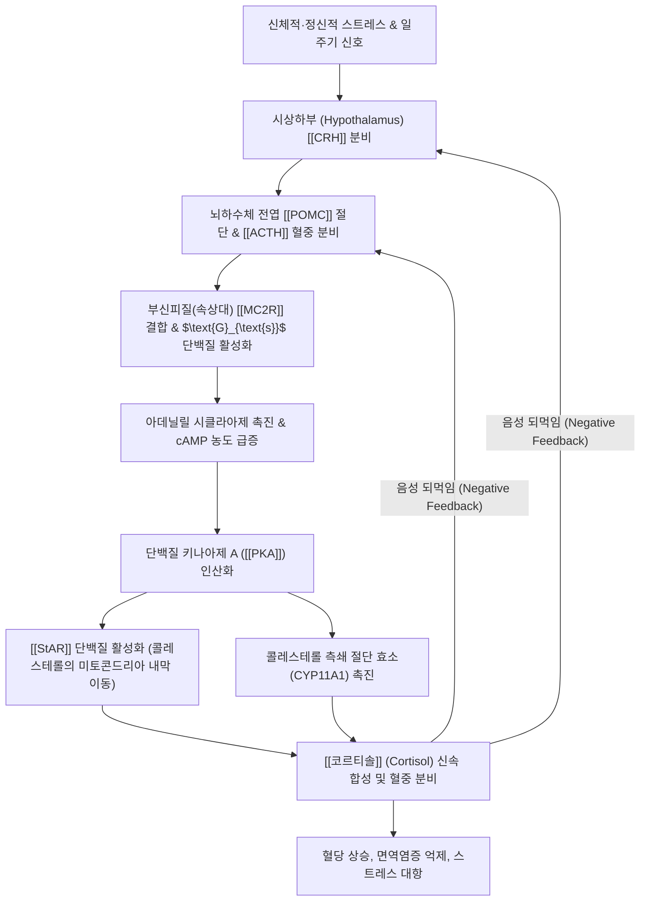

---
aliases:
  - ACTH
  - 부신피질자극호르몬
  - Adrenocorticotropic Hormone
  - 코르티코트로핀
  - Corticotropin
tags:
  - 약리성분
  - 호르몬
  - 펩타이드호르몬
  - 내분비계
  - HPA축
  - 코르티솔
  - 스트레스반응
  - 부신피질
---
# 💊 [[ACTH]] (Adrenocorticotropic Hormone, 부신피질자극호르몬)

> **핵심 요약 (Key Summary)**:
> 뇌하수체 전엽의 코르티코트로프(Corticotroph) 세포에서 프로오피오멜라노코르틴(POMC) 전구체로부터 합성·분비되는 39개 아미노산 폴리펩타이드 호르몬.
> 시상하부-뇌하수체-부신 축([[HPA축]])의 핵심 매개체로 부신피질 세포막의 멜라노코르틴 2형 수용체([[MC2R]])에 결합하여 글루코코르티코이드([[코르티솔]]) 합성 및 분비를 유도.
> 일중 변동(아침 최고, 밤 최저)을 나타내며, 조절 장애 시 쿠싱 증후군(과다), 에디슨병(결핍), 만성 피로 및 스트레스 면역 저하를 유발.

---

## 1. 기본 화학 정보 & 분자 구조식 (Chemical Identity)

> [!abstract]+ 🧪 3D 약리 분자 구조 (Interactive 3D Viewer)
> <iframe src="https://molecule-viewer-rho.vercel.app/?cid=16132284" style="width: 100%; height: 600px; border: none; border-radius: 12px; box-shadow: 0 4px 20px rgba(0,0,0,0.15);" allowfullscreen></iframe>

| 항목 | 상세 내용 |
| :--- | :--- |
| **일반명 (Generic)** | [[ACTH]] (Adrenocorticotropic Hormone, Corticotropin) |
| **분자 구조** | 39개 아미노산 단일 사슬 펩타이드 (생물학적 활성은 N-말단 1~24번 아미노산에 집중) |
| **전구체 단백질** | 프로오피오멜라노코르틴 (POMC) → ACTH, $\alpha$-MSH, $\beta$-엔돌핀 동시 분해 생성 |
| **분비 조절 인자** | • **촉진**: 시상하부의 코르티코트로핀 분비 호르몬([[CRH]]), 바소프레신, 급성 스트레스 • **억제**: 혈중 [[코르티솔]]에 의한 강력한 음성 피드백(Negative feedback) |
| **표적 수용체** | 부신피질 세포막의 멜라노코르틴 2형 수용체 ([[MC2R]]) |
| **분비 리듬** | 뚜렷한 일주기 리듬 (Circadian rhythm: 기상 직후 오전 6~8시 피크, 자정 최저) |

---

## 2. 분자약리 작용 기전 (Mechanism of Action, MoA)

* **부신피질 스테로이드 합성 촉진 (속상대 타깃)**:
  * ACTH는 부신피질 속상대(Zona fasciculata)에 주로 작용하여 콜레스테롤이 프레그네놀론으로 전환되는 율속 단계(StAR 단백질 및 CYP11A1)를 활성화하여 코르티솔 합성을 촉진.
* **부신피질 망상대 자극**:
  * 부신 안드로겐(DHEA, DHEA-S)의 분비도 부수적으로 자극.
* **흑색소포 자극 및 피부 색소 침착 연계**:
  * ACTH의 N-말단 서열은 멜라닌세포 자극 호르몬($\alpha$-MSH)과 동일하므로, ACTH가 극도로 상승하는 원발성 부신 기능 저하증(에디슨병)에서는 멜라닌 수용체([[MC1R]])가 교차 자극되어 피부 흑색소 침착(입술, 잇몸, 손바닥 주름)이 발생.

---

## 3. 관련 임상 질환 및 감별 진단

* **쿠싱 증후군 (Cushing's Syndrome) 감별**:
  * **ACTH 의존성**:
    * 뇌하수체 ACTH 분비 선종 = **쿠싱병(Cushing's Disease)** (ACTH 높음).
    * 이소성(Ectopic) ACTH 증후군: 소세포폐암 등에서 ACTH 과다 분비 (ACTH 극도로 높음).
  * **ACTH 비의존성**:
    * 부신 피질 선종/암종에 의한 자체 코르티솔 과다 분비 (음성 피드백으로 ACTH 낮음).
* **부신 기능 저하증 (Adrenal Insufficiency)**:
  * **원발성(에디슨병, Addison's Disease)**: 부신 자체 파괴로 코르티솔 결핍 $\rightarrow$ 피드백 상실로 ACTH 보상적 급증 (피부 색소 침착 동반).
  * **속발성**: 뇌하수체 질환 또는 장기 경구 스테로이드 복용 후 급격한 중단으로 ACTH 분비 억제 (피부 색소 침착 없음).

---

## 4. 한의학 생리병리 및 한약재 연계

* **신음(腎陰)·신양(腎陽)과 HPA 축의 현대적 매핑**:
  * 한의학에서 '신(腎)'은 인체의 근원적인 부신 호르몬 대사 및 선천지기(先天之氣)를 주관.
  * ACTH-코르티솔 축의 만성 고갈(만성 피로, 부신 피로)은 신양허(腎陽虛) 및 신음부족(腎陰不足)에 부합.
* **부신 피질 기능 조절 본초**:
  * [[감초]]: 글리시리진이 코르티솔을 불활성화하는 $11\beta$-HSD2 효소를 억제하여 코르티솔 반감기를 늘려 항염증 작용 보조.
  * [[인삼]], [[황기]]: HPA 축의 스트레스 회복탄력성을 개선하고 전신 면역기능을 활성화.
  * [[부자]], [[육계]]: 신양을 데워(온보신양) 호르몬 대사 저하로 인한 극심한 사지 냉증과 무력감을 개선.

---

## 5. 출처 및 학술 참고 문헌 (References)

* Gallo-Payet, N. (2016). 60 YEARS OF POMC: Adrenal and extra-adrenal functions of ACTH. *Journal of Molecular Endocrinology*, 56(4), T135-T156.
  * `[연구 요약]` POMC의 분해 산물로서 ACTH의 분자생물학적 구조, MC2R 신호전달 및 부신피질 스테로이드 합성 조절 경로를 총망라한 종설.
* Newell-Price, J., et al. (2006). Cushing's syndrome. *The Lancet*, 367(9522), 1605-1617.
  * `[연구 요약]` ACTH 의존성 및 비의존성 쿠싱 증후군의 감별 진단 프로토콜, 혈중 ACTH 측정법 및 치료 지침을 제시.
