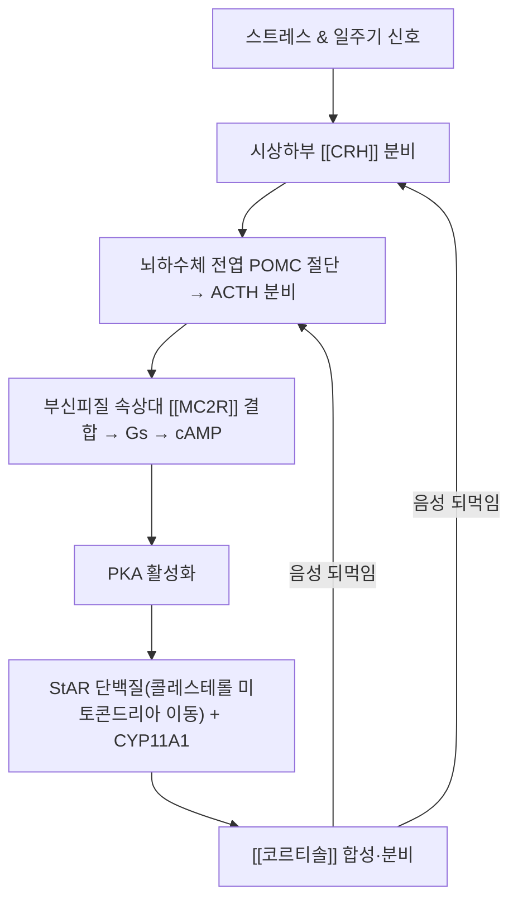

---
aliases:
  - ACTH
  - 부신피질자극호르몬
  - Adrenocorticotropic Hormone
  - 코르티코트로핀
  - Corticotropin
tags:
  - 약리성분
  - 호르몬
  - 펩타이드호르몬
  - 내분비계
  - HPA축
  - 코르티솔
  - 스트레스반응
  - 부신피질
---

# 💊 [[ACTH]] (Adrenocorticotropic Hormone, 부신피질자극호르몬)

> **핵심 3줄 요약 (Key Summary)**:
> - 🌿 기원 & 분류: 뇌하수체 전엽 코르티코트로프 세포에서 프로오피오멜라노코르틴(POMC) 전구체가 절단되어 생성되는 39개 아미노산 펩타이드 호르몬(식물 유래 성분이 아닌 내인성 신경내분비 물질 — 아래 §2 참조).
> - 🎯 핵심 분자 표적 & 조절 경로: 부신피질 멜라노코르틴 2형 수용체([[MC2R]]) 결합 → Gs/cAMP/PKA → StAR·CYP11A1 활성화 → [[코르티솔]] 합성.
> - 🩺 주요 약리 활성 & 질환 치료 기전: 시상하부-뇌하수체-부신([[HPA축]]) 스트레스 반응의 핵심 매개체, 쿠싱증후군·에디슨병 감별 진단의 축.
> - ⚠️ 독성·생체이용률 한계 & 상호작용: 혈중 반감기 약 6~7분으로 극히 짧고, 외인성 글루코코르티코이드 장기 투여 시 음성 되먹임으로 ACTH 분비가 억제되어 부신 위축·부신기능부전 위험이 발생.

---

## 📌 목차
1. [기본 화학 정보 & 분자 구조식 (Chemical Identity)](#1-기본-화학-정보--분자-구조식-chemical-identity)
2. [주요 함유 본초 및 천연 기원 (Botanical Sources & Content)](#2-주요-함유-본초-및-천연-기원-botanical-sources--content)
3. [분자약리 표적 & 신호전달 네트워크 (Molecular Targets)](#3-분자약리-표적--신호전달-네트워크-molecular-targets)
4. [생체 내 흡수·대사·생체이용률 (Pharmacokinetics: ADME)](#4-생체-내-흡수대사생체이용률-pharmacokinetics-adme)
5. [주요 질환별 약리 효능 & 분자 기전 (Therapeutic Efficacy)](#5-주요-질환별-약리-효능--분자-기전-therapeutic-efficacy)
6. [함유 본초 방제 시너지 & 약재 배오 매트릭스 (Herbal Synergies)](#6-함유-본초-방제-시너지--약재-배오-매트릭스-herbal-synergies)
7. [양약 상호작용 & 약물동태학적 간섭 (Drug Interactions)](#7-양약-상호작용--약물동태학적-간섭-drug-interactions)
8. [💡 사용자 진료실 핵심 필기 & 임상 응용 팁 (Melt-In & High-Yield)](#8--사용자-진료실-핵심-필기--임상-응용-팁-melt-in--high-yield)
9. [출처 및 학술 참고 문헌 (References)](#9-출처-및-학술-참고-문헌-references)

---

## 1. 기본 화학 정보 & 분자 구조식 (Chemical Identity)

> [!abstract]+ 🧪 3D 약리 분자 구조 (Interactive 3D Viewer)
> <iframe src="https://molecule-viewer-rho.vercel.app/?cid=16132284" width="100%" height="450px" frameborder="0" allow="webgl" style="border-radius: 8px;"></iframe>

| 항목 | 상세 내용 |
| :--- | :--- |
| **일반명** | ACTH (Adrenocorticotropic Hormone, Corticotropin) |
| **분자 구조** | 39개 아미노산 단일 사슬 펩타이드 (생물학적 활성은 N-말단 1~24번 잔기에 집중 — 진단·치료용 합성 ACTH인 코신트로핀/Cosyntropin이 이 서열 기반) |
| **전구체 단백질** | 프로오피오멜라노코르틴(POMC) → ACTH, α-MSH, β-엔돌핀으로 동시 분해 |
| **분비 조절** | 촉진: 시상하부 [[CRH]], 바소프레신, 급성 스트레스 / 억제: 혈중 [[코르티솔]]에 의한 음성 되먹임 |
| **표적 수용체** | 부신피질 세포막 멜라노코르틴 2형 수용체([[MC2R]]), Gs 단백질 연계 |
| **분비 리듬** | 일주기 리듬(기상 직후 오전 6~8시 피크, 자정 최저) |

---

## 2. 주요 함유 본초 및 천연 기원 (Botanical Sources & Content)

> ⚠️ **템플릿 적용 상 주의**: ACTH는 식물이 함유하는 파이토케미컬이 아니라 뇌하수체에서 분비되는 내인성 펩타이드 호르몬입니다. 따라서 이 절은 "ACTH를 함유하는 본초"가 아니라, **HPA축(ACTH-코르티솔 분비)에 실제로 작용하는 것이 학술적으로 검증된 한약재**를 다룹니다 — 없는 사실을 지어내지 않기 위한 구분입니다.

| 관련 본초 (한글/한자) | 기원 식물학적 명칭 (과명 / 학명) | HPA축 관련 작용 | 근거 수준 |
| :--- | :--- | :--- | :--- |
| [[감초]] (甘草) | 콩과(Fabaceae) / *Glycyrrhiza uralensis* Fisch. | 글리시르헤틴산 대사체가 11β-HSD2를 억제해 코르티솔의 분해를 늦춤 → 코르티솔의 미네랄로코르티코이드 유사 작용 지속(위성 알도스테론증) → 음성 되먹임 경로에 간접 영향 | 사람 임상례 다수 보고(Makino 2021, §9) |
| [[인삼]] (人蔘) | 두릅나무과(Araliaceae) / *Panax ginseng* C.A.Mey. | 진세노사이드가 HPA축의 스트레스 반응성·회복탄력성에 영향을 준다는 동물 실험 다수(사람 대상 확증적 임상자료는 제한적) | 동물실험 위주, 사람 근거는 제한적 — 과장 금지 |
| [[황기]] (黃芪) | 콩과(Fabaceae) / *Astragalus membranaceus* | 만성 스트레스 동물모델에서 코르티코스테론 반응 조절이 보고됨 | 동물실험 위주 |

---

## 3. 분자약리 표적 & 신호전달 네트워크 (Molecular Targets)

### 1) 부신피질 스테로이드 합성 촉진(속상대 타깃)
* 콜레스테롤 → 프레그네놀론 전환의 율속 단계(StAR 단백질, CYP11A1)를 활성화해 코르티솔 합성을 촉진합니다.
### 2) 부신 안드로겐 및 흑색소포 자극 교차반응
* 부신 망상대의 DHEA/DHEA-S 분비를 부수적으로 자극하며, N-말단 서열이 α-MSH와 동일해 ACTH 과다 시(에디슨병) MC1R 교차자극으로 피부 색소침착이 발생합니다.

---

## 4. 생체 내 흡수·대사·생체이용률 (Pharmacokinetics: ADME)

| 파라미터 | 수치/특성 | 근거 |
| :--- | :--- | :--- |
| **혈중 반감기** | 평균 5.94분(혈액 보충 없음) / 7.06분(혈액 보충 시) | Lopez & Negro-Vilar 1988, *Endocrinology* |
| **분비 양상** | 펄스형(Pulsatile) 분비, 일중 리듬(CAR: 기상 후 피크) | Veldhuis et al. 2001, *J Clin Invest*(코르티솔 되먹임 연구) |
| **투여 경로(치료/진단용)** | 정맥·근육 주사(합성 코신트로핀 250 μg 표준 자극검사) | StatPearls NBK555940 |
| **경구 투여 불가** | 펩타이드 구조상 위장관에서 신속히 분해되어 경구 생체이용률 사실상 0% | 펩타이드 호르몬 일반 원칙(표준 약리학) |
| **대사·제거** | 혈중 및 조직 펩티다아제에 의한 신속 분해, 간·신장을 통한 대사체 제거 | 표준 내분비생리학 |

---

## 5. 주요 질환별 약리 효능 & 분자 기전 (Therapeutic Efficacy)

### 1) 쿠싱증후군(Cushing's Syndrome) 감별
* ACTH 의존성(뇌하수체 선종=쿠싱병, 이소성 ACTH 증후군)과 ACTH 비의존성(부신 자체 종양, ACTH 낮음)을 혈중 ACTH로 구분.
### 2) 부신기능저하증(Adrenal Insufficiency)
* 원발성(에디슨병): 부신 파괴로 코르티솔 결핍 → 되먹임 상실로 ACTH 급증(피부 색소침착 동반).
* 속발성: 뇌하수체 질환 또는 장기 스테로이드 복용 후 급격한 중단 시 ACTH 분비 억제(색소침착 없음).
### 3) 진단적 활용(코신트로핀 자극검사)
* 합성 ACTH(코신트로핀) 250 μg 정맥 투여 후 0·30·60분 코르티솔 반응을 측정해 부신 예비능을 평가.

---

## 6. 함유 본초 방제 시너지 & 약재 배오 매트릭스 (Herbal Synergies)

> ACTH 자체를 "배오"하는 처방 개념은 없으므로, 본 절은 **HPA축 기능(ACTH-코르티솔 리듬)에 영향을 주는 것으로 보고된 처방**을 정리합니다.

| 관련 방제 | 구성 본초 | 제안된 작용 기전 | 한의학적 개념 연계 |
| :--- | :--- | :--- | :--- |
| [[사역탕]] | [[부자]], [[건강]], [[감초]] | 감초의 11β-HSD2 억제를 통한 코르티솔 반감기 연장 및 부자·건강의 교감신경/TRPV1 자극이 신양(腎陽) 회복과 관련될 가능성 제시(직접적 ACTH 측정 임상 연구는 부족) | 회양구역(回陽救逆) |
| [[가미소요산]]/[[시호소간산]] | [[시호]], [[백작약]], [[감초]] | 만성 스트레스 동물모델에서 HPA축 과활성 완화가 보고됨(사람 ACTH 직접 측정 자료는 제한적) | 간기울결(肝氣鬱結) 해소 |

---

## 7. 양약 상호작용 & 약물동태학적 간섭 (Drug Interactions)

* **외인성 글루코코르티코이드에 의한 억제**: 프레드니솔론·덱사메타손 등 외인성 스테로이드를 장기 복용하면 코르티솔 상승에 의한 음성 되먹임으로 CRH-ACTH 분비가 억제되어 부신 위축이 진행됩니다. 이 상태에서 급격히 약을 중단하면 부신위기(Adrenal Crisis)가 발생할 수 있어 **점진적 감량**이 원칙입니다(StatPearls NBK279047/NBK279156).
* **덱사메타손 억제검사와의 상호작용**: 저용량(1 mg) 덱사메타손 야간 투여 후 아침 코르티솔을 측정하는 표준 진단법 자체가 ACTH 억제 원리를 이용하므로, 검사 전 스테로이드 복용력을 반드시 확인해야 위양성/위음성을 피할 수 있습니다.
* **감초 함유 한약과 스테로이드 병용 시 고려사항**: 감초의 11β-HSD2 억제 대사체(18β-glycyrrhetyl-3-O-sulfate 등)가 코르티솔의 비활성화를 늦추므로, 외인성 스테로이드나 코르티솔 유사 작용 약물과 병용 시 가성 알도스테론증(저칼륨혈증·고혈압) 위험이 이론적·임상적으로 보고되어 있어 장기 병용 시 전해질 모니터링이 필요합니다(Makino 2021).

---

## 8. 💡 사용자 진료실 핵심 필기 & 임상 응용 팁 (Melt-In & High-Yield)

* **신(腎)-HPA축 매핑**: 한의학의 '신(腎)'은 선천지기와 부신 대사를 포괄하는 개념으로, ACTH-코르티솔 축의 만성 고갈(이른바 "부신 피로")은 신양허(腎陽虛)·신음부족(腎陰不足)의 현대적 대응 개념으로 설명될 수 있으나, "부신 피로(adrenal fatigue)"는 공식 내분비학 진단명이 아니므로 환자에게 설명할 때 과학적 표현("HPA축 조절 저하 상태")을 우선 사용하는 것이 안전합니다.
* **처방 활용 시 주의**: 감초 다량 함유 처방(감초탕, 작약감초탕 등)을 장기 복용하는 환자, 특히 스테로이드를 병용하는 환자는 정기적으로 혈압·혈청 칼륨을 확인하도록 안내합니다.
* **진단 검사 전 문진 포인트**: "최근 몇 달 내 스테로이드 연고, 흡입제, 관절 주사, 경구 스테로이드를 사용하신 적 있나요?"를 반드시 물어야 ACTH/코르티솔 검사 해석 오류를 피할 수 있습니다.

---

## 9. 출처 및 학술 참고 문헌 (References)

1. **Lopez FJ, Negro-Vilar A. (1988)**. *Estimation of endogenous adrenocorticotropin half-life using pulsatility patterns: a physiological approach to the evaluation of secretory episodes*. **Endocrinology**, 123(2), 740-746.
   - [PMID: 2840267](https://pubmed.ncbi.nlm.nih.gov/2840267/)
   - **[연구 요약]**: 혈액 보충 유무에 따른 내인성 ACTH의 평균 혈중 반감기(5.94분/7.06분)를 최초로 정량 추정.
2. **StatPearls (NCBI Bookshelf, updated 2023-2024)**. *Physiology, Adrenocorticotropic Hormone (ACTH)*.
   - [NBK500031](https://www.ncbi.nlm.nih.gov/books/NBK500031/)
   - **[연구 요약]**: POMC 유래 ACTH 합성, MC2R/cAMP 신호전달, 코신트로핀 자극검사·덱사메타손 억제검사의 표준 프로토콜 정리.
3. **StatPearls (NCBI Bookshelf)**. *Glucocorticoid Therapy and Adrenal Suppression*.
   - [NBK279156](https://www.ncbi.nlm.nih.gov/books/NBK279156/)
   - **[연구 요약]**: 외인성 글루코코르티코이드 장기 투여에 따른 HPA축 억제 기전과 안전한 감량 원칙을 정리.
4. **Makino T. (2021)**. *Exploration for the real causative agents of licorice-induced pseudoaldosteronism*. **Journal of Natural Medicines**, 75, 275-283.
   - [DOI: 10.1007/s11418-021-01484-3](https://doi.org/10.1007/s11418-021-01484-3)
   - **[연구 요약]**: 감초 대사체(18β-glycyrrhetyl-3-O-sulfate)가 11β-HSD2를 억제해 코르티솔의 미네랄로코르티코이드 유사 작용을 지속시키는 기전을 규명(IC50 0.10 µM).
5. **Gallo-Payet N. (2016)**. *60 YEARS OF POMC: Adrenal and extra-adrenal functions of ACTH*. **Journal of Molecular Endocrinology**, 56(4), T135-T156.
   - [DOI: 10.1530/JME-15-0257](https://doi.org/10.1530/JME-15-0257)
   - **[연구 요약]**: POMC 유래 ACTH의 분자생물학적 구조, MC2R 신호전달 및 부신피질 스테로이드 합성 조절 경로 총정리.
