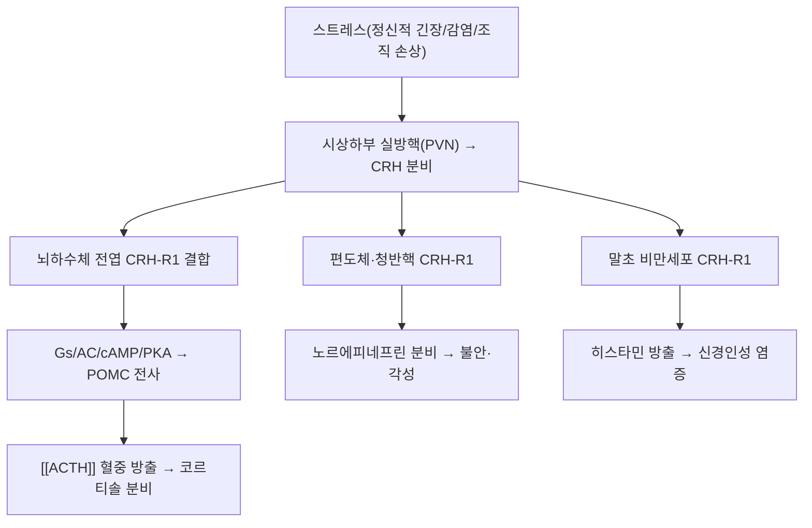

---
aliases:
  - Corticotropin-Releasing Hormone
  - 코르티코트로핀방출호르몬
  - CRF
  - Corticotropin-Releasing Factor
tags:
  - 약리성분
  - 신경호르몬
  - HPA축
  - 스트레스
  - 신경내분비
---

# 🔬 [[CRH]] (Corticotropin-Releasing Hormone)

> **핵심 3줄 요약 (Key Summary)**:
> - 🌿 기원 & 분류: 시상하부 실방핵(PVN)에서 분비되는 41개 아미노산 신경펩타이드 호르몬(식물 유래 성분이 아닌 내인성 스트레스 마스터 호르몬 — 아래 §2 참조).
> - 🎯 핵심 분자 표적 & 조절 경로: 뇌하수체 CRH-R1 수용체 결합 → [[ACTH]]·코르티솔 분비 촉진, 변연계 CRH-R1 활성화로 불안·각성 반응, 말초 비만세포 탈과립.
> - 🩺 주요 약리 활성 & 질환 치료 기전: HPA축 스트레스 반응의 최상위 조절자, 간기울결·심화상충 등 스트레스성 병증의 신경내분비 표적.
> - ⚠️ 독성·생체이용률 한계 & 상호작용: 혈중 반감기가 매우 짧고(분포상 약 7~9분, 소실상 약 34~40분) 이좌기 소실 동태를 보이며, CRH-R1 길항제 계열 신약은 유효성 신호에도 불구하고 간독성 등 오프타깃 부작용으로 다수 개발 중단됨.

---

## 📌 목차
1. [기본 화학 정보 & 분자 구조식 (Chemical Identity)](#1-기본-화학-정보--분자-구조식-chemical-identity)
2. [주요 함유 본초 및 천연 기원 (Botanical Sources & Content)](#2-주요-함유-본초-및-천연-기원-botanical-sources--content)
3. [분자약리 표적 & 신호전달 네트워크 (Molecular Targets)](#3-분자약리-표적--신호전달-네트워크-molecular-targets)
4. [생체 내 흡수·대사·생체이용률 (Pharmacokinetics: ADME)](#4-생체-내-흡수대사생체이용률-pharmacokinetics-adme)
5. [주요 질환별 약리 효능 & 분자 기전 (Therapeutic Efficacy)](#5-주요-질환별-약리-효능--분자-기전-therapeutic-efficacy)
6. [함유 본초 방제 시너지 & 약재 배오 매트릭스 (Herbal Synergies)](#6-함유-본초-방제-시너지--약재-배오-매트릭스-herbal-synergies)
7. [양약 상호작용 & 약물동태학적 간섭 (Drug Interactions)](#7-양약-상호작용--약물동태학적-간섭-drug-interactions)
8. [💡 사용자 진료실 핵심 필기 & 임상 응용 팁 (Melt-In & High-Yield)](#8--사용자-진료실-핵심-필기--임상-응용-팁-melt-in--high-yield)
9. [출처 및 학술 참고 문헌 (References)](#9-출처-및-학술-참고-문헌-references)

---

## 1. 기본 화학 정보 & 분자 구조식 (Chemical Identity)

> [!abstract]+ 🧪 3D 약리 분자 구조 (Interactive 3D Viewer)
> <iframe src="https://molecule-viewer-rho.vercel.app/?cid=16132338" width="100%" height="450px" frameborder="0" allow="webgl" style="border-radius: 8px;"></iframe>

| 항목 | 상세 내용 |
| :--- | :--- |
| **성분명** | CRH(Corticotropin-Releasing Hormone) / 동의어: CRF(Corticotropin-Releasing Factor), Corticoliberin |
| **아미노산 서열** | 41개 잔기 펩타이드(SEEPPISLDLTFHLLREVLEMARAEQLAQQAHSNRKLMEII-NH₂) |
| **분자량** | 4,757.5 Da |
| **CAS 등록번호** | 9015-71-8 |
| **생체 내 생성원** | 시상하부 실방핵(PVN), 편도체, 태반, 면역세포 |
| **약리 분류** | 신경펩타이드, HPA축 개시인자 |

---

## 2. 주요 함유 본초 및 천연 기원 (Botanical Sources & Content)

> ⚠️ **템플릿 적용 상 주의**: CRH도 ACTH와 마찬가지로 식물 유래 파이토케미컬이 아닌 내인성 신경펩타이드입니다. 이 절에서는 "CRH를 함유하는 본초"가 아니라 **CRH 매개 스트레스 반응(간기울결·심화상충)을 조절한다고 학술적으로 보고된 한약재**를 정리합니다.

| 관련 본초 (한글/한자) | 기원 식물학적 명칭 (과명 / 학명) | HPA축/CRH 관련 작용 | 근거 수준 |
| :--- | :--- | :--- | :--- |
| [[시호]] (柴胡) | 산형과(Apiaceae) / *Bupleurum falcatum* | 만성 스트레스 동물모델에서 시상하부 CRH mRNA 발현 및 혈중 코르티코스테론 반응을 완화한다는 보고 다수 | 동물실험 위주, 사람 CRH 직접 측정 임상자료는 제한적 |
| [[산조인]] (酸棗仁) | 갈매나무과(Rhamnaceae) / *Ziziphus jujuba* var. *spinosa* | 스트레스·불면 동물모델에서 HPA축 과활성(CRH-ACTH-코르티코스테론) 완화가 보고됨 | 동물실험 위주 |
| [[백작약]] (白芍藥) | 작약과(Paeoniaceae) / *Paeonia lactiflora* | 페오니플로린이 CRH 유발 스트레스 행동 및 HPA축 반응성을 조절한다는 동물 연구 | 동물실험 위주, 과장 금지 |

---

## 3. 분자약리 표적 & 신호전달 네트워크 (Molecular Targets)

### 1) CRH 수용체 아형의 차등 작용
* **CRH-R1**: 뇌하수체 전엽·대뇌피질에 풍부, 스트레스 반응·ACTH 분비·불안 행동을 촉발. 만성 스트레스 시 과감작이 우울증·범불안장애와 관련됩니다.
* **CRH-R2**: 시상하부 복내측핵·심혈관계에 분포, 장기적으로 스트레스 반응을 종결하고 혈관 확장을 돕는 길항적 역할.

### 2) 위장관-뇌 축(Gut-Brain Axis) 교란
* CRH는 위 운동을 억제(체기·구역감)하는 반면 결장 운동은 항진시켜 복통·설사를 유발합니다.

### 3) 말초 비만세포 매개 신경인성 염증
* 손상 조직 국소에서 분비된 CRH는 혈관 투과성을 높이고 히스타민 방출을 유도해 국소 염증을 촉진하는 '프로염증성' 역할도 합니다.

---

## 4. 생체 내 흡수·대사·생체이용률 (Pharmacokinetics: ADME)

| 파라미터 | 수치/특성 | 근거 |
| :--- | :--- | :--- |
| **분포상 반감기(α phase)** | 약 0.12~0.15시간(약 7~9분) | Tanaka K, et al. 1993, *Endocrine Journal* |
| **소실상 반감기(β phase)** | 약 0.57~0.67시간(약 34~40분) | 상동 |
| **소실 동태** | 이좌기(Biexponential) 소실 곡선 | 상동 |
| **투여 경로(진단용)** | 정맥 주사(합성 인간/양 CRH를 이용한 CRH 자극검사) | Tanaka 1993; Endotext NBK279017 |
| **경구 투여 불가** | 펩타이드 구조상 위장관에서 신속히 분해되어 경구 생체이용률 사실상 0% | 펩타이드 호르몬 일반 원칙 |

---

## 5. 주요 질환별 약리 효능 & 분자 기전 (Therapeutic Efficacy)

### 1) 간기울결(肝氣鬱結)·칠정울결의 신경내분비적 실체
* 스트레스로 기운이 뭉치고 가슴이 답답하며 소화가 안 되는 상태의 분자적 실체가 지속적 CRH 과분비입니다.
### 2) 심화상충(心火上衝)·심신불교
* 극심한 스트레스로 두근거림·불면·상열감이 나타나는 상태와 CRH 매개 교감신경 항진이 연관됩니다.
### 3) 진단적 활용(CRH 자극검사)
* 쿠싱병(뇌하수체성)과 이소성 ACTH 증후군의 감별, 시상하부성-�생하수체성 부신기능저하증 감별에 사용됩니다.

---

## 6. 함유 본초 방제 시너지 & 약재 배오 매트릭스 (Herbal Synergies)

> CRH 자체를 배오하는 처방 개념은 없으므로, CRH 매개 스트레스 반응 완화가 보고된 처방을 정리합니다.

| 관련 방제 | 구성 본초 | 제안된 작용 기전 | 한의학적 개념 연계 |
| :--- | :--- | :--- | :--- |
| [[시호소간산]] / [[소요산]] | [[시호]], [[백작약]], [[박하]] | 편도체-시상하부 CRH 과활성 안정화가 동물모델에서 보고(사람 CRH 직접 측정 자료는 제한적) | 간기울결 해소 |
| [[귀비탕]] / [[천왕보심단]] | [[산조인]], [[원지]], [[용안육]] | CRH 유도 교감신경 흥분 완화가 동물모델에서 보고 | 심화상충·심신불교 진정 |

---

## 7. 양약 상호작용 & 약물동태학적 간섭 (Drug Interactions)

* **CRH-R1 길항제 신약 개발 현황**: NBI-30775(R121919)는 개방표지 임상에서 고용량군 10명 중 8명이 반응 기준을 충족할 만큼 유망했으나, 건강한 피험자에서 고용량 투여 시 간효소 상승이 관찰되어 개발이 중단되었습니다. NBI-34041은 위약대조 임상에서 고용량 사전투여 시 심리사회적 스트레스 검사 중 ACTH·코르티솔 반응이 유의하게 감쇠해 개념증명에는 성공했으나, CRH1 수용체가 없는 조직에서의 독성(오프타깃) 문제로 다수의 CRH1 길항제 임상이 중단되었습니다(Holsboer & Ising 2008).
* **외인성 CRH 자극검사와 스테로이드 병용**: 외인성 글루코코르티코이드를 복용 중인 환자는 음성 되먹임으로 내인성 CRH·ACTH 반응이 억눌려 있어, CRH 자극검사 결과 해석 시 최근 스테로이드 복용력 확인이 필수적입니다.
* **아편유사제·알코올과의 상호작용**: 만성 아편유사제·알코올 노출이 CRH 시스템을 조절한다는 동물 연구가 다수 있으나, 이는 주로 금단(withdrawal) 시 CRH 활성 증가와 관련된 것으로, 사람에서의 정량적 약물-호르몬 상호작용 자료는 제한적입니다 — 과장하여 안내하지 말 것.

---

## 8. 💡 사용자 진료실 핵심 필기 & 임상 응용 팁 (Melt-In & High-Yield)

* **간기울결의 현대적 설명**: 스트레스로 가슴이 답답하고 한숨을 쉬며 소화가 안 되는 환자에게 "이는 시상하부에서 CRH라는 스트레스 호르몬이 과다 분비되어 자율신경과 소화기능에 영향을 미치는 상태"라고 설명하면 이해도를 높일 수 있습니다.
* **처방 선택 포인트**: 불안·불면이 동반된 스트레스성 소화불량에는 시호제(간기울결), 두근거림·불면이 두드러지면 귀비탕류(심화상충)를 감별해 적용합니다.
* **환자 교육 시 주의**: "부신 피로", "코르티솔 고갈" 같은 비공식 용어보다 "스트레스 호르몬 축의 조절 저하"처럼 근거 기반 표현을 우선 사용합니다.

---

## 9. 출처 및 학술 참고 문헌 (References)

1. **Vale W, et al. (1981)**. *Characterization of a 41-residue ovine hypothalamic peptide that stimulates secretion of corticotropin and beta-endorphin*. **Science**, 213(4514), 1394-1397.
   - [DOI: 10.1126/science.6267699](https://doi.org/10.1126/science.6267699)
   - **[연구 요약]**: CRH 펩타이드 구조를 최초로 규명하고 ACTH·베타엔돌핀 분비 촉진 활성을 입증한 랜드마크 논문.
2. **Tanaka K, et al. (1993)**. *Diagnostic study of a synthetic human corticotropin-releasing hormone (hCRH) in healthy adult males: its plasma pharmacokinetics and the effects on the urinary excretion of steroid hormones*. **Endocrine Journal**, 40(4).
   - [PMID: 7951525](https://pubmed.ncbi.nlm.nih.gov/7951525/)
   - **[연구 요약]**: 합성 인간 CRH의 이좌기 혈중 소실 동태(α상 반감기 0.12~0.15시간, β상 반감기 0.57~0.67시간)를 정량 규명.
3. **Bale TL, Vale WW. (2004)**. *CRF and CRF receptors: role in stress responsivity and other behaviors*. **Annual Review of Pharmacology and Toxicology**, 44, 525-557.
   - [DOI: 10.1146/annurev.pharmtox.44.101802.121410](https://doi.org/10.1146/annurev.pharmtox.44.101802.121410)
   - **[연구 요약]**: CRH·CRH-R1/R2 수용체 신호전달과 불안·우울·과민성 대장 증후군 등 스트레스 관련 질환 기전 총괄 고찰.
4. **Holsboer F, Ising M. (2008)**. *Central CRH system in depression and anxiety--evidence from clinical studies with CRH1 receptor antagonists*. **European Journal of Pharmacology**, 583(2-3), 350-357.
   - [PMID: 18272149](https://pubmed.ncbi.nlm.nih.gov/18272149/)
   - **[연구 요약]**: CRH1 수용체 길항제(NBI-30775, NBI-34041)의 임상 유효성 신호와 간독성 등 개발 중단 사유를 정리한 종설.
