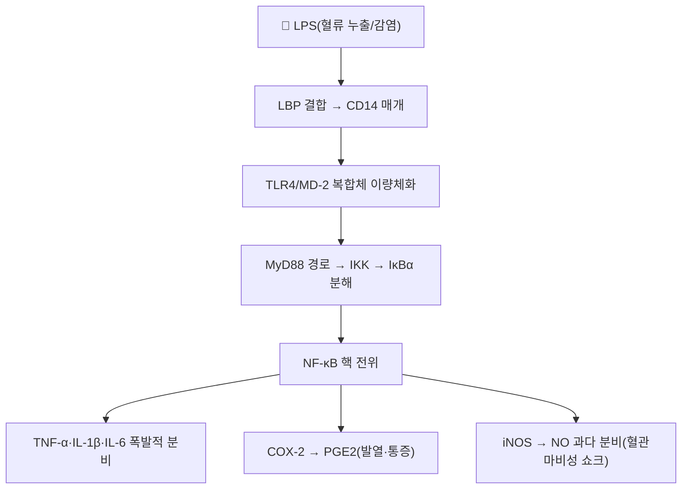

---
aliases:
  - Lipopolysaccharide
  - 지질다당류
  - 내독소
  - Endotoxin
tags:
  - 약리성분
  - 병원체연관분자
  - TLR4
  - 패혈증
  - 신경염증
---

# 🔬 [[LPS]] (Lipopolysaccharide, 지질다당류/내독소)

> **핵심 3줄 요약 (Key Summary)**:
> - 🌿 기원 & 분류: 그람음성 세균 외막의 주요 구조 성분이자 가장 강력한 내독소(식물 유래 성분이 아닌 세균성 병원체연관분자패턴 — 아래 §2 참조).
> - 🎯 핵심 분자 표적 & 조절 경로: [[TLR4]]-MD-2-CD14 복합체 결합 → MyD88 경로 → [[NF-κB]] 활성화 → 전염증성 사이토카인 폭풍.
> - 🩺 주요 약리 활성 & 질환 치료 기전: 패혈성 쇼크·대사성 내독소혈증의 핵심 매개체이자, 청열해독 본초([[황련]], [[황금]], [[금은화]])의 중화 표적.
> - ⚠️ 독성·생체이용률 한계 & 상호작용: 혈중에서 매우 빠르게 제거되나(마우스 기준 반감기 2~4분) 간에서 대부분 처리되며, 감염·염증 상태의 LPS-TLR4 신호는 간 CYP450 발현을 하향 조절해 병용 약물의 대사·용량 조절에 영향을 줄 수 있음.

---

## 📌 목차
1. [기본 화학 정보 & 분자 구조식 (Chemical Identity)](#1-기본-화학-정보--분자-구조식-chemical-identity)
2. [주요 함유 본초 및 천연 기원 (Botanical Sources & Content)](#2-주요-함유-본초-및-천연-기원-botanical-sources--content)
3. [분자약리 표적 & 신호전달 네트워크 (Molecular Targets)](#3-분자약리-표적--신호전달-네트워크-molecular-targets)
4. [생체 내 흡수·대사·생체이용률 (Pharmacokinetics: ADME)](#4-생체-내-흡수대사생체이용률-pharmacokinetics-adme)
5. [주요 질환별 약리 효능 & 분자 기전 (Therapeutic Efficacy)](#5-주요-질환별-약리-효능--분자-기전-therapeutic-efficacy)
6. [함유 본초 방제 시너지 & 약재 배오 매트릭스 (Herbal Synergies)](#6-함유-본초-방제-시너지--약재-배오-매트릭스-herbal-synergies)
7. [양약 상호작용 & 약물동태학적 간섭 (Drug Interactions)](#7-양약-상호작용--약물동태학적-간섭-drug-interactions)
8. [💡 사용자 진료실 핵심 필기 & 임상 응용 팁 (Melt-In & High-Yield)](#8--사용자-진료실-핵심-필기--임상-응용-팁-melt-in--high-yield)
9. [출처 및 학술 참고 문헌 (References)](#9-출처-및-학술-참고-문헌-references)

---

## 1. 기본 화학 정보 & 분자 구조식 (Chemical Identity)

> [!info] 🧪 3D 뷰어 미적용
> LPS(지질다당류)는 균종·균주마다 구조가 다른 복합 당지질이라 단일 PubChem CID로 대표할 수 없습니다. 공통 골격인 Kdo2-Lipid A 등 세부 구조는 문헌을 참고하세요.

| 항목 | 상세 내용 |
| :--- | :--- |
| **명칭** | LPS (Lipopolysaccharide, 지질다당류), 동의어: 내독소(Endotoxin) |
| **분자 구조 3대 영역** | 지질 A(독성 활성 중심) + 코어 다당류 + O-항원 |
| **분자량** | 10~20 kDa(단량체), 수용액에서 거대 응집체 형성 |
| **수용체** | [[TLR4]] / MD-2 / CD14 복합체 |
| **약리 분류** | 병원체연관분자패턴(PAMP), 발열원, 염증 유발 인자 |

---

## 2. 주요 함유 본초 및 천연 기원 (Botanical Sources & Content)

> ⚠️ **템플릿 적용 상 주의**: LPS는 식물이 함유하는 파이토케미컬이 아니라 그람음성 세균이 만드는 물질입니다. 이 절은 "LPS를 함유하는 본초"가 아니라, **LPS를 중화하거나 그 신호전달을 차단한다고 학술적으로 검증된 청열해독 한약재**를 정리합니다.

| 관련 본초 (한글/한자) | 기원 식물학적 명칭 | LPS 관련 작용 | 근거 수준 |
| :--- | :--- | :--- | :--- |
| [[황련]] (黃連) | 미나리아재비과 / *Coptis chinensis* | 지표성분 [[베르베린]]이 LPS와 직접 결합해 중화, 장내 세균 증식 억제 | 다수 동물·시험관 연구 |
| [[황금]] (黃芩) | 꿀풀과 / *Scutellaria baicalensis* | [[바이칼레인]]이 TLR4 수용체 결합을 경쟁적으로 차단 | 다수 동물·시험관 연구 |
| [[금은화]] (金銀花) | 인동과 / *Lonicera japonica* | 대식세포 NF-κB 활성화 차단으로 LPS 유도 염증 진화 | 동물·세포 연구 |

---

## 3. 분자약리 표적 & 신호전달 네트워크 (Molecular Targets)

### 1) 혈관 내피 손상 및 패혈성 쇼크
* 과도한 iNOS 유도로 미세혈관이 통제불능으로 이완되어 혈압이 급격히 떨어지고, 파종성 혈관내 응고·다발성 장기부전을 초래합니다.
### 2) 대사성 내독소혈증
* 고지방 식이·음주·스트레스로 장 점막 치밀결합이 느슨해지는 장누수 상태에서 장내 세균 LPS가 문맥 혈류로 유입되어 지방간·비만·인슐린 저항성을 유발합니다.

---

## 4. 생체 내 흡수·대사·생체이용률 (Pharmacokinetics: ADME)

| 파라미터 | 수치/특성 | 근거 |
| :--- | :--- | :--- |
| **혈중 반감기(마우스)** | 2~4분(매우 빠른 소실) | Yao Z, et al. 2016, *J Immunol* |
| **주요 제거 경로** | 간이 혈중 LPS의 약 75%를 제거 | 상동 |
| **제거 세포** | 전통적으로 쿠퍼세포로 알려졌으나, 실제로는 간 굴모세혈관 내피세포(LSEC)가 HDL 매개로 LPS의 약 75%를 흡수 | 상동 |
| **불활성화 기전** | 순환 중 지단백(HDL 등)과 결합해 생물학적 활성이 빠르게 소실되나, 면역측정법 상 항원 자체는 더 오래 검출될 수 있어 "반감기" 해석에 주의 필요 | Yao 2016; 관련 논의 다수(수치는 종·모델에 따라 분 단위~시간 단위로 폭넓게 보고됨) |

---

## 5. 주요 질환별 약리 효능 & 분자 기전 (Therapeutic Efficacy)

> LPS는 치료 대상이 아니라 병리 매개물질이므로, 이 절은 LPS가 매개하는 주요 질환 기전을 다룹니다.

### 1) 패혈증 및 패혈성 쇼크
* TLR4-NF-κB 경로의 전신 과활성화로 사이토카인 폭풍, 혈관마비성 쇼크가 발생합니다.
### 2) 대사증후군(비만·인슐린저항성·지방간)
* 장누수를 통한 만성 저농도 LPS 유입(대사성 내독소혈증)이 만성 전신 염증의 근본 원인 중 하나로 작용합니다.
### 3) 신경염증 및 인지기능 저하
* 혈뇌장벽 파괴를 동반한 LPS 노출이 미세아교세포를 흥분시켜 우울증·인지저하와 연관됩니다.

---

## 6. 함유 본초 방제 시너지 & 약재 배오 매트릭스 (Herbal Synergies)

| 관련 방제 | 구성 본초 | LPS 중화/차단 기전 | 한의학적 개념 연계 |
| :--- | :--- | :--- | :--- |
| [[황련해독탕]] | [[황련]], [[황금]], [[황백]], [[치자]] | 베르베린(직접결합)+바이칼레인(TLR4 차단)의 다중 표적 상승 | 삼초실열(三焦實熱) 해독 |
| [[청온패독음]] | [[석고]], [[황금]], [[생지황]] | NF-κB 활성화 차단 및 해열 | 열입영혈(熱入營血) 해소 |

---

## 7. 양약 상호작용 & 약물동태학적 간섭 (Drug Interactions)

* **감염·염증에 의한 CYP450 하향조절**: LPS-TLR4-NF-κB/사이토카인(IL-6 등) 신호는 간 CYP450 효소(특히 CYP3A4, CYP1A2, CYP2C 계열)의 발현을 하향 조절하는 것으로 널리 보고되어 있어, 급성 감염·패혈증 상태의 환자에서는 CYP450으로 대사되는 약물(면역억제제, 항경련제, 일부 항응고제 등)의 혈중 농도가 예상보다 상승할 수 있습니다(Morgan ET, 2009).
* **항생제 병용 시 내독소 방출**: 그람음성균 감염에 살균성 항생제(베타락탐계 등)를 투여하면 세균이 급격히 용해되며 다량의 LPS가 일시에 방출되어 염증 반응이 일과성으로 악화될 수 있음이 임상적으로 알려져 있습니다(Jarisch-Herxheimer 유사 반응) — 이는 세균성 감염 치료의 잘 알려진 현상이나, 정량적 개인차가 커 획일적 예측은 어렵습니다.
* **한약재 병용 시 고려사항**: 청열해독 본초(황련, 황금 등)를 항생제와 병용하는 경우 LPS 중화·TLR4 차단 기전이 상보적으로 작용할 가능성이 이론적으로 제시되나, 인체 대상 병용 임상시험은 제한적입니다.

---

## 8. 💡 사용자 진료실 핵심 필기 & 임상 응용 팁 (Melt-In & High-Yield)

* **열독(熱毒)·습열(濕熱)의 현대적 실체**: 감염증 후기 고열·섬어·발진·쇼크를 유발하는 온병의 열입영혈 병태가 LPS 매개 내독소 쇼크와 개념적으로 일치한다고 설명할 수 있습니다.
* **대사성 질환 상담 포인트**: 비만·지방간 환자에게 "장이 새서(장누수) 나쁜 세균 성분이 혈액으로 스며드는 것"이 만성 염증의 한 원인이 될 수 있다고 설명하면 이해도가 높아지며, 청열조습·장관 보호 처방의 논리적 근거가 됩니다.
* **주의**: LPS 중화 본초의 항생제 대체 가능성을 시사하지 않도록 주의 — 어디까지나 보조적 개념이며, 급성 패혈증은 반드시 표준 항생제·중환자 치료가 우선입니다.

---

## 9. 출처 및 학술 참고 문헌 (References)

1. **Poltorak A, et al. (1998)**. *Defective LPS signaling in C3H/HeJ and C57BL/10ScCr mice: mutations in Tlr4 gene*. **Science**, 282(5396), 2085-2088.
   - [DOI: 10.1126/science.282.5396.2085](https://doi.org/10.1126/science.282.5396.2085)
   - **[연구 요약]**: LPS의 포유류 표적 수용체가 TLR4임을 규명해 선천면역학의 패러다임을 바꾼 논문.
2. **Cani PD, et al. (2007)**. *Metabolic endotoxemia initiates obesity and insulin resistance*. **Diabetes**, 56(7), 1761-1772.
   - [DOI: 10.2337/db06-1491](https://doi.org/10.2337/db06-1491)
   - **[연구 요약]**: 장내 세균 유래 LPS의 혈중 유입(대사성 내독소혈증)이 만성 전신 염증과 당뇨·비만의 근본 원인임을 입증.
3. **Yao Z, Mates JM, Cheplowitz AM, et al. (2016)**. *Blood-Borne Lipopolysaccharide Is Rapidly Eliminated by Liver Sinusoidal Endothelial Cells via High-Density Lipoprotein*. **Journal of Immunology**, 197(6), 2390-2398.
   - [PMID: 27534554](https://pubmed.ncbi.nlm.nih.gov/27534554/)
   - **[연구 요약]**: 혈중 LPS의 반감기가 마우스에서 2~4분으로 매우 짧으며, 간 굴모세혈관 내피세포가 HDL을 매개로 약 75%를 제거함을 규명.
4. **Morgan ET. (2009)**. *Impact of infectious and inflammatory disease on cytochrome P450-mediated drug metabolism and pharmacokinetics*. **Clinical Pharmacology & Therapeutics**, 85(4), 434-438.
   - [PMID: 19212314](https://pubmed.ncbi.nlm.nih.gov/19212314/) | [DOI: 10.1038/clpt.2008.302](https://doi.org/10.1038/clpt.2008.302)
   - **[연구 요약]**: 감염·염증(LPS-매개 경로 포함)이 간 CYP450 효소 발현을 하향 조절해 약물 대사·상호작용에 영향을 미치는 기전을 총괄 정리.
