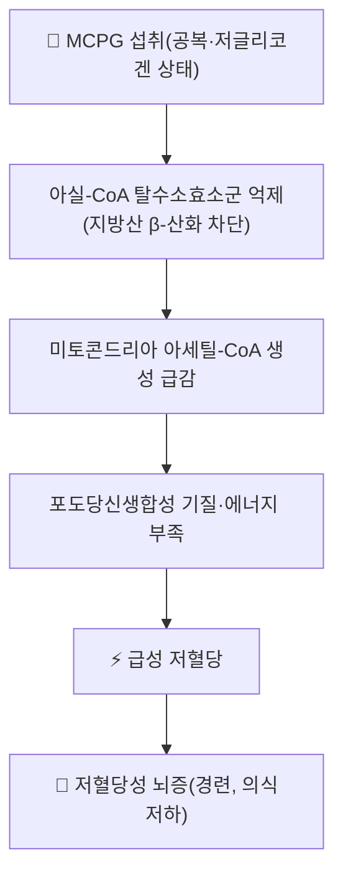

---
aliases:
  - Methylenecyclopropylglycine
  - α-(Methylenecyclopropyl)glycine
  - 메틸렌사이클로프로필글라이신
tags:
  - 약리성분
  - 아미노산유도체
  - 독성학
  - 여지핵
  - 저혈당
---

# 🔬 [[MCPG]] (Methylenecyclopropylglycine, α-(메틸렌사이클로프로필)글라이신)

> **핵심 3줄 요약 (Key Summary)**:
> - 🌿 기원 본초 & 화학 계열: 여지(리치, *Litchi chinensis*)의 씨앗(여지핵) 및 미성숙 과육에 함유된 비단백성 아미노산 유도체(사이클로프로판 고리를 가진 글라이신 유도체).
> - 🎯 핵심 분자 표적: 지방산 β-산화에 관여하는 아실-CoA 탈수소효소를 억제해 미토콘드리아 지방산 대사 및 포도당신생합성에 필요한 아세틸-CoA 공급을 차단.
> - 🩺 주요 독성 기전: 공복·저글리코겐 상태의 소아가 미성숙 여지를 다량 섭취할 경우 급성 저혈당성 뇌증을 유발 — 인도 무자파르푸르 지역 소아 뇌증 집단발병의 핵심 원인 물질로 규명됨.
> - ⚠️ 독성·생체이용률 한계 & 상호작용: 여지핵을 온간산한·진통 목적 한약재로 소량·법제 사용하는 것과 어린이의 공복 상태 미성숙 생과 다량 섭취는 전혀 다른 맥락이며, 정량화된 안전 용량 기준·인체 약동학/약물상호작용 데이터는 확립되어 있지 않음.

---

## 📌 목차
1. [기본 화학 정보 & 분자 구조식 (Chemical Identity)](#1-기본-화학-정보--분자-구조식-chemical-identity)
2. [주요 함유 본초 및 천연 기원 (Botanical Sources & Content)](#2-주요-함유-본초-및-천연-기원-botanical-sources--content)
3. [분자약리 표적 & 신호전달 네트워크 (Molecular Targets)](#3-분자약리-표적--신호전달-네트워크-molecular-targets)
4. [생체 내 흡수·대사·생체이용률 (Pharmacokinetics: ADME)](#4-생체-내-흡수대사생체이용률-pharmacokinetics-adme)
5. [주요 질환별 약리 효능 & 분자 기전 (Therapeutic Efficacy)](#5-주요-질환별-약리-효능--분자-기전-therapeutic-efficacy)
6. [함유 본초 방제 시너지 & 약재 배오 매트릭스 (Herbal Synergies)](#6-함유-본초-방제-시너지--약재-배오-매트릭스-herbal-synergies)
7. [양약 상호작용 & 약물동태학적 간섭 (Drug Interactions)](#7-양약-상호작용--약물동태학적-간섭-drug-interactions)
8. [💡 사용자 진료실 핵심 필기 & 임상 응용 팁 (Melt-In & High-Yield)](#8--사용자-진료실-핵심-필기--임상-응용-팁-melt-in--high-yield)
9. [출처 및 학술 참고 문헌 (References)](#9-출처-및-학술-참고-문헌-references)

---

## 1. 기본 화학 정보 & 분자 구조식 (Chemical Identity)

> [!abstract]+ 🧪 3D 약리 분자 구조 (Interactive 3D Viewer)
> <iframe src="https://molecule-viewer-rho.vercel.app/?cid=55289519" width="100%" height="450px" frameborder="0" allow="webgl" style="border-radius: 8px;"></iframe>

| 항목 | 상세 내용 |
| :--- | :--- |
| **분자식 / 분자량** | $\text{C}_6\text{H}_9\text{NO}_2$ / 약 143.14 g/mol |
| **PubChem CID** | [55289519](https://pubchem.ncbi.nlm.nih.gov/compound/Methylenecyclopropylglycine) |
| **화학 골격 분류** | 사이클로프로필 고리를 포함한 비단백성 아미노산(글라이신 유도체), 하이포글리신 A와 유사한 사이클로프로판 카르복실산 계열 |
| **구조적 특징** | 메틸렌사이클로프로판 고리에 글라이신 곁가지가 결합, 체내에서 유사 기전으로 아실-CoA 탈수소효소를 저해하는 하이포글리신 A와 함께 존재하는 경우가 많음 |

---

## 2. 주요 함유 본초 및 천연 기원 (Botanical Sources & Content)

| 함유 본초 (한글/한자) | 기원 식물학적 명칭 (과명 / 학명) | 주요 함유 부위 | 함량 특성 | 한의학적 배경 |
| :--- | :--- | :--- | :--- | :--- |
| [[여지핵]] (荔枝核) | 무환자나무과(Sapindaceae) / *Litchi chinensis* | 씨앗(종자) | 미성숙 씨앗·과육에서 상대적으로 고농도, 성숙할수록 감소 경향 보고 | 이기산결(理氣散結), 거한지통(祛寒止痛) — 한산요통·산기(疝氣) 치료 |

⚠️ 내용 검토 필요: 성숙도·품종·부위별 정확한 정량적 함량 수치는 문헌마다 차이가 있어 절대값 인용은 원문 확인이 필요합니다.

---

## 3. 분자약리 표적 & 신호전달 네트워크 (Molecular Targets)

* MCPG는 하이포글리신 A와 유사하게 대사되어 활성 대사체(MCPA-CoA 등)로 전환된 뒤, 지방산 β-산화의 여러 단계에 관여하는 아실-CoA 탈수소효소를 비가역적으로 저해합니다.
* 지방산 산화가 차단되면 간에서 포도당신생합성에 필요한 에너지(ATP)와 아세틸-CoA가 부족해져, 야간 공복 후 간 글리코겐 저장이 낮은 소아에서 급격한 저혈당이 발생할 수 있습니다.

---

## 4. 생체 내 흡수·대사·생체이용률 (Pharmacokinetics: ADME)

⚠️ 내용 검토 필요: MCPG의 정량적 인체 ADME 데이터(흡수율, Tmax, 반감기 등)는 현재까지 공식 문헌에서 확인되지 않았습니다. 확인된 것은 대사 경로(하이포글리신 A 유사 기전)와 독성 발현 조건뿐이며, 아래는 확인된 범위 내의 정보입니다.

| 항목 | 내용 | 근거 수준 |
| :--- | :--- | :--- |
| **대사 경로** | MCPA-CoA 등 활성 대사체로 전환 후 아실-CoA 탈수소효소 비가역적 저해 | 무자파르푸르 역학연구 기반 추정(§9) |
| **독성 발현 조건** | 공복·저글리코겐 상태에서 위험 급증(에너지 예비능이 낮은 소아) | Shrivastava 2017; John & Das 2017 |
| **정량적 흡수율·반감기** | 확립된 인체 데이터 없음 | — |

---

## 5. 주요 질환별 약리 효능 & 분자 기전 (Therapeutic Efficacy)

> ⚠️ MCPG는 치료 효능이 아니라 **독성 기전**이 핵심이므로, 이 절은 MCPG가 매개하는 중독 질환을 다룹니다.

### 1) 무자파르푸르(Muzaffarpur) 급성 뇌증 집단발병
* 인도 비하르주 무자파르푸르 지역에서는 매년 여지 수확철(5~6월)에 소아를 중심으로 급성 뇌증이 반복적으로 집단발병했습니다. 2017년 *Lancet Global Health*의 환자-대조군 연구(Shrivastava 등)가 발병과 여지 섭취의 연관성을 규명했고, 후속 연구(John & Das, 2017)는 살충제 노출이 아니라 MCPG(및 하이포글리신 A)가 주된 병인 물질임을 확인했습니다.
* 주된 위험군은 영양상태가 좋지 않아 간 글리코겐 저장이 낮고, 저녁 식사를 거른 채 다량의 미성숙 여지를 섭취한 소아였습니다.

---

## 6. 함유 본초 방제 시너지 & 약재 배오 매트릭스 (Herbal Synergies)

> MCPG는 독성 물질이지 배오 대상 유효성분이 아니므로, 이 절은 **여지핵의 전통적 한의학적 배오 맥락과 독성 맥락의 구분**을 다룹니다.

| 맥락 | 형태·용량 | MCPG 노출 위험 | 비고 |
| :--- | :--- | :--- | :--- |
| 한의학적 여지핵 처방(산기·한산요통) | 볶아서 법제, 소량 배합(타 본초와 병용) | 낮음 | 법제 과정에서 함량 변화 가능성 있으나 정량 데이터 없음 |
| 무자파르푸르 사례 | 공복 상태 미성숙 생과 다량 섭취 | 높음 | 법제되지 않은 생과, 대량, 공복이라는 3중 위험 요인 결합 |

---

## 7. 양약 상호작용 & 약물동태학적 간섭 (Drug Interactions)

⚠️ 내용 검토 필요: MCPG와 특정 양약 간의 정량적 상호작용을 다룬 임상 연구는 확인되지 않았습니다. 다만 기전적으로 주의할 수 있는 점은 다음과 같습니다.
* **저혈당 유발 약물과의 이론적 상가 위험**: 설포닐우레아·인슐린 등 저혈당을 유발할 수 있는 약물을 복용 중인 소아·환자가 여지를 다량 섭취하면 저혈당 위험이 상가될 가능성이 기전상 상정되나, 이를 직접 검증한 연구는 없습니다.
* **공복 상태의 위험 증폭**: 장시간 금식이 필요한 시술·수술 전후에는 여지 다량 섭취와의 조합을 피하는 것이 안전합니다(기전적 추론이며, 확정 임상 근거는 아님).

---

## 8. 💡 사용자 진료실 핵심 필기 & 임상 응용 팁 (Melt-In & High-Yield)

* **한의학적 함의: 여지핵과의 구분**: 한의학에서 사용하는 여지핵(볶아서 포제한 씨앗)은 산기·한산복통 등에 소량·법제된 형태로 처방에 배합되는 것으로, 무자파르푸르 사례처럼 공복 상태에서 미성숙 생과실을 다량 섭취하는 상황과는 섭취량·포제 여부·임상 맥락이 전혀 다릅니다.
* **환자 교육 포인트**: 여지핵을 한약재로 처방받는 것과, 어린이가 빈속에 설익은 리치 열매를 많이 먹는 것은 완전히 다른 상황임을 명확히 설명해 불필요한 불안을 줄이되, 소아의 공복 상태 생과 다량 섭취는 계절적으로 주의하도록 안내합니다.
* **원료가 동일한 식물이라는 점에서** 여지핵을 다량으로 오남용하거나 미성숙 과실을 생으로 대량 섭취하는 것은 이론적으로 주의가 필요하며, 정량적인 안전 역치는 현재 확립되어 있지 않으므로 과장된 안전/위험 단정을 피합니다.

---

## 9. 출처 및 학술 참고 문헌 (References)

1. **Shrivastava A, Kumar A, Thomas JD, et al. (2017)**. *Association of acute toxic encephalopathy with litchi consumption in an outbreak in Muzaffarpur, India, 2014: a case-control study*. **The Lancet Global Health**.
   - [PMID: 28153514](https://pubmed.ncbi.nlm.nih.gov/28153514/)
   - **[연구 요약]**: 무자파르푸르 소아 뇌증 집단발병과 여지(리치) 섭취의 연관성을 규명한 환자-대조군 연구. 저혈당·저글리코겐 상태의 공복 소아에서 위험도가 높았음을 보고.
2. **John TJ, Das M. (2017)**. *Methylene cyclopropyl glycine, not pesticide exposure as the primary etiological factor underlying hypoglycemic encephalopathy in Muzaffarpur, India*.
   - [PMID: 30389321](https://pubmed.ncbi.nlm.nih.gov/30389321/)
   - **[연구 요약]**: 살충제 노출 가설을 반박하고 MCPG가 뇌증의 핵심 병인 물질임을 재확인.
3. **PubChem Compound Summary** — Methylenecyclopropylglycine (CID 55289519).
   - [https://pubchem.ncbi.nlm.nih.gov/compound/Methylenecyclopropylglycine](https://pubchem.ncbi.nlm.nih.gov/compound/Methylenecyclopropylglycine)
