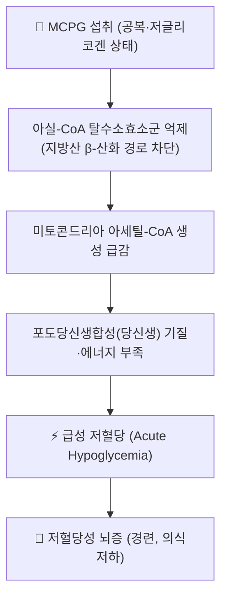

---
aliases:
  - Methylenecyclopropylglycine
  - α-(Methylenecyclopropyl)glycine
  - 메틸렌사이클로프로필글라이신
tags:
  - 약리성분
  - 아미노산유도체
  - 독성학
  - 여지핵
  - 저혈당
---

# 🔬 MCPG (Methylenecyclopropylglycine, α-(메틸렌사이클로프로필)글라이신)

> **핵심 3줄 요약 (Key Summary)**:
> - 🌿 기원 및 화학 계열: 여지(리치, *Litchi chinensis*)의 씨앗(여지핵) 및 미성숙 과육에 함유된 비단백성 아미노산 유도체(사이클로프로판 고리를 가진 글라이신 유도체).
> - 🎯 핵심 분자 표적: 지방산 β-산화에 관여하는 여러 아실-CoA 탈수소효소(acyl-CoA dehydrogenase)를 억제하여, 미토콘드리아 내 지방산 대사 및 포도당신생합성(gluconeogenesis)에 필요한 아세틸-CoA 공급을 차단.
> - 🩺 주요 독성 기전: 영양 결핍 상태에서 간 글리코겐이 부족한 소아가 공복 상태로 미성숙 여지를 다량 섭취할 경우, 지방산 산화 차단으로 인한 급성 저혈당성 뇌증(acute hypoglycemic encephalopathy)을 유발할 수 있음 — 인도 무자파르푸르(Muzaffarpur) 지역의 반복적 소아 뇌증 집단발병의 핵심 원인 물질로 규명됨.
> - ⚠️ 유의점: 여지핵을 온간산한·진통 목적의 한약재로 사용할 때는 어린이의 공복 상태 다량 생과 섭취(특히 미성숙 과실)와는 전혀 다른 맥락이므로 혼동해서는 안 되며, 정량화된 안전 용량 기준은 확립되어 있지 않음.

---

## 📌 목차
1. [기본 화학 정보](#1-기본-화학-정보-chemical-identity)
2. [주요 함유 본초 및 천연 기원](#2-주요-함유-본초-및-천연-기원)
3. [분자약리 표적 & 독성 기전](#3-분자약리-표적--독성-기전)
4. [무자파르푸르 뇌증 집단발병 사례](#4-무자파르푸르-뇌증-집단발병-사례)
5. [한의학적 함의: 여지핵과의 구분](#5-한의학적-함의-여지핵과의-구분)
6. [출처 및 학술 참고 문헌 (References)](#6-출처-및-학술-참고-문헌-references)

---

## 1. 기본 화학 정보 (Chemical Identity)

> [!abstract]+ 🧪 3D 분자 구조 (Interactive 3D Viewer)
> <iframe src="https://molecule-viewer-rho.vercel.app/?cid=55289519" style="width: 100%; height: 600px; border: none; border-radius: 12px; box-shadow: 0 4px 20px rgba(0,0,0,0.15);" allowfullscreen></iframe>

| 항목 | 상세 내용 |
| :--- | :--- |
| **분자식 / 분자량** | C₆H₉NO₂ / 약 143.14 g/mol |
| **PubChem CID** | [55289519](https://pubchem.ncbi.nlm.nih.gov/compound/Methylenecyclopropylglycine) |
| **화학 골격 분류** | 사이클로프로필 고리를 포함한 비단백성 아미노산(글라이신 유도체) — 하이포글리신 A(Hypoglycin A)와 유사한 사이클로프로판 카복실산 계열 독성 아미노산 |
| **구조적 특징** | 메틸렌사이클로프로판 고리에 아미노산(글라이신) 곁가지가 결합된 구조로, 체내에서 유사한 기전으로 아실-CoA 탈수소효소를 저해하는 하이포글리신 A와 함께 존재하는 경우가 많음 |

---

## 2. 주요 함유 본초 및 천연 기원 (Botanical Sources & Content)

| 함유 본초 (한글/한자) | 기원 식물학적 명칭 | 주요 함유 부위 | 함량 특성 | 한의학적 배경 |
| :--- | :--- | :--- | :--- | :--- |
| [[여지핵]] (荔枝核) | 무환자나무과 / *Litchi chinensis* | 씨앗(종자) | 미성숙 씨앗·과육에서 상대적으로 고농도, 성숙할수록 감소하는 경향이 보고됨 | 이기산결(理氣散結), 거한지통(祛寒止痛) — 한산요통·산기(疝氣) 치료에 사용되는 한약재 |

⚠️ 내용 검토 필요: 성숙도·품종·부위별 정확한 정량적 함량 수치는 문헌마다 차이가 있어 절대값 인용은 원문 확인이 필요합니다.

---

## 3. 분자약리 표적 & 독성 기전

* MCPG는 하이포글리신 A와 유사하게 대사되어 활성 대사체(MCPA-CoA 등)로 전환된 뒤, 지방산 β-산화의 여러 단계에 관여하는 아실-CoA 탈수소효소를 비가역적으로 저해합니다.
* 지방산 산화가 차단되면 간에서 포도당신생합성에 필요한 에너지(ATP)와 보조 기질(아세틸-CoA)이 부족해져, 특히 야간 공복 후 간 글리코겐 저장이 낮은 소아에서 급격한 저혈당이 발생할 수 있습니다.
* 저혈당이 신속히 교정되지 않으면 뇌 에너지 대사 장애로 경련, 의식 저하 등 급성 뇌증으로 진행할 수 있습니다.

---

## 4. 무자파르푸르(Muzaffarpur) 뇌증 집단발병 사례

인도 비하르주 무자파르푸르 지역에서는 매년 여지(리치) 수확철(5~6월)에 소아를 중심으로 급성 뇌증이 반복적으로 집단발병해 왔습니다. 2017년 *Lancet Global Health*에 발표된 환자-대조군 연구(Shrivastava 등)는 발병과 여지 섭취 사이의 연관성을 규명했고, 후속 연구(John 등, 2017)는 살충제 노출이 아니라 MCPG(및 하이포글리신 A)가 주된 병인 물질임을 확인했습니다. 주된 위험군은 영양상태가 좋지 않아 간 글리코겐 저장이 낮고, 저녁 식사를 거른 채 다량의 미성숙 여지를 섭취한 소아였습니다.

---

## 5. 한의학적 함의: 여지핵과의 구분

한의학에서 사용하는 [[여지핵]](荔枝核, 볶아서 포제한 씨앗)은 산기(疝氣)·한산복통 등에 소량·법제된 형태로 처방에 배합되는 것으로, 무자파르푸르 사례처럼 공복 상태에서 미성숙 생과실을 다량 섭취하는 상황과는 섭취량·포제 여부·임상 맥락이 전혀 다릅니다. 다만 원료가 동일한 식물이라는 점에서 여지핵을 다량으로 오남용하거나 미성숙 과실을 생으로 대량 섭취하는 것은 이론적으로 주의가 필요하며, 정량적인 안전 역치는 현재 확립되어 있지 않으므로 ⚠️ 내용 검토 필요로 표기합니다.

---

## 6. 출처 및 학술 참고 문헌 (References)

1. **Shrivastava A, Kumar A, Thomas JD, et al. (2017)**. Association of acute toxic encephalopathy with litchi consumption in an outbreak in Muzaffarpur, India, 2014: a case-control study. *The Lancet Global Health*. PMID: [28153514](https://pubmed.ncbi.nlm.nih.gov/28153514/)
   - **[연구 요약]**: 무자파르푸르 소아 뇌증 집단발병과 여지(리치) 섭취의 연관성을 규명한 환자-대조군 연구로, 저혈당·저글리코겐 상태의 공복 소아에서 위험도가 높았음을 보고.
2. **John TJ, Das M. (2017)**. Methylene cyclopropyl glycine, not pesticide exposure as the primary etiological factor underlying hypoglycemic encephalopathy in Muzaffarpur, India. PMID: [30389321](https://pubmed.ncbi.nlm.nih.gov/30389321/)
   - **[연구 요약]**: 살충제 노출 가설을 반박하고 MCPG가 뇌증의 핵심 병인 물질임을 재확인한 논평/연구.
3. PubChem Compound Summary — Methylenecyclopropylglycine (CID 55289519): [https://pubchem.ncbi.nlm.nih.gov/compound/Methylenecyclopropylglycine](https://pubchem.ncbi.nlm.nih.gov/compound/Methylenecyclopropylglycine)
