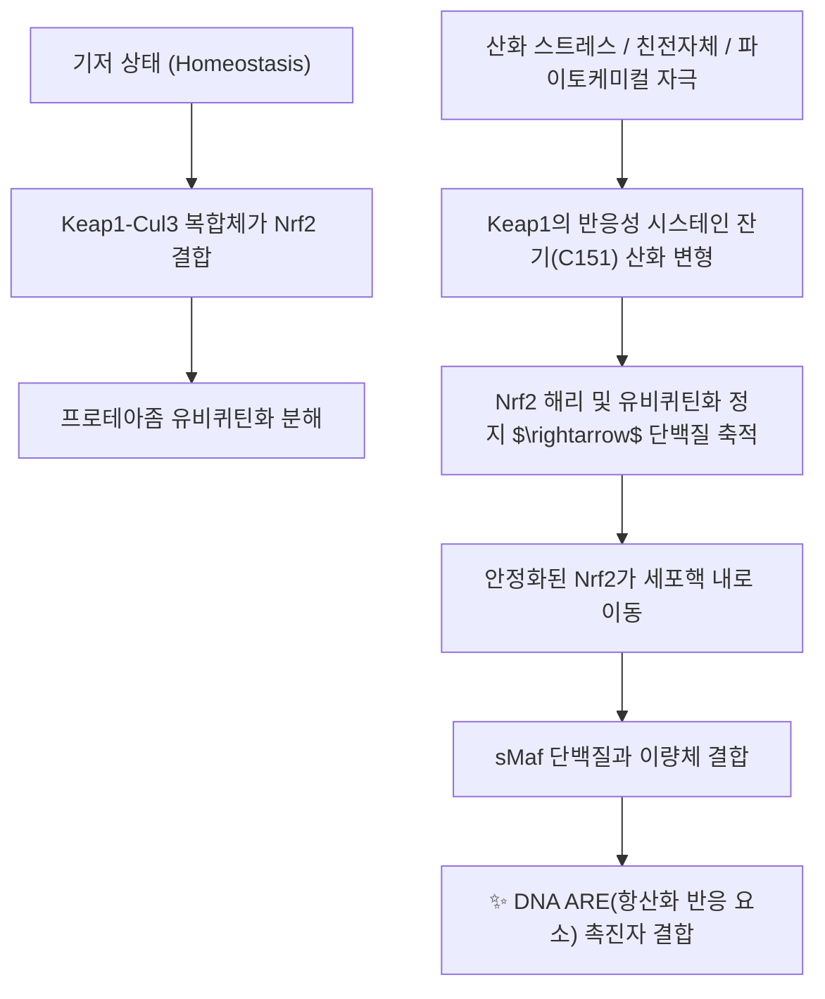

# 💊 [[Nrf2]] (Nuclear Factor Erythroid 2-Related Factor 2)

> **핵심 요약 (Key Summary)**:
> 세포 내 산화 스트레스와 친전자성 독소에 대항하여 세포를 방어하는 인체 내인성 항산화·해독 시스템의 마스터 전사인자.
> 평상시 Keap1에 억제되어 있다가 활성산소 자극 시 핵 내로 전위되어 ARE에 결합함으로써 HO-1, NQO1, GSH 합성 효소군을 일제히 유도.
> 만성 염증, 혈관 내피 손상, 신경퇴행성 질환 방어의 핵심 약리 표적이자 당귀의 페룰산, 감초의 리퀴리틴 등 다수 한약 성분의 공통 분자 타깃.

---

## 1. 기본 화학 정보 & 분자 구조식 (Chemical Identity)

> [!abstract]+ 🧪 3D 약리 분자 구조 (Interactive 3D Viewer)
> <iframe src="https://molecule-viewer-rho.vercel.app/?cid=5281767" style="width: 100%; height: 600px; border: none; border-radius: 12px; box-shadow: 0 4px 20px rgba(0,0,0,0.15);" allowfullscreen></iframe>

| 항목 | 상세 분자생물학적 정보 |
| :--- | :--- |
| **유전자 및 단백질** | *NFE2L2* (Nuclear factor, erythroid 2 like 2) / 605개 아미노산, 66 kDa |
| **단백질 도메인** | Neh1~Neh7 도메인 (Neh1은 sMaf 결합 bZIP 도메인, Neh2는 Keap1 결합 부위) |
| **음성 조절 단백질** | Keap1 (Kelch-like ECH-associated protein 1) - 유비퀴틴화 억제자 |

---

## 2. 주요 조절 본초 및 천연 기원 (Botanical Sources & Content)

> [!warning] ⚠️ 템플릿 적용 상 주의
> Nrf2는 식물이 함유하는 파이토케미컬이 아니라 인체 세포가 발현하는 내인성 전사인자입니다. 이 절은 "Nrf2를 함유하는 본초"가 아니라, **Nrf2를 활성화(Keap1 시스테인 변형을 통한 안정화)하는 것으로 학술 보고된 한약 성분**을 다룹니다.

| 활성화 성분 | 기원 본초 | 분자 구조군 |
| :--- | :--- | :--- |
| [[페룰산]] | [[당귀]], [[천궁]] | 페놀산 유도체 |
| [[리퀴리틴]] | [[감초]] | 플라바논 배당체 |
| [[커큐민]] | [[강황]], [[울금]] | 폴리페놀 |
| [[레스베라트롤]] | [[호장근]] | 스틸베노이드 |
| [[설포라판]] | 십자화과 채소 | 이소티오시아네이트 |

---

## 3. 분자약리 표적 & 신호전달 네트워크 (Molecular Targets)

Nrf2가 핵 내 ARE 염기서열(5'-TGACnnnGC-3')에 결합하면 세포 보호 2상 해독 효소들의 전사가 유도됩니다.

| 유전자 및 단백질 | 주된 생화학적 기능 |
| :--- | :--- |
| **HO-1 (Heme Oxygenase-1)** | 헴 분해 → 강력한 항염증·혈관 확장 |
| **NQO1 (NADPH Quinone Reductase)** | 퀴논 독소의 2전자 환원을 통한 활성산소 발생 방지 |
| **GCLC / GCLM** | 글루타티온(GSH) 합성 속도 조절 |
| **GPX (Glutathione Peroxidase)** | 과산화수소 및 지질 과산화물 무독화 |

**NF-κB와의 상호 크로스토크**: Nrf2가 유도한 HO-1과 글루타티온은 세포질 내 활성산소를 제거하여 IKK 복합체 활성화를 차단함으로써 NF-κB의 핵 내 이동을 저지합니다 (Wardyn 2015). 따라서 Nrf2 활성화는 항산화를 넘어 항염증 치료 효과를 발휘합니다.

---

## 4. 생체 내 조절·분해 동태 (Pharmacokinetics: ADME 대응)

> [!warning] ⚠️ 템플릿 적용 상 주의
> Nrf2는 경구 흡수되는 저분자가 아니므로, 이 절은 **Nrf2 단백질 자체의 생성·분해 동태**를 다룹니다.

- **초고속 회전율(Turnover)**: 기저 상태의 Nrf2는 Cul3-Rbx1 E3 유비퀴틴 리가아제 복합체에 의해 지속적으로 분해되어, 약 20분 내외의 매우 짧은 단백질 반감기를 유지하는 것으로 보고되어 있습니다 (Dinkova-Kostova 2015 리뷰 기반의 일반적으로 인용되는 수치).
- **활성화 시 안정화**: 산화 스트레스나 친전자체 자극이 Keap1의 반응성 시스테인(C151 등)을 변형시키면 유비퀴틴화가 정지되어 Nrf2 단백질이 축적·안정화되고 핵 내로 이동합니다.
- 정확한 조직별 반감기 수치는 세포주·자극 조건에 따라 차이가 크게 보고되어, 이 노트에서는 단일 절대값으로 단정하지 않습니다.

---

## 5. 주요 질환별 약리 효능 & 분자 기전 (Therapeutic Efficacy)

- **당뇨병성 혈관 합병증 및 신증 방어**: 고혈당으로 인한 최종당화산물(AGEs) 생성을 억제하고 신장 사구체 간질세포의 섬유화를 방어.
- **허혈-재관류 뇌손상 방어**: 뇌경색 발생 시 미세아교세포(Microglia)의 M1(염증형) 분극화를 M2(항염증·조직재생형)로 유도하여 신경세포 생존율을 높임 (Kumar 2014).

---

## 6. 조절 본초 방제 시너지 & 배오 매트릭스 (Herbal Synergies)

> [!warning] ⚠️ 템플릿 적용 상 주의
> 아래는 "Nrf2를 함유하는 처방"이 아니라, **다수의 Nrf2 활성화 성분을 동시에 함유한 처방 배오** 사례입니다.

- [[당귀]](페룰산)와 [[감초]](리퀴리틴)가 함께 배오되는 다수의 보익·조화 처방에서는 이론적으로 Nrf2 경로에 대한 상가적 자극이 가능하다고 추정되나, **처방 수준의 Nrf2 활성 상승을 직접 측정한 임상 대조시험은 확인되지 않았습니다** — 개별 성분 실험 데이터를 처방 전체 효과로 단정하지 않도록 주의가 필요합니다.

---

## 7. 양약 상호작용 & 약물동태학적 간섭 (Drug Interactions)

- **디메틸푸마레이트(Dimethyl Fumarate, Tecfidera)**: 다발성 경화증 치료에 FDA 승인된 대표적 합성 Nrf2 경로 활성화 약물로, Keap1의 시스테인 잔기를 숙신화(succination)하여 Nrf2를 안정화시키는 것으로 보고되어 있습니다.
  - Yadav SK, Soin D, Ito K, Dhib-Jalbut S. Insight into the mechanism of action of dimethyl fumarate in multiple sclerosis. *Journal of Molecular Medicine*. 2019;97:463-472. PMID: 30820593
- 한약재 유래 Nrf2 활성화 성분(커큐민, 설포라판 등)과 디메틸푸마레이트의 병용에 대한 인체 대상 상호작용 데이터는 현재 확인되지 않아, 상가적 항산화 효과의 가능성과 별개로 확정적 서술은 피합니다.

---

## 8. 💡 사용자 진료실 핵심 필기 & 임상 응용 팁 (Melt-In & High-Yield)

- "Nrf2 활성화 = 무조건 좋은 것"이 아니라, 일부 암세포에서는 Nrf2 과활성이 항암제 저항성과 연관된다는 이중적 측면이 있어 환자군에 따라 설명을 달리해야 함.
- 항산화 계열 한약 성분(커큐민, 페룰산 등)을 설명할 때 "Keap1-Nrf2-ARE 경로"라는 공통 분자 기전으로 묶어 설명하면 여러 본초의 작용을 통합적으로 이해시키기 좋음.

---

## 9. 출처 및 학술 참고 문헌 (References)

1. Dinkova-Kostova AT, Abramov AY. The emerging role of Nrf2 in mitochondrial function. *Free Radic Biol Med*. 2015;88(Pt B):179-188. [PubMed](https://pubmed.ncbi.nlm.nih.gov/25975984/)
2. Wardyn JD, Ponsford AH, Sanderson CM. Dissecting molecular cross-talk between Nrf2 and NF-κB pathways. *Biochem Soc Trans*. 2015;43(4):621-626. [PubMed](https://pubmed.ncbi.nlm.nih.gov/26551702/)
3. Kumar H, Kim IS, More SV, et al. Natural product-derived pharmacological modulators of Nrf2/ARE pathway for chronic diseases. *Natural Product Reports*. 2014;31(1):109-139. [PubMed](https://pubmed.ncbi.nlm.nih.gov/24292194/)
4. Yadav SK, Soin D, Ito K, Dhib-Jalbut S. (2019). Insight into the mechanism of action of dimethyl fumarate in multiple sclerosis. *Journal of Molecular Medicine*, 97:463-472. [PubMed](https://pubmed.ncbi.nlm.nih.gov/30820593/)
