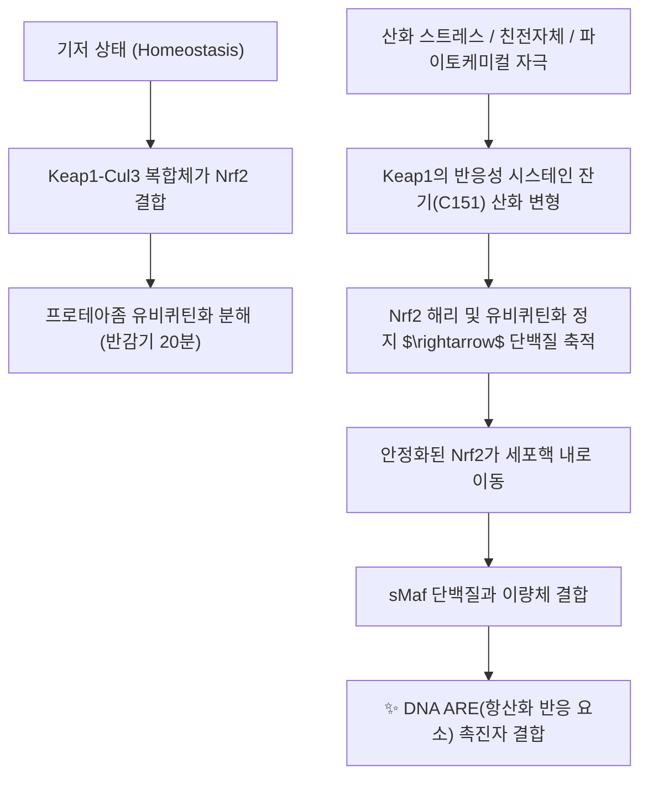

# 💊 [[Nrf2]] (Nuclear Factor Erythroid 2-Related Factor 2)

> **핵심 요약 (Key Summary)**:
> 세포 내 산화 스트레스와 친전자성 독소에 대항하여 세포를 방어하는 인체 내인성 항산화·해독 시스템의 마스터 전사인자.
> 평상시 Keap1에 억제되어 있다가 활성산소 자극 시 핵 내로 전위되어 ARE에 결합함으로써 HO-1, NQO1, GSH 합성 효소군을 일제히 유도.
> 만성 염증, 혈관 내피 손상, 신경퇴행성 질환 방어의 핵심 약리 표적이자 당귀의 페룰산, 감초의 리퀴리틴 등 다수 한약 성분의 공통 분자 타깃.

---
## 📌 목차
1. [분자 구조 및 Keap1-Nrf2 신호 축 (Canonical Pathway)](#1-분자-구조-및-keap1-nrf2-신호-축-canonical-pathway)
2. [ARE(Antioxidant Response Element) 하류 표적 유전자망](#2-areantioxidant-response-element-하류-표적-유전자망)
3. [NF-κB와의 상호 크로스토크(Cross-talk) & 항염증 연계](#3-nf-κb와의-상호-크로스토크cross-talk--항염증-연계)
4. [대사증후군·허혈성 뇌심혈관 질환 보호 기전](#4-대사증후군허혈성-뇌심혈관-질환-보호-기전)
5. [한약재 천연 파이토케미컬 활성화제 매트릭스](#5-한약재-천연-파이토케미컬-활성화제-매트릭스)
6. [출처 및 학술 참고 문헌 (References)](#6-출처-및-학술-참고-문헌-references)

---
## 1. 분자 구조 및 Keap1-Nrf2 신호 축 (Canonical Pathway)

| 항목 | 상세 분자생물학적 정보 |
| :--- | :--- |
| **유전자 및 단백질** | *NFE2L2* (Nuclear factor, erythroid 2 like 2) / 605개 아미노산, 66 kDa |
| **단백질 도메인** | Neh1~Neh7 도메인 (Neh1은 sMaf 결합 bZIP 도메인, Neh2는 Keap1 결합 부위) |
| **음성 조절 단백질** | Keap1 (Kelch-like ECH-associated protein 1) - 유비퀴틴화 억제자 |
| **기저 상태 분해 주기** | Cul3-Rbx1 E3 리가아제에 의해 지속 분해되어 20분 내외의 짧은 반감기 유지 |

---
## 2. ARE(Antioxidant Response Element) 하류 표적 유전자망

Nrf2가 핵 내 ARE 염기서열(5'-TGACnnnGC-3')에 결합하면 세포 보호 2상 해독 효소들의 전사가 폭발적으로 유도됩니다.

| 유전자 및 단백질 | 주된 생화학적 기능 및 세포 방어 역할 |
| :--- | :--- |
| **HO-1 (Heme Oxygenase-1)** | 헴을 빌리베르딘, Fe2+, 일산화탄소(CO)로 분해 $\rightarrow$ 강력한 항염증·혈관 확장 |
| **NQO1 (NADPH Quinone Reductase)** | 퀴논 독소의 2전자 환원을 통한 활성산소 발생 방지 |
| **GCLC / GCLM** | 글루타티온(GSH) 합성 속도 조절 효소 $\rightarrow$ 세포 내 항산화 저장고 충전 |
| **GPX (Glutathione Peroxidase)** | 과산화수소(H2O2) 및 지질 과산화물 무독화 |
| **SOD / Catalase** | 슈퍼옥사이드 라디칼 소거 |

---
## 3. NF-κB와의 상호 크로스토크(Cross-talk) & 항염증 연계

* **염증과 항산화의 상호 길항 짝힘**:
  * 전사인자 NF-κB는 염증성 사이토카인(TNF-α, IL-6)을 유도하고, Nrf2는 항산화 효소를 유도하여 서로를 억제합니다.
* **Nrf2 활성화에 의한 IκB 분해 억제**:
  * Nrf2가 유도한 HO-1과 글루타티온은 세포질 내 활성산소를 제거하여 IKK 복합체의 활성화를 차단함으로써 NF-κB의 핵 내 이동을 저지합니다.
  * 따라서 Nrf2 활성화는 단순한 항산화를 넘어 강력한 항염증 치료 효과를 발휘합니다.

---
## 4. 대사증후군·허혈성 뇌심혈관 질환 보호 기전

* **당뇨병성 혈관 합병증 및 신증 방어**:
  * 고혈당으로 인한 최종당화산물(AGEs) 생성을 억제하고 신장 사구체 간질세포의 섬유화를 방어합니다.
* **허혈-재관류 뇌손상 방어**:
  * 뇌경색 발생 시 미세아교세포(Microglia)의 M1(염증형) 분극화를 M2(항염증·조직재생형) 분극화로 유도하여 신경세포 생존율을 극대화합니다.

---
## 5. 한약재 천연 파이토케미컬 활성화제 매트릭스

인체 내 Nrf2를 부작용 없이 활성화하는 주된 천연물 분자들입니다.

| 활성화 성분 | 기원 본초 | 분자 구조군 | 한의학적 효능 연계 |
| :--- | :--- | :--- | :--- |
| [[페룰산]] | [[당귀]], [[천궁]] | 페놀산 유도체 | 보혈활혈(補血活血), 항혈전, 혈관 내피 보호 |
| [[리퀴리틴]] | [[감초]] | 플라바논 배당체 | 보기건비(補氣健脾), 간세포 보호, 해독 |
| [[커큐민]] | [[강황]], [[울금]] | 폴리페놀 | 파혈행기(破血行氣), 관절염 소염진통 |
| [[레스베라트롤]] | [[호장근]] | 스틸베노이드 | 활혈산어(活血散瘀), 청열해독, 항노화 |
| [[설포라판]] | 십자화과 채소 | 이소티오시아네이트 | 최강의 천연 Nrf2 유도제, 항암 |

---
## 6. 출처 및 학술 참고 문헌 (References)

* Dinkova-Kostova AT, Abramov AY. The emerging role of Nrf2 in mitochondrial function. *Free Radic Biol Med*. 2015;88(Pt B):179-188.
  * `[연구 요약]` Nrf2가 미토콘드리아 생합성 및 ATP 생산, 산화 스트레스 저항성에 미치는 핵심 조절 기전 규명.
* Wardyn JD, Ponsford AH, Sanderson CM. Dissecting molecular cross-talk between Nrf2 and NF-κB pathways. *Biochem Soc Trans*. 2015;43(4):621-626.
  * `[연구 요약]` Nrf2와 NF-κB 전사인자 축 간의 상호 피드백 억제 루프와 만성 염증성 질환 제어 분석.
* Kumar H, Kim IS, More SV, et al. Natural product-derived pharmacological modulators of Nrf2/ARE pathway for therapy of neurodegenerative diseases. *Mol Neurobiol*. 2014;50(3):1064-1089.
  * `[연구 요약]` 천연 한약 파이토케미컬에 의한 Nrf2 활성화와 파킨슨·알츠하이머병 신경 보호 효능 총괄.
