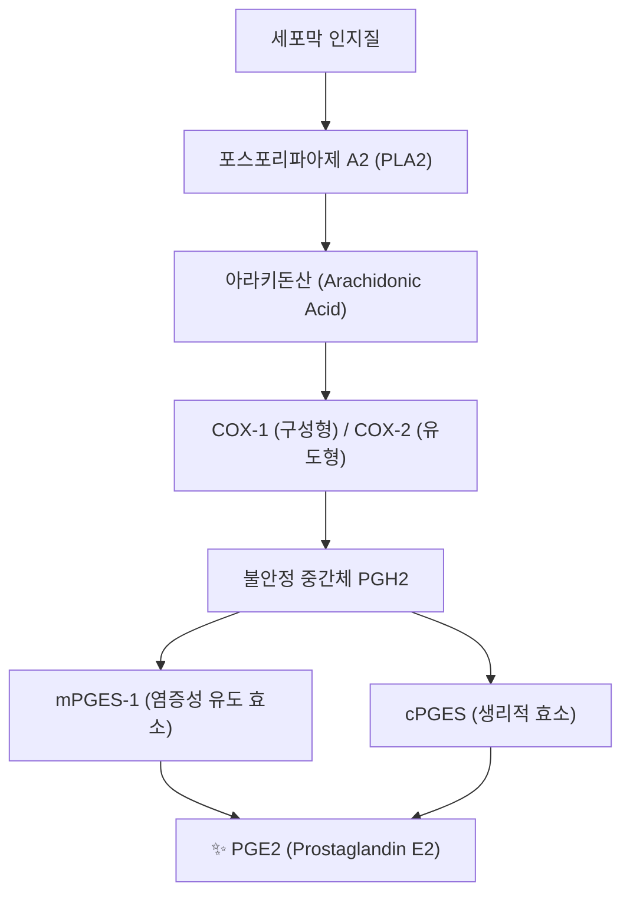
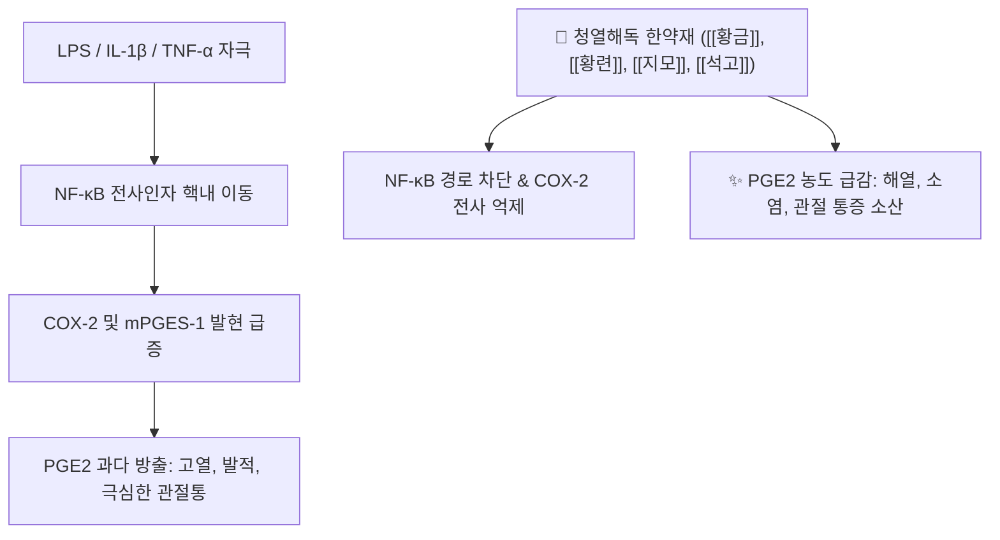

# 💊 [[PGE2]] (Prostaglandin E2)

> **핵심 요약 (Key Summary)**:
> 세포막 인지질 유래 아라키돈산에서 COX-1 및 COX-2 효소와 PGE 합성효소에 의해 생성되는 대표적인 에이코사노이드 생체활성 지질.
> EP1부터 EP4까지 4종의 G단백질 결합 수용체를 통해 시상하부 체온 설정점 상승(발열), 말초 통각신경 감작(통증), 혈관 확장 및 위점막 보호 작용을 발휘.
> 급만성 염증성 질환과 관절염의 핵심 유발 인자이자 NSAIDs의 주 억제 표적이며 청열소염 한약재([[황금]], [[황련]])의 핵심 약리 억제 타깃.

---
## 📌 목차
1. [분자 구조 및 생합성 경로 (Arachidonic Acid Cascade)](#1-분자-구조-및-생합성-경로-arachidonic-acid-cascade)
2. [4대 EP 수용체(EP1~EP4) 신호전달 네트워크](#2-4대-ep-수용체ep1ep4-신호전달-네트워크)
3. [주요 생리활성 및 병태생리 (발열·통증·위점막 보호·면역)](#3-주요-생리활성-및-병태생리-발열통증위점막-보호면역)
4. [양방 약리학적 조절 (NSAIDs / Coxib / 생식기계 제제)](#4-양방-약리학적-조절-nsaids--coxib--생식기계-제제)
5. [한의학적 청열해독·소염 처방 배오 연계](#5-한의학적-청열해독소염-처방-배오-연계)
6. [출처 및 학술 참고 문헌 (References)](#6-출처-및-학술-참고-문헌-references)

---
## 1. 분자 구조 및 생합성 경로 (Arachidonic Acid Cascade)

| 항목 | 화학 및 생화학적 정보 |
| :--- | :--- |
| **화학명 (IUPAC)** | (5Z,11α,13E,15S)-11,15-Dihydroxy-9-oxoprosta-5,13-dien-1-oic acid |
| **분자식 및 분자량** | C20H32O5 / 352.47 g/mol |
| **CAS 등록번호** | 363-24-6 |
| **생합성 전구체** | 막 인지질 $\rightarrow$ 포스포리파아제 A2(PLA2)에 의해 유리된 [[아라키돈산]] |
| **합성 관여 효소** | 사이클로옥시게나아제(COX-1, COX-2) $\rightarrow$ PGH2 $\rightarrow$ 미세소체 PGE 합성효소(mPGES-1) |

---
## 2. 4대 EP 수용체(EP1~EP4) 신호전달 네트워크

PGE2는 7회 막관통 G단백질 결합 수용체(GPCR)인 EP1, EP2, EP3, EP4를 통해 표적 조직마다 매우 다양한 복합 효과를 유발합니다.

| 수용체 | 결합 G단백질 | 2차 전달자 | 주된 조직 분포 및 생리 작용 |
| :--- | :--- | :--- | :--- |
| **EP1** | Gq/11 | IP3 / DAG $\uparrow$, 세포내 Ca2+ $\uparrow$ | 기관지 및 위장관 평활근 수축, 말초 통각신경 흥분성 증대 |
| **EP2** | Gs | cAMP $\uparrow$, PKA 활성화 | 혈관 및 기관지 확장, 자궁경부 숙개(소실), 면역세포 억제 |
| **EP3** | Gi (일부 G12/13) | cAMP $\downarrow$, Rho 활성화 | 시상하부 발열 유도(체온 설정점 상승), 위산 분비 억제, 자궁근 수축 |
| **EP4** | Gs / PI3K | cAMP $\uparrow$, Akt 신호 활성화 | 신장 혈관 확장, 관절 골 흡수 촉진, 대장 점막 상피 재생 |

---
## 3. 주요 생리활성 및 병태생리 (발열·통증·위점막 보호·면역)

* **시상하부 발열 반응 (Pyrogenesis)**:
  * 세균 내독소(LPS)나 염증성 사이토카인(IL-1β, TNF-α)이 뇌 미세혈관 내피세포의 COX-2/mPGES-1을 자극하여 PGE2 방출.
  * PGE2가 시상하부 시신경전구역(Preoptic area)의 EP3 수용체에 작용하여 체온 설정점을 상승시켜 오한 및 발열을 촉발합니다.
* **말초 통각수용기 감작 (Hyperalgesia)**:
  * 손상 부위 감각 신경 말단의 EP 수용체에 결합하여 나트륨 및 TRPV1 통로의 역치를 낮춤으로써 브라디키닌, 히스타민에 대한 통증 민감도를 극대화합니다.
* **위점막 세포 보호 (Cytoprotection)**:
  * 위점막 상피의 EP2/EP4 수용체를 통해 점액(Mucin) 및 중탄산염(HCO3-) 분비를 촉진하고, EP3 수용체로 위산 분비를 억제하여 궤양 형성을 방어합니다.

---
## 4. 양방 약리학적 조절 (NSAIDs / Coxib / 생식기계 제제)

* **비스테로이드성 소염진통제 (NSAIDs)**:
  * 이부프로펜, 나프록센 등은 COX-1/COX-2를 차단하여 PGE2 합성을 억제함으로써 강력한 해열·진통·항염 효과를 나타냅니다.
  * 그러나 COX-1 억제로 인한 위점막 PGE2 고갈 시 위염, 소화성 궤양, 위장관 출혈이 동반됩니다.
* **선택적 COX-2 억제제 (Celecoxib)**:
  * 위점막 보호 기능(COX-1)은 보존하면서 염증 국소의 PGE2만 차단하나, 혈관 내피의 PGI2 억제에 따른 심혈관계 혈전 위험 증가에 주의해야 합니다.
* **임상 외인성 제제 (Dinoprostone)**:
  * 합성 PGE2 제제로 산부인과에서 만삭 임산부의 유도분만(자궁경부 연화 및 수축 유발)에 사용됩니다.

---
## 5. 한의학적 청열해독·소염 처방 배오 연계

* **청열사화·해독제의 PGE2 차단 메커니즘**:
  * [[황금]](Baicalin) 및 [[황련]](Berberine): 대식세포와 활액막세포에서 NF-κB 활성화를 억제하여 COX-2 및 mPGES-1 단백질 발현을 전사 수준에서 강력히 차단.
  * [[석고]]·[[지모]] ([[백호탕]]): 시상하부 PGE2 생산을 급격히 억제하여 사기(邪氣)가 성한 고열(壯熱)과 번갈(煩渴)을 신속히 해소.
* **관절 활액막염 및 풍한습비 처방**:
  * [[방기황기탕]], [[대강활탕]]: 관절강 내 PGE2 축적을 억제하여 활액막 부종과 연골 기질 분해 효소(MMP) 분비를 억제.

---
## 6. 출처 및 학술 참고 문헌 (References)

* Ricciotti E, FitzGerald GA. Prostaglandins and inflammation. *Arterioscler Thromb Vasc Biol*. 2011;31(5):986-1000.
  * `[연구 요약]` PGE2의 생합성 경로, 4가지 EP 수용체 하류 신호 전달 및 심혈관·염증성 질환에서의 복합 병태생리 분석.
* Legler DF, Bruckner M, Uetz-von Allmen E, Krause P. Prostaglandin E2 at new glance: Novel insights in functional diversity offer therapeutic chances. *Int J Biochem Cell Biol*. 2010;42(2):198-201.
  * `[연구 요약]` 면역 조절, 발열, 통각 신경계 감작에서 PGE2-EP 수용체 축의 기능적 다형성 및 최신 표적 약물 동향.
* 윤용갑. *동의방제학*. 라움; 2020.
  * `[연구 요약]` 황련해독탕 및 백호탕 구성 본초들의 소염·해열 작용과 현대 분자약리학적 프로스타글란딘 억제 기전 비교.
