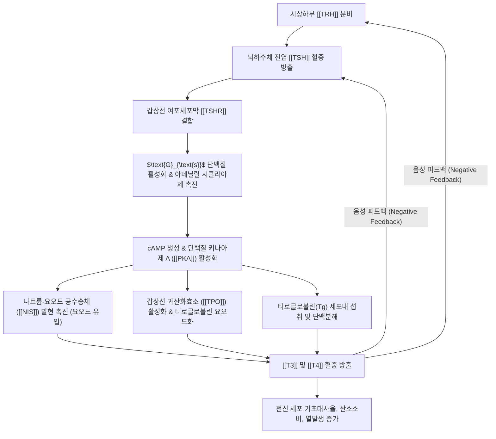

---
aliases:
  - TSH
  - 갑상선자극호르몬
  - Thyroid-Stimulating Hormone
  - 티로트로핀
  - Thyrotropin
tags:
  - 약리성분
  - 호르몬
  - 당단백질호르몬
  - 내분비계
  - 갑상선
  - HPT축
  - 갑상선기능항진증
  - 갑상선기능저하증
---
# 💊 [[TSH]] (Thyroid-Stimulating Hormone, 갑상선자극호르몬)

> **핵심 요약 (Key Summary)**:
> 뇌하수체 전엽의 갑상선자극세포(Thyrotroph)에서 합성·분비되는 이종이량체(Heterodimeric) 당단백질 호르몬.
> 시상하부-뇌하수체-갑상선 축([[HPT축]])의 중심 조절자로 갑상선 여포세포 표면의 TSH 수용체([[TSHR]])에 결합하여 요오드 흡수 및 티록신([[T4]])·트리요오도티로닌([[T3]]) 합성·분비를 촉진.
> 갑상선 질환 스크리닝의 1차 표준 지표로 활용되며, 분비 이상 시 갑상선기능항진증(TSH 저하), 갑상선기능저하증(TSH 상승) 및 영류(갑상선종)를 유발.

---

## 1. 기본 화학 정보 & 분자 구조식 (Chemical Identity)

> [!abstract]+ 🧪 3D 약리 분자 구조 (Interactive 3D Viewer)
> <iframe src="https://molecule-viewer-rho.vercel.app/?cid=1150" style="width: 100%; height: 600px; border: none; border-radius: 12px; box-shadow: 0 4px 20px rgba(0,0,0,0.15);" allowfullscreen></iframe>

| 항목 | 상세 내용 |
| :--- | :--- |
| **일반명 (Generic)** | [[TSH]] (Thyroid-Stimulating Hormone, Thyrotropin) |
| **분자 구조** | 2개의 소단위체로 구성된 당단백질 (분자량 약 28 kDa) • **$\alpha$ 소단위**: 92개 아미노산 (LH, FSH, hCG와 동일한 공통 서열) • **$\beta$ 소단위**: 118개 아미노산 (TSH 고유의 수용체 특이성 결정) |
| **분비 조절 경로** | • **촉진**: 시상하부의 갑상선자극호르몬 방출호르몬([[TRH]]) • **억제**: 순환 혈중 유리 T3, 유리 T4에 의한 뇌하수체 음성 피드백 (Negative feedback) |
| **표적 수용체** | 갑상선 여포세포막의 G단백질 결합 수용체 ([[TSHR]]) |
| **임상 참고치** | 성인 기준 약 0.4 ~ 4.5 $\mu\text{IU/mL}$ (검사 기관별 미세 차이 존재) |

---

## 2. 분자약리 작용 기전 (Mechanism of Action, MoA)

* **요오드 트래핑(Iodine Trapping) 및 흡수 촉진**:
  * 기저막의 나트륨-요오드 공수송체([[NIS]]) 발현을 증가시켜 혈액 속의 무기 요오드를 세포 내로 능동 수송.
* **티로글로불린 요오드화 및 호르몬 합성**:
  * 갑상선 과산화효소([[TPO]]) 활성을 자극하여 티로신 잔기를 요오드화(MIT, DIT 형성)하고 T3(트리요오도티로닌), T4(티록신)를 결합 합성.
* **갑상선 세포 비대 및 혈류량 증가**:
  * 만성적으로 TSH가 높게 유지되면 갑상선 여포세포의 크기와 수가 증가하여 외형상 갑상선이 부어오르는 **갑상선종(Goiter, 癭瘤)**을 형성.

---

## 3. 임상 평가 및 갑상선 질환 감별 매트릭스

| TSH 수치 | Free T4 수치 | 임상 질환 진단 | 주요 병태 및 증상 |
| :--- | :--- | :--- | :--- |
| **현저히 낮음** ($\downarrow$) | **높음** ($\uparrow$) | **원발성 갑상선기능항진증** | 그레이브스병(TSHR 자극 항체), 중독성 결절. 심계항진, 체중감소, 다한증, 안구돌출 |
| **낮음** ($\downarrow$) | 정상 | **무증상(불현성) 갑상선기능항진증** | 향후 심방세동 및 골다공증 위험 증가 |
| **현저히 높음** ($\uparrow$) | **낮음** ($\downarrow$) | **원발성 갑상선기능저하증** | 하시모토 갑상선염(자가면역 파괴). 피로, 체중증가, 한랭 불내성, 부종, 변비 |
| **높음** ($\uparrow$) | 정상 | **무증상(불현성) 갑상선기능저하증** | 피로감, 고지혈증 동반 가능 |
| **낮음** ($\downarrow$) | **낮음** ($\downarrow$) | **중추성(이차성) 갑상선기능저하증** | 뇌하수체 또는 시상하부 병변 |

---

## 4. 한의학 생리병리 및 영류(癭瘤) 연계

* **기체담응(氣滯痰凝)과 갑상선종**:
  * 한의학에서 갑상선종대 질환은 목 앞쪽에 멍울이 생기는 **영류(癭瘤)**에 해당.
  * 정서적 울화(간기울결)로 기운이 뭉치고 체액 대사가 정체되어 생긴 담음(痰飮)이 목 앞쪽에 엉겨붙어 TSH 자극에 의한 여포 과증식이 유발된다고 파악.
* **본초 및 처방 연계**:
  * **연견산결(軟堅散結) 약재**: [[해조]], [[곤포]]. 천연 요오드와 다당류([[후코이단]])를 함유하여 비정상적인 TSH 과자극과 결절 성장을 억제.
  * **화담이기(化痰理氣) 처방**: [[해조옥호탕]], [[반하후박탕]].
  * **체질 매핑**: 소양인의 흉격열화(상초 화열)에서 그레이브스병 항진증 패턴이 빈발하며, 태음인과 소음인의 비신양허 수습정체에서 기능저하증 패턴이 호발.

---

## 5. 출처 및 학술 참고 문헌 (References)

* Garber, J. R., et al. (2012). Clinical practice guidelines for hypothyroidism in adults. *Thyroid*, 22(12), 1200-1235.
  * `[연구 요약]` 성인 갑상선기능저하증에서 TSH 검사의 1차 스크리닝 가치, 정상 참고 범위 및 호르몬 대체요법(레보티록신) 모니터링 가이드라인 제시.
* Kahaly, G. J., et al. (2018). 2018 European Thyroid Association Guideline for the Management of Graves' Hyperthyroidism. *European Thyroid Journal*, 7(4), 167-186.
  * `[연구 요약]` 그레이브스병에서 TSH 억제 및 TSH 수용체 항체(TRAb)의 병태생리학적 기전과 치료 알고리즘을 규명.
