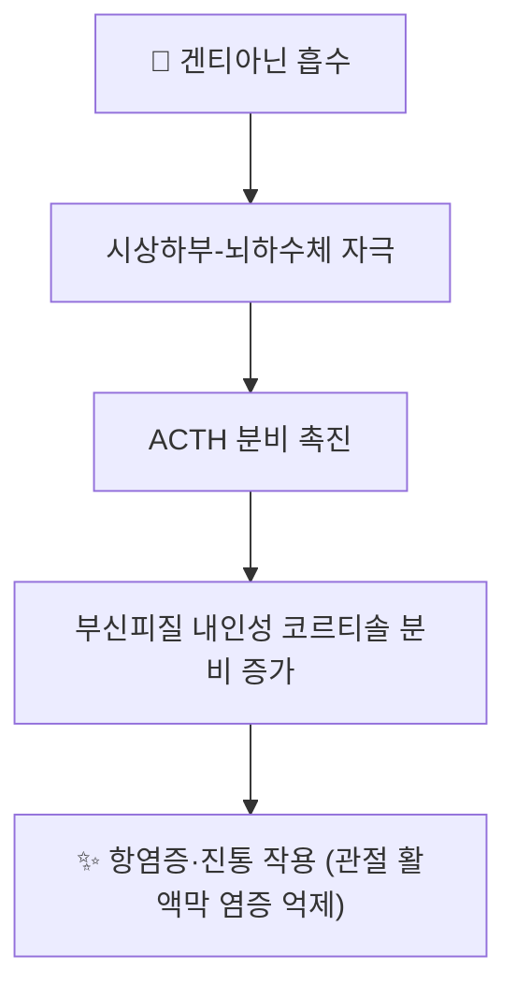

---
aliases:
  - Gentianine
  - 겐티아닌
tags:
  - 약리성분
  - 알칼로이드
  - 진교
  - 항염증
---

# 🔬 겐티아닌 (Gentianine)

> **핵심 3줄 요약 (Key Summary)**:
> - 🌿 기원 본초 & 화학 계열: [[진교]](秦艽, *Gentiana macrophylla* 등 용담과 뿌리)에 함유된 피리딘계 알칼로이드. 세코이리도이드 배당체인 [[겐티오피크로사이드]]와 함께 진교의 대표 활성 성분.
> - 🎯 핵심 분자 표적: 시상하부-뇌하수체-부신피질(HPA) 축을 자극해 ACTH 분비를 촉진하고, 이를 통해 내인성 코르티솔 분비를 증가시키는 것으로 제시되는 독특한 기전.
> - 🩺 주요 약리 활성: 내인성 코르티솔 증가를 매개로 한 항염증·진통 작용이 진교의 거풍습(祛風濕)·서근통락(舒筋通絡) 효능의 현대적 근거로 다뤄지며, 관절 활액막 염증 억제 효과가 함께 보고됨.
> - ⚠️ 근거 수준: HPA축 자극을 통한 코르티솔 분비 촉진 기전은 일부 약리 연구에서 제시된 가설적 기전으로, 사람 대상 대규모 임상 검증 자료는 제한적이며 장기 복용 시 외인성 스테로이드와 유사한 주의가 필요할 수 있음.

---

## 📌 목차
1. [기본 화학 정보](#1-기본-화학-정보-chemical-identity)
2. [주요 함유 본초 및 천연 기원](#2-주요-함유-본초-및-천연-기원)
3. [분자약리 표적 & 작용 기전](#3-분자약리-표적--작용-기전)
4. [한의학적 연계](#4-한의학적-연계)
5. [출처 및 학술 참고 문헌 (References)](#5-출처-및-학술-참고-문헌-references)

---

## 1. 기본 화학 정보 (Chemical Identity)

> [!abstract]+ 🧪 3D 약리 분자 구조 (Interactive 3D Viewer)
> <iframe src="https://molecule-viewer-rho.vercel.app/?cid=354616" style="width: 100%; height: 600px; border: none; border-radius: 12px; box-shadow: 0 4px 20px rgba(0,0,0,0.15);" allowfullscreen></iframe>

| 항목 | 상세 내용 |
| :--- | :--- |
| **분자식 / 분자량** | C₁₀H₉NO₂ / 약 175.18 g/mol |
| **PubChem CID** | [354616](https://pubchem.ncbi.nlm.nih.gov/compound/Gentianine) |
| **화학 골격 분류** | 피리딘계 알칼로이드(세코이리도이드 유래 알칼로이드) |

---

## 2. 주요 함유 본초 및 천연 기원 (Botanical Sources & Content)

| 함유 본초 | 기원 식물학적 명칭 | 주요 함유 부위 | 한의학적 귀경 및 약효 특성 |
| :--- | :--- | :--- | :--- |
| [[진교]] (秦艽) | 용담과 / *Gentiana macrophylla* 등 | 뿌리 | 간·위·담경 귀경, 거풍습(祛風濕)·서근통락(舒筋通絡)·청허열(淸虛熱) — 풍습비통, 골증조열에 활용 |

---

## 3. 분자약리 표적 & 작용 기전

* [[진교]] 노트에 기술된 바와 같이, 겐티아닌은 시상하부-뇌하수체 축을 자극하여 ACTH 분비를 촉진하고, 이어 부신피질에서 내인성 코르티솔을 합성·방출시켜 합성 스테로이드제와 유사한 항염증·진통 작용을 나타내는 것으로 제시됩니다.
* 이 기전은 진교가 관절염 등 풍습비통(風濕痹痛)에 사용되어 온 전통적 효능의 현대 약리학적 근거로 다뤄집니다.

---

## 4. 한의학적 연계

겐티아닌은 [[진교]]의 거풍습·서근통락 효능을 뒷받침하는 핵심 알칼로이드 성분으로, [[겐티오피크로사이드]] 등 다른 진교 성분과 함께 작용해 풍습성 관절통, 골증조열(만성 소모성 미열) 등의 병증에 활용되는 근거로 제시됩니다.

---

## 5. 출처 및 학술 참고 문헌 (References)

1. **Gentianae Radix et Rhizoma 관련 리뷰**. The chemical structure, pharmacological activity, and clinical progress of Gentianae Radix et Rhizoma. PMC: [PMC12583185](https://pmc.ncbi.nlm.nih.gov/articles/PMC12583185/)
   - **[연구 요약]**: 진교(Gentianae Radix et Rhizoma)의 화학 성분(겐티아닌 포함), 약리 활성, 임상 연구 진행 현황을 종합한 리뷰.
2. PubChem Compound Summary — Gentianine (CID 354616): [https://pubchem.ncbi.nlm.nih.gov/compound/Gentianine](https://pubchem.ncbi.nlm.nih.gov/compound/Gentianine)
