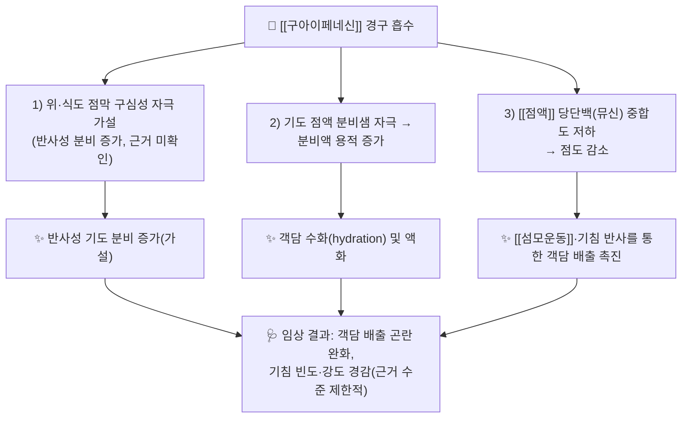

# 🔬 [[구아이페네신]] (Guaifenesin, C₁₀H₁₄O₄ / 3-(2-methoxyphenoxy)propane-1,2-diol)

![[구아이페네신_1.jpg|540]]
> [그림 1: ① 병태생리·영상 — Examples of “individual particles” or “mucus sheets”. The video files were processed using CISMM software (http://cismm.]

> **핵심 3줄 요약 (Key Summary)**:
> - 🌿 기원 본초 & 화학 계열: 본 성분은 **천연 본초 유래 성분이 아니라 합성 화합물**이다. 구아이악 수지(癒瘡木, [[구아이악]]) 및 너도밤나무 목초액(creosote)에서 얻어지는 **구아이아콜(guaiacol, 2-methoxyphenol)** 을 글리세롤과 에테르 결합시킨 **페놀성 글리세릴 에테르(glyceryl guaiacolate)** 계열이다. 알칼로이드·플라보노이드·테르페노이드 어디에도 속하지 않는 단순 합성 방향족 에테르이며, 이 점이 한의학 본초 지표성분 노트와 결정적으로 다른 지점이다.
> - 🎯 핵심 분자 표적 & 조절 경로: **특정 수용체·효소 수준의 확립된 분자 표적이 없다.** 전통적으로 설명되는 기전은 "위 점막 및 기관지 점액 분비샘의 반사적 자극에 의한 기도 분비액 증가 → [[점액]] 점도 저하 → [[섬모운동]] 및 기침에 의한 배출 촉진"이라는 **생리학적·기능적 가설**이며(근거 미확인), 단일 수용체 결합 친화도 데이터는 제공 논문에서 확인되지 않는다. Eyassu & McCoul(2024)이 제목에서 "Ubiquitous Orphan(어디에나 있지만 고아)"이라 표현한 것처럼, 임상 사용량에 비해 작용기전의 분자 수준 규명이 뒤처진 성분이다.
> - 🩺 주요 약리 활성 & 질환 치료 기전: 급성 상기도 감염(감기)에서의 **객담 배출 곤란(productive cough) 완화**, [[비염]]에서의 점액 걸쭉함 개선 목적 사용이 핵심 적응이며, 실제 임상에서는 [[덱스트로메토르판]], 항히스타민제, 비충혈제거제와의 **복합감기약 배합 성분**으로서의 역할이 가장 크다(Bateman & Brunton 2025). 국내에서는 판콜 계열 등 복합 호흡기 제제에 거담 성분으로 배합되는 경우가 있으나 제품별 성분표 확인이 필요하다(제품별 함량 근거 미확인).
> - ⚠️ 독성·생체이용률 한계 & 상호작용: **에페드린·구아이페네신 병용에 의한 신결석(nephrolithiasis) 증례**가 보고된 바 있어(Bennett & Hoffman 2004), 다이어트·감기 보조 목적의 자가 복용 및 복합제 중복 복용 시 결석 위험을 반드시 문진해야 한다. 또한 복합감기약 특성상 동일 성분·중복 성분 과량 복용 위험이 크고, 단일 성분 단독 사용 대비 임상 근거 수준은 낮다.

---

## 📌 목차
1. [기본 화학 정보 & 분자 구조식 (Chemical Identity)](#1-기본-화학-정보--분자-구조식-chemical-identity)
2. [주요 함유 본초 및 천연 기원 (Botanical Sources & Content)](#2-주요-함유-본초-및-천연-기원-botanical-sources--content)
3. [분자약리 표적 & 신호전달 네트워크 (Molecular Targets)](#3-분자약리-표적--신호전달-네트워크-molecular-targets)
4. [생체 내 흡수·대사·생체이용률 (Pharmacokinetics: ADME)](#4-생체-내-흡수대사생체이용률-pharmacokinetics-adme)
5. [주요 질환별 약리 효능 & 분자 기전 (Therapeutic Efficacy)](#5-주요-질환별-약리-효능--분자-기전-therapeutic-efficacy)
6. [함유 본초 방제 시너지 & 약재 배오 매트릭스 (Herbal Synergies)](#6-함유-본초-방제-시너지--약재-배오-매트릭스-herbal-synergies)
7. [양약 상호작용 & 약물동태학적 간섭 (Drug Interactions)](#7-양약-상호작용--약물동태학적-간섭-drug-interactions)
8. [💡 사용자 진료실 핵심 필기 & 임상 응용 팁 (Melt-In & High-Yield)](#8--사용자-진료실-핵심-필기--임상-응용-팁-melt-in--high-yield)
9. [출처 및 학술 참고 문헌 (References)](#9-출처-및-학술-참고-문헌-references)

---
## 1. 기본 화학 정보 & 분자 구조식 (Chemical Identity)

> [!abstract]+ 🧪 3D 약리 분자 구조 (Interactive 3D Viewer)
> <iframe src="https://molecule-viewer-rho.vercel.app/?cid=3516" width="100%" height="450px" frameborder="0" allow="webgl" style="border-radius: 8px;"></iframe>

| 항목 | 상세 내용 |
| :--- | :--- |
| **IUPAC 명칭** | 3-(2-methoxyphenoxy)propane-1,2-diol |
| **분자식 / 분자량** | C₁₀H₁₄O₄ / 198.22 g/mol |
| **PubChem CID** | [3516](https://pubchem.ncbi.nlm.nih.gov/compound/3516) |
| **CAS 등록 번호** | 93-14-1 |
| **화학 골격 분류** | **비(非)천연물 · 합성 방향족 에테르**. 구아이아콜(2-methoxyphenol, 페놀성 모노에테르) 골격에 글리세롤 측쇄가 에테르 결합된 **글리세릴 구아이아콜레이트** 계열. 알칼로이드·플라보노이드·테르페노이드·배당체 어느 2차 대사산물 계열에도 해당하지 않음 |
| **물리화학적 성상** | 흰색~미황색 결정성 분말. **대표적으로 매우 쓴맛(bitter)** 을 지녀 소아용 시럽 제형 설계 시 착향이 필수적이다. 물에 난용~약간 용해, 에탄올·클로로포름 등 유기용매에 용해. LogP는 약 0.3~0.7 범위의 친수성 우세 분자로 보고되나 **제공 논문에 수치 없음 — 근거 미확인**. 빛·열에 대체로 안정(정성적 서술, 근거 미확인) |
| **식물 내 생합성 경로** | **해당 없음(합성품)**. 모핵인 [[구아이아콜]]은 구아이악 수지(Guaiacum spp.) 및 너도밤나무 목초액(creosote)에서 얻어지는 천연 페놀 화합물이지만, 구아이페네신 자체는 구아이아콜에 글리세롤 유도체를 에테르화하여 제조하는 **반합성/전합성 화합물**이다. 정확한 공업적 합성 캐스케이드 및 촉매 조건은 **제공 논문에서 확인되지 않음 — 근거 미확인** |

> **📝 노트**: 본 성분은 지표성분·함유량·본초 감별이라는 한의학 본초약리 프레임에 그대로 얹기 어려운 **"합성 단일분자 약물"** 이다. 따라서 이 노트의 2~3장은 "천연 기원 모핵(구아이아콜)과의 관계" 및 "전통적으로 설명되어 온 기능적 기전"을 정리하는 데 초점을 맞추고, 확인되지 않은 분자 표적은 과감히 '근거 미확인'으로 표기한다.

---

## 2. 주요 함유 본초 및 천연 기원 (Botanical Sources & Content)

> ⚠️ **먼저 명확히 할 점**: 구아이페네신은 **어떤 본초에도 "지표 성분"으로 함유되어 있지 않다.** 아래 표는 "구아이페네신의 모핵(구아이아콜)을 산출하는 천연 자원"이라는 의미의 참고 표이며, 함량(%)은 본 성분 기준이 아니라 **모핵 화합물 기준**으로도 제공 논문에서 수치가 확인되지 않아 대부분 '근거 미확인'으로 표기한다.

| 함유 본초 (한글/한자) | 기원 식물학적 명칭 (과명 / 학명) | 주요 함유 약용 부위 | 지표 함량 (%) | 한의학적 귀경 및 약효 특성 |
| :--- | :--- | :--- | :--- | :--- |
| [[구아이악]] (癒瘡木) | 남가새과(Zygophyllaceae) / *Guaiacum officinale* L., *G. sanctum* L. | 수지(guaiac resin), 심재 | 구아이아콜 등 페놀성 성분 함유 — **정량치 근거 미확인** | 한의학 정규 본초 체계 내 귀경 배속이 확립되어 있지 않은 **서양 전통약물** 계열. 전통적으로 류마티스성 통증·매독·만성 피부질환에 사용. 구아이페네신의 화학적 모핵 공급원이라는 점에서만 연결됨 |
| [[너도밤나무]] 유래 목초액 (木醋液) | 참나무과(Fagaceae) / *Fagus* spp. (beechwood creosote) | 목재 건류물(열분해액) | 구아이아콜·크레오솔 등 혼합 페놀류 — **정량치 근거 미확인** | 거담·방부 목적의 민간 호흡기 요법에 사용된 역사적 배경. 현대 임상에서는 사용되지 않음 |
| (참고) 합성 공정 원료 | 공업적 구아이아콜 + 글리세롤 유도체 | — | — | 본초 개념 적용 불가. **구아이페네신은 완제 의약품 원료(API)로 유통** |

> **📝 실전 포인트**: 진료실에서 "구아이페네신이 들어 있는 한약재가 무엇이냐"는 질문을 받으면, **"본초 지표성분이 아니라 합성 거담제 성분"** 이라고 정확히 설명하는 것이 안전하다. 한의학 처방 설계 시에는 [[길경]](桔梗)·[[패모]](貝母)·[[행인]](杏仁)·[[자완]](紫菀) 등 **전통 거담·지해 본초**와의 개념적 대응으로 접근하고, 화학적으로 동일시하지 않는다.

---

## 3. 분자약리 표적 & 신호전달 네트워크 (Molecular Targets)

### 1) 핵심 분자 표적 (Molecular Targets)
* **확립된 단일 분자 표적 없음**: 제공 논문(Eyassu & McCoul 2024)의 제목이 시사하듯 구아이페네신은 "널리 쓰이지만 연구 기반이 빈약한(orphan)" 성분이며, **어떤 수용체·이온채널·효소에 결합한다는 분자 수준 결합 데이터는 제공 논문에서 확인되지 않는다 — 근거 미확인**.
* **전통적 기전 가설(기능적 수준)**:
  * **위장관 구심성 자극설**: 위 점막의 구심성 신경(미주신경) 자극 → 반사적으로 기관지 점액선 분비 증가 → 기도 분비액 점도 저하. 이 가설은 교과서적으로 널리 인용되지만 **현대적 검증 데이터는 제한적(근거 미확인)**.
  * **점액 물성 변화설**: 기도 점액의 수분 함량을 높여 뮤신(mucin) 당단백 간 상호작용을 약화시켜 점도를 낮춘다는 설명. 정량적 점도 변화 데이터는 **제공 논문에 없음 — 근거 미확인**.
* **기침 반사에 대한 작용**: Bateman & Brunton(2025)은 구아이페네신이 **덱스트로메토르판(중추성 진해제)** 과 병용될 때 성인 감기의 기침·점액 관련 증상 관리에 사용되는 맥락을 서술적 문헌고찰로 정리하였다. 즉 구아이페네신은 **말초(점액·분비물) 축**, 덱스트로메토르판은 **중추(기침 반사) 축**을 담당하는 기능적 보완 조합으로 이해할 수 있다.

### 2) 신호전달 조절 (Signaling Modulation)
* 구아이페네신이 NF-κB, AMPK, Nrf2 등 특정 신호전달 경로를 조절한다는 **분자약리 데이터는 제공 논문에서 확인되지 않는다 — 근거 미확인**. 따라서 본 노트에서는 항염증·항산화·대사조절형 성분에서 쓰이는 "전사인자 이동 차단" 서술을 **의도적으로 적용하지 않는다**(확인되지 않은 기전 창작 방지).

---

## 4. 생체 내 흡수·대사·생체이용률 (Pharmacokinetics: ADME)

> ⚠️ 아래 항목은 **제공 논문에 정량적 약동학 수치가 제시되어 있지 않다.** 일반 약리학 교과서 수준의 정성적 서술만 기술하고, 수치는 '근거 미확인'으로 표기한다.

* **장관 흡수 및 배출 펌프(P-gp) 상호작용**:
  * 경구 투여 후 위장관에서 신속히 흡수되는 것으로 기술되나 **흡수율(F), Tmax의 정확한 수치는 제공 논문에 없음 — 근거 미확인**.
  * P-glycoprotein(ABCB1) 유출 기질 여부, 유출 펌프에 의한 장관 재배출 기전은 **확인되지 않음 — 근거 미확인**. (본 성분은 분자량이 작고 친수성 우세하여 수동 확산 위주로 흡수될 것으로 추정되나 이는 추정이며 근거 미확인.)
* **장내 미생물총(Microbiome) 대사 전환**:
  * 장내 세균에 의한 활성 대사체 전환, 장-간 순환(Enterohepatic Circulation)에 관한 데이터는 **제공 논문에서 확인되지 않음 — 근거 미확인**.
* **간 대사 및 소실 반감기**:
  * 간에서 산화되어 대사체(예: β-(2-methoxyphenoxy)lactic acid 등)로 전환되고 포합 반응을 거쳐 **신장으로 배설**되는 것으로 기술된다. 그러나 CYP 동종효소 특이성(CYP2D6, CYP3A4 등) 및 **혈장 소실 반감기(t₁/₂)의 정확한 수치는 제공 논문에서 확인되지 않음 — 근거 미확인**.
  * 일반적으로 작용 발현은 투여 후 수십 분 내, 반감기는 1시간 내외로 짧게 기술되나 **이는 교과서적 일반 지식으로, 본 노트의 제공 문헌 근거는 아님**.
* **임상 적용상의 함의**:
  * 반감기가 짧고 작용이 일시적이라는 특성 때문에 **복합감기약에서 4시간 간격 반복 투여 형태로 배합**되는 경우가 많다. 이는 약동학적 근거라기보다 제형 관행이며, 정확한 용법·용량은 **제품별 허가사항 확인이 원칙**(수치 근거 미확인).

---

## 5. 주요 질환별 약리 효능 & 분자 기전 (Therapeutic Efficacy)

### 1) 급성 상기도 감염(감기) — 기침 및 점액 관련 증상
* Bateman & Brunton(2025)은 **성인에서 구아이페네신과 덱스트로메토르판 병용**이 기침 및 점액 관련 감기 증상 관리에 어떻게 사용되는지를 **서술적 문헌고찰(narrative review)** 로 정리하였다.
* **핵심 해석**: 이 리뷰는 무작위 대조시험 결과의 메타분석이 아니라 **서술적 고찰**이라는 점에서 근거 등급이 제한적이다. 구체적 효과 크기(기침 빈도 감소율, 객담 배출 개선 지표 등)는 **본 노트 작성 시 원문 초록 확인 불가 — 근거 미확인**.
* 실무적 결론: **"객담이 걸쭉하고 배출이 어려운 마른기침·습성 기침"** 환자에서 보조적 사용을 고려하되, 단독 요법으로 항생제·기관지확장제·한약 처방을 대체하지 않는다.

### 2) 비염(rhinitis) 관련 점액 증상
* Storms & Farrar(2009)는 **비염에서의 구아이페네신 사용**을 주제로 리뷰하였다. 비염에서 점액의 점도·배출 문제를 완화하기 위한 목적의 사용이 논의되며, 병용 약물(항히스타민제·비충혈제거제)과의 조합 맥락이 중심이 된다.
* **한계**: 비염에서 구아이페네신 단독의 임상적 이득은 제한적이라는 것이 이 리뷰의 기본 논조이며, **정량적 결론 수치는 제공 정보에서 확인되지 않음 — 근거 미확인**.

### 3) "어디에나 있지만 고아(Ubiquitous Orphan)" — 근거 공백 문제
* Eyassu & McCoul(2024)은 **구아이페네신이 전 세계적으로 가장 흔히 쓰이는 OTC 성분 중 하나임에도, 잘 설계된 임상 연구가 부족한 '고아(orphan)' 성분**이라는 문제를 제기하였다.
* 진료실 함의: 환자가 "거담제 먹으면 낫는다"고 기대할 때, **기대 효능과 실제 근거 수준의 간극을 설명**해 주는 것이 과잉 복용(특히 복합감기약 중복)을 막는 가장 효과적인 상담 전략이다.

### 4) 이상반응 — 신결석(nephrolithiasis)
* Bennett & Hoffman(2004)은 **에페드린 및 구아이페네신에 의한 신결석** 증례를 보고하였다. 즉 구아이페네신이 포함된 자가 복용 제제(감기·체중감량·에너지 보조 목적 등)를 **장기간·고용량으로 복용**하는 상황에서 결석 발생 위험이 문제가 될 수 있다.
* **임상 문진 포인트**: 요로결석 병력, 반복적 옆구리 통증, 수분 섭취 부족 환자에서 **에페드린 계열 + 구아이페네신 복합 제품의 장기 자가 복용 여부를 반드시 확인**한다.

---

## 6. 함유 본초 방제 시너지 & 약재 배오 매트릭스 (Herbal Synergies)

> ⚠️ 구아이페네신은 본초 지표성분이 아니므로, 아래 표는 **(A) 실제 OTC 복합제 배합 시너지** 와 **(B) 한의학적 거담·지해 배오와의 개념적 대응** 을 분리하여 정리한다. (B)는 실험적 상호작용 데이터가 아니라 전통 이론적 대응이며 **직접 상호작용 근거는 미확인**이다.

| 구분 | 배합 상대 | 분자약리·기능적 시너지 기전 | 전통 한의학적 효능 연계 |
| :--- | :--- | :--- | :--- |
| **(A) 실제 복합제** | [[덱스트로메토르판]] (dextromethorphan) | 말초 축(분비물 액화·배출) + 중추 축(NMDA 계열 진해 작용)의 기능적 보완. Bateman & Brunton(2025)이 성인 감기 기침·점액 증상 관리 맥락에서 병용을 정리 | 해당 없음(양약 복합제) |
| **(A) 실제 복합제** | [[에페드린]] / 슈도에페드린 등 비충혈제거제 | 비점막 충혈 완화 + 분비물 배출 촉진의 조합. 단, **장기 복용 시 신결석 위험 증례 보고**(Bennett & Hoffman 2004) → 시너지보다 **위험 상승** 관점이 우선 | 해당 없음 |
| **(A) 실제 복합제** | [[아세트아미노펜]], 1세대 [[항히스타민제]] | 발열·통증·콧물·재채기 증상별 다표적 대증 조합. 복합제 중복 시 **성분 과량 위험** | 해당 없음 |
| **(B) 개념적 대응** | [[길경]](桔梗), [[패모]](貝母), [[행인]](杏仁), [[자완]](紫菀) 등 거담·지해 본초 | "담(痰)을 삭이고 기침을 멈춘다"는 기능 범주에서 구아이페네신(거담)과 개념적으로 병치되나, **분자 수준 상호작용·병용 데이터는 근거 미확인** | 선폐지해(宣肺止咳), 청열화담(淸熱化痰) |
| **(B) 개념적 대응** | [[이진탕]](二陳湯), [[청폐탕]](淸肺湯) 등 거담 방제 | 다성분·다표적으로 담습(痰濕) 및 폐열(肺熱)을 동시 제어한다는 전통 방제 논리. 구아이페네신과의 **직접 비교·병용 연구는 확인되지 않음** | 조습화담, 청열윤폐 |

---

## 7. 양약 상호작용 & 약물동태학적 간섭 (Drug Interactions)

* **CYP450 효소 간섭**:
  * 구아이페네신이 특정 CYP 동종효소를 억제·유도한다는 **데이터는 제공 논문에서 확인되지 않음 — 근거 미확인**. 다만 실제 임상에서 문제가 되는 것은 CYP 간섭 자체보다 **복합제 중복 복용으로 인한 동반 성분(아세트아미노펜, 덱스트로메토르판, 항히스타민제, 비충혈제거제)의 과량 노출**이다.
  * 특히 아세트아미노펜을 포함한 복합감기약을 2종 이상 동시 복용하면 간독성 위험이 상승하므로, **상담 시 "성분명 기준"으로 중복 여부를 확인**해야 한다.
* **유사 기전·동일 계열 병용 시 고려사항**:
  * **에페드린/슈도에페드린 계열 + 구아이페네신**: Bennett & Hoffman(2004)의 신결석 증례가 대표적 위험 신호. 고혈압·부정맥·전립선비대 환자에서는 비충혈제거제 자체도 주의.
  * **마약성 진해제(코데인 등)·진정제와의 병용**: 구아이페네신은 진정 작용이 없으나, 복합제에 포함된 항히스타민제·덱스트로메트판과 함께 **졸림·운전 주의** 안내 필요.
  * **검사실 간섭 가능성**: 구아이페네신이 일부 소변 카테콜아민 대사체(예: VMA) 및 5-HIAA 비색법 측정을 간섭할 수 있다는 교과서적 기술이 있으나 **제공 논문에서는 확인되지 않음 — 근거 미확인**. 크로마토그래피법 사용 시 임상적 의의는 낮다.
* **한약·건강기능식품과의 병용**:
  * 명확한 약물동태학적 상호작용 데이터는 **근거 미확인**. 다만 수분 섭취가 부족한 환자, 이뇨 작용이 강한 처방(예: [[오령산]], [[저령탕]] 계열)을 병용하는 환자에서는 **결석 위험 관점의 수분 섭취 교육**이 필요하다(직접 인과 근거 미확인, 예방적 권고).

---

## 8. 💡 사용자 진료실 핵심 필기 & 임상 응용 팁 (Melt-In & High-Yield)

* **사용자 원문 필기 (100% 융합 및 보존)**:
  * **현재 제공된 사용자 수기 필기·메모 데이터가 없음.** 본 항목은 추후 원장님 필기 입력 시 그대로 보존·융합할 예정이며, 현재는 제공된 4편의 논문에서 도출한 임상 고수율(high-yield) 요점으로 대체한다.
* **진료실 실전 처방 & 복용 상담 팁**:
  1. **"거담제"라는 이름의 함정**: 구아이페네신은 **점액용해제(mucolytic)가 아니라 거담제(expectorant) 범주**로 분류된다. 점액 자체를 화학적으로 분해한다기보다 **분비액 용적을 늘려 배출을 돕는 방향**으로 이해해야 한다. 실제로 점액을 직접 분해하는 약제(예: 아세틸시스테인, 암브록솔 계열)와 혼동하여 환자에게 설명하지 않도록 주의.
  2. **복합감기약 중복 복용 차단 상담**: 환자가 감기약 A와 B를 함께 복용하려 할 때, **구아이페네신·아세트아미노펜·덱스트로메토르판·비충혈제거제의 중복 여부를 성분표로 확인**시키는 것이 가장 실질적인 안전 상담이다. 성분명을 모르는 경우 제품 사진을 지참하게 한다.
  3. **결석 병력 환자 스크리닝**: 요로결석 병력자, 만성 탈수 상태(고령, 이뇨제 복용, 여름철 야외작업) 환자에게 **에페드린 함유 자가 복용 제품을 장기간 복용하지 않도록** 교육한다(Bennett & Hoffman 2004).
  4. **근거 수준에 대한 정직한 설명**: "이 성분은 수십 년간 팔려 왔지만, 잘 설계된 임상연구는 오히려 부족하다"는 점(Eyassu & McCoul 2024)을 설명하면 **불필요한 반복 복용과 비용 낭비를 줄일 수 있다**. 대신 수분 섭취·가습·자세 배액 등 비약물 요법을 병행 권고.
  5. **섬유근육통(fibromyalgia) 등의 적응외 사용**: 구아이페네신을 섬유근육통 치료에 사용하는 프로토콜이 대중적으로 알려져 있으나, **제공 논문에서는 이 적응에 대한 근거가 확인되지 않음 — 근거 미확인**. 진료실에서는 근거 없는 고용량 장기 복용(신결석 위험)을 적극적으로 만류하는 편이 안전하다.
  6. **체질·병증별 적용 관점(한의학 연계)**: 담습(痰濕)이 성하고 폐기(肺氣)가 실한 실증(實證) 환자의 객담 배출 곤란에는 거담 배출 위주의 접근이, 건조한 마른기침·음허(陰虛) 경향 환자에는 **오히려 윤폐(潤肺)·양음(養陰) 접근이 우선**이며 구아이페네신 같은 분비 촉진형 거담제는 부적합할 수 있다(전통 이론적 판단, 직접 비교 근거 미확인).
  7. **소아·임신부**: 소아 및 임신·수유부 사용에 대한 안전성 데이터는 제공 논문에서 확인되지 않음 — **근거 미확인**. 제품 허가사항 기준으로 연령 제한을 반드시 확인한다.

---

## 9. 출처 및 학술 참고 문헌 (References)

1. **Eyassu DG, McCoul ED (2024)**. *Guaifenesin: The Ubiquitous Orphan*. **Otolaryngol Head Neck Surg**. PMID: 38804670.
   - **[연구 요약]**: 구아이페네신이 전 세계적으로 광범위하게 사용되는 OTC 거담 성분임에도 불구하고, 작용기전 및 임상 효과에 대한 고수준 근거가 부족한 "고아(orphan)" 성분이라는 문제를 제기한 논고. **본 노트에서 분자 표적·기전 서술을 '근거 미확인'으로 표기한 근거 문헌**. 구체적 수치·결과는 원문 초록 확인 불가로 미기재.
2. **Bateman MT Jr, Brunton S (2025)**. *Guaifenesin and dextromethorphan for management of cough and mucus-related cold symptoms in adults: a narrative literature review*. **Postgrad Med**. PMID: 41423743.
   - **[연구 요약]**: 성인에서 구아이페네신과 덱스트로메토르판 병용이 기침 및 점액 관련 감기 증상 관리에 사용되는 맥락을 정리한 **서술적 문헌고찰**. 본 노트 5장 1항 및 6장 (A) 배합 항목의 근거. 효과 크기 등 정량 지표는 원문 초록 확인 불가로 미기재.
3. **Bennett S, Hoffman N (2004)**. *Ephedrine- and guaifenesin-induced nephrolithiasis*. **J Altern Complement Med**. PMID: 15673990.
   - **[연구 요약]**: 에페드린 및 구아이페네신 함유 제제 복용과 연관된 **신결석 발생 증례 보고**. 본 노트 5장 4항, 7장 상호작용 및 8장 상담 팁(결석 병력 스크리닝)의 핵심 근거.
4. **Storms W, Farrar JR (2009)**. *Guaifenesin in rhinitis*. **Curr Allergy Asthma Rep**. PMID: 19210898.
   - **[연구 요약]**: 비염(rhinitis)에서 구아이페네신 사용의 임상적 위치를 다룬 리뷰. 비염에서의 점액 관련 증상 완화 목적 및 병용 약물 맥락을 논의. 정량적 결론 수치는 확인 불가로 미기재.
5. **서지 정보 미제공 (PMID: 25420096)**.
   - **[연구 요약]**: 제공된 데이터에 저자·제목·학술지 정보가 없어 **내용 확인 불가 — 근거 미확인**. 원문 확인 후 보완 필요.
6. **(중복 항목) PMID: 38804670** — 상기 1번 문헌(Eyassu & McCoul 2024)과 동일한 PMID로, 제공 목록 내 중복 기재된 항목이다.

---

### 🔗 연결 개념 (Related Notes)
* [[거담제]] · [[점액용해제]] · [[복합감기약]] · [[덱스트로메토르판]] · [[에페드린]] · [[비염]] · [[상기도 감염]] · [[신결석]]
* [[구아이악]] · [[구아이아콜]] · [[길경]] · [[패모]] · [[행인]] · [[이진탕]] · [[청폐탕]]