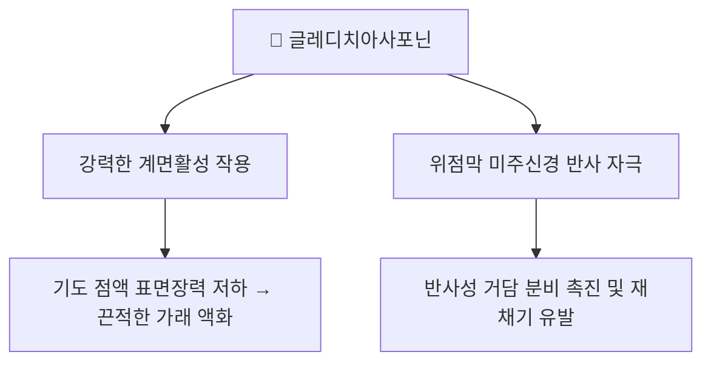

---
aliases:
  - Gleditsiasaponin
  - Gleditsia saponin
  - 글레디치아사포닌
tags:
  - 약리성분
  - 사포닌
  - 조협
  - 조각자
---

# 🔬 글레디치아사포닌 (Gleditsiasaponin)

> **핵심 3줄 요약 (Key Summary)**:
> - 🌿 기원 본초 & 화학 계열: [[조협]](皂莢)·[[조각자]](皂角刺)(콩과 *Gleditsia sinensis*, 주엽나무) 열매·가시에 함유된 트리테르펜 비스데스모사이드 사포닌군(Gleditsiasaponin B~H 등 다수의 유사체 존재).
> - 🎯 핵심 분자 표적: 강력한 계면활성(surfactant) 특성으로 기도 점액의 표면장력을 급격히 낮추어 끈적한 가래를 액화시키며, 위점막 미주신경을 자극해 반사성 거담·재채기를 유도.
> - 🩺 주요 약리 활성: 거담(祛痰) 작용 외에도, 종양세포에서 Fas 매개 사멸수용체 경로 및 미토콘드리아 경로를 통한 세포자멸사(apoptosis) 유도 효과가 백혈병 세포주 등에서 보고됨.
> - ⚠️ 독성 주의: 사포닌 특유의 용혈(hemolysis) 작용을 가질 수 있어, 조협·조각자는 예로부터 소량·법제 후 신중하게 사용해온 약재이며 과량 사용 시 구토·설사 등 위장관 자극이 나타날 수 있음.

---

## 📌 목차
1. [기본 화학 정보](#1-기본-화학-정보-chemical-identity)
2. [주요 함유 본초 및 천연 기원](#2-주요-함유-본초-및-천연-기원)
3. [분자약리 표적 & 작용 기전](#3-분자약리-표적--작용-기전)
4. [항종양 연구](#4-항종양-연구)
5. [한의학적 연계](#5-한의학적-연계)
6. [출처 및 학술 참고 문헌 (References)](#6-출처-및-학술-참고-문헌-references)

---

## 1. 기본 화학 정보 (Chemical Identity)

| 항목 | 상세 내용 |
| :--- | :--- |
| **화학 골격 분류** | 트리테르펜 비스데스모사이드 사포닌(올레아난형 골격, 당사슬 결합) |
| **대표 유사체** | Gleditsiasaponin B~H 등 다수의 구조 유사체가 존재하는 사포닌 복합체군 |
| **관련 화합물 예시 PubChem CID** | Gleditsia saponin C — [44584163](https://pubchem.ncbi.nlm.nih.gov/compound/Gleditsia-saponin-C) (유사체 중 하나의 대표 등록 예시) |

⚠️ 내용 검토 필요: "글레디치아사포닌"은 단일 화합물이 아니라 유사 구조의 사포닌 복합체군을 통칭하는 명칭으로 사용되는 경우가 많아, 개별 성분의 정확한 CAS 번호·분자식은 문헌별 지칭 대상에 따라 다를 수 있습니다.

---

## 2. 주요 함유 본초 및 천연 기원 (Botanical Sources & Content)

| 함유 본초 | 기원 식물학적 명칭 | 주요 함유 부위 | 한의학적 귀경 및 약효 특성 |
| :--- | :--- | :--- | :--- |
| [[조협]] (皂莢) | 콩과 / *Gleditsia sinensis* | 열매(협과) | 폐·대장경 귀경, 거풍화담(祛風化痰)·통규개폐(通竅開閉) |
| [[조각자]] (皂角刺) | 콩과 / *Gleditsia sinensis* | 가시(자) | 소종배농(消腫排膿)·거풍살충(祛風殺蟲) |

---

## 3. 분자약리 표적 & 작용 기전

* [[조협]] 노트에 기술된 바와 같이, 글레디치아사포닌은 강력한 계면활성 능력으로 기도 점액의 표면장력을 급격히 낮추어 끈적한 가래 덩어리를 액화시키며, 위점막 미주신경 반사를 통해 거담 분비를 극대화하는 것으로 제시됩니다.

---

## 4. 항종양 연구

일부 연구에서 조각자 유래 사포닌이 백혈병 세포주 등에서 Fas 매개 사멸수용체 경로 및 미토콘드리아 경로를 통한 세포자멸사(apoptosis)를 유도한다는 결과가 보고되었습니다. 또한 조각자에서 분리된 트리테르펜 사포닌(글레디치오사이드 B 등)이 혈관내피세포의 이동을 억제해 MMP-2·FAK 활성화를 차단하는 항혈관신생 관련 기전도 연구된 바 있습니다.

⚠️ 내용 검토 필요: 항종양 관련 연구는 대부분 세포주 수준의 초기 연구로, 임상적 항암 효과가 확립된 것은 아닙니다.

---

## 5. 한의학적 연계

글레디치아사포닌은 [[조협]]·[[조각자]]의 거풍화담·통규개폐 효능을 뒷받침하는 핵심 사포닌 성분으로, 완고한 담음(痰飮)이 막혀 인사불성이나 심한 천식·가래에 응급으로 코에 불어넣어 재채기를 유발시키는 통규(通竅) 용법의 현대 약리학적 근거로 다뤄집니다.

---

## 6. 출처 및 학술 참고 문헌 (References)

1. **Gleditsia species: An ethnomedical, phytochemical and pharmacological review**. ScienceDirect: [https://www.sciencedirect.com/science/article/abs/pii/S0378874115302452](https://www.sciencedirect.com/science/article/abs/pii/S0378874115302452)
   - **[연구 요약]**: *Gleditsia* 속 식물(조협·조각자 포함)의 전통 활용, 함유 사포닌 성분, 약리 활성을 종합한 리뷰.
2. **Wang YH, et al.** Structure-activity relationships of saponins from Gleditsia sinensis in cytotoxicity and induction of apoptosis. PMID: [15386187](https://pubmed.ncbi.nlm.nih.gov/15386187/)
   - **[연구 요약]**: 조협 유래 사포닌의 구조-활성 관계 및 세포자멸사 유도 기전을 규명한 연구.
