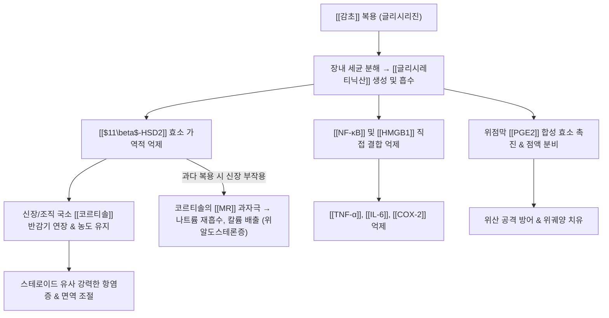

---
aliases:
  - 글리시레티닉산
  - Glycyrrhetinic acid
  - 글리시레트산
  - Glycyrrhetic acid
  - 엔옥솔론
  - Enoxolone
tags:
  - 약리성분
  - 트리테르페노이드
  - 사포닌
  - 비배당체
  - 항염증
  - 간보호
  - 위점막보호
  - 위알도스테론증
---
# 💊 [[글리시레티닉산]] (Glycyrrhetinic acid, Enoxolone)

> **핵심 요약 (Key Summary)**:
> 콩과 [[감초]](*Glycyrrhiza uralensis*)의 핵심 사포닌인 글리시리진(Glycyrrhizin)이 장내 미생물에 의해 가수분해되어 흡수되는 5고리형 트리테르페노이드 비배당체(Aglycone).
> $11\beta$-히드록시스테로이드 탈수소효소 2형([[$11\beta$-HSD2]])을 경쟁적으로 억제하여 내인성 코르티솔 불활성화를 차단함으로써 강력한 항염증·위점막 보호 및 항궤양 작용 발휘.
> 장기 과다 복용 시 신장에서 코르티솔이 미네랄코르티코이드 수용체([[MR]])를 과자극하여 나트륨 저류, 저칼륨혈증, 고혈압을 유발하는 가성 알도스테론증(위알도스테론증)의 원인 물질.

---

## 1. 기본 화학 및 약동학적 특성 (Pharmacokinetics)

| 항목 | 상세 내용 |
| :--- | :--- |
| **일반명 (Generic)** | [[글리시레티닉산]] (Glycyrrhetinic acid, Enoxolone) |
| **화학명 (IUPAC)** | (3β,20β)-3-hydroxy-11-oxoolean-12-en-29-oic acid |
| **화학식 / 분자량** | $\text{C}_{30}\text{H}_{46}\text{O}_4$ / 470.69 g/mol |
| **화학적 분류** | 올레아난계 5고리형 트리테르페노이드 (Pentacyclic triterpenoid) |
| **생체 내 생성 및 흡수** | 감초 경구 복용 시 전구체인 글리시리진은 장관에서 거의 흡수되지 않으며, 대장 미생물의 $\beta$-글루쿠로니다아제에 의해 가수분해되어 지용성인 글리시레티닉산 형태로 체내 흡수 |
| **대사 및 배설** | 간에서 황산포합 및 글루쿠론산 포합 후 담즙을 통해 장간순환(Enterohepatic circulation), 긴 혈중 반감기(10~30시간) |

---

## 2. 분자약리 작용 기전 (Mechanism of Action, MoA)

* **$11\beta$-HSD2 억제를 통한 코르티솔 보호**:
  * 신장 피질 집합관에서 코르티솔을 불활성형인 코르티손(Cortisone)으로 분해하는 [[$11\beta$-HSD2]] 효소를 차단. 조직 내 활성 코르티솔 농도를 장시간 유지시켜 스테로이드 효과를 극대화.
* **HMGB1 표적 결합 및 항염증 캐스케이드 차단**:
  * 염증 매개 분자인 고이동성족 단백질 B1([[HMGB1]])에 직접 결합하여 대식세포 침윤과 사이토카인 방출을 원천 억제.
* **위점막 혈류 개선 및 세포 보호 (Cytoprotection)**:
  * 위점막 프로스타글란딘($\text{PGE}_2, \text{PGI}_2$) 분해 효소(15-PGDH)를 억제하여 국소 혈류를 늘리고 점액 분비를 촉진함으로써 NSAIDs 유발 위궤양을 방어.

---

## 3. 임상 적응증 및 약리학적 응용

* **소화성 궤양 및 역류성 식도염**:
  * 위점막 방어벽 재생 및 헬리코박터 파일로리균 부착 억제.
* **만성 간질환 및 간염 치료 (글리시리진 제제)**:
  * 간세포막 안정화 및 지질과산화 억제를 통해 간세포 괴사 방어 (일본의 강력네오미노파겐C 정맥 주사제).
* **피부염 및 구내염 외용제 (엔옥솔론)**:
  * 연고 및 치약 제제로 응용되어 습진, 접촉성 피부염, 잇몸 염증 진정.

---

## 4. 부작용: 가성 알도스테론증 (Pseudoaldosteronism)

* **발생 기전**:
  * 신장의 미네랄코르티코이드 수용체([[MR]])는 알도스테론뿐 아니라 코르티솔에도 친화력을 가짐. 평상시에는 $11\beta$-HSD2가 코르티솔을 파괴하여 수용체를 보호하지만, 글리시레티닉산에 의해 이 효소가 차단되면 코르티솔이 알도스테론 행세를 하며 MR을 폭주 자극함.
* **3대 임상 징후**:
  1. **나트륨 및 수분 저류** $\rightarrow$ 전신 부종, 혈장량 팽창, 혈압 급상승(고혈압).
  2. **칼륨 과다 배출** $\rightarrow$ 저칼륨혈증(Hypokalemia), 근육 마비, 손발 저림, 횡문근융해증.
  3. **레닌-알도스테론계 억제** $\rightarrow$ 실제 체내 혈장 레닌 활성(PRA)과 알도스테론 수치는 역설적으로 극도로 감소.
* **대처법**:
  * 감초 복용 즉시 중단, 칼륨 보충, 스피로놀락톤(MR 길항제) 투여.

---

## 5. 기원 본초 및 한의학 연계

* **대표 기원 본초**:
  * [[감초]](甘草, *Glycyrrhiza uralensis*): 조화제약, 익기보중, 청열해독, 완급지통.
* **한의 임상 용량 가이드**:
  * 통상 탕약 처방에서 감초 2~6g 용량은 안전하나, 15~30g 이상 대량 투여하거나 1개월 이상 장복 시 가성 알도스테론증 부종 모니터링 필수.
* **십팔반(十八反) 및 상호작용**:
  * [[대극]], [[원화]], [[감수]], [[해조]]와 배합 시 약물 독성 및 부작용 위험 증가.

---

## 6. 출처 및 학술 참고 문헌 (References)

* Stewart, P. M., et al. (1987). Mineralocorticoid activity of liquorice: 11-beta-hydroxysteroid dehydrogenase deficiency comes of age. *The Lancet*, 330(8563), 821-824.
  * `[연구 요약]` 감초 추출물 글리시레티닉산이 11β-HSD2 효소를 억제하여 저칼륨혈증과 고혈압을 유발하는 분자 기전을 최초로 규명한 기념비적 논문.
* Kao, T. C., et al. (2014). Bioactivity, tissue distribution, and metabolism of glycyrrhizin, glycyrrhetic acid, and their metabolites. *BioFactors*, 40(3), 297-310.
  * `[연구 요약]` 글리시리진 및 글리시레티닉산의 장내 흡수, 간 대사, 조직 분포 및 항염증·항암 활성을 총괄 정리.
