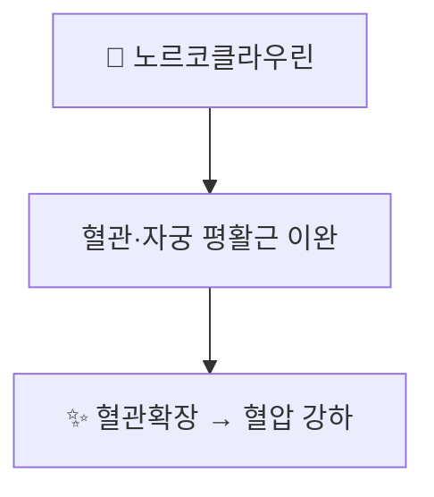

---
aliases:
  - Norcoclaurine
  - (S)-Norcoclaurine
  - 노르코클라우린
tags:
  - 약리성분
  - 알칼로이드
  - 연자심
---

# 🔬 노르코클라우린 (Norcoclaurine)

> **핵심 3줄 요약 (Key Summary)**:
> - 🌿 기원 본초 & 화학 계열: [[연자심]](蓮子心, 수련과 *Nelumbo nucifera* 연꽃 씨앗의 배아)에 함유된 벤질이소퀴놀린 알칼로이드. 식물계에서 벤질이소퀴놀린 알칼로이드 생합성의 최초 골격 화합물로, [[리에닌]]·[[네페린]] 등 연자심의 주요 알칼로이드 생합성 경로의 시원 물질이기도 함.
> - 🎯 핵심 분자 표적: 혈관·자궁 평활근 이완 작용에 관여하는 것으로 제시되며, [[네페린]]과 함께 혈압 강하 효과의 기전으로 다뤄짐.
> - 🩺 주요 약리 활성: 평활근 이완을 통한 혈관확장·혈압강하 작용이 연자심의 청심사화(淸心瀉火) 효능의 현대적 근거로 제시됨.
> - ⚠️ 근거 수준: 노르코클라우린 단독의 약리 효능에 대한 사람 대상 임상 연구는 제한적이며, 대부분 연자심 전체 추출물 또는 관련 알칼로이드 복합체 수준의 연구입니다.

---

## 📌 목차
1. [기본 화학 정보](#1-기본-화학-정보-chemical-identity)
2. [주요 함유 본초 및 천연 기원](#2-주요-함유-본초-및-천연-기원)
3. [생합성적 의의: 벤질이소퀴놀린 알칼로이드의 시원 물질](#3-생합성적-의의-벤질이소퀴놀린-알칼로이드의-시원-물질)
4. [분자약리 표적 & 작용 기전](#4-분자약리-표적--작용-기전)
5. [한의학적 연계](#5-한의학적-연계)
6. [출처 및 학술 참고 문헌 (References)](#6-출처-및-학술-참고-문헌-references)

---

## 1. 기본 화학 정보 (Chemical Identity)

> [!abstract]+ 🧪 3D 약리 분자 구조 (Interactive 3D Viewer)
> <iframe src="https://molecule-viewer-rho.vercel.app/?cid=440927" style="width: 100%; height: 600px; border: none; border-radius: 12px; box-shadow: 0 4px 20px rgba(0,0,0,0.15);" allowfullscreen></iframe>

| 항목 | 상세 내용 |
| :--- | :--- |
| **분자식 / 분자량** | C₁₆H₁₇NO₃ / 약 271.31 g/mol |
| **PubChem CID** | [440927](https://pubchem.ncbi.nlm.nih.gov/compound/S_-Norcoclaurine) ((S)-형) |
| **화학 골격 분류** | 벤질이소퀴놀린 알칼로이드(Benzylisoquinoline alkaloid, BIA) 계열의 가장 단순한 시조 구조 |

---

## 2. 주요 함유 본초 및 천연 기원 (Botanical Sources & Content)

| 함유 본초 | 기원 식물학적 명칭 | 주요 함유 부위 | 한의학적 귀경 및 약효 특성 |
| :--- | :--- | :--- | :--- |
| [[연자심]] (蓮子心) | 수련과 / *Nelumbo nucifera* | 연꽃 씨앗(연자)의 배아(심) | 심경(心經) 귀경, 청심사화(淸心瀉火)·삽정지혈(澁精止血) |

---

## 3. 생합성적 의의: 벤질이소퀴놀린 알칼로이드의 시원 물질

식물 생합성 경로에서 (S)-노르코클라우린은 효소 (S)-노르코클라우린 합성효소(NCS)에 의해 도파민과 4-하이드록시페닐아세트알데히드가 축합되어 생성되는 벤질이소퀴놀린 알칼로이드(BIA) 계열의 최초 골격 화합물입니다. 이후 다양한 효소적 변형을 거쳐 모르핀(양귀비), 베르베린(황련 등), 그리고 연자심의 리에닌·네페린 등 수많은 BIA 알칼로이드로 분화됩니다.

---

## 4. 분자약리 표적 & 작용 기전

* [[연자심]] 노트에 기술된 바와 같이, 노르코클라우린은 [[네페린]]과 함께 혈관과 자궁 평활근을 이완시켜 혈압을 낮추는 작용에 관여하는 것으로 제시됩니다.

---

## 5. 한의학적 연계

노르코클라우린은 [[연자심]]의 청심사화 효능을 뒷받침하는 알칼로이드 성분 중 하나로, [[리에닌]]·[[네페린]] 등과 함께 심화(心火)로 인한 번조·불면·고혈압 경향에 활용되는 근거로 다뤄집니다.

---

## 6. 출처 및 학술 참고 문헌 (References)

1. **Benzylisoquinoline Alkaloids Biosynthesis in Sacred Lotus**. PMID: [30404216](https://pubmed.ncbi.nlm.nih.gov/30404216/)
   - **[연구 요약]**: 연자심(Nelumbo nucifera)에서 노르코클라우린을 포함한 벤질이소퀴놀린 알칼로이드 생합성 경로를 규명한 연구.
2. **Elucidation of the (R)-enantiospecific benzylisoquinoline alkaloid biosynthetic pathways in sacred lotus**. *Scientific Reports*. [https://www.nature.com/articles/s41598-023-29415-0](https://www.nature.com/articles/s41598-023-29415-0)
   - **[연구 요약]**: 연자심의 (R)-형 벤질이소퀴놀린 알칼로이드 생합성 경로를 규명한 후속 연구.
3. PubChem Compound Summary — (S)-Norcoclaurine (CID 440927): [https://pubchem.ncbi.nlm.nih.gov/compound/S_-Norcoclaurine](https://pubchem.ncbi.nlm.nih.gov/compound/S_-Norcoclaurine)
