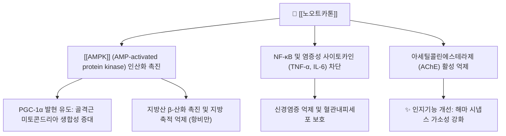

# 🌿 [[노오트카톤]] (Nootkatone)

> **핵심 요약 (Key Summary)**:
> 한약재 [[익지인]] 및 자몽 정유에서 분리되는 천연 세스퀴테르페노이드 정유 지표 성분
> [[AMPK]] 경로 활성화로 지방 축적 억제 및 미토콘드리아 생합성 촉진, 항염증·신경보호 작용 발휘
> 대사증후군 개선, 지구력 향상, 인지기능 보호 및 익지인의 온신고정·축뇨 효능의 현대적 지표

---
## 📌 목차
1. [기본 정보 & 화학적 특성](#1-기본-정보--화학적-특성)
2. [분자약리 작용 기전 (Mechanism of Action)](#2-분자약리-작용-기전-mechanism-of-action)
3. [함유 본초 및 한의학적 연계](#3-함유-본초-및-한의학적-연계)
4. [임상 효능 및 연구 결과](#4-임상-효능-및-연구-결과)
5. [안전성 및 약물 상호작용](#5-안전성-및-약물-상호작용)
6. [출처 및 학술 참고 문헌 (References)](#6-출처-및-학술-참고-문헌-references)

---
## 1. 기본 정보 & 화학적 특성

| 항목 | 상세 내용 |
| :--- | :--- |
| **성분명** | [[노오트카톤]] (Nootkatone, (+)-Nootkatone) |
| **IUPAC 명칭** | (4R,4aS,6R)-4,4a-dimethyl-6-prop-1-en-2-yl-3,4,5,6,7,8-hexahydronaphthalen-2-one |
| **화학식** | $C_{15}H_{22}O$ |
| **분자량** | 218.33 g/mol |
| **화합물 분류** | 에레모필란형 바이사이클릭 세스퀴테르페노이드 (Sesquiterpenoid) |
| **대표 기원 식물** | [[익지인]](*Alpinia oxyphylla* Miq.) 과실, 자몽(*Citrus paradisi*) 과피 |

---
## 2. 분자약리 작용 기전 (Mechanism of Action)

### (1) 강력한 AMPK 활성화 매개 대사 개선
* **골격근 및 간 에너지 센서 조절**: 노오트카톤은 세포 내 [[AMPK]] 인산화를 직접 촉진하여 PGC-1α 신호전달을 자극함.
* **미토콘드리아 활성화**: 골격근 내 미토콘드리아 밀도를 높이고 지구력을 증대시키며, 간세포 내 지방 축적을 억제하여 비알코올성 지방간(NAFLD)을 개선함.

### (2) 신경세포 보호 및 아세틸콜린 분해 억제
* 뇌 해마 부위의 콜린성 신경망을 활성화하고 아세틸콜린 분해효소(AChE)를 억제하여 알츠하이머병 모델에서 공간 학습 및 기억 능력을 보존함.

---
## 3. 함유 본초 및 한의학적 연계

### (1) 핵심 함유 본초: [[익지인]]
* [[익지인]](益智仁)은 신양(腎陽)을 따뜻하게 하고 비위를 덥혀 소변 빈삭, 유뇨, 야간뇨 및 유연(군침 흘림)을 멈추게 하는 명약임.
* 노오트카톤은 익지인의 방향성 건비(健脾) 및 온신(溫腎) 효능을 뒷받침하는 핵심 정유 성분으로, 방광 평활근 긴장도 조절 및 비기허 증후 개선에 관여함.

### (2) 주요 배오 처방
* [[축천환]]: [[오약]], [[산약]]과 함께 신허유뇨(腎虛遺尿) 및 소변 실금 치료.
* [[비해분청음]]: 비뇨기계 만성 염증 및 요탁(백탁) 해소.

---
## 4. 임상 효능 및 연구 결과

* **대사 촉진 및 지구력 증진**: 운동 지구력 한계 시간을 연장하고 근육 내 글리코겐 보존을 돕는 대사 활성 입증.
* **천연 해충 기피 효과**: 진드기, 모기 등에 대한 우수한 살충 및 기피 활성으로 미국 EPA 인증 획득.

---
## 5. 안전성 및 약물 상호작용

* **온조(溫燥)성 주의**: 노오트카톤을 다량 함유한 익지인은 성질이 맵고 따뜻하므로, 음허화왕(陰虛火旺)으로 인한 소변 적삽 환자에게는 투여를 주의함.

---
## 6. 출처 및 학술 참고 문헌 (References)

* Murase T et al. Nootkatone, a characteristic constituent of grapefruit, stimulates energy metabolism and prevents diet-induced obesity by activating AMPK. Am J Physiol Endocrinol Metab. 2010.
  * [연구 요약] 노오트카톤이 AMPK 활성화를 통해 전신 에너지 대사를 증진시키고 식이성 비만을 예방함을 증명함.
* Qi Y et al. Neuroprotective effects of nootkatone against memory impairment in mice. Neurochem Res. 2017.
  * [연구 요약] 노오트카톤이 아세틸콜린에스테라제를 억제하고 산화 스트레스를 경감시켜 기억 손상을 유의하게 회복시킴을 규명함.
