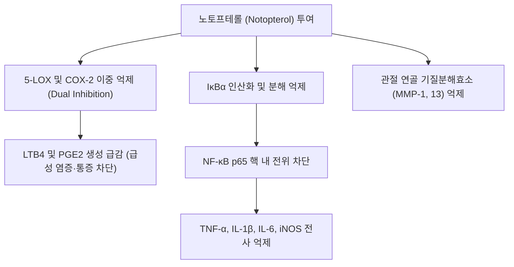

---
aliases:
  - Notopterol
  - 노토프테롤
tags:
  - 약리성분
  - 푸라노쿠마린
  - 강활
  - 항염증
  - 진통
---

# 노토프테롤 (Notopterol)

> 핵심 요약 (Key Summary):
> 한약재 [[강활]](Notopterygium incisum / Notopterygium franchetii)의 뿌리에서 추출되는 대표적인 선형 푸라노쿠마린(Furanocoumarin) 계열의 핵심 지표 성분.
> 5-리폭시게나아제(5-LOX)와 사이클로옥시게나아제-2(COX-2)를 동시에 억제하여 프로스타글란딘($PGE_2$) 및 류코트리엔($LTB_4$) 합성을 차단하는 강력한 듀얼 항염·진통 작용.
> NF-$\kappa$B 전사인자 핵 내 이동 억제 및 연골파괴 효소(MMP-1, MMP-13) 발현을 차단하여, 류마티스 관절염 및 상반신 풍한습(風寒濕) 관절 비통을 다스리는 강활의 핵심 분자 기전.

---

## 1. 화학 구조 및 기본 물성 (Chemical Properties)

* **IUPAC 명칭**: (E)-5-[(3,7-dimethylocta-2,6-dienyl)oxy]-7H-furo[3,2-g]chromen-7-one
* **화학식 (Molecular Formula)**: $C_{21}H_{22}O_5$
* **분자량 (Molecular Weight)**: 354.40 g/mol
* **구조적 특징**:
  * 소랄렌(Psoralen) 모핵에 게라닐옥시(Geranyloxy) 곁사슬이 5번 위치에 에테르 결합된 구조.
  * 지용성이 높아 생체막 투과성이 우수하며, 중추신경계 및 말초 신경 말단으로 신속히 분포합니다.

---

## 2. 분자 약리 작용 및 메커니즘 (Pharmacological MoA)

### 1) 아라키돈산 대사 이중 억제 (5-LOX / COX-2 Dual Inhibition)
- 기존 NSAIDs가 COX 경로만 차단하여 류코트리엔 축적으로 인한 위장관 궤양이나 천식을 유발하는 한계를 극복하고, 노토프테롤은 COX-2와 5-LOX를 동시에 억제하여 강력한 진통 효과와 함께 조직 보호 효과를 나타냅니다.

### 2) 염증성 사이토카인 및 활성산소 억제
- 대식세포에서 LPS 자극에 의해 유도되는 $I\kappa B\alpha$ 분해를 막아 NF-$\kappa$B 신호전달을 차단합니다.
- NO(산화질소) 합성 효소(iNOS) 및 전염증성 사이토카인(TNF-$\alpha$, IL-1$\beta$, IL-6)의 mRNA 발현을 농도 의존적으로 감소시킵니다.

### 3) 관절 연골 보호 및 항관절염 (Chondroprotection)
- 활액막 세포 및 연골세포에서 제2형 콜라겐을 파괴하는 기질금속단백질가수분해효소(MMP-1, MMP-3, MMP-13) 생성을 억제하여 퇴행성 및 류마티스 관절염 모델에서 관절 간격 협소와 골 미란을 유의하게 방어합니다.

---

## 3. 한의학 본초 및 방제 연계 (Phytomedicine Link)

* **기원 본초**:
  * [[강활]](羌活): 신온발산(辛溫發散), 거풍승습(祛風勝濕), 지통(止痛).
  * 강활의 약효 중 특히 항염증, 해열, 진통 효과의 70% 이상이 노토프테롤과 베르가프텐, 이소임페라토린 복합체에서 발현됩니다.
* **관련 처방 및 임상 응용**:
  * [[구미강활탕]](九味羌活湯): 풍한습 감기 초기 두통 및 사지 관절통 해소.
  * [[대강활탕]](大羌活湯): 급성 류마티스 관절염 및 관절 종통.
  * [[독활기생탕]](獨活寄生湯): 만성 척추 비증 및 관절 연골 퇴행 방어.

---

## 4. 📚 출처 및 학술 연구 요약 (References)

1. Okuyama, E., et al. (1993). "Analgesic components of Notopterygium incisum: notopterol and its derivatives." *Chemical and Pharmaceutical Bulletin*, 41(7), 1309-1311.
   - [연구 요약] 강활 추출물에서 주 활성 물질로 노토프테롤을 분리 동정하고 마우스 초산 유발 통증 모델에서 뛰어난 진통 활성을 최초 입증.
2. Wang, C. C., et al. (2019). "Notopterol inhibits inflammatory responses in rheumatoid arthritis through NF-$\kappa$B and MAPK signaling pathways." *Phytomedicine*, 63, 153018.
   - [연구 요약] 류마티스 관절염 활액 섬유아세포에서 노토프테롤이 NF-$\kappa$B 및 p38 MAPK 경로를 억제하여 관절 연골 파괴와 염증 매개인자를 차단함을 규명.
