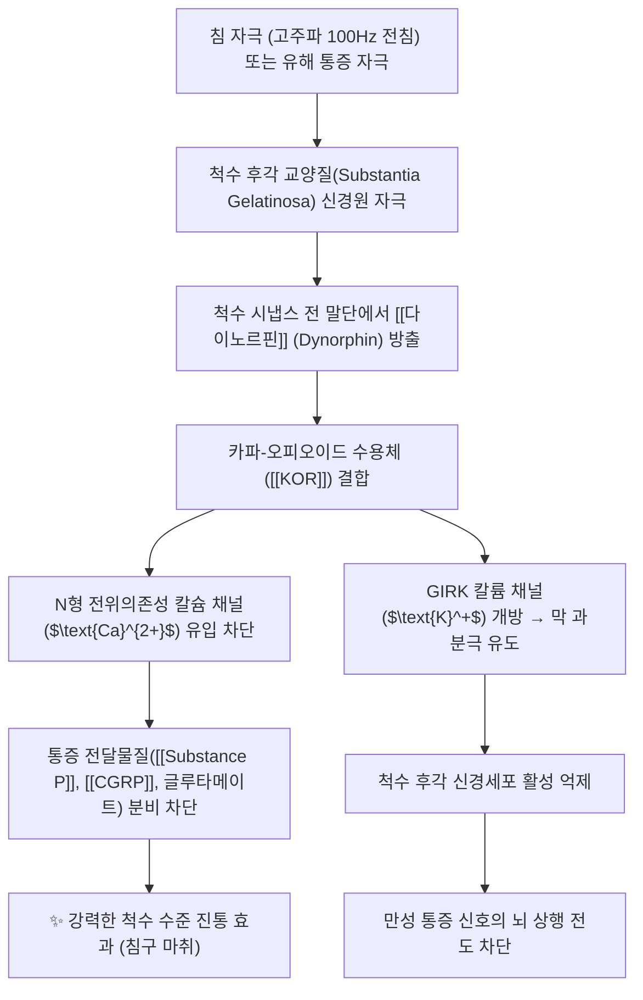

---
aliases:
  - 다이노르핀
  - Dynorphin
  - 다이노핀
  - 다이놀핀
tags:
  - 약리성분
  - 오피오이드
  - 신경펩타이드
  - 내인성진통물질
  - 카파수용체
  - 침구마취
  - 침치료기전
  - 전침
---
# 💊 [[다이노르핀]] (Dynorphin, Endogenous Opioid Peptide)

> **핵심 요약 (Key Summary)**:
> 척수 후각 및 시상하부 등 중추신경계에서 분비되는 대표적인 내인성 오피오이드 신경펩타이드.
> 카파-오피오이드 수용체([[KOR]])에 특이적으로 결합하여 전위의존성 칼슘 채널을 억제하고 통증 전달 펩타이드(Substance P, CGRP) 유리를 차단.
> 고주파 전침(100Hz) 자극 시 척수 수준에서 대량 방출되어 강력한 척수 진통, 신경병증성 통증 억제 및 중독 조절에 관여.
> ⚠️ 근거 수준: 다이노르핀은 본초 함유 성분이 아닌 내인성 펩타이드입니다. KOR 선택적 리간드라는 점(Chavkin 1982)과 침 자극 주파수별 신경펩타이드 유리(Han 2003)는 문헌으로 확인되나, 구체적 임상 적응증(IBS 복통 등)의 인체 근거는 이 노트에서 확인하지 못했습니다.

---

## 📌 목차
1. [기본 화학 정보 & 분자 구조식 (Chemical Identity)](#1-기본-화학-정보--분자-구조식-chemical-identity)
2. [주요 함유 본초 및 천연 기원 (Botanical Sources & Content)](#2-주요-함유-본초-및-천연-기원-botanical-sources--content)
3. [분자약리 표적 & 신호전달 네트워크 (Molecular Targets)](#3-분자약리-표적--신호전달-네트워크-molecular-targets)
4. [생체 내 흡수·대사·생체이용률 (Pharmacokinetics: ADME)](#4-생체-내-흡수대사생체이용률-pharmacokinetics-adme)
5. [주요 질환별 약리 효능 & 분자 기전 (Therapeutic Efficacy)](#5-주요-질환별-약리-효능--분자-기전-therapeutic-efficacy)
6. [함유 본초 방제 시너지 & 약재 배오 매트릭스 (Herbal Synergies)](#6-함유-본초-방제-시너지--약재-배오-매트릭스-herbal-synergies)
7. [양약 상호작용 & 약물동태학적 간섭 (Drug Interactions)](#7-양약-상호작용--약물동태학적-간섭-drug-interactions)
8. [💡 사용자 진료실 핵심 필기 & 임상 응용 팁 (Melt-In & High-Yield)](#8--사용자-진료실-핵심-필기--임상-응용-팁-melt-in--high-yield)
9. [출처 및 학술 참고 문헌 (References)](#9-출처-및-학술-참고-문헌-references)

---

## 1. 기본 화학 정보 & 분자 구조식 (Chemical Identity)

> [!abstract]+ 🧪 3D 약리 분자 구조 (Interactive 3D Viewer)
> <iframe src="https://molecule-viewer-rho.vercel.app/?cid=16133805" width="100%" height="450px" frameborder="0" allow="webgl" style="border-radius: 8px;"></iframe>
> *(Dynorphin A(1-17) 기준)*

| 항목 | 상세 내용 |
| :--- | :--- |
| **일반명 (Generic)** | [[다이노르핀]] (Dynorphin, Dyn) |
| **분자 구조군** | 내인성 신경펩타이드 (전구체: Pro-dynorphin / Prodynorphin) |
| **주요 활성 형태** | • **Dynorphin A (1-17)**: Tyr-Gly-Gly-Phe-Leu-Arg-Arg-Ile-Arg-Pro-Lys-Leu-Lys-Trp-Asp-Asn-Gln • **Dynorphin B (Rimorphin)**, Big Dynorphin, Dynorphin A (1-8) |
| **PubChem CID (Dynorphin A(1-17))** | [16133805](https://pubchem.ncbi.nlm.nih.gov/compound/16133805) — C₉₉H₁₅₅N₃₁O₂₃ / 약 2147.5 g/mol (PubChem 등록명: Dynorphin A (swine)) |
| **표적 수용체** | 카파-오피오이드 수용체 ([[KOR]], $\kappa$-opioid receptor)에 초고친화력 결합 |
| **신호전달계** | $\text{G}_{\text{i/o}}$ 단백질 결합 수용체 (GPCR) 경로 → 아데닐릴 시클라아제(AC) 억제, cAMP 감소, 칼슘 채널 억제, 칼륨 채널(GIRK) 개방 |

---

## 2. 주요 함유 본초 및 천연 기원 (Botanical Sources & Content)

다이노르핀은 본초에서 유래한 성분이 아니라 **내인성 신경펩타이드**입니다. 이 섹션은 함유 본초 대신 발현 부위와 한의학적 자극(침) 연계를 정리합니다.

* **내인성 분포**: 척수 후각 및 시상하부 등 중추신경계(원문). 다이노르핀은 해마, 편도체, 시상하부, 선조체, 척수에 분포하며 학습·기억, 정서 조절, 스트레스 반응, 통증과 관련된 것으로 정리되어 있습니다(Schwarzer 2009).
* **한의학적 연계**: 본초 대신 침·전침 자극에 의해 척수에서 유리된다는 점이 핵심이며, 상세는 §6을 참고하세요.

---

## 3. 분자약리 표적 & 신호전달 네트워크 (Molecular Targets)

* **척수 시냅스 전 억제를 통한 통증 전달 차단**:
  * 척수 후각(Dorsal horn)의 일차 구심성 C-섬유 말단에 위치한 [[KOR]]에 결합하여 칼슘 유입을 억제함으로써, 유해 자극 신호를 전달하는 [[Substance P]]와 [[CGRP]]의 분비를 물리적으로 차단.
* **시냅스 후 막 과분극(Hyperpolarization)**:
  * 칼륨 채널을 개방하여 세포 내 양이온을 유출시킴으로써 척수 신경세포의 흥분 역치를 높여 통증 감작(Central sensitization)을 방지.
* **보상 회로 및 정서 조절(스트레스 반응)**:
  * 중뇌 도파민성 신경원 말단의 도파민 분비를 억제하여, 뮤-오피오이드 수용체([[MOR]])와 달리 도취감(Euphoria) 대신 불쾌감(Dysphoria)을 매개하며 약물 중독 갈망을 억제하는 역작용 수행.

⚠️ 검증 메모: 다이노르핀이 카파 오피오이드 수용체의 특이적 내인성 리간드임은 1982년 Science 논문으로 확인됩니다(Chavkin 1982). 다이노르핀이 오피오이드 펩타이드 계열이며 KOR에 우선 결합하고, 간질·중독·우울증·조현병 등의 병태에 관여할 수 있다는 점은 종설에 정리되어 있습니다(Schwarzer 2009). N형 칼슘 채널 차단·GIRK 개방·Substance P/CGRP 유리 차단 등 세부 신호전달 서술은 이 노트에서 개별 논문으로 확인하지 못해 **내용 검토 필요**입니다.

---

## 4. 생체 내 흡수·대사·생체이용률 (Pharmacokinetics: ADME)

⚠️ 내용 검토 필요: 다이노르핀은 내인성 펩타이드로 약물로서의 흡수·생체이용률 개념이 적용되지 않으며, 이 노트에서 확인한 반감기·대사 정량 자료는 없습니다.

---

## 5. 주요 질환별 약리 효능 & 분자 기전 (Therapeutic Efficacy)

* **만성 염증성 관절통 및 좌골신경통 완화**:
  * 침 치료를 통해 국소 및 척수 분절에서 다이노르핀 농도를 높여 진통제 복용량을 감량.
* **약물 의존성 및 중독 치료(이침 및 체침 요법)**:
  * 마약, 알코올, 니코틴 금단 증상 시 도파민 폭주를 제어하여 갈망과 재발을 방지.
* **소화기 내장통(Visceral pain) 완화**:
  * 족삼리(ST36) 전침 자극 시 장관 감각신경의 KOR을 자극하여 과민성 장 증후군 복통 완화.

⚠️ 내용 검토 필요: 위 세 항목의 인체 임상 근거는 이 노트에서 확인하지 못했습니다. 다이노르핀·KOR 시스템이 통증·학습·정서 조절과 관련되고 중독·우울증 등 병태에 관여할 수 있다는 점만 종설로 확인됩니다(Schwarzer 2009).

---

## 6. 함유 본초 방제 시너지 & 약재 배오 매트릭스 (Herbal Synergies)

본초 대신 침·전침 자극 매트릭스로 정리합니다(원문 서술).

* **한지생(Han Ji-Sheng) 교수의 전침 진통 메커니즘**:
  * **저주파(2Hz) 전침 자극**: 뇌간 및 척수에서 엔돌핀([[Endorphin]])과 엔케팔린([[Enkephalin]]) 방출 유도 ([[MOR]] 및 DOR 매개).
  * **고주파(100Hz) 전침 자극**: 척수 후각에서 [[다이노르핀]]의 방출을 선택적으로 유도하여 [[KOR]]을 통한 강력한 척수 진통 효과 발휘.
  * **2Hz/100Hz 교번(Dense-Disperse, 조밀파) 자극**: 엔돌핀과 다이노르핀을 동시에 최대로 방출시켜 가장 강력한 시너지 진통 효과를 나타냄 (현대 한방병원 침구 마취 및 난치성 통증 프로토콜의 표준 근거).
* **난치성 신경병증성 통증(Neuropathic pain) 치료의 핵심**:
  * 척수 손상, 대상포진 후 신경통, 복합부위통증증후군(CRPS) 환자에서 척수 레벨의 다이노르핀 유리를 촉진하는 고주파 전침 요법 적용.

| 자극 | 방출 신경펩타이드(원문) | 수용체 |
| :--- | :--- | :--- |
| 저주파 2Hz [[전침]] | 엔돌핀·엔케팔린 | [[MOR]], DOR |
| 고주파 100Hz [[전침]] | 다이노르핀 | [[KOR]] |
| 2Hz/100Hz 교번 | 엔돌핀 + 다이노르핀 | MOR + KOR |

⚠️ 검증 메모: 전침 자극 주파수에 따라 서로 다른 신경펩타이드가 유리된다는 개념은 Han(2003, *Trends Neurosci*)의 종설 제목("Acupuncture: neuropeptide release produced by electrical stimulation of different frequencies")으로 확인되며, 이 노트에서는 초록 본문을 확인하지 못해 주파수별 구체 서술은 원문 그대로 보존합니다. 난치성 신경병증성 통증(CRPS 등)에 대한 임상 적용 서술도 문헌으로 확인하지 못했습니다(**내용 검토 필요**).

---

## 7. 양약 상호작용 & 약물동태학적 간섭 (Drug Interactions)

⚠️ 내용 검토 필요: 다이노르핀 자체에 대한 양약 상호작용 자료는 이 노트에서 확인하지 못했습니다. KOR을 매개로 하는 시스템이므로 KOR 작용제·길항제 및 오피오이드 계열 약물과의 상호작용 가능성은 이론적으로 생각해 볼 수 있으나 검증된 근거는 아닙니다.

---

## 8. 💡 사용자 진료실 핵심 필기 & 임상 응용 팁 (Melt-In & High-Yield)

* 전침 주파수 선택 개념: 2Hz(엔돌핀·엔케팔린, MOR/DOR), 100Hz(다이노르핀, KOR), 2/100Hz 교번(두 계통 동시)으로 정리해 환자·학생 설명에 활용.
* 다이노르핀은 통증 억제뿐 아니라 정서·스트레스·중독과도 연결된 시스템이므로(불쾌감 매개), 전침 자극 후 정서 반응을 관찰할 때 참고.
* 구체 임상 적응증(신경병증성 통증, IBS, 금단증상 등)은 근거 수준을 구분해 안내.

---

## 9. 출처 및 학술 참고 문헌 (References)

1. **Han JS (2003)**. *Acupuncture: neuropeptide release produced by electrical stimulation of different frequencies*. **Trends Neurosci**, 26(1):17-22. PMID: [12495858](https://pubmed.ncbi.nlm.nih.gov/12495858/)
   - **[연구 요약]**: 서로 다른 주파수의 전기자극이 서로 다른 신경펩타이드 유리를 일으켜 침 진통에 관여함을 정리한 종설.
2. **Chavkin C, James IF, Goldstein A (1982)**. *Dynorphin is a specific endogenous ligand of the kappa opioid receptor*. **Science**, 215(4531):413-415. PMID: [6120570](https://pubmed.ncbi.nlm.nih.gov/6120570/)
   - **[연구 요약]**: 다이노르핀이 카파-오피오이드 수용체의 특이적 내인성 리간드임을 보인 고전적 연구.
3. **Schwarzer C (2009)**. *30 years of dynorphins—new insights on their functions in neuropsychiatric diseases*. **Pharmacol Ther**, 123(3):353-370. PMID: [19481570](https://pubmed.ncbi.nlm.nih.gov/19481570/) · DOI: [10.1016/j.pharmthera.2009.05.006](https://doi.org/10.1016/j.pharmthera.2009.05.006)
   - **[연구 요약]**: 다이노르핀이 KOR에 우선 결합하며 해마·편도체·시상하부·선조체·척수에 분포해 학습·기억, 정서 조절, 스트레스 반응, 통증과 관련되고 간질·중독·우울증·조현병 등에 관여할 수 있음을 정리한 종설.
