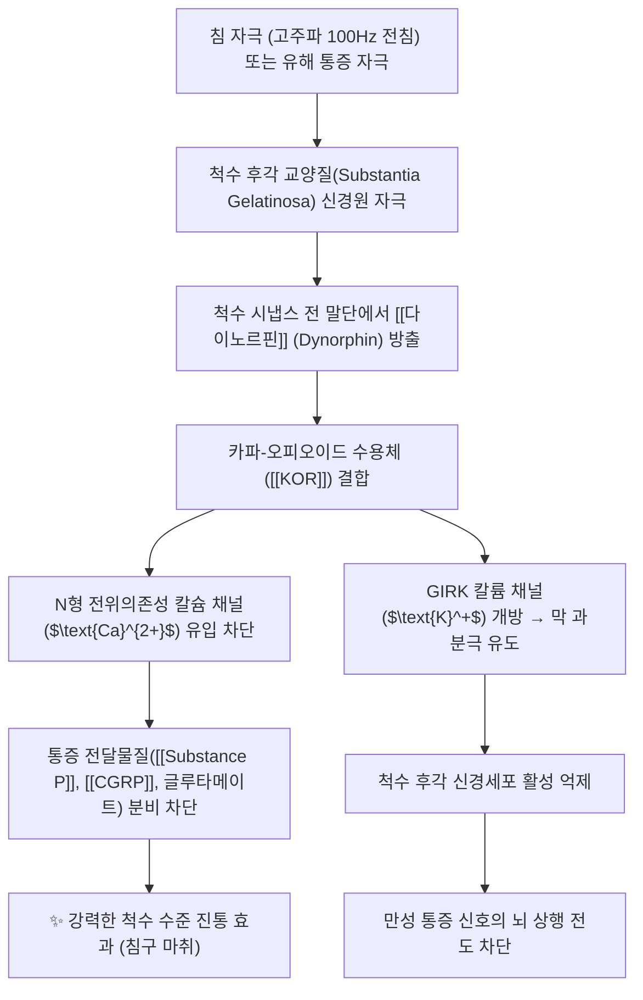

---
aliases:
  - 다이노르핀
  - Dynorphin
  - 다이노핀
  - 다이놀핀
tags:
  - 약리성분
  - 오피오이드
  - 신경펩타이드
  - 내인성진통물질
  - 카파수용체
  - 침구마취
  - 침치료기전
  - 전침
---
# 💊 [[다이노르핀]] (Dynorphin, Endogenous Opioid Peptide)

> **핵심 요약 (Key Summary)**:
> 척수 후각 및 시상하부 등 중추신경계에서 분비되는 대표적인 내인성 오피오이드 신경펩타이드.
> 카파-오피오이드 수용체([[KOR]])에 특이적으로 결합하여 전위의존성 칼슘 채널을 억제하고 통증 전달 펩타이드(Substance P, CGRP) 유리를 차단.
> 고주파 전침(100Hz) 자극 시 척수 수준에서 대량 방출되어 강력한 척수 진통, 신경병증성 통증 억제 및 중독 조절에 관여.

---

## 1. 기본 화학 및 분자약리 특성

| 항목 | 상세 내용 |
| :--- | :--- |
| **일반명 (Generic)** | [[다이노르핀]] (Dynorphin, Dyn) |
| **분자 구조군** | 내인성 신경펩타이드 (전구체: Pro-dynorphin / Prodynorphin) |
| **주요 활성 형태** | • **Dynorphin A (1-17)**: Tyr-Gly-Gly-Phe-Leu-Arg-Arg-Ile-Arg-Pro-Lys-Leu-Lys-Trp-Asp-Asn-Gln • **Dynorphin B (Rimorphin)**, Big Dynorphin, Dynorphin A (1-8) |
| **표적 수용체** | 카파-오피오이드 수용체 ([[KOR]], $\kappa$-opioid receptor)에 초고친화력 결합 |
| **신호전달계** | $\text{G}_{\text{i/o}}$ 단백질 결합 수용체 (GPCR) 경로 → 아데닐릴 시클라아제(AC) 억제, cAMP 감소, 칼슘 채널 억제, 칼륨 채널(GIRK) 개방 |

---

## 2. 분자약리 작용 기전 (Mechanism of Action, MoA)

* **척수 시냅스 전 억제를 통한 통증 전달 차단**:
  * 척수 후각(Dorsal horn)의 일차 구심성 C-섬유 말단에 위치한 [[KOR]]에 결합하여 칼슘 유입을 억제함으로써, 유해 자극 신호를 전달하는 [[Substance P]]와 [[CGRP]]의 분비를 물리적으로 차단.
* **시냅스 후 막 과분극(Hyperpolarization)**:
  * 칼륨 채널을 개방하여 세포 내 양이온을 유출시킴으로써 척수 신경세포의 흥분 역치를 높여 통증 감작(Central sensitization)을 방지.
* **보상 회로 및 정서 조절(스트레스 반응)**:
  * 중뇌 도파민성 신경원 말단의 도파민 분비를 억제하여, 뮤-오피오이드 수용체([[MOR]])와 달리 도취감(Euphoria) 대신 불쾌감(Dysphoria)을 매개하며 약물 중독 갈망을 억제하는 역작용 수행.

---

## 3. 한의학 침구학 및 전침(Electroacupuncture) 연계

* **한지생(Han Ji-Sheng) 교수의 전침 진통 메커니즘**:
  * **저주파(2Hz) 전침 자극**: 뇌간 및 척수에서 엔돌핀([[Endorphin]])과 엔케팔린([[Enkephalin]]) 방출 유도 ([[MOR]] 및 DOR 매개).
  * **고주파(100Hz) 전침 자극**: 척수 후각에서 [[다이노르핀]]의 방출을 선택적으로 유도하여 [[KOR]]을 통한 강력한 척수 진통 효과 발휘.
  * **2Hz/100Hz 교번(Dense-Disperse, 조밀파) 자극**: 엔돌핀과 다이노르핀을 동시에 최대로 방출시켜 가장 강력한 시너지 진통 효과를 나타냄 (현대 한방병원 침구 마취 및 난치성 통증 프로토콜의 표준 근거).
* **난치성 신경병증성 통증(Neuropathic pain) 치료의 핵심**:
  * 척수 손상, 대상포진 후 신경통, 복합부위통증증후군(CRPS) 환자에서 척수 레벨의 다이노르핀 유리를 촉진하는 고주파 전침 요법 적용.

---

## 4. 임상 질환 및 대사적 연계

* **만성 염증성 관절통 및 좌골신경통 완화**:
  * 침 치료를 통해 국소 및 척수 분절에서 다이노르핀 농도를 높여 진통제 복용량을 감량.
* **약물 의존성 및 중독 치료(이침 및 체침 요법)**:
  * 마약, 알코올, 니코틴 금단 증상 시 도파민 폭주를 제어하여 갈망과 재발을 방지.
* **소화기 내장통(Visceral pain) 완화**:
  * 족삼리(ST36) 전침 자극 시 장관 감각신경의 KOR을 자극하여 과민성 장 증후군 복통 완화.

---

## 5. 출처 및 학술 참고 문헌 (References)

* Han, J. S. (2003). Acupuncture: neuropeptide release produced by electrical stimulation of different frequencies. *Trends in Neurosciences*, 26(1), 17-22.
  * `[연구 요약]` 서로 다른 전침 주파수(2Hz vs 100Hz)가 엔돌핀과 다이노르핀을 선택적으로 분비시켜 침 치료 진통을 유도함을 입증한 세계적 랜드마크 논문.
* Chavkin, C., et al. (1982). Dynorphin is a specific endogenous ligand of the kappa opioid receptor. *Science*, 215(4531), 413-415.
  * `[연구 요약]` 다이노르핀이 카파-오피오이드 수용체에 특이적으로 결합하는 내인성 리간드임을 최초로 규명한 고전적 연구.
* Schwarzer, C. (2009). 30 years of dynorphins—new paths on the way to depression and addiction therapy. *Cellular and Molecular Life Sciences*, 66(16), 2570-2588.
  * `[연구 요약]` 다이노르핀-KOR 시스템의 통증 전달 차단, 우울증 및 중독 조절의 분자생물학적 메커니즘을 종합 정리한 종설.
