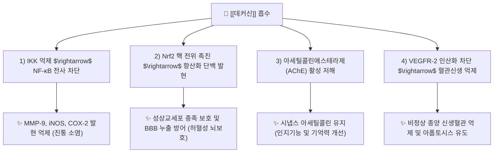

---
aliases:
  - Decursin
  - 데커신
  - 데쿠르신
  - 참당귀쿠마린
  - Pyranocoumarin
tags:
  - 약리/약리성분
  - 쿠마린
  - 피라노쿠마린
  - 당귀
  - 참당귀
  - 활혈보혈
  - 신경보호
  - 항염증
---

# 🔬 데커신 (Decursin, $C_{19}H_{20}O_5$ / [(7S)-8,8-dimethyl-2-oxo-7,8-dihydro-6H-pyrano[3,2-g]chromen-7-yl] 3-methylbut-2-enoate)

> **핵심 3줄 요약 (Key Summary)**:
> - 🌿 기원 본초 & 화학 계열: 토종 한국 참당귀([[당귀]], Angelica gigas Nakai)의 뿌리에 특이적으로 고농도(3~6% 이상) 함유된 지표 성분으로, 피라노쿠마린(Pyranocoumarin) 골격을 지닌 2차 대사산물.
> - 🎯 핵심 분자 표적 & 조절 경로: NF-κB 활성화 차단 및 MMP-9 발현 억제를 통한 항염증, VEGFR-2 혈관신생 신호 차단, 아세틸콜린에스테라제(AChE) 억제 및 Nrf2/HO-1 경로를 통한 뇌신경 보호.
> - 🩺 주요 약리 활성 & 질환 치료 기전: 혈소판 응집 억제 및 혈액 순환 촉진(활혈보혈 活血補血, 타박 어혈·월경통 완화), 뇌 허혈 손상 후 혈액-뇌 장벽(BBB) 누출 방어 및 기억력 개선([[치매]]·경도인지장애 예방), 에스트로겐 수용체 비의존적 갱년기 증후군 개선.
> - ⚠️ 독성·생체이용률 한계 & 상호작용: 중국당귀(리구스틸라이드 주성분)나 일당귀와 화학적 성분 조성이 상이하므로 기원 감별 필수, 항응고제·항혈소판제 병용 시 출혈 시간 연장 주의.

---

## 목차 (Table of Contents)
- [[#1. 기본 화학 정보 & 분자 구조식 (Chemical Identity)|1. 기본 화학 정보 & 분자 구조식 (Chemical Identity)]]
- [[#2. 주요 함유 본초 및 천연 기원 (Botanical Sources & Content)|2. 주요 함유 본초 및 천연 기원 (Botanical Sources & Content)]]
- [[#3. 분자약리 표적 & 신호전달 네트워크 (Molecular Targets)|3. 분자약리 표적 & 신호전달 네트워크 (Molecular Targets)]]
- [[#4. 생체 내 흡수·대사·생체이용률 (Pharmacokinetics: ADME)|4. 생체 내 흡수·대사·생체이용률 (Pharmacokinetics: ADME)]]
- [[#5. 주요 질환별 약리 효능 & 분자 기전 (Therapeutic Efficacy)|5. 주요 질환별 약리 효능 & 분자 기전 (Therapeutic Efficacy)]]
- [[#6. 함유 본초 방제 시너지 & 약재 배오 매트릭스 (Herbal Synergies)|6. 함유 본초 방제 시너지 & 약재 배오 매트릭스 (Herbal Synergies)]]
- [[#7. 양약 상호작용 & 약물동태학적 간섭 (Drug Interactions)|7. 양약 상호작용 & 약물동태학적 간섭 (Drug Interactions)]]
- [[#8. 💡 사용자 진료실 핵심 필기 & 임상 응용 팁 (Melt-In & High-Yield)|8. 💡 사용자 진료실 핵심 필기 & 임상 응용 팁 (Melt-In & High-Yield)]]
- [[#9. 출처 및 학술 참고 문헌 (References)|9. 출처 및 학술 참고 문헌 (References)]]

---

## 1. 기본 화학 정보 & 분자 구조식 (Chemical Identity)

### 1.1 분자 구조식 및 3D 뷰어

> [그림 1] PubChem 데커신(Decursin) 2D 화학 분자 구조식 (CID: 442126)

> [그림 2] 데커신의 피라노쿠마린(Pyranocoumarin) 모핵 및 곁사슬 화학 결합 구조

> [!abstract]+ 🧪 3D 약리 분자 구조 (Interactive 3D Viewer)
> <iframe src="https://molecule-viewer-rho.vercel.app/?cid=442126" width="100%" height="450px" frameborder="0" allow="webgl" style="border-radius: 8px;"></iframe>

### 1.2 화학적 프로파일
| 항목 | 상세 내용 |
| :--- | :--- |
| **IUPAC 명칭** | [(7S)-8,8-dimethyl-2-oxo-7,8-dihydro-6H-pyrano[3,2-g]chromen-7-yl] 3-methylbut-2-enoate |
| **분자식 / 분자량** | $C_{19}H_{20}O_5$ / 328.36 g/mol |
| **PubChem CID** | 442126 |
| **CAS 등록 번호** | 5928-27-8 |
| **화학 골격 분류** | 피라노쿠마린 (Pyranocoumarin) |
| **이성질체 관계** | 곁사슬 에스터 이중결합의 기하 이성질체인 **데커시놀 안겔레이트(Decursinol angelate, CID 442129)**와 참당귀 내에서 쌍으로 공존(1:0.7~1:1 비율) |
| **물리화학적 성상** | 백색의 침상 결정, 에탄올, 메탄올, 클로로포름에 가용, 물에 불용 |

---

## 2. 주요 함유 본초 및 천연 기원 (Botanical Sources & Content)

### 2.1 3국 당귀의 기원종 및 성분 차이 (감별 포인트)
대한민국약전, 중국약전, 일본약국방에서 규정하는 당귀는 기원 식물과 핵심 성분이 완전히 상이하므로 임상적 감별이 필수적입니다:
| 구분 | 한국 참당귀 ([[당귀]]) | 중국 당귀 | 일본 당귀 (일당귀) |
| :--- | :--- | :--- | :--- |
| **학명** | *Angelica gigas Nakai* | *Angelica sinensis (Oliv.) Diels* | *Angelica acutiloba Kitagawa* |
| **주요 지표 성분** | **데커신(Decursin) 및 데커시놀 안겔레이트 (3~6% 이상)** | [[리구스틸라이드]](Ligustilide), 부틸리덴프탈라이드 | 리구스틸라이드 |
| **화학 계열** | 피라노쿠마린 (Pyranocoumarins) | 프탈라이드 (Phthalides) 정유 | 프탈라이드 정유 |
| **한의 효능 특화** | **활혈거어(活血祛瘀), 통경지통(通經止痛)** 우수 (어혈 제거, 항암, 뇌신경 보호) | **보혈조경(補血調經), 윤장통변(潤腸通便)** 우수 (빈혈, 혈허변비) | 보혈 활혈 균형 |
| **KP 규격** | 건조물 기준 데커신 및 데커시놀안겔레이트의 합 **6.0% 이상** | — | — |

---

## 3. 분자약리 표적 & 신호전달 네트워크 (Molecular Targets)

### 3.1 신경보호 및 혈액-뇌 장벽(BBB) 보호
* **허혈성 뇌손상 방어 (Molecules 2021)**:
  * 일과성 전뇌 허혈 모델에서 데커신은 성상교세포 종족(Astrocyte endfeet) 손상을 억제하고 밀착연접 단백질(Claudin-5, ZO-1)의 분해를 막아 혈액-뇌 장벽(BBB) 누출을 유의하게 억제합니다.
* **콜린성 신경계 활성화**:
  * 아세틸콜린을 분해하는 효소인 AChE를 농도 의존적으로 저해하여 해마 시냅스 간극의 아세틸콜린 농도를 보존함으로써 스코폴라민 유도성 기억력 감퇴를 가역적으로 회복시킵니다.

### 3.2 강력한 NF-κB 차단 및 항염증·소염 진통
* 대식세포에서 IκB 키나아제(IKK) 복합체의 인산화를 차단하여 NF-κB p65의 핵 내 이동을 억제하고, 염증 매개 효소인 iNOS, COX-2 및 기질분해효소인 MMP-9의 발현을 유의하게 억제합니다.

---

## 4. 생체 내 흡수·대사·생체이용률 (Pharmacokinetics: ADME)

### 4.1 흡수 및 대사 변환
* **경구 흡수**: 지용성이 매우 높은 피라노쿠마린으로 위장관 지질막을 통해 신속히 흡수됩니다.
* **데커시놀(Decursinol)로의 가수분해**:
  * 생체 내 흡수 후 간 및 장관의 에스테라제(Esterase)에 의해 곁사슬 에스터 결합이 신속히 가수분해되어 활성 모핵인 **데커시놀(Decursinol)**로 전환됩니다.
  * 전환된 데커시놀 역시 우수한 뇌혈관 장벽 투과성을 지니며 강력한 진통 및 신경보호 약리 활성을 공유합니다.

### 4.2 배설 경로
* 간에서 글루쿠론산 및 황산 포합 반응을 거쳐 수용성 대사체로 전환된 후 담즙 및 소변을 통해 배설됩니다.

---

## 5. 주요 질환별 약리 효능 & 분자 기전 (Therapeutic Efficacy)

### 5.1 어혈성 동통 및 미세순환 장애 개선 (活血祛瘀)
* 콜라겐 및 ADP에 의해 유도되는 혈소판 응집을 강력하게 억제하고 트롬복산 생성을 차단하여 혈전 형성을 억제합니다. 타박상, 교통사고 염좌, 생리통 등 어혈성 통증에 탁월한 소염진통 효능을 발휘합니다.

### 5.2 알츠하이머 치매 및 퇴행성 뇌질환 예방
* $\beta$-아밀로이드($A\beta_{1-42}$) 단백질의 응집을 억제하고, 미세아교세포의 신경염증 반응을 차단하여 해마 신경세포의 세포사멸을 방어합니다.

### 5.3 갱년기 증후군 및 여성 질환 개선
* 자궁 내막 증식이나 유방암 위험을 유발하는 고전적 에스트로겐 수용체($ER\alpha$) 자극 없이, 신경혈관계를 조절하여 안면 홍조, 야간 발한, 골밀도 저하를 안전하게 완화합니다.

---

## 6. 함유 본초 방제 시너지 & 약재 배오 매트릭스 (Herbal Synergies)

> [그림 3] 당귀의 데커신과 작약, 홍화의 배오 시너지 (당귀수산 타박 어혈 흡수 촉진)

| 처방 / 배오 조합 | 공존 본초 및 지표 성분 | 분자약리 시너지 기전 | 전통 한의학적 적응증 |
| :--- | :--- | :--- | :--- |
| **[[당귀수산]]** | 당귀, [[적작약]], [[오약]], [[향부자]], [[홍화]] | 데커신의 항혈전·소염 작용과 홍화, 작약의 미세순환 촉진 시너지로 피하 혈종 흡수 가속 | 타박상, 교통사고 후유증, 염좌 어혈통 |
| **[[사물탕]]** | 당귀, [[숙지황]], [[백작약]], [[천궁]] | 당귀의 조혈 촉진과 천궁의 혈관 확장 시너지로 골수 조혈 기능 및 말초 순환 개선 | 혈허증(血虛證), 월경불순, 빈혈 |
| **[[당귀보혈탕]]** | [[황기]](황기다당체), 당귀 (5:1 황금비율 배합) | 황기의 면역 활성화 및 거핵세포 증식과 당귀의 적혈구 생성 촉진 시너지 | 기혈양허(氣血兩虛), 수술 후 회복기 빈혈 |
| **[[오적산]]** | 당귀, [[백지]], [[계지]], [[마황]], [[반하]] | 신남알데하이드, 에페드린과 데커신이 한습(寒濕)과 어혈을 동시에 소산 | 만성 요통, 관절통, 냉증 |

---

## 7. 양약 상호작용 & 약물동태학적 간섭 (Drug Interactions)

### 7.1 병용 주의 약물
| 양약 계열 | 대표 약물 | 상호작용 기전 및 임상 권고사항 |
| :--- | :--- | :--- |
| **항응고제 / 항혈소판제** | 와파린, [[아스피린]], [[에독사반]], [[클로피도그렐]] | 데커신의 혈소판 응집 억제 시너지로 출혈 시간 연장 가능 $\rightarrow$ **대형 수술 1주일 전 참당귀 고용량 처방 일시 중단 권장** |
| **콜린에스테라제 억제제** | 도네페질, 리바스티그민 | AChE 억제 작용 중첩으로 콜린성 부작용(오심, 서맥) 모니터링 필요 |

---

## 8. 💡 사용자 진료실 핵심 필기 & 임상 응용 팁 (Melt-In & High-Yield)

### 8.1 참당귀 vs 중국당귀의 실전 처방 선택 기준
* **어혈·통증·근골격계 질환 (참당귀 선택)**:
  * 교통사고 염좌, 타박상, 관절염, 생리통, 암 환자 보완 요법 등 **소염진통과 어혈 제거가 주된 목표일 때는 데커신 함량이 6% 이상인 국산 참당귀(Angelica gigas)**를 반드시 선택해야 강력한 임상 효과를 거둘 수 있습니다.
* **극심한 혈허·변비·마른 체형 (중국당귀/일당귀 선택)**:
  * 피부가 극도로 건조하고 어지러우며 대변이 단단한 혈허변비(血虛便秘) 환자에게는 정유 성분(리구스틸라이드)이 풍부하여 장관 윤활 및 혈관 확장에 특화된 중국당귀(*A. sinensis*)가 더 부합합니다.

### 8.2 탕전 시 추출 효율 극대화 노하우
* 데커신은 소수성(지용성)이 강하므로 단순 수침출 시 수용액 내 용출률이 20~30%에 불과합니다.
* 감초, 인삼, 대추 등 천연 계면활성제 역할을 하는 사포닌(Saponin) 함유 본초와 함께 전탕하면 사포닌 미셀(Micelle) 내에 데커신이 포집되어 수용액 추출 수율이 2배 이상 비약적으로 증가합니다.

---

## 9. 출처 및 학술 참고 문헌 (References)

### 9.1 학술 논문 및 임상 연구
1. **Zhang Y, et al.** (2024). *Chemistry, Pharmacology and Therapeutic Potential of Decursin: A Promising Natural Lead for New Drug Discovery and Development.* **Drug Design, Development and Therapy**, 18, 3819-3839. [PMID: 39286287](https://pubmed.ncbi.nlm.nih.gov/39286287/) / [DOI: 10.2147/DDDT.S476279](https://doi.org/10.2147/DDDT.S476279)
   - `[연구 요약]` 참당귀의 핵심 피라노쿠마린인 데커신의 분자 구조적 특성, 항암·항염증·신경보호 분자 표적(NF-κB, VEGFR-2, Nrf2) 및 신약 후보물질로서의 잠재력을 총망라한 최신 2024 종설 논문.
2. **Li L, et al.** (2017). *Natural Korean Medicine Dang-Gui: Biosynthesis, Effective Extraction and Formulations of Major Active Pyranocoumarins, Their Molecular Action Mechanism in Cancer, and Other Biological Activities.* **Molecules**, 22(12), 2170. [PMID: 29215592](https://pubmed.ncbi.nlm.nih.gov/29215592/) / [DOI: 10.3390/molecules22122170](https://doi.org/10.3390/molecules22122170)
   - `[연구 요약]` 한국 토종 참당귀(Angelica gigas)의 생합성 경로, 데커신 및 데커시놀 안겔레이트의 고효율 추출 기술과 중국당귀와의 성분학적 차별성을 규명한 연구.
3. **Park JH, et al.** (2021). *Therapeutic Effects of Decursin and Angelica gigas Nakai Root Extract in Gerbil Brain after Transient Ischemia via Protecting BBB Leakage and Astrocyte Endfeet Damage.* **Molecules**, 26(8), 2161. [PMID: 33918660](https://pubmed.ncbi.nlm.nih.gov/33918660/) / [DOI: 10.3390/molecules26082161](https://doi.org/10.3390/molecules26082161)
   - `[연구 요약]` 일과성 전뇌 허혈 동물 모델에서 데커신이 성상교세포 손상을 억제하고 혈액-뇌 장벽(BBB) 밀착연접 단백질을 보존하여 뇌부종 및 신경세포 사멸을 유의하게 방어함을 입증한 실험 논문.

### 9.2 규제 기관 및 공인 데이터베이스
* **대한민국약전 (KP 12개정)**: 당귀(Angelicae Gigantis Radix) 규격 (데커신 및 데커시놀안겔레이트의 합으로서 6.0% 이상)
* **PubChem Compound Summary**: CID 442126 (Decursin)
