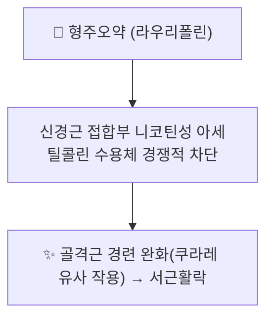

---
aliases:
  - Laurifoline
  - 라우리폴린
tags:
  - 약리성분
  - 알칼로이드
  - 형주오약
---

# 🔬 라우리폴린 (Laurifoline)

> **핵심 3줄 요약 (Key Summary)**:
> - 🌿 기원 본초 & 화학 계열: [[형주오약]](荊州烏藥, 녹나무과 *Lindera aggregata* 뿌리)에 함유된 아포르핀(aporphine)계 4차 암모늄 알칼로이드. [[코클라우린]]·[[마그노플로린]]과 함께 형주오약의 신경근·혈관 작용 관련 핵심 알칼로이드군을 구성.
> - 🎯 핵심 분자 표적: 신경근 접합부의 니코틴성 아세틸콜린 수용체를 경쟁적으로 차단하는 쿠라레(curare) 유사 작용이 제시됨.
> - 🩺 주요 약리 활성: 골격근 이완(신경근 차단), 항경련 작용이 형주오약의 거풍활락(祛風活絡)·서근활락(舒筋活絡) 효능의 현대적 근거 중 하나로 다뤄짐.
> - ⚠️ 근거 수준: 라우리폴린 단독의 PubChem 표준 화합물 페이지가 확인되지 않아(CAS 7224-61-5로 시약업체 카탈로그에는 등재), 정확한 구조·분자량은 원문 화학성분 논문 확인이 필요합니다. 신경근 차단 기전에 대한 근거도 대부분 형주오약 조추출물 또는 관련 아포르핀 알칼로이드(볼딘 등) 유사체 연구에 기반합니다.

---

## 📌 목차
1. [기본 화학 정보](#1-기본-화학-정보-chemical-identity)
2. [주요 함유 본초 및 천연 기원](#2-주요-함유-본초-및-천연-기원)
3. [분자약리 표적 & 작용 기전](#3-분자약리-표적--작용-기전)
4. [한의학적 연계](#4-한의학적-연계)
5. [출처 및 학술 참고 문헌 (References)](#5-출처-및-학술-참고-문헌-references)

---

## 1. 기본 화학 정보 (Chemical Identity)

| 항목 | 상세 내용 |
| :--- | :--- |
| **CAS 번호** | 7224-61-5 |
| **화학 골격 분류** | 아포르핀(Aporphine)계 4차 암모늄 알칼로이드 |
| **근연 골격 참고** | 아포르핀(Aporphine) 모핵 — [PubChem CID 114911](https://pubchem.ncbi.nlm.nih.gov/compound/Aporphine) |

---

## 2. 주요 함유 본초 및 천연 기원 (Botanical Sources & Content)

| 함유 본초 | 기원 식물학적 명칭 | 주요 함유 부위 | 한의학적 귀경 및 약효 특성 |
| :--- | :--- | :--- | :--- |
| [[형주오약]] (荊州烏藥) | 녹나무과 / *Lindera aggregata* | 뿌리 | 폐·비·신·방광경 귀경, 행기지통(行氣止痛)·온신산한(溫腎散寒)·거풍활락(祛風活絡) |

---

## 3. 분자약리 표적 & 작용 기전

* [[형주오약]] 노트에 기술된 바와 같이, 라우리폴린은 신경근 접합부의 니코틴성 아세틸콜린 수용체를 경쟁적으로 차단하여 골격근 경련을 완화하는 쿠라레 유사 작용에 관여하는 것으로 제시됩니다.
* [[마그노플로린]]과 함께 $\alpha_1$ 아드레날린 수용체 차단을 통한 말초 혈관 확장·혈압 강하 작용에도 관여하는 것으로 다뤄집니다.

---

## 4. 한의학적 연계

라우리폴린은 [[형주오약]]의 거풍활락·서근활락 효능을 뒷받침하는 알칼로이드 성분 중 하나로, 풍한습(風寒濕)으로 인한 근육 경련·저림, 관절 동통에 활용되는 근거로 제시됩니다.

---

## 5. 출처 및 학술 참고 문헌 (References)

1. **Traditional uses, phytochemistry, pharmacology, processing methods and quality control of Lindera aggregata (Sims) Kosterm: A critical review**. PMID: [37499843](https://pubmed.ncbi.nlm.nih.gov/37499843/)
   - **[연구 요약]**: 형주오약(Lindera aggregata)의 전통 활용·화학성분(라우리폴린 포함)·약리 활성을 종합한 비판적 리뷰.
2. **[Chemical constituents of Lindera aggregata and their bioactivities: a review]**. PMID: [38114168](https://pubmed.ncbi.nlm.nih.gov/38114168/)
   - **[연구 요약]**: 형주오약의 화학성분 및 생물활성을 정리한 리뷰.
3. Lindera aggregata (Sims) Kosterm: a systematic review — *MaxAPress*. [https://www.maxapress.com/article/doi/10.48130/MPB-2023-0011](https://www.maxapress.com/article/doi/10.48130/MPB-2023-0011)
   - **[참고]**: 형주오약의 전통 응용·화학·약리·품질관리 체계적 리뷰.
