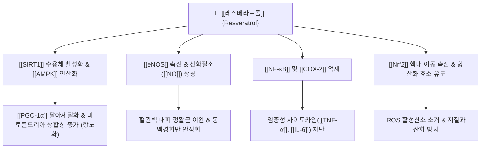

---
aliases:
  - 레스베라트롤
  - Resveratrol
  - 트랜스레스베라트롤
  - trans-Resveratrol
tags:
  - 약리성분
  - 폴리페놀
  - 스틸벤
  - 항노화
  - 항산화
  - SIRT1
  - 심혈관보호
  - 항염증
---
# 💊 [[레스베라트롤]] (Resveratrol, trans-3,5,4'-trihydroxystilbene)

> **핵심 요약 (Key Summary)**:
> 마디풀과 [[호장근]](*Reynoutria japonica*), 포도 껍질, 베리류에 고농도로 함유된 천연 폴리페놀 스틸벤계(Stilbene) 파이토알렉신.
> [[SIRT1]](Sirtuin 1) 및 [[AMPK]] 경로 활성화를 통한 미토콘드리아 생합성 촉진, [[eNOS]] 발현 유도로 혈관내피 이완, [[NF-κB]] 억제에 따른 항염증·항산화 및 세포 수명 연장.
> 한의학의 활혈거어(活血祛瘀), 청열해서, 이습퇴황 효능과 부합하여 심혈관 질환, 대사증후군, 당뇨병성 합병증, 만성 퇴행성 관절염 관리에 광범위하게 응용.

---

## 1. 기본 화학 및 물리화학적 특성

| 항목 | 상세 내용 |
| :--- | :--- |
| **일반명 (Generic)** | [[레스베라트롤]] (Resveratrol) |
| **화학명 (IUPAC)** | 5-[(E)-2-(4-hydroxyphenyl)ethenyl]benzene-1,3-diol |
| **기원 본초** | [[호장근]](虎杖根), 포도 덩굴 및 과피(*Vitis vinifera*), 땅콩 피막, 뽕나무 오디 |
| **화학식 / 분자량** | $\text{C}_{14}\text{H}_{12}\text{O}_3$ / 228.24 g/mol |
| **화학적 분류** | 비플라보노이드계 폴리페놀 / 스틸베노이드 (Stilbenoid) |
| **물리화학적 성상** | 백색~미황색 결정성 분말, 물에 난용성(지용성), 에탄올 및 DMSO에 가용, 광(빛) 노출 시 cis형으로 이성화 |

---

## 2. 분자약리 작용 기전 (Mechanism of Action, MoA)

* **SIRT1-AMPK 축 활성화를 통한 항노화 및 대사 개선**:
  * 탈아세틸화 효소인 [[SIRT1]]을 직접 알로스테릭 활성화하고 [[AMPK]]를 인산화하여, 미토콘드리아 전사조절인자인 [[PGC-1α]]를 활성화. 세포 내 에너지 대사를 개선하고 칼로리 제한(Calorie restriction) 유사 수명 연장 효과를 나타냄.
* **혈관 내피세포 보호 및 혈압·미세순환 조절**:
  * 내피세포 일산화질소합성효소([[eNOS]])의 발현 및 활성을 증가시켜 [[NO]] 방출을 유도, 혈관을 확장하고 혈소판 응집을 차단하여 동맥경화와 허혈성 뇌심장 질환을 예방.
* **항염증 및 전사인자 억제**:
  * IκB 키나아제(IKK) 활성을 억제하여 [[NF-κB]] 신호전달을 차단, [[COX-2]], [[iNOS]], [[TNF-α]] 생성을 억제하여 관절염 및 혈관 내막 염증을 경감.
* **항산화 및 미토콘드리아 자가포식(Autophagy) 유도**:
  * 활성산소(ROS)를 직접 소거할 뿐 아니라 [[Nrf2]]를 매개로 체내 항산화 효소(SOD, Catalase, GPx)의 합성을 촉진하고 손상된 미토콘드리아의 미토파지(Mitophagy)를 유도.

---

## 3. 주요 적응증 및 임상 응용

* **심혈관 질환 및 동맥경화증 (French Paradox의 핵심)**:
  * 관상동맥 질환, 고지혈증, 동맥경직도 개선 및 혈소판 응집 방지.
* **제2형 당뇨병 및 인슐린 저항성 대사증후군**:
  * 근육 및 지방세포의 GLUT4 당수송체 발현 촉진, 간 내 포도당 생성 억제 및 인슐린 감수성 개선.
* **퇴행성 관절염 및 만성 염증성 질환**:
  * 관절 연골세포의 세포사멸 억제 및 활막 염증 완화.
* **인지기능 저하 및 신경퇴행성 질환 예방**:
  * 뇌혈류 개선 및 알츠하이머병 모델에서 베타-아밀로이드 침착 억제.

---

## 4. 기원 본초 및 한의학 연계

* **대표 기원 본초**:
  * [[호장근]](虎杖根, *Reynoutria japonica*): 활혈정통, 청열이습, 해독소옹.
  * 호장근은 한의학에서 어혈과 담습을 동시에 치료하는 핵심 본초이며, 식물계에서 레스베라트롤 및 그 배당체인 폴리다틴(Polydatin) 함량이 가장 높은 약재임.
* **본초 배합 특성**:
  * 레스베라트롤의 활혈 및 항염 작용은 호장근의 어혈성 관절통(비통), 황달, 타박상 및 암종(종괴) 치료 효능의 현대 분자약리학적 토대가 됨.
* **생체이용률과 파이토케미컬 시너지**:
  * 레스베라트롤은 단독 섭취 시 간에서의 빠른 글루쿠론산 포합 대사(Phase II)로 경구 생체이용률이 낮으나, 한약 복합 탕전 시 병용되는 플라보노이드(예: [[케르세틴]], 피페린)가 대사를 억제하여 생체이용률을 극대화함.

---

## 5. 부작용, 상호작용 및 복용 주의사항

* **항응고제/항혈소판제 병용 주의**:
  * 아스피린, 클로피도그렐, 와파린 등과 병용 시 혈소판 응집 억제 시너지로 출혈 위험 증가 가능.
* **에스트로겐 수용체 조절(Phytoestrogen 특성)**:
  * 고용량 복용 시 약한 식물성 에스트로겐 작용을 나타낼 수 있으므로, 에스트로겐 민감성 유방암 또는 자궁내막증 환자는 주의.
* **소화기 가벼운 이상반응**:
  * 하루 1~2g 이상의 초고용량 복용 시 일시적 오심, 설사, 복통 등 위장관 불쾌감 발생 가능.

---

## 6. 출처 및 학술 참고 문헌 (References)

* Baur, J. A., et al. (2006). Resveratrol improves health and survival of mice on a high-calorie diet. *Nature*, 444(7117), 337-342.
  * `[연구 요약]` 고지방식이를 섭취한 마우스 모델에서 레스베라트롤 투여가 SIRT1/AMPK 경로 활성화를 통해 생존율을 개선하고 미토콘드리아 기능을 향상시킴을 규명한 기념비적 연구.
* Weiskirchen, S., & Weiskirchen, R. (2016). Resveratrol: How Much Wine Do You Have to Drink to Stay Healthy? *Advances in Nutrition*, 7(4), 706-718.
  * `[연구 요약]` 레스베라트롤의 분자생물학적 표적, 약동학적 대사 특성 및 심혈관 보호 기전을 종합 정리한 종설.
* Berman, A. Y., et al. (2017). The therapeutic potential of resveratrol: a review of clinical trials. *npj Precision Oncology*, 1, 35.
  * `[연구 요약]` 레스베라트롤의 인체 임상시험 결과들을 분석하여 당뇨, 심혈관 및 신경질환에서의 효능과 안전성 프로파일을 평가.
