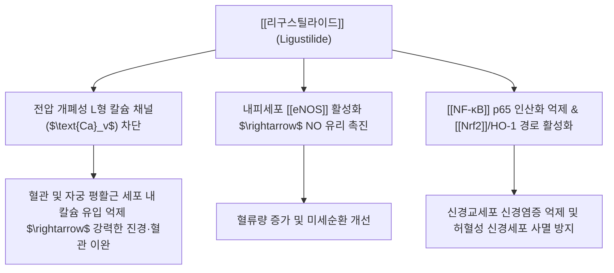

---
aliases:
  - 리구스틸라이드
  - Ligustilide
  - Z-리구스틸라이드
tags:
  - 약리성분
  - 프탈라이드
  - 당귀
  - 천궁
  - 혈관확장
  - 진경
---
# 💊 [[리구스틸라이드]] (Ligustilide, Z-Ligustilide)

> **핵심 3줄 요약 (Key Summary)**:
> - 🌿 기원 본초 & 화학 계열: 미나리과 [[당귀]]·[[천궁]] 뿌리 정유에 함유된 알킬프탈라이드(Alkylphthalide) 계열 지표 성분.
> - 🎯 핵심 분자 표적 & 조절 경로: 전압 개폐성 L형 칼슘 채널 차단, 내피세포 [[eNOS]] 활성화, [[NF-κB]] 인산화 억제 및 [[Nrf2]]/HO-1 경로 활성화.
> - 🩺 주요 약리 활성 & 질환 치료 기전: 뇌허혈(중풍) 및 혈관성 치매 개선, 원발성 월경곤란증(생리통) 완화, 동맥경화 진행 억제 등 활혈(活血)·진경(鎭痙) 효능의 핵심 분자 매개체.
> - ⚠️ 독성·생체이용률 한계 & 상호작용: 빛·열·산소에 민감하여 쉽게 이성질화·이합체화되는 물리적 불안정성, 강력한 항혈소판 작용으로 아스피린·와파린 병용 시 출혈 경향성 주의.

---

## 📌 목차
1. [기본 화학 정보 & 분자 구조식 (Chemical Identity)](#1-기본-화학-정보--분자-구조식-chemical-identity)
2. [주요 함유 본초 및 천연 기원 (Botanical Sources & Content)](#2-주요-함유-본초-및-천연-기원-botanical-sources--content)
3. [분자약리 작용 기전 (Mechanism of Action, MoA)](#3-분자약리-작용-기전-mechanism-of-action-moa)
4. [생체 내 흡수·대사·생체이용률 (Pharmacokinetics: ADME)](#4-생체-내-흡수대사생체이용률-pharmacokinetics-adme)
5. [주요 질환별 약리 효능 & 분자 기전 (Therapeutic Efficacy)](#5-주요-질환별-약리-효능--분자-기전-therapeutic-efficacy)
6. [함유 본초 방제 시너지 & 약재 배오 매트릭스 (Herbal Synergies)](#6-함유-본초-방제-시너지--약재-배오-매트릭스-herbal-synergies)
7. [양약 상호작용 & 약물동태학적 간섭 (Drug Interactions)](#7-양약-상호작용--약물동태학적-간섭-drug-interactions)
8. [💡 사용자 진료실 핵심 필기 & 임상 응용 팁 (Melt-In & High-Yield)](#8--사용자-진료실-핵심-필기--임상-응용-팁-melt-in--high-yield)
9. [출처 및 학술 참고 문헌 (References)](#9-출처-및-학술-참고-문헌-references)

---

## 1. 기본 화학 정보 & 분자 구조식 (Chemical Identity)

> [!abstract]+ 🧪 3D 약리 분자 구조 (Interactive 3D Viewer)
> <iframe src="https://molecule-viewer-rho.vercel.app/?cid=442042" style="width: 100%; height: 600px; border: none; border-radius: 12px; box-shadow: 0 4px 20px rgba(0,0,0,0.15);" allowfullscreen></iframe>

| 항목 | 상세 내용 |
| :--- | :--- |
| **일반명 (Generic)** | Ligustilide, Z-Ligustilide |
| **화학명 (IUPAC)** | (3Z)-3-butylidene-4,5-dihydro-3H-2-benzofuran-1-one |
| **PubChem CID** | [442042](https://pubchem.ncbi.nlm.nih.gov/compound/442042) |
| **기원 본초** | 미나리과 [[당귀]](*Angelica sinensis* / *A. gigas*), [[천궁]](*Ligusticum chuanxiong*)의 뿌리 정유 |
| **화학식 / 분자량** | $\text{C}_{12}\text{H}_{14}\text{O}_2$ / 190.24 g/mol |
| **화학적 분류** | 알킬프탈라이드 (Alkylphthalide derivative) |
| **물리화학적 성상** | 담황색의 특이한 방향성 유상 액체, 지용성, 빛·열·산소에 민감하여 쉽게 이성질화(E-체) 및 이합체화 |

---

## 2. 주요 함유 본초 및 천연 기원 (Botanical Sources & Content)

| 함유 본초 (한글/한자) | 기원 식물학적 명칭 (과명 / 학명) | 주요 함유 부위 | 한의학적 귀경 및 약효 특성 |
| :--- | :--- | :--- | :--- |
| [[당귀]] (當歸) | 미나리과 / *Angelica sinensis* (*A. gigas*) | 뿌리 정유 | 보혈(補血)·활혈(活血)·조경지통(調經止痛) |
| [[천궁]] (川芎) | 미나리과 / *Ligusticum chuanxiong* | 뿌리줄기 정유 | 활혈행기(活血行氣)·거풍지통(祛風止痛) |

---

## 3. 분자약리 작용 기전 (Mechanism of Action, MoA)

* **평활근 이완 및 진경 기전**:
  * 세포막 칼슘 채널 및 소포체 칼슘 분비를 이중으로 차단하여 혈관 평활근 긴장 완화 및 자궁 수축 억제(월경통 완화).
* **뇌혈관 및 신경 보호 작용**:
  * 혈액뇌장벽(BBB)을 신속히 통과하여 대뇌 미세혈관을 확장하고, 뇌허혈 재관류 손상 모델에서 미토콘드리아 카스파제-3 활성화를 억제하여 신경세포 보호.
* **항혈전 및 혈소판 응집 억제**:
  * 트롬복산 $\text{TXA}_2$ 합성을 억제하고 혈관내피 프로스타사이클린($\text{PGI}_2$) 생성을 유지하여 혈전 형성 차단.

---

## 4. 생체 내 흡수·대사·생체이용률 (Pharmacokinetics: ADME)

* **물리적 불안전성 및 이성질화**:
  * 리구스틸라이드는 옥외 노출, 고온, 산소 접촉 시 빠르게 산화 및 중합되어 세디아놀라이드(Sedanenolide) 등으로 전환되므로 당귀·천궁 엑기스는 저온 차광 보관이 필수적이며, 이는 체내 대사 안정성에도 영향을 미칠 수 있음.
  * 랫드 대상 약동학·대사 연구가 보고되어 있으며(Z-ligustilide 약동학·약리학 총설, PMID: [32135035](https://pubmed.ncbi.nlm.nih.gov/32135035/)), 휘발성·지용성 정유 성분 특성상 흡수 및 소실이 비교적 빠른 것으로 알려져 있음.

---

## 5. 주요 질환별 약리 효능 & 분자 기전 (Therapeutic Efficacy)

### 주요 약리학적 효능 & 중추/혈관 보호

* **뇌허혈(중풍) 및 혈관성 치매 개선**:
  * 뇌혈류량(CBF) 증가 및 뇌부종 완화, 인지 기능 회복.
* **원발성 월경곤란증(생리통) 완화**:
  * 비정상적인 자궁 과수축과 허혈성 골반통 해소.
* **동맥경화 및 항염증**:
  * 혈관내피세포 부착분자(VCAM-1) 발현 억제를 통한 죽상동맥경화 진행 차단.

---

## 6. 함유 본초 방제 시너지 & 약재 배오 매트릭스 (Herbal Synergies)

| 함유 본초 / 방제 | 공존 유효 성분군 | 분자약리 시너지 기전 | 전통 한의학적 효능 연계 |
| :--- | :--- | :--- | :--- |
| [[사물탕]] ([[당귀]]+[[천궁]]+[[작약]]+[[숙지황]]) | 페루릭산, 리구스틸라이드 | 자궁·말초 혈류 개선 상가 효과 | 보혈조경(補血調經), 월경불순 |
| [[궁귀탕]] ([[천궁]]+[[당귀]]) | 리구스틸라이드, 페루릭산 | 진경·혈관 이완 상승 | 활혈행기, 산후 어혈복통 |
| [[혈부축어탕]] ([[당귀]]+[[천궁]]+[[도인]]+[[홍화]]) | 리구스틸라이드, 하이드록시사플라워 옐로우 | 항혈전·미세순환 개선 다표적 시너지 | 흉중 어혈 정체 개선 |
| [[귀비탕]] ([[당귀]] 포함) | 리구스틸라이드 등 당귀 정유 성분 | 보혈 기전을 통한 심비양허(心脾兩虛) 개선 | 건망(健忘)·불면·심계 |
| [[당귀수산]] ([[당귀]]+[[천궁]] 포함) | 리구스틸라이드, 페루릭산 | 활혈거어 상가 효과 | 타박상·어혈성 동통 |

---

## 7. 양약 상호작용 & 약물동태학적 간섭 (Drug Interactions)

* **항혈소판·항응고제 병용 시 출혈 위험**:
  * 강력한 항혈소판 작용(트롬복산 TXA2 합성 억제)으로 인해 아스피린, 와파린 등 항응고·항혈소판제 병용 환자에서 출혈 경향성 증가 주의.
* **기타 CYP450 관련 사항**:
  * 사람 대상의 구체적 CYP 효소 상호작용 임상 데이터는 확인되지 않았으며, 당귀·천궁을 활혈거어 계열 다른 정유 성분과 병용 시에도 항응고제와의 상가적 출혈 위험을 보수적으로 고려할 필요가 있음.

---

## 8. 💡 사용자 진료실 핵심 필기 & 임상 응용 팁 (Melt-In & High-Yield)

* 현재 별도로 기록된 원장님 임상 필기가 없습니다.

---

## 9. 출처 및 학술 참고 문헌 (References)
* Kuang X, et al. Neuroprotective role of Z-ligustilide against stroke: A review. *Phytomedicine*. 2014;21(5):787-794.
  * `[연구 요약]`: Z-리구스틸라이드의 뇌허혈성 손상 보호, 항염증, 혈액뇌장벽 통과 특성 및 신경재생 분자 기전 분석.
* Du J, et al. Ligustilide attenuates pain behaviors in a rat model of dysmenorrhea. *Planta Med*. 2006;72(10):888-892.
  * `[연구 요약]`: 리구스틸라이드의 자궁 평활근 이완 및 원발성 생리통 통증 완화 효능 규명.
* Chen Z, et al. Z-ligustilide: A review of its pharmacokinetics and pharmacology. *Phytotherapy Research*. 2020. PMID: [32135035](https://pubmed.ncbi.nlm.nih.gov/32135035/)
  * `[연구 요약]`: Z-리구스틸라이드의 흡수·분포·대사·배설(ADME) 특성과 약리학적 효능을 종합 정리한 리뷰.
