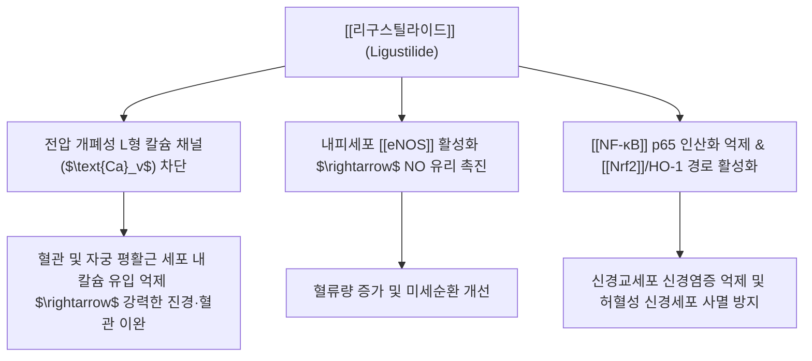

---
aliases:
  - 리구스틸라이드
  - Ligustilide
  - Z-리구스틸라이드
tags:
  - 약리성분
  - 프탈라이드
  - 당귀
  - 천궁
  - 혈관확장
  - 진경
---
# 💊 [[리구스틸라이드]] (Ligustilide, Z-Ligustilide)

> **핵심 요약 (Key Summary)일반명 (Generic)화학명 (IUPAC)** | (3Z)-3-butylidene-4,5-dihydro-3H-2-benzofuran-1-one |
| **기원 본초** | 미나리과 [[당귀]](*Angelica sinensis* / *A. gigas*), [[천궁]](*Ligusticum chuanxiong*)의 뿌리 정유 |
| **화학식 / 분자량** | $\text{C}_{12}\text{H}_{14}\text{O}_2$ / 190.24 g/mol |
| **화학적 분류** | 알킬프탈라이드 (Alkylphthalide derivative) |
| **물리화학적 성상** | 담황색의 특이한 방향성 유상 액체, 지용성, 빛·열·산소에 민감하여 쉽게 이성질화(E-체) 및 이합체화 |

---

## 1. 기본 화학 정보 & 분자 구조식 (Chemical Identity)

> [!abstract]+ 🧪 3D 약리 분자 구조 (Interactive 3D Viewer)
> <iframe src="https://molecule-viewer-rho.vercel.app/?cid=442042" style="width: 100%; height: 600px; border: none; border-radius: 12px; box-shadow: 0 4px 20px rgba(0,0,0,0.15);" allowfullscreen></iframe>

## 2. 분자약리 작용 기전 (Mechanism of Action, MoA)

* **평활근 이완 및 진경 기전**:
  * 세포막 칼슘 채널 및 소포체 칼슘 분비를 이중으로 차단하여 혈관 평활근 긴장 완화 및 자궁 수축 억제(월경통 완화).
* **뇌혈관 및 신경 보호 작용**:
  * 혈액뇌장벽(BBB)을 신속히 통과하여 대뇌 미세혈관을 확장하고, 뇌허혈 재관류 손상 모델에서 미토콘드리아 카스파제-3 활성화를 억제하여 신경세포 보호.
* **항혈전 및 혈소판 응집 억제**:
  * 트롬복산 $\text{TXA}_2$ 합성을 억제하고 혈관내피 프로스타사이클린($\text{PGI}_2$) 생성을 유지하여 혈전 형성 차단.

---

## 3. 주요 약리학적 효능 & 중추/혈관 보호

* **뇌허혈(중풍) 및 혈관성 치매 개선**:
  * 뇌혈류량(CBF) 증가 및 뇌부종 완화, 인지 기능 회복.
* **원발성 월경곤란증(생리통) 완화**:
  * 비정상적인 자궁 과수축과 허혈성 골반통 해소.
* **동맥경화 및 항염증**:
  * 혈관내피세포 부착분자(VCAM-1) 발현 억제를 통한 죽상동맥경화 진행 차단.

---

## 4. 기원 본초 및 한의 임상 연계

* **함유 본초**:
  * : 지표 성분으로 보혈(補血)과 활혈(活血), 조경지통(調經止痛)의 핵심 분자 매개체.
  * : 활혈행기(活血行氣), 거풍지통(祛風止痛)의 주역으로 두통 및 두경부 혈류 개선.
* **배합 방제**:
  * [[사물탕]], [[귀비탕]], [[궁귀탕]], [[혈부축어탕]], [[당귀수산]].

---

## 5. 안정성, 대사 및 보관 주의점

* **물리적 불안전성 (보관 주의)**:
  * 리구스틸라이드는 옥외 노출, 고온, 산소 접촉 시 빠르게 산화 및 중합되어 세디아놀라이드(Sedanenolide) 등으로 전환되므로 당귀·천궁 엑기스는 저온 차광 보관 필수.
* **출혈 경향성 주의**:
  * 강력한 항혈소판 작용으로 인해 아스피린, 와파린 병용 환자 출혈 주의.

---

## 6. 출처 및 학술 참고 문헌 (References)
* Kuang X, et al. Neuroprotective role of Z-ligustilide against stroke: A review. *Phytomedicine*. 2014;21(5):787-794.
  * `[연구 요약]`: Z-리구스틸라이드의 뇌허혈성 손상 보호, 항염증, 혈액뇌장벽 통과 특성 및 신경재생 분자 기전 분석.
* Du J, et al. Ligustilide attenuates pain behaviors in a rat model of dysmenorrhea. *Planta Med*. 2006;72(10):888-892.
  * `[연구 요약]`: 리구스틸라이드의 자궁 평활근 이완 및 원발성 생리통 통증 완화 효능 규명.
