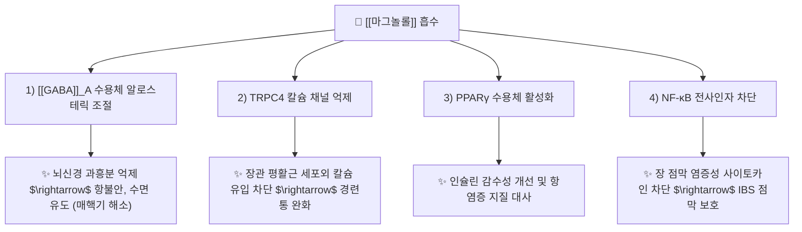

---
aliases:
  - Magnolol
  - 마그놀롤
  - 후박리그난
  - 5,5'-diallyl-2,2'-biphenyldiol
tags:
  - 약리/약리성분
  - 리그난
  - 네오리그난
  - 후박
  - 위장관운동
  - GABA
  - 신경안정
  - 매핵기
---

# 🔬 마그놀롤 (Magnolol, $C_{18}H_{18}O_2$ / 2-(prop-2-enyl)-4-[3-(prop-2-enyl)-4-hydroxyphenyl]phenol)

> **핵심 3줄 요약 (Key Summary)**:
> - 🌿 기원 본초 & 화학 계열: 목련과 방향화습약(芳香化濕藥)인 [[후박]](Magnoliae Cortex)의 핵심 활성 지표 성분으로, 대칭형 비페닐 골격에 알릴기를 지닌 천연 네오리그난(Neolignan).
> - 🎯 핵심 분자 표적 & 조절 경로: [[GABA]]_A 수용체 벤조디아제핀 결합 부위 양성 알로스테릭 조절(중추 신경안정 및 수면 유도), TRPC4 이온 채널 차단을 통한 위장관 평활근 경련 완화, NF-κB 억제 및 PPARγ 활성화.
> - 🩺 주요 약리 활성 & 질환 치료 기전: 소화기 이상 발효 가스 제거 및 장관 운동 조절(행기소적 行氣消積, 복부 팽만·소화불량·IBS 개선), 인후부 신경성 이물감 완화(강역지구 降逆止嘔, [[매핵기]]·신경성 식도염), 항불안 및 진정 작용.
> - ⚠️ 독성·생체이용률 한계 & 상호작용: 지용성이 높아 장관 흡수는 원활하나 간에서 신속한 글루쿠론산 포합 대사를 받음, 중추신경 억제제(수면진정제, 알코올) 병용 시 진정 효과 중첩 주의.

---

## 목차 (Table of Contents)
- [[#1. 기본 화학 정보 & 분자 구조식 (Chemical Identity)|1. 기본 화학 정보 & 분자 구조식 (Chemical Identity)]]
- [[#2. 주요 함유 본초 및 천연 기원 (Botanical Sources & Content)|2. 주요 함유 본초 및 천연 기원 (Botanical Sources & Content)]]
- [[#3. 분자약리 표적 & 신호전달 네트워크 (Molecular Targets)|3. 분자약리 표적 & 신호전달 네트워크 (Molecular Targets)]]
- [[#4. 생체 내 흡수·대사·생체이용률 (Pharmacokinetics: ADME)|4. 생체 내 흡수·대사·생체이용률 (Pharmacokinetics: ADME)]]
- [[#5. 주요 질환별 약리 효능 & 분자 기전 (Therapeutic Efficacy)|5. 주요 질환별 약리 효능 & 분자 기전 (Therapeutic Efficacy)]]
- [[#6. 함유 본초 방제 시너지 & 약재 배오 매트릭스 (Herbal Synergies)|6. 함유 본초 방제 시너지 & 약재 배오 매트릭스 (Herbal Synergies)]]
- [[#7. 양약 상호작용 & 약물동태학적 간섭 (Drug Interactions)|7. 양약 상호작용 & 약물동태학적 간섭 (Drug Interactions)]]
- [[#8. 💡 사용자 진료실 핵심 필기 & 임상 응용 팁 (Melt-In & High-Yield)|8. 💡 사용자 진료실 핵심 필기 & 임상 응용 팁 (Melt-In & High-Yield)]]
- [[#9. 출처 및 학술 참고 문헌 (References)|9. 출처 및 학술 참고 문헌 (References)]]

---

## 1. 기본 화학 정보 & 분자 구조식 (Chemical Identity)

### 1.1 분자 구조식 및 3D 뷰어

> [그림 1] PubChem 마그놀롤(Magnolol) 2D 화학 분자 구조식 (CID: 72300)

> [!abstract]+ 🧪 3D 약리 분자 구조 (Interactive 3D Viewer)
> <iframe src="https://molecule-viewer-rho.vercel.app/?cid=72300" width="100%" height="450px" frameborder="0" allow="webgl" style="border-radius: 8px;"></iframe>

### 1.2 화학적 프로파일
| 항목 | 상세 내용 |
| :--- | :--- |
| **IUPAC 명칭** | 2-(prop-2-enyl)-4-[3-(prop-2-enyl)-4-hydroxyphenyl]phenol |
| **분자식 / 분자량** | $C_{18}H_{18}O_2$ / 266.33 g/mol |
| **PubChem CID** | 72300 |
| **CAS 등록 번호** | 528-43-8 |
| **화학 골격 분류** | 비페닐 네오리그난 (Biphenyl Neolignan) |
| **물리화학적 성상** | 백색~담황색의 결정성 분말, 특유의 향기, 에탄올, 메탄올, 아세톤에 가용, 물에 불용 ($LogP \approx 3.94$) |
| **구조 이성질체 관계** | 비대칭형 위치 이성질체인 **[[호노키올]](Honokiol, CID 72303)**과 함께 후박 내에 약 1:1~2:1의 비율로 공존 |

---

## 2. 주요 함유 본초 및 천연 기원 (Botanical Sources & Content)

> [그림 2] 목련과 후박(Magnolia officinalis)의 수피 및 기원 수목 외형

### 2.1 주요 함유 본초 매트릭스
| 함유 본초 (한글/한자) | 기원 식물학적 명칭 (과명 / 학명) | 주요 함유 약용 부위 | 지표 함량 (%) | 한의학적 귀경 및 약효 특성 |
| :--- | :--- | :--- | :--- | :--- |
| [[후박]] (당후박) | 목련과(Magnoliaceae) / *Magnolia officinalis* | 줄기껍질(수피 樹皮) | **마그놀롤 및 호노키올의 합 2.0% 이상** (우수품은 3~8%) | 비(脾), 위(胃), 폐(肺), 대장(大腸) / 조습소담(燥濕消痰), 하기제만(下氣除滿) |
| [[후박]] (일후박) | 목련과(Magnoliaceae) / *Magnolia obovata* | 수피 | 마그놀롤 1.0~3.0% | 비, 위 / 온중화습, 행기통변 |
| [[목련화]] (신이) | 목련과(Magnoliaceae) / *Magnolia biondii* | 꽃봉오리(화뢰 花蕾) | 마그놀롤 미량 함유 (주성분은 정유 시네올 등) | 폐, 위 / 산풍한, 통비규 |

---

## 3. 분자약리 표적 & 신호전달 네트워크 (Molecular Targets)

### 3.1 GABA_A 수용체 조절과 비진정성 항불안·수면 유도
* **벤조디아제핀 결합 부위 매개 작용**:
  * 마그놀롤은 중추신경계의 $GABA_A$ 수용체 복합체 내 벤조디아제핀 결합 부위에 양성 알로스테릭 조절제(PAM)로 결합하여, GABA에 의한 염화물 이온($Cl^-$) 유입을 증폭시킵니다 (Chen et al., Neuropharmacology 2012).
  * 뇌 변연계(Limbic system)의 과도한 불안 신호를 차단하고 렘수면 및 서파 수면을 유도하여, 매핵기(梅核氣) 환자의 목 이물감과 신경성 불면증을 완화합니다.

### 3.2 TRPC4 칼슘 채널 차단을 통한 위장관 연동 조절
* **위장관 평활근 이완 및 장운동 정상화 (J Ethnopharmacol 2022)**:
  * 마그놀롤은 장관 평활근의 TRPC4(Transient Receptor Potential Canonical 4) 양이온 통로를 직접 억제하여 세포 외 칼슘($Ca^{2+}$) 유입을 차단합니다.
  * 소화관의 비정상적인 경련성 수축을 억제하면서도 장내 가스 정체를 해소하여, 복통·복부 팽만·과민성 대장 증후군(IBS) 증상을 양방향으로 정상화합니다.

---

## 4. 생체 내 흡수·대사·생체이용률 (Pharmacokinetics: ADME)

### 4.1 흡수 (Absorption)
* **신속한 장관 흡수**: 지용성이 매우 우수하여($LogP \approx 3.94$) 소장 점막을 단순 확산으로 쉽게 투과합니다.
* **최고 혈중 농도 시간($T_{max}$)**: 경구 투여 후 약 1~1.5시간 이내에 혈중 최고 농도에 도달합니다.

### 4.2 간 대사 및 포합 반응
* **신속한 제2상 포합 (UGT 글루쿠론산화)**:
  * 간을 통과하면서 장관 및 간의 UDP-glucuronosyltransferase(UGT1A7, UGT1A9)에 의해 페놀성 수산기가 빠르게 모노글루쿠로나이드(Magnolol monoglucuronide)로 포합됩니다.
  * 이로 인해 유리형(Free) 마그놀롤의 생체이용률은 약 5~10% 수준이나, 생성된 포합 대사체 역시 체내 순환을 통해 표적 장기에 도달합니다.

### 4.3 배설 경로
* 주로 담즙을 통해 대변으로 배설되며, 일부 수용성 포합체는 신장을 통해 소변으로 배설됩니다. 소실 반감기($t_{1/2}$)는 약 2~4시간입니다.

---

## 5. 주요 질환별 약리 효능 & 분자 기전 (Therapeutic Efficacy)

### 5.1 기능성 소화불량 및 복부 팽만감 해소 (行氣消積)
* 위 배출능(Gastric emptying)을 촉진하고 위장관 가스 팽만을 배출시키며, 위산 과다 분비를 억제하여 속쓰림과 오심, 구토를 완화합니다.
* 장관 내 유해균(Helicobacter pylori 등) 증식을 억제하고 장 점막 상피 장벽의 밀착연접을 보호합니다.

### 5.2 신경성 매핵기(梅核氣) 및 화병(火病) 치료
* 스트레스로 인한 시상하부-뇌하수체-부신(HPA) 축의 과활성을 억제하고 해마의 5-$HT_{1A}$ 세로토닌 수용체 발현을 회복시켜, 우울감과 가슴 답답함, 인후부 이물감을 해소합니다 (Psychosom Med 2019).

### 5.3 신경염증 억제 및 인지기능 보호
* 미세아교세포(Microglia)의 과도한 활성화와 활성산소종(ROS) 생성을 차단하여, 알츠하이머병 환자의 $\beta$-아밀로이드 축적으로 인한 해마 시냅스 손상을 방어합니다.

---

## 6. 함유 본초 방제 시너지 & 약재 배오 매트릭스 (Herbal Synergies)

| 처방 / 배오 조합 | 공존 본초 및 지표 성분 | 분자약리 시너지 기전 | 전통 한의학적 적응증 |
| :--- | :--- | :--- | :--- |
| **[[반하후박탕]]** | [[반하]], [[후박]], [[복령]], [[생강]], [[소엽]] | 마그놀롤의 $GABA_A$ 진정과 소엽의 방향 이기, 반하의 진토 작용이 결합되어 인후 신경 긴장 해소 | 신경성 매핵기(梅核氣), 공황장애, 역류성 식도염 |
| **[[평위산]]** | [[창출]](아트락틸로딘), 후박, [[진피]]([[헤스페리딘]]), 감초 | 창출의 수분 정체 배출과 후박의 장관 평활근 연동 정상화 시너지로 위장관 식적(食積) 배출 | 급만성 위염, 소화불량, 식후 복부 팽만 |
| **[[대승기탕]] / [[소승기탕]]** | [[대황]](센노사이드), [[지실]], 후박 | 대황의 사하 작용과 후박의 장관 가스 하기(下氣) 작용이 결합하여 숙변과 고열을 배출 | 양명병 부실증(腑實證), 중증 변비, 장마비 |
| **[[마황행인자감초탕]] / 오적산** | 후박, [[마황]], [[행인]] | 기관지 평활근 이완과 소화관 이기(理氣)의 상하 균형 | 해수 천식, 외감풍한에 동반된 식체 |

---

## 7. 양약 상호작용 & 약물동태학적 간섭 (Drug Interactions)

### 7.1 병용 주의 약물
| 양약 계열 | 대표 약물 | 상호작용 기전 및 임상 권고사항 |
| :--- | :--- | :--- |
| **중추신경 억제제 / 수면제** | [[알프라졸람]], [[로라제팜]], [[졸피뎀]] | $GABA_A$ 수용체 작용 중첩으로 과도한 졸림, 어지럼, 진정 작용 유발 가능 (병용 시 저용량 관찰) |
| **위장관 운동조절제** | [[모사프리드]], [[트리메부틴]] | 위장관 운동 촉진 시너지 발휘 (공식 병용 시 긍정적 효과) |
| **항응고제** | 와파린, [[아스피린]] | 마그놀롤의 약한 혈소판 응집 억제 작용으로 고용량 투여 시 출혈 경향 모니터링 |

---

## 8. 💡 사용자 진료실 핵심 필기 & 임상 응용 팁 (Melt-In & High-Yield)

### 8.1 신경성 소화기 질환(Brain-Gut Axis) 환자 진료실 핵심 포인트
* **신경과 위장은 하나(腦-腸 軸)**:
  * "스트레스만 받으면 체하고, 헛배가 부르고 트림이 나오며 목에 가래가 낀 것처럼 답답하다"는 환자는 위장관 약물(PPI, 제산제)만으로는 결코 호전되지 않습니다.
  * 이때 후박의 **마그놀롤은 장관 평활근(TRPC4)과 뇌신경계($GABA_A$)를 동시에 타겟팅**하여, 스트레스로 굳어진 위장과 불안한 자율신경을 동시에 이완시키는 독보적인 한방 신경-소화기 조절 성분입니다.

### 8.2 후박의 생강즙 자(炙) 가공 노하우
* 후박은 본래 맵고 자극적인 맛이 있어 목을 자극(소열 騷咽)할 수 있습니다.
* 한의 임상에서는 생강즙으로 축여 볶는 **생강자(生薑炙) 후박**을 사용하여 위점막 자극성을 완화하고 행기건비(行氣健脾) 효능을 극대화합니다.

---

## 9. 출처 및 학술 참고 문헌 (References)

### 9.1 학술 논문 및 임상 연구
1. **Chen CR, Zhou XZ, Luo YJ, et al.** (2012). *Magnolol, a major bioactive constituent of the bark of Magnolia officinalis, induces sleep via the benzodiazepine site of GABA(A) receptor in mice.* **Neuropharmacology**, 63(6), 1191-1199. [PMID: 22771461](https://pubmed.ncbi.nlm.nih.gov/22771461/) / [DOI: 10.1016/j.neuropharm.2012.06.031](https://doi.org/10.1016/j.neuropharm.2012.06.031)
   - `[연구 요약]` 후박의 주요 활성 성분인 마그놀롤이 $GABA_A$ 수용체의 벤조디아제핀 결합 부위에 작용하여 비자극적으로 수면을 유도하고 불안을 완화함을 규명한 랜드마크 신경약리학 연구.
2. **Li X, et al.** (2022). *Magnolol and honokiol target TRPC4 to regulate extracellular calcium influx and relax intestinal smooth muscle.* **Journal of Ethnopharmacology**, 290, 115105. [PMID: 35157953](https://pubmed.ncbi.nlm.nih.gov/35157953/) / [DOI: 10.1016/j.jep.2022.115105](https://doi.org/10.1016/j.jep.2022.115105)
   - `[연구 요약]` 마그놀롤과 호노키올이 TRPC4 이온 통로를 억제하여 세포 외 칼슘 유입을 차단함으로써 장관 평활근의 과수축을 이완시키는 분자 소화기 약리 기전을 증명한 논문.
3. **Zhang J, et al.** (2021). *The rich pharmacological activities of Magnolia officinalis and secondary effects based on significant intestinal contributions.* **Journal of Ethnopharmacology**, 281, 114524. [PMID: 34400262](https://pubmed.ncbi.nlm.nih.gov/34400262/) / [DOI: 10.1016/j.jep.2021.114524](https://doi.org/10.1016/j.jep.2021.114524)
   - `[연구 요약]` 후박과 마그놀롤의 장관 점막 상피 장벽 보호, 장-뇌 축(Gut-Brain axis) 조절 및 전신 항염증·대사 개선 효능을 총망라한 종합 종설.

### 9.2 규제 기관 및 공인 데이터베이스
* **대한민국약전 (KP 12개정)**: 후박(Magnoliae Cortex) 규격 (마그놀롤 및 호노키올의 합 2.0% 이상)
* **PubChem Compound Summary**: CID 72300 (Magnolol)
