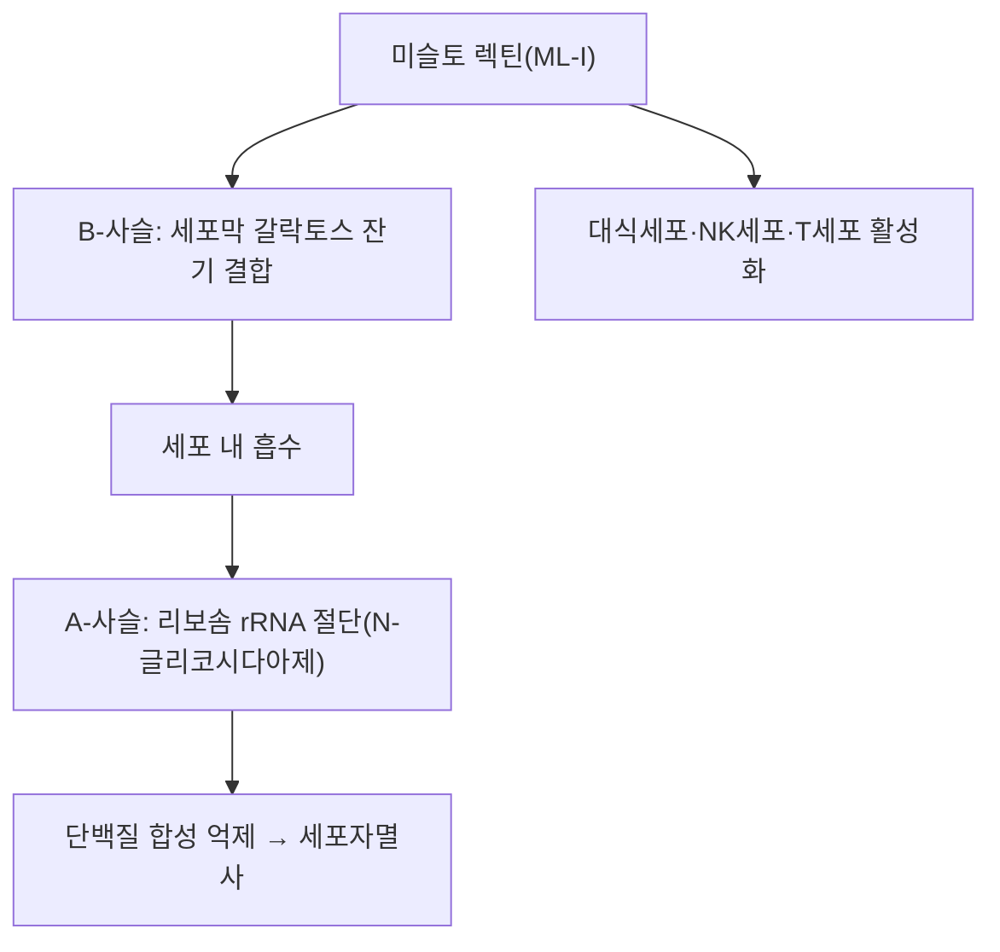

---
aliases:
  - Mistletoe lectin
  - Viscumin
  - ML-I
  - 미슬토 렉틴
tags:
  - 약리성분
  - 단백질
  - 곡기생
---

# 🔬 미슬토 렉틴 (Mistletoe Lectin)

> **핵심 3줄 요약 (Key Summary)**:
> - 🌿 기원 본초 & 화학 계열: [[곡기생]](槲寄生, 겨우살이과 참나무겨우살이 *Taxillus chinensis* 등 겨우살이류 기생식물)에 함유된 리보솜 불활성화 단백질(Ribosome-Inactivating Protein, RIP) 계열의 렉틴(당결합 단백질). 서양겨우살이(*Viscum album*) 유래 렉틴 I(ML-I, viscumin)이 가장 널리 연구됨.
> - 🎯 핵심 분자 표적: 세포 표면 갈락토스 잔기에 결합하는 B-사슬과, 리보솜 rRNA를 절단하여 단백질 합성을 억제하는 A-사슬(N-글리코시다아제 활성)로 구성된 2사슬 구조. 세포자멸사 유도 및 면역세포(대식세포·NK세포·T세포) 활성화에 관여.
> - 🩺 주요 약리 활성: 항종양(암세포 세포자멸사 유도), 면역조절(비특이적 면역 자극)이 유럽에서 보조 항암요법(미슬토 요법)으로 임상 활용되며, 곡기생의 거풍습(祛風濕)·보간신(補肝腎)·안태(安胎) 효능과는 별개로 현대 종양학에서 독자적으로 연구되는 성분.
> - ⚠️ 근거 수준: 유럽에서 표준화 미슬토 추출물이 보조 항암요법으로 처방되지만, 대규모 무작위대조시험에 기반한 표준치료 대체 근거는 부족하며 평가가 엇갈립니다. 렉틴은 단백질로 PubChem 소분자 데이터베이스의 대상이 아닙니다.

---

## 📌 목차
1. [기본 정보](#1-기본-정보)
2. [주요 함유 본초 및 천연 기원](#2-주요-함유-본초-및-천연-기원)
3. [분자약리 표적 & 작용 기전](#3-분자약리-표적--작용-기전)
4. [한의학적 연계](#4-한의학적-연계)
5. [출처 및 학술 참고 문헌 (References)](#5-출처-및-학술-참고-문헌-references)

---

## 1. 기본 정보

| 항목 | 상세 내용 |
| :--- | :--- |
| **분류** | 리보솜 불활성화 단백질(Type II RIP) — 렉틴(당결합 단백질) |
| **구조** | A-사슬(N-글리코시다아제, 리보솜 rRNA 절단) + B-사슬(갈락토스 결합 렉틴 도메인)의 이황화결합 이중구조 |
| **대표 아형** | ML-I(viscumin), ML-II, ML-III (서양겨우살이 *Viscum album* 기준) |

---

## 2. 주요 함유 본초 및 천연 기원 (Botanical Sources & Content)

| 함유 본초 | 기원 식물학적 명칭 | 주요 함유 부위 | 한의학적 귀경 및 약효 특성 |
| :--- | :--- | :--- | :--- |
| [[곡기생]] (槲寄生) | 겨우살이과 / *Taxillus chinensis* 등 (겨우살이류) | 줄기·잎(기생 부위) | 간·신경 귀경, 거풍습(祛風濕)·보간신(補肝腎)·강근골(强筋骨)·안태(安胎) |

---

## 3. 분자약리 표적 & 작용 기전

* **세포독성 기전**: B-사슬이 표적세포 표면의 갈락토스 잔기에 결합해 세포 내로 흡수되면, A-사슬이 리보솜의 28S rRNA를 특이적으로 절단하여 단백질 합성을 차단, 세포자멸사를 유도합니다.
* **면역조절**: 저농도에서는 대식세포·자연살해세포(NK세포)·T세포를 활성화시켜 사이토카인(IL-1, IL-6, TNF-α 등) 분비를 촉진하는 면역자극 작용이 보고됩니다.

---

## 4. 한의학적 연계

미슬토 렉틴은 [[곡기생]]의 서양 겨우살이류 특유의 현대 종양학적 성분으로, 전통 한의학의 거풍습·보간신 효능과는 별개의 연구 축입니다. 다만 곡기생이 간신(肝腎)을 보하고 풍습비통(風濕痺痛)·태동불안(胎動不安)에 활용되어 온 것과 함께, 현대에는 서양겨우살이 추출물의 항종양·면역조절 성분으로서 독자적으로 다뤄지고 있습니다.

---

## 5. 출처 및 학술 참고 문헌 (References)

1. **Difficulties and Perspectives of Immunomodulatory Therapy with Mistletoe Lectins and Standardized Mistletoe Extracts in Evidence-Based Medicine**. PMID: [19939951](https://pubmed.ncbi.nlm.nih.gov/19939951/)
   - **[연구 요약]**: 미슬토 렉틴 및 표준화 미슬토 추출물의 면역조절 치료에 대한 근거중심의학적 검토.
2. **Mistletoe lectins: From interconnecting proteins to potential tumour inhibiting agents**. *ScienceDirect*. [https://www.sciencedirect.com/science/article/pii/S266703132100021X](https://www.sciencedirect.com/science/article/pii/S266703132100021X)
   - **[연구 요약]**: 미슬토 렉틴의 구조·작용 기전 및 항종양 잠재력을 정리한 리뷰.
3. **Down-regulation of some miRNAs by degrading their precursors contributes to anti-cancer effect of mistletoe lectin-I**. *PMC*. [https://pmc.ncbi.nlm.nih.gov/articles/PMC3031057/](https://pmc.ncbi.nlm.nih.gov/articles/PMC3031057/)
   - **[연구 요약]**: 미슬토 렉틴-I의 miRNA 조절을 통한 항암 기전을 규명한 연구.
