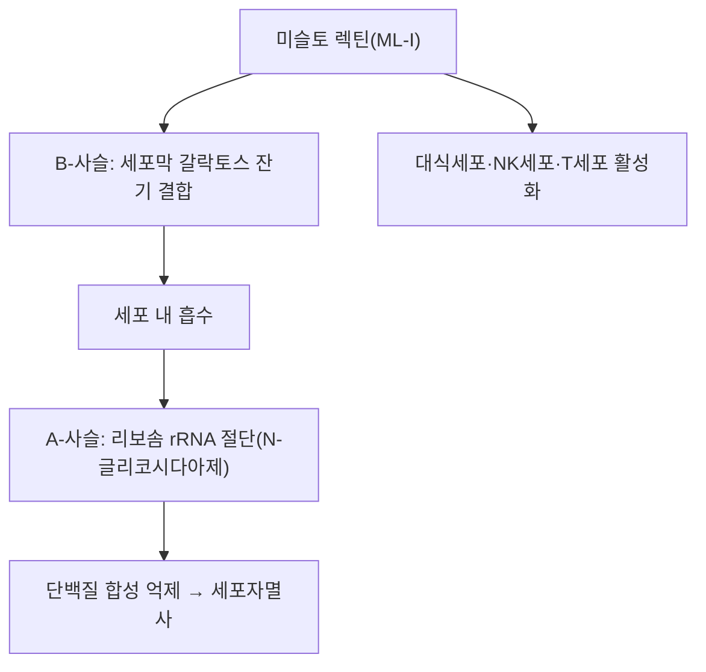

---
aliases:
  - Mistletoe lectin
  - Viscumin
  - ML-I
  - 미슬토 렉틴
tags:
  - 약리성분
  - 단백질
  - 곡기생
---

# 🔬 미슬토 렉틴 (Mistletoe Lectin)

> **핵심 3줄 요약 (Key Summary)**:
> - 🌿 기원 본초 & 화학 계열: [[곡기생]](槲寄生, 겨우살이과 참나무겨우살이 *Taxillus chinensis* 등 겨우살이류 기생식물)에 함유된 리보솜 불활성화 단백질(Ribosome-Inactivating Protein, RIP) 계열의 렉틴(당결합 단백질). 서양겨우살이(*Viscum album*) 유래 렉틴 I(ML-I, viscumin)이 가장 널리 연구됨.
> - 🎯 핵심 분자 표적: 세포 표면 갈락토스 잔기에 결합하는 B-사슬과, 리보솜 rRNA를 절단하여 단백질 합성을 억제하는 A-사슬(N-글리코시다아제 활성)로 구성된 2사슬 구조. 세포자멸사 유도 및 면역세포(대식세포·NK세포·T세포) 활성화에 관여.
> - 🩺 주요 약리 활성: 항종양(암세포 세포자멸사 유도), 면역조절(비특이적 면역 자극)이 유럽에서 보조 항암요법(미슬토 요법)으로 임상 활용되며, 곡기생의 거풍습(祛風濕)·보간신(補肝腎)·안태(安胎) 효능과는 별개로 현대 종양학에서 독자적으로 연구되는 성분.
> - ⚠️ 근거 수준: 유럽에서 표준화 미슬토 추출물이 보조 항암요법으로 처방되지만, 대규모 무작위대조시험에 기반한 표준치료 대체 근거는 부족하며 평가가 엇갈립니다. 렉틴은 단백질로 PubChem 소분자 데이터베이스의 대상이 아닙니다. 주사제(피하·정맥)가 임상 근거의 대상이며, 정맥 투여 시 일과성 간효소 상승·발열·인플루엔자 유사 증상이 보고되었습니다(§4·§7).

---

## 📌 목차
1. [기본 화학 정보 & 분자 구조식 (Chemical Identity)](#1-기본-화학-정보--분자-구조식-chemical-identity)
2. [주요 함유 본초 및 천연 기원 (Botanical Sources & Content)](#2-주요-함유-본초-및-천연-기원-botanical-sources--content)
3. [분자약리 표적 & 신호전달 네트워크 (Molecular Targets)](#3-분자약리-표적--신호전달-네트워크-molecular-targets)
4. [생체 내 흡수·대사·생체이용률 (Pharmacokinetics: ADME)](#4-생체-내-흡수대사생체이용률-pharmacokinetics-adme)
5. [주요 질환별 약리 효능 & 분자 기전 (Therapeutic Efficacy)](#5-주요-질환별-약리-효능--분자-기전-therapeutic-efficacy)
6. [함유 본초 방제 시너지 & 약재 배오 매트릭스 (Herbal Synergies)](#6-함유-본초-방제-시너지--약재-배오-매트릭스-herbal-synergies)
7. [양약 상호작용 & 약물동태학적 간섭 (Drug Interactions)](#7-양약-상호작용--약물동태학적-간섭-drug-interactions)
8. [💡 사용자 진료실 핵심 필기 & 임상 응용 팁 (Melt-In & High-Yield)](#8--사용자-진료실-핵심-필기--임상-응용-팁-melt-in--high-yield)
9. [출처 및 학술 참고 문헌 (References)](#9-출처-및-학술-참고-문헌-references)

---

## 1. 기본 화학 정보 & 분자 구조식 (Chemical Identity)

> [!info] 🧪 3D 뷰어 미적용
> 미슬토 렉틴은 약 60 kDa급 단백질로 PubChem 소분자(Compound) 항목이 없어 PubChem CID 기반 3D 뷰어를 삽입하지 않습니다. 단백질 구조는 아래 PDB 항목(RCSB)을 참고하세요.

| 항목 | 상세 내용 |
| :--- | :--- |
| **분류** | 리보솜 불활성화 단백질(Type II RIP) — 렉틴(당결합 단백질) |
| **구조** | A-사슬(N-글리코시다아제, 리보솜 rRNA 절단) + B-사슬(갈락토스 결합 렉틴 도메인)의 이황화결합 이중구조 |
| **대표 아형** | ML-I(viscumin), ML-II, ML-III (서양겨우살이 *Viscum album* 기준) |
| **IUPAC 명칭** | 해당 없음(단백질) |
| **분자식 / 분자량** | 해당 없음(단백질). UniProt [P81446](https://rest.uniprot.org/uniprotkb/P81446) *Beta-galactoside-specific lectin 1*(*Viscum album*) 전구체 서열 564 aa, 62,628 Da (전구체 기준이며 성숙 이종이량체의 분자량과는 다를 수 있음) |
| **PubChem CID** | 해당 없음(단백질) |
| **CAS 등록 번호** | ⚠️ 내용 검토 필요 — 확인하지 못함 |
| **결정 구조 (PDB)** | [1ONK](https://www.rcsb.org/structure/1ONK) ML-I (2.1 Å) · [1PUM](https://www.rcsb.org/structure/1PUM) ML-I + 갈락토스 복합체 (2.3 Å) · [1M2T](https://www.rcsb.org/structure/1M2T) ML-I + AMP 복합체 (1.9 Å) |
| **화학 골격 분류** | 단백질(이황화결합 2사슬 렉틴). Type II RIP |
| **물리화학적 성상** | ⚠️ 내용 검토 필요 — 원문에 기재 없음(단백질이라 열·pH에 따른 변성 가능성이 있으나 전탕액 내 안정성 문헌은 확인하지 못함) |
| **식물 내 생합성 경로** | 원문에 기재 없음 |

* **A-사슬의 작용 부위**: 서양겨우살이 렉틴 A-사슬은 쥐 간 리보솜의 28S rRNA A-4324 위치의 N-글리코시드 결합을 절단해 리보솜을 불활성화합니다(리신 A-사슬과 같은 방식; Endo 1988).
* **B-사슬의 당 결합**: ML-I은 이종이량체이며 B-사슬이 세포막의 갈락토스 말단 당지질·당단백질에 우선 결합합니다. 당 결합 부위는 α1·γ2 하위 도메인 2곳입니다(Mikeska 2005).

---

## 2. 주요 함유 본초 및 천연 기원 (Botanical Sources & Content)

| 함유 본초 | 기원 식물학적 명칭 | 주요 함유 부위 | 한의학적 귀경 및 약효 특성 |
| :--- | :--- | :--- | :--- |
| [[곡기생]] (槲寄生) | 겨우살이과 / *Taxillus chinensis* 등 (겨우살이류) | 줄기·잎(기생 부위) | 간·신경 귀경, 거풍습(祛風濕)·보간신(補肝腎)·강근골(强筋骨)·안태(安胎) |

* ⚠️ 내용 검토 필요: 볼트 [[곡기생]] 노트는 곡기생의 기원을 *Viscum album* var. *coloratum*(붉은열매겨우살이)으로, *Taxillus chinensis*는 [[상기생]](뽕나무겨우살이)로 구분해 기재합니다. 위 표의 기원 표기(*Taxillus chinensis*)와 다르므로 어느 종의 렉틴 연구를 근거로 삼는지 구분이 필요합니다. 아래 근거 연구는 서양겨우살이(*V. album*), 한국겨우살이(*V. album* var. *coloratum*), 중국 겨우살이(CM-1) 유래 렉틴입니다.
* 렉틴 함량(지표 함량 %)·부위별·숙주 나무별 함량은 이 노트에서 확인하지 못했습니다. 숙주 나무에 따른 함량 차이는 [[비스코톡신]] 노트를 참고하세요.

---

## 3. 분자약리 표적 & 신호전달 네트워크 (Molecular Targets)

### 1) 핵심 분자 표적 (Molecular Targets)
* **세포독성 기전**: B-사슬이 표적세포 표면의 갈락토스 잔기에 결합해 세포 내로 흡수되면, A-사슬이 리보솜의 28S rRNA를 특이적으로 절단하여 단백질 합성을 차단, 세포자멸사를 유도합니다.
  * 근거: A-사슬의 28S rRNA A-4324 N-글리코시드 결합 절단(Endo 1988), B-사슬의 갈락토스 결합 부위 구조(Mikeska 2005).
  * 한국겨우살이 렉틴(VCA)과 추출물은 흑색종 세포에서 G0/G1 정지·세포자멸사를 유도하고 여러 카스파제(caspase-1·3·4·5·6·7·8·9)의 활성을 용량 의존적으로 증가시켰습니다(Han 2015).
* **면역조절**: 저농도에서는 대식세포·자연살해세포(NK세포)·T세포를 활성화시켜 [[사이토카인]](IL-1, [[IL-6]], TNF-α 등) 분비를 촉진하는 면역자극 작용이 보고됩니다.
  * 근거: 한국겨우살이 렉틴(KML)은 마우스 림프구 증식(T세포·B세포), 비장 NK세포·대식세포 활성을 높이고 대식세포의 IL-1·IL-6 생성을 증가시켰습니다(Lee 2009). 한국겨우살이 렉틴(KMLC)은 NK92 세포 독성을 200 ng/mL에서 35% 높였고 NKG2D 수용체·퍼포린 발현 상승이 관여했으며, B-사슬이 퍼포린 발현을 증가시켰습니다(Kim 2018).
  * ⚠️ 내용 검토 필요: 위 연구의 초록에서 TNF-α 증가는 확인하지 못했습니다(IL-1·IL-6만 확인).
  * 면역효과는 렉틴 활성과 상관하며 종형(bell-shaped) 용량-반응 곡선을 보인다고 합니다. 활성 렉틴의 CD75 강글리오시드 수용체에 대한 선택적 결합이 IL-12 생성 대식세포·수지상세포 활성화에 관여할 수 있다는 가설도 제시됩니다(Hajtó 2011).
* **miRNA 조절 (원문 외 신규 근거)**: 중국 겨우살이 ML-I(CM-1)은 대장암 세포에서 miR-135a·b의 전구체를 직접 분해하며, 그 표적 유전자 APC 발현과 β-catenin 인산화 증가와 연계됩니다(Li 2011). 렉틴 A-사슬이 28S rRNA에만 작용한다는 기존 관점에 더한 기전입니다.
* **대식세포 극성 조절**: 한국겨우살이 렉틴(VCA)은 유방암 세포와 M1·M2 대식세포 공배양 모델에서 M1의 VCA 유도 세포자멸사 증강과 M2의 보호 효과 역전을 보였습니다(Hong 2024; 세포 모델).

---

## 4. 생체 내 흡수·대사·생체이용률 (Pharmacokinetics: ADME)

* **주사 투여 약동학 (인체 실측)**:
  * 피하 주사(건강한 남성 15명, 천연 미슬토 렉틴 약 20 µg/mL 제제 20 mg 1회): 혈청에서 전원 검출, 평균 최고 농도 도달은 주사 후 약 1시간(중앙값 2시간), 개인차가 컸고 일부는 2주 후에도 검출되었습니다. 전원에서 발열·인플루엔자 유사 증상이 있었으나 중대한 이상반응은 없었습니다(Huber 2010).
  * 정맥 투여(Helixor® P 2000 mg 1회): 혈청 렉틴 평균 반감기 7.02 ± 2.01 h. 계획한 12명 중 8명 등록 후 전원의 간효소 상승으로 조기 종료, ALT 최고 평균 445 ± 260 U/L, 경증 약물유발간손상이며 전원 회복(Lederer 2024).
  * 재조합 Type II RIP(rML) 정맥 투여 시 암 환자에서 반감기 약 13분이라는 선행 결과가 Huber 2010 초록에 인용되어 있습니다.
* **경구 흡수 / 전탕**: 단백질이라 소화관 분해 가능성이 높으나, 경구·전탕 투여 시의 렉틴 흡수·생체이용률 문헌은 확인하지 못했습니다. ⚠️ 내용 검토 필요 (마우스에서 장용 코팅 한국겨우살이를 경구 투여해 흑색종 종양 부피가 감소한 보고는 있으나 인체 근거가 아님; Han 2015).
* **장내 미생물 대사, 간 CYP450 대사, P-gp 기질성**: 단백질 특성상 통상적인 소분자 대사 경로가 적용되지 않으며, 관련 문헌은 확인하지 못했습니다. ⚠️ 내용 검토 필요

---

## 5. 주요 질환별 약리 효능 & 분자 기전 (Therapeutic Efficacy)

### 1) 항종양 (전임상)
* 세포자멸사 유도·면역세포 활성화가 핵심 기전으로 제시됩니다(§3). 대장암 세포(in vitro)·동물(in vivo) 실험에서 CM-1의 항종양 활성(Li 2011), 유방암 세포에서 시스플라틴과의 병용 효과를 2D·3D 모델로 검토한 연구(Lyu 2025)가 있습니다.

### 2) 보조 항암요법 임상 (추출물 기반)
* 유방암 환자 삶의 질: 미슬토 추출물 병용에 대한 체계적 문헌고찰·메타분석에서 RCT 9건(833명) 통합 시 삶의 질 변화 표준화 평균차 SMD = 0.61(95% CI 0.47–0.75), 근거 확실성은 RCT 기준 중등도로 평가되었습니다(Loef 2023). 이는 표준화 미슬토 추출물의 결과이며 정제 렉틴 단독의 효과가 아닙니다.
* 추출물의 면역조절 효과는 렉틴 활성과 상관하나, 임상시험에 쓰인 추출물의 면역학적 효능 근거는 부족한 경우가 많습니다(Hajtó 2011). 표준치료 대체 근거는 부족하며 평가가 엇갈립니다.

### 3) 기타
* 그 외 곡기생의 전통적 효능(거풍습·보간신·안태)과 혈압강하 등은 [[곡기생]] 노트를 참고하세요(별개의 연구 축).

---

## 6. 함유 본초 방제 시너지 & 약재 배오 매트릭스 (Herbal Synergies)

미슬토 렉틴은 [[곡기생]]의 서양 겨우살이류 특유의 현대 종양학적 성분으로, 전통 한의학의 거풍습·보간신 효능과는 별개의 연구 축입니다. 다만 곡기생이 간신(肝腎)을 보하고 풍습비통(風濕痺痛)·태동불안(胎動不安)에 활용되어 온 것과 함께, 현대에는 서양겨우살이 추출물의 항종양·면역조절 성분으로서 독자적으로 다뤄지고 있습니다.

| 함유 본초 / 방제 | 공존 유효 성분군 | 분자약리 시너지 기전 | 전통 한의학적 효능 연계 |
| :--- | :--- | :--- | :--- |
| [[곡기생]] / [[상기생]] | [[비스코톡신]](염기성 폴리펩타이드), 플라보노이드, 트리테르페노이드([[올레아놀산]] 등) — 볼트 곡기생 노트 기준 | ⚠️ 내용 검토 필요 — 렉틴과 공존 성분 간 시너지 문헌 미확인 | 보간신·강근골·거풍습·안태 |
| [[독활기생탕]] | [[상기생]]([[곡기생]]) 6g 외 [[독활]]·[[두충]]·[[우슬]]·[[사물탕]] 등 (볼트 처방 노트에서 구성 확인) | ⚠️ 내용 검토 필요 — 전탕액에 렉틴이 남아 활성을 갖는지, 처방 효과에 렉틴이 기여하는지는 문헌 미확인 | 관절·척추 비증(痺證), 간신 보강·거풍습 |

---

## 7. 양약 상호작용 & 약물동태학적 간섭 (Drug Interactions)

* **CYP450 효소 간섭**:
  * 유럽 미슬토 제품(Helixor® A·M·P)은 인간 간 마이크로좀에서 주요 CYP 9종 억제와 간세포에서 5종 유도를 시험했으며, 큰 억제·유도는 관찰되지 않아 임상적으로 의미 있는 약물상호작용은 예상되지 않는다고 보고되었습니다(Schink 2017; 시험관 연구).
  * 발효 *Viscum album* 추출물은 타목시펜 활성대사체 엔독시펜의 세포독성을 방해하지 않았고 CYP3A4/5·CYP2D6 억제도 없었습니다(Weissenstein 2019; 세포·마이크로좀 연구).
* **젬시타빈 병용**: 진행 고형암 1상 시험(44명)에서 미슬토 병용은 젬시타빈 약동학에 영향을 주지 않았으며, 용량제한독성(4등급 호중구감소·혈소판감소·급성신부전·3등급 봉와직염 등)은 미슬토에 귀속되었고, 24명에서 비호중구감소성 발열·인플루엔자 유사 증후군, 전원에서 ML3 IgG 항체 형성이 있었습니다(Mansky 2013).
* **과민반응**: 겨우살이 추출물의 비스코톡신에 대한 아나필락시스 보고가 있습니다(Bauer 2005; [[비스코톡신]] 성분에 대한 반응).
* **간효소 모니터링**: 정맥 투여 시 일과성 간효소 상승이 보고되어 모니터링이 권고됩니다(Lederer 2024).
* ⚠️ 내용 검토 필요: 면역억제제·자가면역질환 환자와의 상호작용, 항응고제 병용 등은 확인한 문헌이 없습니다.

---

## 8. 💡 사용자 진료실 핵심 필기 & 임상 응용 팁 (Melt-In & High-Yield)

* **사용자 원문 필기 (100% 융합 및 보존)**:
  * 기존 노트에 원장님의 수기 필기는 없었습니다. (추후 필기가 생기면 이곳에 원문 그대로 추가)
* **진료실 실전 처방 & 생체이용률 극대화 팁**:
  1. 임상 근거는 표준화된 미슬토 추출물 주사제에 대한 것이며, 곡기생·상기생 전탕액의 렉틴 활성·생체이용률은 확인되지 않았습니다(§4·§6). 이를 전탕 처방의 항암 근거로 그대로 옮기지 않도록 주의합니다.
  2. 체질별·병증별 적용은 원문·문헌에서 확인되지 않아 기재하지 않습니다. ⚠️ 내용 검토 필요

---

## 9. 출처 및 학술 참고 문헌 (References)

1. **Hajtó T, Fodor K, Perjési P, Németh P (2011)**. *Difficulties and Perspectives of Immunomodulatory Therapy with Mistletoe Lectins and Standardized Mistletoe Extracts in Evidence-Based Medicine*. **Evid Based Complement Alternat Med**, 2011:298972. PMID: [19939951](https://pubmed.ncbi.nlm.nih.gov/19939951/) · DOI: [10.1093/ecam/nep191](https://doi.org/10.1093/ecam/nep191)
   - **[연구 요약]**: 미슬토 렉틴 및 표준화 미슬토 추출물의 면역조절 치료에 대한 근거중심의학적 검토.
2. **Majeed, Hakeem, Rehman (2021)**. *Mistletoe lectins: From interconnecting proteins to potential tumour inhibiting agents*. **Phytomedicine Plus**, 1:100039. *ScienceDirect*. DOI: [10.1016/j.phyplu.2021.100039](https://doi.org/10.1016/j.phyplu.2021.100039) · [https://www.sciencedirect.com/science/article/pii/S266703132100021X](https://www.sciencedirect.com/science/article/pii/S266703132100021X)
   - **[연구 요약]**: 미슬토 렉틴의 구조·작용 기전 및 항종양 잠재력을 정리한 리뷰.
3. **Li LN, Zhang HD, Zhi R, Yuan SJ (2011)**. *Down-regulation of some miRNAs by degrading their precursors contributes to anti-cancer effect of mistletoe lectin-I*. **Br J Pharmacol**, 162(2):349-364. PMID: [20955366](https://pubmed.ncbi.nlm.nih.gov/20955366/) · *PMC*. [https://pmc.ncbi.nlm.nih.gov/articles/PMC3031057/](https://pmc.ncbi.nlm.nih.gov/articles/PMC3031057/) · DOI: [10.1111/j.1476-5381.2010.01042.x](https://doi.org/10.1111/j.1476-5381.2010.01042.x)
   - **[연구 요약]**: 미슬토 렉틴-I의 miRNA 조절을 통한 항암 기전을 규명한 연구.
4. **Endo Y, Tsurugi K, Franz H (1988)**. *The site of action of the A-chain of mistletoe lectin I on eukaryotic ribosomes. The RNA N-glycosidase activity of the protein*. **FEBS Lett**, 231(2):378-380. PMID: [3360143](https://pubmed.ncbi.nlm.nih.gov/3360143/) · DOI: [10.1016/0014-5793(88)80853-6](https://doi.org/10.1016/0014-5793(88)80853-6)
   - **[연구 요약]**: ML-I A-사슬이 28S rRNA A-4324의 N-글리코시드 결합을 절단해 리보솜을 불활성화함을 규명.
5. **Mikeska R, Wacker R, Arni R, Singh TP, et al. (2005)**. *Mistletoe lectin I in complex with galactose and lactose reveals distinct sugar-binding properties*. **Acta Crystallogr Sect F Struct Biol Cryst Commun**, 61(Pt 1):17-25. PMID: [16508080](https://pubmed.ncbi.nlm.nih.gov/16508080/) · DOI: [10.1107/S1744309104031501](https://doi.org/10.1107/S1744309104031501)
   - **[연구 요약]**: ML-I이 Type II RIP 이종이량체이며 B-사슬의 갈락토스 결합 부위 2곳의 구조를 규명.
6. **Lee CH, Kim JK, Kim HY, Park SM, et al. (2009)**. *Immunomodulating effects of Korean mistletoe lectin in vitro and in vivo*. **Int Immunopharmacol**, 9(13-14):1555-1561. PMID: [19788934](https://pubmed.ncbi.nlm.nih.gov/19788934/) · DOI: [10.1016/j.intimp.2009.09.011](https://doi.org/10.1016/j.intimp.2009.09.011)
   - **[연구 요약]**: 한국겨우살이 렉틴의 림프구 증식·NK세포/대식세포 활성·IL-1·IL-6 생성 증가.
7. **Kim Y, Kim I, Park CH, Kim JB, et al. (2018)**. *Korean mistletoe lectin enhances natural killer cell cytotoxicity via upregulation of perforin expression*. **Asian Pac J Allergy Immunol**, 36(3):175-183. PMID: [29602283](https://pubmed.ncbi.nlm.nih.gov/29602283/) · DOI: [10.12932/AP-030417-0067](https://doi.org/10.12932/AP-030417-0067)
   - **[연구 요약]**: NK 세포 독성 증가에 NKG2D 수용체 상향과 퍼포린 발현이 관여.
8. **Han SY, Hong CE, Kim HG, Lyu SY, et al. (2015)**. *Anti-cancer effects of enteric-coated polymers containing mistletoe lectin in murine melanoma cells in vitro and in vivo*. **Mol Cell Biochem**, 408(1-2):73-87. PMID: [26152904](https://pubmed.ncbi.nlm.nih.gov/26152904/) · DOI: [10.1007/s11010-015-2484-1](https://doi.org/10.1007/s11010-015-2484-1)
   - **[연구 요약]**: 한국겨우살이 렉틴·추출물의 G0/G1 정지·카스파제 활성화, 장용 코팅 경구 투여 시 마우스 흑색종 종양 감소.
9. **Hong CE, Lyu SY (2024)**. *Modulation of Breast Cancer Cell Apoptosis and Macrophage Polarization by Mistletoe Lectin in 2D and 3D Models*. **Int J Mol Sci**, 25(15):8459. PMID: [39126027](https://pubmed.ncbi.nlm.nih.gov/39126027/) · DOI: [10.3390/ijms25158459](https://doi.org/10.3390/ijms25158459)
   - **[연구 요약]**: VCA가 유방암 세포자멸사와 M1·M2 대식세포 극성을 조절.
10. **Lyu SY, Meshesha SM, Hong CE (2025)**. *Synergistic Effects of Mistletoe Lectin and Cisplatin on Triple-Negative Breast Cancer Cells: Insights from 2D and 3D In Vitro Models*. **Int J Mol Sci**, 26(1):366. PMID: [39796221](https://pubmed.ncbi.nlm.nih.gov/39796221/) · DOI: [10.3390/ijms26010366](https://doi.org/10.3390/ijms26010366)
    - **[연구 요약]**: 삼중음성 유방암 세포에서 미슬토 렉틴과 시스플라틴의 병용 효과(세포 모델; 세부 수치는 원문 확인 필요).
11. **Huber R, Eisenbraun J, Miletzki B, Adler M, et al. (2010)**. *Pharmacokinetics of natural mistletoe lectins after subcutaneous injection*. **Eur J Clin Pharmacol**, 66(9):889-897. PMID: [20467733](https://pubmed.ncbi.nlm.nih.gov/20467733/) · DOI: [10.1007/s00228-010-0830-5](https://doi.org/10.1007/s00228-010-0830-5)
    - **[연구 요약]**: 건강 성인 15명 피하 주사 후 렉틴 혈중 동태와 안전성(발열·인플루엔자 유사 증상).
12. **Lederer AK, Rieger S, Schink M, Huber R, et al. (2024)**. *Pharmakokinetics of Mistletoe Lectins after Intravenous Application of a Mistletoe Product in Healthy Subjects*. **Pharmaceuticals (Basel)**, 17(3):278. PMID: [38543063](https://pubmed.ncbi.nlm.nih.gov/38543063/) · DOI: [10.3390/ph17030278](https://doi.org/10.3390/ph17030278)
    - **[연구 요약]**: 정맥 투여 1상에서 반감기 약 7시간, 일과성 간효소 상승으로 조기 종료.
13. **Loef M, Paepke D, Walach H (2023)**. *Quality of Life in Breast Cancer Patients Treated With Mistletoe Extracts: A Systematic Review and Meta-Analysis*. **Integr Cancer Ther**, 22:15347354231198074. PMID: [37888846](https://pubmed.ncbi.nlm.nih.gov/37888846/) · DOI: [10.1177/15347354231198074](https://doi.org/10.1177/15347354231198074)
    - **[연구 요약]**: RCT 9건·NRSI 7건 메타분석, 삶의 질 개선(RCT SMD 0.61).
14. **Schink M, Dehus O (2017)**. *Effects of mistletoe products on pharmacokinetic drug turnover by inhibition and induction of cytochrome P450 activities*. **BMC Complement Altern Med**, 17(1):521. PMID: [29202738](https://pubmed.ncbi.nlm.nih.gov/29202738/) · DOI: [10.1186/s12906-017-2028-1](https://doi.org/10.1186/s12906-017-2028-1)
    - **[연구 요약]**: Helixor® A·M·P의 CYP 억제·유도 시험, 임상적으로 의미 있는 약물상호작용은 예상되지 않음(시험관).
15. **Weissenstein U, Kunz M, Oufir M, Wang JT, et al. (2019)**. *Absence of herb-drug interactions of mistletoe with the tamoxifen metabolite (E/Z)-endoxifen and cytochrome P450 3A4/5 and 2D6 in vitro*. **BMC Complement Altern Med**, 19(1):23. PMID: [30658716](https://pubmed.ncbi.nlm.nih.gov/30658716/) · DOI: [10.1186/s12906-019-2439-2](https://doi.org/10.1186/s12906-019-2439-2)
    - **[연구 요약]**: 발효 *V. album* 추출물이 엔독시펜 효과를 방해하지 않고 CYP3A4/5·2D6을 억제하지 않음(시험관).
16. **Mansky PJ, Wallerstedt DB, Sannes TS, Stagl J, et al. (2013)**. *NCCAM/NCI Phase 1 Study of Mistletoe Extract and Gemcitabine in Patients with Advanced Solid Tumors*. **Evid Based Complement Alternat Med**, 2013:964592. PMID: [24285980](https://pubmed.ncbi.nlm.nih.gov/24285980/) · DOI: [10.1155/2013/964592](https://doi.org/10.1155/2013/964592)
    - **[연구 요약]**: 젬시타빈 약동학은 미슬토에 영향받지 않았으며 MTD·용량제한독성·ML3 항체 형성을 보고.
17. **Bauer C, Oppel T, Ruëff F, Przybilla B (2005)**. *Anaphylaxis to viscotoxins of mistletoe (Viscum album) extracts*. **Ann Allergy Asthma Immunol**, 94(1):86-89. PMID: [15702822](https://pubmed.ncbi.nlm.nih.gov/15702822/) · DOI: [10.1016/S1081-1206(10)61291-4](https://doi.org/10.1016/S1081-1206(10)61291-4)
    - **[연구 요약]**: 겨우살이 추출물 비스코톡신에 의한 아나필락시스 보고.
