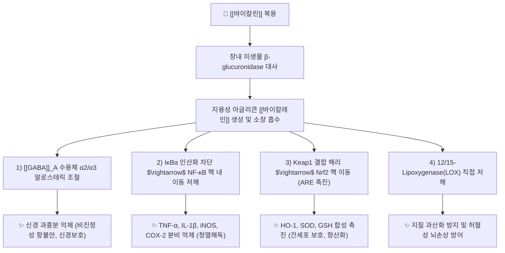

---
aliases:
  - Baicalin
  - 바이칼린
  - 황금배당체
  - 5,6-dihydroxyflavone-7-O-glucuronide
tags:
  - 약리/약리성분
  - 플라보노이드
  - 플라본배당체
  - 황금
  - 청열해독
  - 항염증
  - 신경보호
  - GABA
---

# 🔬 바이칼린 (Baicalin, $C_{21}H_{18}O_{11}$ / 5,6-dihydroxy-4-oxo-2-phenylchromen-7-yl $\beta$-D-glucopyranosiduronic acid)

> **핵심 3줄 요약 (Key Summary)**:
> - 🌿 기원 본초 & 화학 계열: 꿀풀과 대표 청열약인 [[황금]](Scutellariae Radix)의 주요 활성 지표 성분으로, 5,6-디하이드록시플라본 모핵의 7번 위치에 글루쿠론산이 결합된 플라본 배당체(Flavone Glucuronide).
> - 🎯 핵심 분자 표적 & 조절 경로: [[GABA]]_A 수용체 $\alpha_2/\alpha_3$ 아형의 알로스테릭 조절을 통한 비진정성 항불안·신경보호, NF-κB 및 NLRP3 인플라마좀 억제를 통한 강력한 항염증, 12/15-LOX 억제 및 Nrf2/HO-1 항산화 경로 활성화.
> - 🩺 주요 약리 활성 & 질환 치료 기전: 상초(上焦) 폐열 및 급만성 호흡기 염증 완화, 간 손상 억제 및 간섬유화 방어, 중추 신경원 과흥분 억제 및 불안·불면 개선, 광범위한 항바이러스(호흡기 바이러스 프로테아제 억제) 활성.
> - ⚠️ 독성·생체이용률 한계 & 상호작용: 친수성 글루쿠론산 배당체 형태로 소장 직접 흡수가 불량하여 장내 미생물의 $\beta$-glucuronidase에 의해 비배당체인 [[바이칼레인]](Baicalein)으로 가수분해된 후 흡수되는 프로드러그(Prodrug) 특성을 지님.

---

## 목차 (Table of Contents)
- [[#1. 기본 화학 정보 & 분자 구조식 (Chemical Identity)|1. 기본 화학 정보 & 분자 구조식 (Chemical Identity)]]
- [[#2. 주요 함유 본초 및 천연 기원 (Botanical Sources & Content)|2. 주요 함유 본초 및 천연 기원 (Botanical Sources & Content)]]
- [[#3. 분자약리 표적 & 신호전달 네트워크 (Molecular Targets)|3. 분자약리 표적 & 신호전달 네트워크 (Molecular Targets)]]
- [[#4. 생체 내 흡수·대사·생체이용률 (Pharmacokinetics: ADME)|4. 생체 내 흡수·대사·생체이용률 (Pharmacokinetics: ADME)]]
- [[#5. 주요 질환별 약리 효능 & 분자 기전 (Therapeutic Efficacy)|5. 주요 질환별 약리 효능 & 분자 기전 (Therapeutic Efficacy)]]
- [[#6. 함유 본초 방제 시너지 & 약재 배오 매트릭스 (Herbal Synergies)|6. 함유 본초 방제 시너지 & 약재 배오 매트릭스 (Herbal Synergies)]]
- [[#7. 양약 상호작용 & 약물동태학적 간섭 (Drug Interactions)|7. 양약 상호작용 & 약물동태학적 간섭 (Drug Interactions)]]
- [[#8. 💡 사용자 진료실 핵심 필기 & 임상 응용 팁 (Melt-In & High-Yield)|8. 💡 사용자 진료실 핵심 필기 & 임상 응용 팁 (Melt-In & High-Yield)]]
- [[#9. 출처 및 학술 참고 문헌 (References)|9. 출처 및 학술 참고 문헌 (References)]]

---

## 1. 기본 화학 정보 & 분자 구조식 (Chemical Identity)

### 1.1 분자 구조식 및 3D 뷰어

> [그림 1] PubChem 바이칼린(Baicalin) 2D 화학 분자 구조식 (CID: 5281605)

> [!abstract]+ 🧪 3D 약리 분자 구조 (Interactive 3D Viewer)
> <iframe src="https://molecule-viewer-rho.vercel.app/?cid=5281605" width="100%" height="450px" frameborder="0" allow="webgl" style="border-radius: 8px;"></iframe>

### 1.2 화학적 프로파일
| 항목 | 상세 내용 |
| :--- | :--- |
| **IUPAC 명칭** | (2S,3S,4S,5R,6S)-6-(5,6-dihydroxy-4-oxo-2-phenylchromen-7-yl)oxy-3,4,5-trihydroxyoxane-2-carboxylic acid |
| **분자식 / 분자량** | $C_{21}H_{18}O_{11}$ / 446.36 g/mol |
| **PubChem CID** | 5281605 |
| **CAS 등록 번호** | 21967-41-9 |
| **화학 골격 분류** | 플라보노이드 배당체 (Flavone-7-O-glucuronide) |
| **물리화학적 성상** | 담황색의 결정성 분말, 쓴맛, 열수 및 알칼리 수용액에 용해, 찬물과 클로로포름에 난용 |
| **배당체-아글리콘 관계** | 당이 결합된 형태가 **바이칼린(Baicalin)**, 장내 세균 분해로 당이 떨어진 비배당체 형태가 **[[바이칼레인]](Baicalein, CID 5281605 vs 5281607)**임 |

---

## 2. 주요 함유 본초 및 천연 기원 (Botanical Sources & Content)

> [그림 2] 황금의 플라보노이드 성분군과 신경 전달 및 염증 신호 제어 네트워크

### 2.1 주요 함유 본초 매트릭스
| 함유 본초 (한글/한자) | 기원 식물학적 명칭 (과명 / 학명) | 주요 함유 약용 부위 | 지표 함량 (%) | 한의학적 귀경 및 약효 특성 |
| :--- | :--- | :--- | :--- | :--- |
| [[황금]] (黃芩) | 꿀풀과(Labiatae) / *Scutellaria baicalensis Georgi* | 뿌리(주피를 벗긴 주근) | **바이칼린 8.0 ~ 15.0% 이상** (대한민국약전 규격 9.0% 이상) | 폐(肺), 담(膽), 위(胃), 대장(大腸) / 청열조습(淸熱燥濕), 사화해독(瀉火解毒), 지혈, 안태(安胎) |
| [[반지련]] (半枝蓮) | 꿀풀과(Labiatae) / *Scutellaria barbata* | 전초(全草) | 바이칼린 0.5 ~ 1.5% 및 디테르페노이드 | 간, 신, 폐 / 청열해독, 활혈화어, 항종양 |
| [[황금]] 편황금 vs 조황금 | 자라난 생육 기간 및 수피 부위별 차이 | 편황금(고황금, 속이 썩은 오래된 뿌리 - 청폐열), 조황금(속이 찬 어린 뿌리 - 청대장열) | 생육 부위별 플라보노이드 함량 차이 | 폐열 및 대장 습열 감별 응용 |

---

## 3. 분자약리 표적 & 신호전달 네트워크 (Molecular Targets)

### 3.1 GABA_A 수용체 알로스테릭 조절과 신경 보호
* **아형 선택적 양성 알로스테릭 조절제(PAM)**:
  * 바이칼린 및 바이칼레인은 벤조디아제핀(BZD) 결합 부위와는 구별되는 별도의 플라보노이드 결합 부위에서 $GABA_A$ 수용체 $\alpha_2$ 및 $\alpha_3$ 소단위에 선택적으로 작용합니다 (Wang et al., Neuropharmacology 2008).
  * 기존 신경안정제([[디아제팜]], [[알프라졸람]])의 치명적 한계인 운동 실조, 기억력 저하, 과도한 진정(Sedation), 약물 의존성 및 내성 형성 없이 **선택적인 항불안(Anxiolytic) 및 항경련 작용**을 유도합니다.

### 3.2 NF-κB 및 NLRP3 인플라마좀 복합체 억제
* 대식세포 및 호흡기 상피세포에서 IκB 키나아제(IKK)의 활성화를 억제하여 NF-κB p65의 핵 내 전위를 차단함으로써 염증성 사이토카인의 전사를 원천 억제합니다.
* NLRP3 인플라마좀의 단백질 조립을 방해하여 프로-카스파제-1의 활성화와 성숙한 IL-1β 및 IL-18 유출을 차단합니다.

---

## 4. 생체 내 흡수·대사·생체이용률 (Pharmacokinetics: ADME)

### 4.1 장내 미생물총(Microbiome) 의존적 프로드러그 메커니즘
* **소장 점막 투과 장벽**:
  * 바이칼린 분자는 친수성 글루쿠론산기로 인해 지질 이중층을 단순 확산으로 통과하기 어렵고, 장관 상피세포에 직접 흡수되지 못합니다.
* **장내 세균에 의한 활성화**:
  * 소장 하부 및 대장으로 이행한 바이칼린은 대장 공생 세균(Bacteroides, E. coli 등)이 분비하는 **$\beta$-글루쿠로니다아제($\beta$-glucuronidase)**에 의해 당이 절단되어 고지용성의 아글리콘인 **[[바이칼레인]](Baicalein)**으로 신속히 전환됩니다.
  * 생성된 바이칼레인이 소화관 점막으로 빠르게 단순 확산 흡수된 후, 장관 세포 및 간의 UDP-glucuronosyltransferase(UGT1A8, UGT1A9)에 의해 다시 글루쿠론산 포합 반응을 거쳐 체순환 혈액 내에서는 바이칼린 형태로 순환합니다.

### 4.2 대사 및 배설 (Metabolism & Excretion)
* **간-장 순환 (Enterohepatic Circulation)**:
  * 담즙을 통해 십이지장으로 배출된 바이칼린이 다시 장내 세균에 의해 탈포합-재흡수되는 간-장 순환을 반복하여, 혈중 유효 농도가 12~24시간 이상 길게 유지되는 다봉성(Multi-peak) 약동학 곡선을 나타냅니다.
* **배설 경로**: 담즙 및 대변, 신장을 통해 배설됩니다.

---

## 5. 주요 질환별 약리 효능 & 분자 기전 (Therapeutic Efficacy)

### 5.1 호흡기 감염 및 급만성 염증 완화 (淸熱瀉火)
* **폐포 상피세포 보호**: LPS 또는 바이러스에 의한 급성 폐손상(ALI/ARDS) 모델에서 호중구 침윤을 억제하고 혈관 내피세포 투과성을 정상화하여 폐부종을 억제합니다.
* **광범위 항바이러스 활성**: SARS-CoV-2의 주요 단백질 분해효소($M^{pro}$) 및 인플루엔자 바이러스의 뉴라미니다아제(NA) 활성 부위에 결합하여 바이러스 복제를 직접 차단합니다 (Eur J Med Chem 2023).

### 5.2 간세포 보호 및 지방간·간섬유화 억제
* Nrf2 항산화 전사인자를 활성화하여 글루타치온(GSH) 합성을 증가시키고, 지질 과산화와 사염화탄소($CCl_4$) 또는 알코올에 의한 간세포 괴사를 현저히 경감합니다.
* 간성상세포(HSC)의 활성화를 억제하여 콜라겐 축적을 차단함으로써 만성 간염의 간섬유화 진행을 억제합니다.

### 5.3 신경염증 억제 및 항불안·뇌신경 보호
* 뇌혈관 장벽(BBB)을 통과한 바이칼레인이 미세아교세포(Microglia)의 과활성을 억제하여 신경염증 매개 신경세포 사멸을 방어하고, 허혈성 뇌졸중(Cerebral Ischemia) 시 뇌경색 부피를 감소시킵니다.

---

## 6. 함유 본초 방제 시너지 & 약재 배오 매트릭스 (Herbal Synergies)

| 처방 / 배오 조합 | 공존 본초 및 지표 성분 | 분자약리 시너지 기전 | 전통 한의학적 적응증 |
| :--- | :--- | :--- | :--- |
| **[[황련해독탕]]** | [[황련]]([[베르베린]]), [[황백]], [[치자]]([[제니포사이드]]) | 바이칼린의 폐열 사화와 베르베린의 심포화 사화 및 장관 항균 시너지가 삼초(三焦)의 실열을 전면 제어 | 삼초실열(三焦實熱), 고열 번조, 급성 위장염 |
| **[[소시호탕]]** | [[시호]]([[사이코사포닌]]), 반하, 황금 | 사이코사포닌의 간세포 보호와 바이칼린의 항염 사화 작용이 담음·간열을 해소 | 소양병(少陽病) 한열왕래, 만성 간염, 흉협고만 |
| **[[시호청간탕]]** | 시호, 황금, 산치자, 당귀, 천궁 | 신경 흥분성 사이토카인을 억제하고 간경(肝經)의 울화를 사화하여 안면 홍조 및 소아 아토피 개선 | 간담울화, 소아 아토피 피부염, 신경성 열감 |
| **[[패독산]] / [[형개연교탕]]** | 황금, [[연교]], 형개, 방풍 | 바이칼린의 항바이러스·항균과 플라보노이드 복합체가 이비인후과 점막 염증 제어 | 급성 편도선염, 부비동염, 비염 |

---

## 7. 양약 상호작용 & 약물동태학적 간섭 (Drug Interactions)

### 7.1 병용 주의 약물
| 양약 계열 | 대표 약물 | 상호작용 기전 및 임상 권고사항 |
| :--- | :--- | :--- |
| **항생제 (광범위)** | 아목시실린, 세팔로스포린 | 장내 정상 세균총을 사멸시켜 바이칼린을 바이칼레인으로 전환하는 $\beta$-glucuronidase 활성을 억제 $\rightarrow$ **바이칼린 흡수율 급감 (병용 시 2시간 이상 간격)** |
| **P-gp 기질 약물** | 디곡신, 사이클로스포린 | 바이칼린 및 바이칼레인이 장관 상피 P-gp 및 BCRP 수송체를 억제하여 병용 약물의 혈중 농도 상승 가능 |
| **중추신경 억제제** | 벤조디아제핀, 수면진정제 | $GABA_A$ 수용체에 대한 작용 중첩으로 과도한 신경 안정 효과 유발 주의 |

---

## 8. 💡 사용자 진료실 핵심 필기 & 임상 응용 팁 (Melt-In & High-Yield)

### 8.1 상초(上焦) 열증과 피로·불면 환자 감별 응용
* **청폐사화(淸肺瀉火)와 뇌신경 안정의 동시 달성**:
  * 임상에서 "가슴이 답답하고 열이 얼굴로 치밀어 오르며, 입이 쓰고 마르며, 밤에 잡념으로 잠을 못 이룬다"고 호소하는 심담화왕(心膽火旺) 또는 폐열(肺熱) 환자에게 황금은 최고의 청열안신(淸熱安神) 약제입니다.
  * 바이칼린의 $GABA_A$ 수용체 선택적 안정 효과 덕분에 의존성이나 주간 졸림증 없이 뇌파를 안정시키고 깊은 서파 수면을 유도합니다.

### 8.2 항생제 복용 환자 티칭 노하우
* 양방 이비인후과나 내과에서 항생제를 복합 처방받은 환자가 황련해독탕이나 형개연교탕을 함께 복용할 경우:
  * "항생제가 장 속의 유익균을 일시적으로 줄이면 황금 속 유효 성분(바이칼린)을 몸에 흡수하기 좋은 형태로 소화시키는 능력이 떨어질 수 있습니다. 따라서 항생제와 한약은 **최소 2시간 이상의 시차를 두고 복용**하시고, 유산균(프로바이오틱스)을 섭취해 장내 유익균을 보강하는 것이 한약 흡수율을 2배 이상 높이는 비결입니다."

---

## 9. 출처 및 학술 참고 문헌 (References)

### 9.1 학술 논문 및 임상 연구
1. **Wang F, Xu Z, Jiang F, et al.** (2008). *GABA A receptor subtype selectivity underlying selective anxiolytic effect of baicalin.* **Neuropharmacology**, 55(7), 1231-1237. [PMID: 18723037](https://pubmed.ncbi.nlm.nih.gov/18723037/) / [DOI: 10.1016/j.neuropharm.2008.07.040](https://doi.org/10.1016/j.neuropharm.2008.07.040)
   - `[연구 요약]` 황금의 핵심 성분인 바이칼린이 기존 벤조디아제핀의 진정·운동실조 부작용 없이 $GABA_A$ 수용체 $\alpha_2/\alpha_3$ 아형에 선택적으로 결합하여 강력한 항불안 작용을 발휘함을 분자 전기생리학적으로 입증한 랜드마크 연구.
2. **Wang F, et al.** (2017). *Brain Uptake of Bioactive Flavones in Scutellariae Radix and Its Relationship to Anxiolytic Effect in Mice.* **Molecular Pharmaceutics**, 14(9), 2893-2900. [PMID: 28426226](https://pubmed.ncbi.nlm.nih.gov/28426226/) / [DOI: 10.1021/acs.molpharmaceut.7b00029](https://doi.org/10.1021/acs.molpharmaceut.7b00029)
   - `[연구 요약]` 황금 플라본 복합체의 뇌혈관 장벽(BBB) 투과 메커니즘과 활성 아글리콘 바이칼레인의 뇌 조직 흡수 및 중추신경계 항불안 반응 상관관계를 정량 규명한 연구.
3. **Song M, et al.** (2023). *An overview of anti-SARS-CoV-2 and anti-inflammatory potential of baicalein and its metabolite baicalin: Insights into molecular mechanisms.* **European Journal of Medicinal Chemistry**, 258, 115629. [PMID: 37437351](https://pubmed.ncbi.nlm.nih.gov/37437351/) / [DOI: 10.1016/j.ejmech.2023.115629](https://doi.org/10.1016/j.ejmech.2023.115629)
   - `[연구 요약]` 바이칼린과 바이칼레인의 호흡기 바이러스 프로테아제 억제, NF-κB 및 NLRP3 인플라마좀 차단, 폐 조직 염증 방어의 분자 기전을 집대성한 종설 논문.

### 9.2 규제 기관 및 공인 데이터베이스
* **대한민국약전 (KP 12개정)**: 황금(Scutellariae Radix) 정량법 (건조물 기준 바이칼린 9.0% 이상 함유 규격)
* **PubChem Compound Summary**: CID 5281605 (Baicalin)
