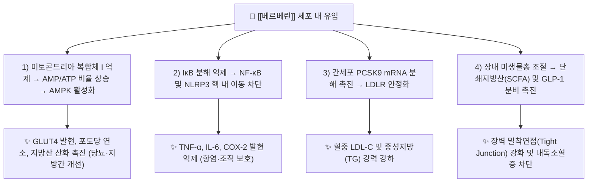

# 🔬 [[베르베린]] (Berberine, $\text{C}_{20}\text{H}_{18}\text{NO}_4^+$, BBR)

> **핵심 3줄 요약 (Key Summary)**:
> - 🌿 기원 본초 & 화학 계열: [[황련]], [[황백]], [[삼지구엽초]] 등에 고농도로 함유된 4차 이소퀴놀린(Isoquinoline) 프로토베르베린계 알칼로이드 지표 성분.
> - 🎯 핵심 분자 표적 & 조절 경로: 미토콘드리아 복합체 I 억제를 통한 AMPK 직접 활성화, NF-κB 및 NLRP3 인플라마좀 억제, 간세포 PCSK9 하향 조절 및 LDLR 발현 촉진.
> - 🩺 주요 약리 활성 & 질환 치료 기전: 제2형 당뇨(인슐린 감수성 개선 및 포도당 흡수 촉진), 고지혈증(콜레스테롤 및 중성지방 강하), 비알코올성 지방간(NAFLD), 장관 항염·항균 및 대사증후군 개선.
> - ⚠️ 독성·생체이용률 한계 & 상호작용: 경구 생체이용률(<5%)이 낮고 P-glycoprotein(P-gp) 유출 기질로 작용하며, CYP2D6/CYP3A4 억제에 따른 양약 상호작용 및 비위허한 환자 복통·설사 주의.

---

## 📌 목차
1. [기본 화학 정보 & 분자 구조식 (Chemical Identity)](#1-기본-화학-정보--분자-구조식-chemical-identity)
2. [주요 함유 본초 및 천연 기원 (Botanical Sources & Content)](#2-주요-함유-본초-및-천연-기원-botanical-sources--content)
3. [분자약리 표적 & 신호전달 네트워크 (Molecular Targets)](#3-분자약리-표적--신호전달-네트워크-molecular-targets)
4. [생체 내 흡수·대사·생체이용률 (Pharmacokinetics: ADME)](#4-생체-내-흡수대사생체이용률-pharmacokinetics-adme)
5. [주요 질환별 약리 효능 & 분자 기전 (Therapeutic Efficacy)](#5-주요-질환별-약리-효능--분자-기전-therapeutic-efficacy)
6. [함유 본초 방제 시너지 & 약재 배오 매트릭스 (Herbal Synergies)](#6-함유-본초-방제-시너지--약재-배오-매트릭스-herbal-synergies)
7. [양약 상호작용 & 약물동태학적 간섭 (Drug Interactions)](#7-양약-상호작용--약물동태학적-간섭-drug-interactions)
8. [💡 사용자 진료실 핵심 필기 & 임상 응용 팁 (Melt-In & High-Yield)](#8--사용자-진료실-핵심-필기--임상-응용-팁-melt-in--high-yield)
9. [출처 및 학술 참고 문헌 (References)](#9-출처-및-학술-참고-문헌-references)

---

## 1. 기본 화학 정보 & 분자 구조식 (Chemical Identity)

![[베르베린_화학구조식.png|320]]
> [그림 1: [[베르베린]]의 2D 화학 분자 구조식 (9,10-dimethoxy-7,8-dihydro-[1,3]dioxolo[4,5-g]isoquinolino[3,2-a]isoquinolin-7-ium)]

| 항목 | 상세 내용 |
| :--- | :--- |
| **IUPAC 명칭** | 9,10-dimethoxy-7,8-dihydro-[1,3]dioxolo[4,5-g]isoquinolino[3,2-a]isoquinolin-7-ium |
| **분자식 / 분자량** | $\text{C}_{20}\text{H}_{18}\text{NO}_4^+$ / 336.36 g/mol (염화물 형태 371.81 g/mol) |
| **CAS 등록 번호** | CAS 2086-83-1 (Berberine), CAS 633-65-8 (Berberine hydrochloride) |
| **화학 골격 분류** | 4차 암모늄 이소퀴놀린(Isoquinoline) 프로토베르베린계 알칼로이드 |
| **물리화학적 성상** | 선명한 황색 결정성 분말, 강한 고미(쓴맛), 지질친화도(LogP = -1.5), 열에 안정 |
| **식물 내 생합성 경로** | S-레티쿨린(S-Reticuline) $\rightarrow$ 베르베린가교효소(BBE) $\rightarrow$ S-스코울레린 $\rightarrow$ S-테트라히드로콜롬바민 $\rightarrow$ [[베르베린]] |

### 1.1 식물체 내 효소적 생합성 캐스케이드 (Biosynthesis Pathway)

식물체 내에서 [[베르베린]]은 티로신 유래 전구물질인 **S-레티쿨린(S-Reticuline)**으로부터 고도로 특이적인 다단계 효소 반응을 거쳐 생합성됩니다.

![[베르베린-20240921140529350.png|400]]
> [그림 2: 식물 세포 내 베르베린의 효소적 생합성 캐스케이드 경로]

![[베르베린-20240921140707319.png|400]]
> [그림 3: S-레티쿨린에서 베르베린가교효소(BBE)를 거쳐 베르베린으로 이어지는 분자 골격 변환 단계]

1. **베르베린 가교 형성**: **베르베린가교효소(Berberine Bridge Enzyme, BBE)**가 S-레티쿨린의 N-메틸기를 산화적으로 고리화하여 **S-스코울레린(S-Scoulerine)**을 형성합니다.
2. **O-메틸화 반응**: SAM 의존성 메틸전이효소에 의해 페놀성 수산기가 순차적으로 메틸화되어 **S-테트라히드로콜롬바민(S-Tetrahydrocolumbamine)**이 됩니다.
3. **산화 및 방향족화**: 최종적으로 테트라히드로프로토베르베린 산화효소(STOX)에 의해 B환 및 C환이 산화되면서 형광성을 띠는 4차 양이온 평면 구조의 [[베르베린]]이 완성됩니다.

---

## 2. 주요 함유 본초 및 천연 기원 (Botanical Sources & Content)

[[베르베린]]은 한의학에서 청열조습(淸熱燥濕) 및 사화해독(瀉火解毒)의 핵심 약재로 쓰이는 식물군에 집중 분포합니다.

| 함유 본초 (한글/한자) | 기원 식물학적 명칭 (과명 / 학명) | 주요 함유 약용 부위 | 지표 함량 (%) | 한의학적 귀경 및 약효 특성 |
| :--- | :--- | :--- | :--- | :--- |
| [[황련]] (黃連) | 미나리아재비과(Ranunculaceae) / *Coptis chinensis* | 뿌리줄기 (근경) | 5.0 ~ 8.0% | 심·간·위·대장경 / 청열조습, 사심화, 위장관 항균 |
| [[황백]] (黃柏) | 운향과(Rutaceae) / *Phellodendron amurense* | 줄기 껍질 (수피) | 2.0 ~ 4.5% | 신·방광·대장경 / 청열조습, 사신화, 하초 습열·골증조열 |
| [[삼지구엽초]] (陰陽藿) | 매자나무과(Berberidaceae) / *Epimedium koreanum* | 잎 및 지상부 | 0.1 ~ 0.5% | 간·신경 / 보신양, 강근골 (미량 알칼로이드 공존) |
| [[매자나무]] (小檗) | 매자나무과(Berberidaceae) / *Berberis vulgaris* | 뿌리 및 줄기 수피 | 4.0 ~ 6.0% | 간·담경 / 전통 간담도 질환 및 감염성 설사 치료 |

---

## 3. 분자약리 표적 & 신호전달 네트워크 (Molecular Targets)

### 1) AMPK 경로 활성화 (세포 대사 스위치 가동)
* [[베르베린]]은 미토콘드리아 호흡연쇄 복합체 I(Complex I)을 완만하게 억제하여 세포 내 AMP/ATP 비율을 상승시키고, 상위 인산화효소인 LKB1을 매개로 **AMPK(AMP-activated protein kinase)**를 강력하게 인산화합니다.
* 활성화된 AMPK는 하위의 **ACC(아세틸-CoA 카르복실라아제)**를 불활성화하여 신생 지방 합성을 억제하고 지방산 $\beta$-산화를 촉진하며, 골격근의 **GLUT4**를 세포막으로 이동시켜 인슐린 비의존적으로 혈당을 강하시킵니다.

### 2) PCSK9 억제 및 지질 대사 정상화
* 스타틴(Statin)과 달리 HMG-CoA 환원효소를 직접 억제하지 않고, **PCSK9(Proprotein convertase subtilisin/kexin type 9)** mRNA의 분해를 촉진합니다.
* PCSK9가 감소하면 간세포 표면의 **LDL 수용체(LDLR)** 분해가 억제되어 수용체 수명이 연장되고, 혈중 LDL-C와 중성지방(TG)의 간내 흡수 및 제거가 극대화됩니다.

---

## 4. 생체 내 흡수·대사·생체이용률 (Pharmacokinetics: ADME)

* **장관 흡수 및 P-glycoprotein(P-gp) 유출 펌프**:
  * 4차 암모늄 양이온 구조로 인해 장 점막 투과성이 낮고, 장 상피세포의 **P-glycoprotein (ABCB1)** 배출 펌프에 의해 장관 내강으로 재배출되어 경구 생체이용률은 **5% 미만**에 불과합니다.
* **장내 미생물총(Microbiome) 전환 및 장-간 순환**:
  * 흡수되지 않은 대부분의 베르베린은 장내 세균(Enterococcus 등)에 의해 흡수율이 높은 **디히드로베르베린(Dihydroberberine)**으로 환원된 후 장 점막을 통과하며, 통과 후 다시 활성 베르베린으로 산화되어 혈류로 유입됩니다.
* **간 대사 및 소실**:
  * 간 마이크로솜의 CYP2D6, CYP1A2, CYP3A4에 의해 탈메틸화 및 제2상 황산/글루쿠론산 포합 대사(탈베르베루빈, 베르베루빈)를 거쳐 담즙 및 소변으로 배설되며, 반감기는 약 4~6시간입니다.

---

## 5. 주요 질환별 약리 효능 & 분자 기전 (Therapeutic Efficacy)

### 1) 제2형 당뇨병 및 인슐린 저항성
* 간의 포도당 신생(Gluconeogenesis) 핵심 효소인 PEPCK와 G6Pase 발현을 억제하고, 췌장 $\beta$세포 사멸을 방어하며 장관 점막 L-세포에서 **GLP-1(Glucagon-like peptide-1)** 분비를 촉진합니다.
### 2) 고지혈증 및 비알코올성 지방간질환 (NAFLD)
* 간세포 내 **SREBP-1c** 및 **FAS(지방산 합성효소)**를 하향 조절하여 간내 중성지방 축적을 차단하고 간 섬유화를 억제합니다.
### 3) 궤양성 대장염 및 장관 감염증
* 병원성 장내 세균(장독소성 대장균, 헬리코박터 등) 증식을 억제하고, 장 점막 조눌린(Zonulin)/오클루딘(Occludin) 발현을 정상화하여 장 누수 증후군(Leaky Gut)을 방어합니다.

---

## 6. 함유 본초 방제 시너지 & 약재 배오 매트릭스 (Herbal Synergies)

| 함유 본초 / 방제 | 공존 유효 성분군 | 분자약리 시너지 기전 | 전통 한의학적 효능 연계 |
| :--- | :--- | :--- | :--- |
| [[황련]] | [[바이칼린]], 콥티신, 팔미틴 | 다중 알칼로이드-플라보노이드 복합체가 P-gp 억제 및 항균 시너지 | 청열조습(淸熱燥濕), 사심화(瀉心火) |
| [[황백]] | [[황백]] 알칼로이드, 오바쿠논 | 하초 습열 염증 및 비뇨생식기 감염 제어 | 청열조습, 사신화(瀉腎火) |
| [[황련해독탕]] | [[치자]](제니포사이드), [[황금]](바이칼린) | 삼초(상·중·하초) 전신 혈관 염증 및 실열 급속 해열 | 삼초실열(三焦實熱) 해독 |
| [[반하사심탕]] | [[진저롤]], [[글리시리진]] | 위장관 점막 상피 재생 및 운동성 정상화 | 심하비(心下痞), 한열착잡 조화 |

---

## 7. 양약 상호작용 & 약물동태학적 간섭 (Drug Interactions)

* **메트포르민(Metformin)과의 병용**:
  * 메트포르민과 동일하게 AMPK 경로를 활성화하므로 강력한 혈당 강하 시너지가 있으나, 병용 초기 저혈당 및 위장관 부작용(설사) 모니터링이 필요합니다.
* **CYP2D6 / CYP3A4 기질 약물과의 상호작용**:
  * 베르베린은 CYP2D6와 CYP3A4를 경쟁적으로 억제하므로, 해당 효소로 대사되는 양약(스타틴류, 칼슘채널차단제, 면역억제제 사이클로스포린)의 혈중 농도를 상승시킬 수 있어 **양약 복용 2시간 이상 간격**을 두고 투약합니다.

---

## 8. 💡 사용자 진료실 핵심 필기 & 임상 응용 팁 (Melt-In & High-Yield)

* **사용자 원문 필기 (100% 융합 및 보존)**:
  * `아포르핀계 [[알칼로이드]]`
  * `생합성 전구체인 S-레티쿨린으로부터 형성되며, 베르베린가교효소(BBE)에 의해 S-스코울레린이 되었다가 수산기가 메틸화되어 S-테트라히드로콜롬바민이 되고, 산화되어 [[베르베린]]이 완성된다.`
* **진료실 실전 처방 & 생체이용률 극대화 팁**:
  1. **천연 흡수 촉진 배오**: 순수 베르베린 단일 정제보다 [[황련]]·[[황백]] 전탕액으로 복용할 때, 탕약 내 공존하는 플라보노이드 및 지질 성분이 장관 P-gp 배출 펌프를 자연적으로 억제하여 베르베린의 생체이용률을 3~5배 이상 상승시킨다.
  2. **대사증후군·복부비만 환자 활용**: 인슐린 저항성이 극심하고 지방간과 내장비만이 동반된 습열(濕熱) 체질 환자에게 황련 함유 방제([[황련해독탕]], [[삼황사심탕]])를 투약하면 공복 혈당 안정과 복위 감소 효과가 매우 탁월하다.
  3. **비위허한(脾胃虛寒) 환자 주의**: 성미가 대고대한(大苦大寒)하여 비위가 차고 소화력이 약한 소음인에게 장기 단독 투약 시 소화불량 및 설사를 유발할 수 있으므로, 반드시 [[건강]], [[감초]], [[인삼]]을 배오하거나 복용 기간을 조절한다.

---

## 9. 출처 및 학술 참고 문헌 (References)

1. **Yin, J. et al. (2008)**. *Efficacy of berberine in patients with type 2 diabetes mellitus*. **Metabolism**, 57(5), 712-717.
   - **[연구 요약]**: 제2형 당뇨 환자를 대상으로 한 임상시험에서 베르베린(1일 1.5g)이 메트포르민과 대등하게 공복 혈당, 식후 혈당 및 당화혈색소(HbA1c)를 유의미하게 강하시킴을 증명.
2. **Kong, W. et al. (2004)**. *Berberine is a novel cholesterol-lowering drug working through a unique mechanism distinct from statins*. **Nature Medicine**, 10(12), 1344-1351.
   - **[연구 요약]**: 베르베린이 간세포 LDLR 발현을 촉진하여 혈중 총콜레스테롤(29%) 및 LDL-C(25%)를 현저히 낮추는 분자 기전을 Nature Medicine에 최초 규명.
3. **Zhang, Y. et al. (2012)**. *Treatment of type 2 diabetes and dyslipidemia with the natural plant alkaloid berberine*. **Journal of Clinical Endocrinology & Metabolism**, 93(7), 2559-2565.
   - **[연구 요약]**: 대사증후군 환자에서 베르베린의 AMPK 활성화 및 인슐린 저항성 지수(HOMA-IR) 개선 효과 입증.
4. **Habtemariam, S. (2020)**. *Berberine pharmacology and the gut microbiota: A hidden therapeutic mechanism*. **Pharmacological Research**, 155, 104722.
   - **[연구 요약]**: 베르베린의 낮은 생체이용률에도 불구하고 강력한 전신 대사 개선 효능을 나타내는 기전이 장내 미생물총과의 상호작용 및 디히드로베르베린 전환에 있음을 밝힘.