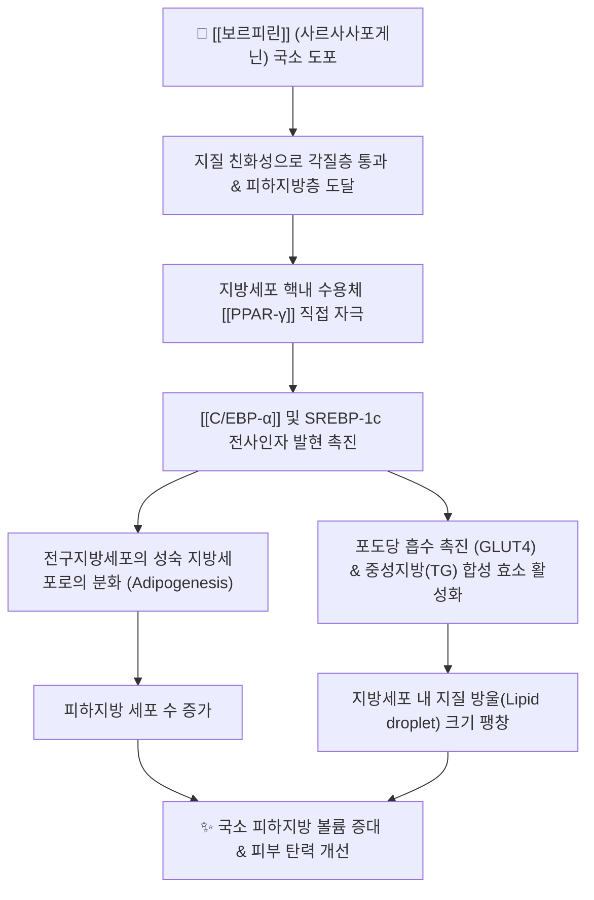

---
aliases:
  - 보르피린
  - Volufiline
  - 사르사사포게닌
  - Sarsasapogenin
tags:
  - 약리성분
  - 스테로이드사포닌
  - 식물유래성분
  - 지질대사
  - 지방세포분화
  - PPAR감마
  - 에스테틱약리
  - 지모
---
# 💊 [[보르피린]] (Volufiline, Sarsasapogenin 복합체)

> **핵심 요약 (Key Summary)**:
> 백합과 본초인 [[지모]](*Anemarrhena asphodeloides*) 뿌리줄기에서 추출한 스테로이드 사포닌 사르사사포게닌(Sarsasapogenin)을 핵심 활성 물질로 함유한 특허 지용성 미용약리 복합 원료.
> 전구지방세포(Preadipocyte)의 [[PPAR-γ]] 활성화 및 [[C/EBP-α]] 경로 자극을 통해 지방세포 분화(Adipogenesis)와 세포 내 중성지방 지질 축적을 국소적으로 촉진.
> 호르몬성 부작용 없이 국소 지방 볼륨 증대, 피부 주름 개선, 가슴·엉덩이 탄력 개선 및 지모 고유의 청열자음(淸熱滋陰) 약리와 연계.

---

## 1. 기본 화학 및 물리화학적 특성

| 항목 | 상세 내용 |
| :--- | :--- |
| **원료명 (Trade Name)** | [[보르피린]] (Volufiline™ - 프랑스 Sederma사 특허 원료) |
| **핵심 유효 성분** | 사르사사포게닌 (Sarsasapogenin, 식물성 스테로이드 스피로스탄 사포닌) |
| **기원 본초** | 백합과 [[지모]](*Anemarrhena asphodeloides* Bunge)의 근경 |
| **주요 배합 베이스** | 하이드로제네이티드 폴리아이소부텐(Hydrogenated Polyisobutene)에 사르사사포게닌을 지용성으로 용해 |
| **화학식 / 분자량 (사르사사포게닌)** | $\text{C}_{27}\text{H}_{44}\text{O}_3$ / 416.64 g/mol |
| **물리화학적 성상** | 투명~미황색의 점조성 지용성 액체, 에탄올 및 지질에 가용, 수불용성 |

---

## 2. 분자약리 작용 기전 (Mechanism of Action, MoA)

* **PPAR-$\gamma$ 경로 자극을 통한 지방세포 분화 촉진**:
  * 사르사사포게닌이 지방 대사의 마스터 조절자인 [[PPAR-γ]](Peroxisome proliferator-activated receptor gamma)를 활성화하여 섬유아세포성 전구지방세포가 지질을 저장할 수 있는 성숙 지방세포로 분화하도록 유도.
* **지방 축적 및 지질 방울 팽창**:
  * 세포 내 지질 축적 효소인 아실-CoA 합성효소 및 디아실글리세롤 아실전이효소(DGAT)를 활성화하여 혈류 내 지방산을 세포 내 중성지방으로 변환 축적.
* **비호르몬성 작용 기전 (Estrogen-independent)**:
  * 에스트로겐 수용체([[ER]])나 프로게스테론 수용체에 직접 결합하지 않으므로, 유방암, 자궁내막증, 호르몬 교란 위험 없이 안전하게 지방 조직의 리모델링 유도.

---

## 3. 주요 임상 적응증 및 에스테틱 응용

* **국소 피하지방 볼륨 보충 (Lipo-filling 효과)**:
  * 꺼진 눈밑 볼륨 개선, 팔자주름 및 이마 볼륨 보충, 볼살 꺼짐 완화.
  * 바스트(가슴) 및 힙(엉덩이) 라인의 탄력 및 국소 볼륨 증대 크림.
* **피부 노화 방지 및 진피 지지구조 강화**:
  * 피하지방층이 얇아져 피부가 처지고 늘어지는 노인성 피부 위축증 완화.

---

## 4. 기원 본초 및 한의학 연계

* **기원 본초: [[지모]](知母, *Anemarrhena asphodeloides*)**:
  * 한의학에서 지모는 청열사화(淸熱瀉火), 생진윤조(生津潤燥), 자신강화(滋腎降火)의 대표 본초.
  * 뼛속의 허열을 끄고 체내 마른 진액을 채워주는 지모의 윤조(潤燥, 마른 것을 적셔 채움) 효능이 현대 분자생물학적으로 피부와 피하지방의 볼륨을 채우는 사르사사포게닌의 약리와 절묘하게 일치.
* **배합 처방**:
  * [[육미지황탕]]에 지모, 황백을 가미한 [[지백지황환]]에서 음액을 보태고 열을 내리는 보음 약리로 운용.

---

## 5. 부작용 및 외용 안전성

* **국소 외용 안전성**:
  * 전신 흡수율이 낮고 국소 피하지방에 작용하므로 전신 대사에 미치는 영향이 극히 적음.
  * 호르몬 비의존성이 입증되어 안전한 화장품 및 외용 의약외품 원료로 사용됨.
* **피부 트러블 주의**:
  * 고농도 지용성 베이스이므로 여드름성 지성 피부 부위에 바를 경우 모공 폐쇄로 인한 면포(비립종, 여드름) 유발 가능.

---

## 6. 출처 및 학술 참고 문헌 (References)

* Sederma Research Report. (2010). Volufiline: Phytosterols to promote lipid storage leading to a fuller volume. *Sederma SAS France*.
  * `[연구 요약]` 사르사사포게닌이 지방세포 분화 유전자(PPAR-γ, C/EBP) 발현을 촉진하여 지방세포 크기와 부피를 유의하게 증가시킴을 입증한 인비트로 및 인비보 임상 데이터.
* Timon-Gomez, A., et al. (2017). Sarsasapogenin enhances adipogenesis and glucose uptake in 3T3-L1 cells. *Phytomedicine*, 36, 174-182.
  * `[연구 요약]` 지모의 사르사사포게닌이 지방세포 분화 촉진 및 GLUT4 매개 포도당 흡수를 촉진하여 세포 내 지질 축적을 유도함을 규명.
