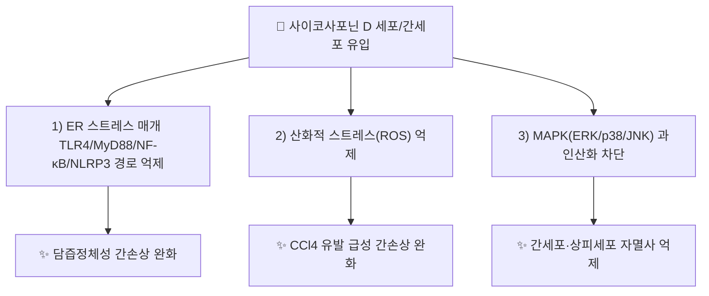

---
aliases:
  - Saikosaponin D
  - Saikosaponin d
  - SSd
  - 사이코사포닌D
tags:
  - 약리성분
  - 사포닌
  - 시호
---

# 🔬 사이코사포닌 D (Saikosaponin D)

> **핵심 3줄 요약 (Key Summary)**:
> - 🌿 기원 본초 & 화학 계열: [[시호]](柴胡, *Bupleurum* spp.) 뿌리에 함유된 올레아난(oleanane)형 트리테르페노이드 사포닌 [[사이코사포닌]] 계열 중 [[사이코사포닌 a]]와 함께 가장 널리 연구된 대표 유사체(analogue). KP(대한민국약전) 규격상 시호의 지표성분(사이코사포닌 a+d ≥ 0.30%)입니다.
> - 🎯 핵심 분자 표적 & 조절 경로: 소포체(ER) 스트레스를 매개하는 TLR4/MyD88/NF-κB/NLRP3 인플라마좀 경로 억제, 산화적 스트레스 억제, MAPK(ERK/p38/JNK) 과인산화 차단을 통한 세포 보호.
> - 🩺 주요 약리 활성: 담즙정체성(cholestatic) 및 사염화탄소(CCl4) 유발 급성 간손상에 대한 간세포 보호, 항염증, 항산화 효과가 세포·동물 연구로 보고되며, [[시호]]의 화해퇴열(和解退熱)·소간해울(疏肝解鬱) 효능의 분자적 근거로 제시됩니다.
> - ⚠️ 독성·생체이용률 한계 & 상호작용: 고농도 세포·동물 연구에서 심장·간 독성이 보고된 바 있고 경구 생체이용률이 낮은 것으로 알려져, 단일 성분 고농도 투여 결과를 전탕액(煎湯液) 복용의 저농도 노출과 동일시할 수 없습니다.

---

## 📌 목차
1. [기본 화학 정보](#1-기본-화학-정보)
2. [주요 함유 본초 및 천연 기원](#2-주요-함유-본초-및-천연-기원)
3. [분자약리 표적 & 신호전달 네트워크](#3-분자약리-표적--신호전달-네트워크)
4. [주요 질환별 약리 효능 & 분자 기전](#4-주요-질환별-약리-효능--분자-기전)
5. [한의학적 연계](#5-한의학적-연계)
6. [출처 및 학술 참고 문헌 (References)](#6-출처-및-학술-참고-문헌-references)

---

## 1. 기본 화학 정보

| 항목 | 상세 내용 |
| :--- | :--- |
| **화학 골격 분류** | 올레아난(oleanane)형 트리테르페노이드 사포닌, [[사이코사포닌]] 계열 |
| **분자식 / 분자량** | C₄₂H₆₈O₁₃ |
| **PubChem CID** | [107793](https://pubchem.ncbi.nlm.nih.gov/compound/107793) |
| **CAS 등록 번호** | 20874-52-6 |

---

## 2. 주요 함유 본초 및 천연 기원 (Botanical Sources & Content)

| 함유 본초 (한글/한자) | 기원 식물학적 명칭 | 주요 함유 부위 | 한의학적 귀경 및 약효 특성 |
| :--- | :--- | :--- | :--- |
| [[시호]] (柴胡) | 산형과 / *Bupleurum chinense*, *B. scorzonerifolium* 등 | 뿌리 | 간(肝)·담(膽)경 귀경, 화해퇴열·소간해울 |

---

## 3. 분자약리 표적 & 신호전달 네트워크

* **담즙정체성 간손상 보호 기전**: 2026년 발표된 연구에서 사이코사포닌 D가 소포체(ER) 스트레스를 매개하는 TLR4/MyD88/NF-κB/NLRP3 인플라마좀 신호전달을 억제하여 담즙산 노출로 인한 간세포 손상과 염증을 완화하는 것으로 보고되었습니다(PMID 41965724).
* **산화적 스트레스·NLRP3 억제 기전**: 2020년 연구에서는 사염화탄소(CCl4) 유발 급성 간손상 마우스 모델에서 사이코사포닌 D가 산화적 스트레스와 NLRP3 인플라마좀 활성화를 억제하여 간손상을 완화함이 보고되었습니다(PMID 32816567).

---

## 4. 주요 질환별 약리 효능 & 분자 기전

### 1) 담즙정체성 간손상 (Cholestatic liver injury)
* ER 스트레스 매개 TLR4/MyD88/NF-κB/NLRP3 경로 억제를 통한 간세포·담관세포 보호(2026, Hereditas).
### 2) 급성 간손상 (CCl4 유발)
* 산화적 스트레스 및 NLRP3 인플라마좀 활성화 억제를 통한 간손상 완화(2020, Int J Immunopathol Pharmacol).

⚠️ 내용 검토 필요: 위 두 연구 모두 동물·세포 모델 수준이며, 인체 대상 임상시험(RCT) 근거는 이번 검색 범위 내에서 확인되지 않았습니다.

---

## 5. 한의학적 연계

사이코사포닌 D는 [[사이코사포닌 a]]와 함께 [[시호]]의 화해소양(和解少陽)·소간해울(疏肝解鬱)·화해퇴열 효능을 뒷받침하는 핵심 지표성분으로, [[세신]] 배합 처방 등 시호제(柴胡劑)의 간 보호·항염증 효능에 대한 분자약리학적 근거로 상위 개념 노트 [[사이코사포닌]]에서도 함께 다루어집니다.

---

## 6. 출처 및 학술 참고 문헌 (References)

1. **Meng XM, Chen W (2026)**. "Protective effect of Saikosaponin D modulating endoplasmic reticulum stress mediated by TLR4/MyD88/NF-κB/NLRP3 pathway on cholestatic liver injury". *Hereditas*, 163(1):62. DOI: [10.1186/s41065-026-00669-8](https://doi.org/10.1186/s41065-026-00669-8). PMID: [41965724](https://pubmed.ncbi.nlm.nih.gov/41965724/).
   - **[연구 요약]**: 사이코사포닌 D가 소포체 스트레스 매개 TLR4/MyD88/NF-κB/NLRP3 경로를 억제하여 담즙정체성 간손상(동물모델·배양세포)을 완화함을 보고.
2. **Chen Y, Que R, Lin L, Shen Y, Liu J, Li Y (2020)**. "Inhibition of oxidative stress and NLRP3 inflammasome by Saikosaponin-d alleviates acute liver injury in carbon tetrachloride-induced hepatitis in mice". *International Journal of Immunopathology and Pharmacology*, 34. DOI: [10.1177/2058738420950593](https://doi.org/10.1177/2058738420950593). PMID: [32816567](https://pubmed.ncbi.nlm.nih.gov/32816567/).
   - **[연구 요약]**: CCl4 유발 급성 간손상 마우스 모델에서 사이코사포닌 D의 산화적 스트레스·NLRP3 인플라마좀 억제를 통한 간보호 효과를 규명.
3. **PubChem CID 107793 (Saikosaponin D)**. National Center for Biotechnology Information.
   - **[화학 데이터베이스]**: 분자식·CAS 번호 등 공인 화학 데이터.

> ⚠️ 내용 검토 필요: 상위 개념 [[사이코사포닌]] 노트에 이미 정리된 항종양(PMID 38965200) 관련 내용은 사이코사포닌 D 공통 기전이나 중복 방지를 위해 본 노트에서는 간 보호 관련 신규 문헌(2020·2026)만 별도로 수록했습니다.
