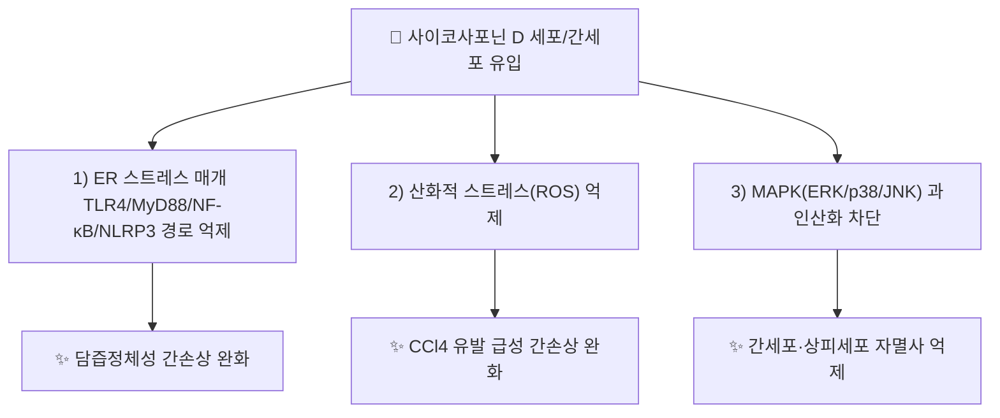

---
aliases:
  - Saikosaponin D
  - Saikosaponin d
  - SSd
  - 사이코사포닌D
tags:
  - 약리성분
  - 사포닌
  - 시호
---

# 🔬 [[사이코사포닌 d]] (Saikosaponin D, C₄₂H₆₈O₁₃, SSd)

> **핵심 3줄 요약 (Key Summary)**:
> - 🌿 기원 본초 & 화학 계열: [[시호]](柴胡, *Bupleurum* spp.) 뿌리에 함유된 올레아난(oleanane)형 트리테르페노이드 사포닌 [[사이코사포닌]] 계열의 대표 유사체. [[사이코사포닌 a]]와 함께 KP(대한민국약전) 지표성분(사이코사포닌 a+d ≥ 0.30%)입니다.
> - 🎯 핵심 분자 표적 & 조절 경로: 소포체(ER) 스트레스를 매개하는 TLR4/MyD88/NF-κB/NLRP3 인플라마좀 경로 억제, 산화적 스트레스(ROS) 억제, MAPK(ERK/p38/JNK) 과인산화 차단.
> - 🩺 주요 약리 활성 & 질환 치료 기전: 담즙정체성(cholestatic) 및 사염화탄소(CCl4) 유발 급성 간손상에 대한 간세포 보호, 항염증, 항산화 — [[시호]]의 화해퇴열(和解退熱)·소간해울(疏肝解鬱) 효능의 분자적 근거로 제시됩니다.
> - ⚠️ 독성·생체이용률 한계 & 상호작용: 고농도 세포·동물 연구에서 심장·간 독성이 보고된 바 있고 트리테르펜 사포닌 특유의 낮은 경구 생체이용률을 가져, 단일 성분 고농도 투여 결과를 전탕액(煎湯液) 복용의 저농도 노출과 동일시할 수 없습니다.

---

## 📌 목차
1. [기본 화학 정보 & 분자 구조식 (Chemical Identity)](#1-기본-화학-정보--분자-구조식-chemical-identity)
2. [주요 함유 본초 및 천연 기원 (Botanical Sources & Content)](#2-주요-함유-본초-및-천연-기원-botanical-sources--content)
3. [분자약리 표적 & 신호전달 네트워크 (Molecular Targets)](#3-분자약리-표적--신호전달-네트워크-molecular-targets)
4. [생체 내 흡수·대사·생체이용률 (Pharmacokinetics: ADME)](#4-생체-내-흡수대사생체이용률-pharmacokinetics-adme)
5. [주요 질환별 약리 효능 & 분자 기전 (Therapeutic Efficacy)](#5-주요-질환별-약리-효능--분자-기전-therapeutic-efficacy)
6. [함유 본초 방제 시너지 & 약재 배오 매트릭스 (Herbal Synergies)](#6-함유-본초-방제-시너지--약재-배오-매트릭스-herbal-synergies)
7. [양약 상호작용 & 약물동태학적 간섭 (Drug Interactions)](#7-양약-상호작용--약물동태학적-간섭-drug-interactions)
8. [💡 사용자 진료실 핵심 필기 & 임상 응용 팁 (Melt-In & High-Yield)](#8--사용자-진료실-핵심-필기--임상-응용-팁-melt-in--high-yield)
9. [출처 및 학술 참고 문헌 (References)](#9-출처-및-학술-참고-문헌-references)

---

## 1. 기본 화학 정보 & 분자 구조식 (Chemical Identity)

![[사이코사포닌 d_화학구조식.png|320]]
> [그림 1: 사이코사포닌 D의 2D 화학 분자 구조식 (Chemical Structure)] ⚠️ 내용 검토 필요 — 구조식 이미지 파일은 아직 첨부되지 않았습니다. `7. 첨부·자료/첨부파일/`에 실제 구조식 이미지를 추가해 주세요.

> [!abstract]+ 🧪 3D 약리 분자 구조 (Interactive 3D Viewer)
> <iframe src="https://molecule-viewer-rho.vercel.app/?cid=107793" style="width: 100%; height: 600px; border: none; border-radius: 12px; box-shadow: 0 4px 20px rgba(0,0,0,0.15);" allowfullscreen></iframe>

| 항목 | 상세 내용 |
| :--- | :--- |
| **IUPAC 명칭** | 복합 올레아난형 트리테르펜 배당체 구조로 정식 IUPAC 계통명이 매우 길어 관용명(Saikosaponin D)을 표준 표기로 사용 |
| **분자식 / 분자량** | C₄₂H₆₈O₁₃ / 약 780.98 g/mol |
| **PubChem CID** | [107793](https://pubchem.ncbi.nlm.nih.gov/compound/107793) |
| **CAS 등록 번호** | 20874-52-6 |
| **화학 골격 분류** | 올레아난(oleanane)형 트리테르페노이드 사포닌, [[사이코사포닌]] 계열 |
| **물리화학적 성상** | 백색~미황색 결정성 분말, 배당체 구조상 수용성이 아글리콘 대비 높음, 쓴맛 |
| **식물 내 생합성 경로** | 스쿠알렌(squalene) → 2,3-옥시도스쿠알렌 → β-아미린형 올레아난 골격 형성 → 당전이효소(glycosyltransferase)에 의한 배당화 → 사이코사포닌 a/d (⚠️ 세부 효소 캐스케이드는 이번 검색 범위에서 개별 논문으로 확인하지 못함) |

---

## 2. 주요 함유 본초 및 천연 기원 (Botanical Sources & Content)

| 함유 본초 (한글/한자) | 기원 식물학적 명칭 (과명 / 학명) | 주요 함유 약용 부위 | 지표 함량 (%) | 한의학적 귀경 및 약효 특성 |
| :--- | :--- | :--- | :--- | :--- |
| [[시호]] (柴胡) | 산형과(Apiaceae) / *Bupleurum chinense*, *B. scorzonerifolium* 등 | 뿌리 | KP 규격 사이코사포닌 a+d ≥ 0.30% | 간(肝)·담(膽)경 귀경, 화해퇴열·소간해울 |

---

## 3. 분자약리 표적 & 신호전달 네트워크 (Molecular Targets)

### 1) 소포체(ER) 스트레스 매개 TLR4/MyD88/NF-κB/NLRP3 경로 억제
* 2026년 발표된 연구에서 사이코사포닌 D가 담즙산 노출로 유발되는 소포체 스트레스(Unfolded Protein Response 관련 경로)를 완화하고, 이를 매개하는 TLR4/MyD88/NF-κB/NLRP3 인플라마좀 신호전달을 억제하여 담즙정체성 간손상을 경감시킴이 보고되었습니다(PMID 41965724).

### 2) 산화적 스트레스·NLRP3 인플라마좀 억제
* 2020년 연구에서는 사염화탄소(CCl4) 유발 급성 간손상 마우스 모델에서 사이코사포닌 D가 산화적 스트레스와 NLRP3 인플라마좀 활성화를 억제하여 간손상을 완화함이 보고되었습니다(PMID 32816567).

---

## 4. 생체 내 흡수·대사·생체이용률 (Pharmacokinetics: ADME)

* **장관 흡수 및 P-glycoprotein(P-gp) 상호작용**:
  * 트리테르페노이드 사포닌 특유의 큰 분자량(약 781 g/mol)과 다당쇄 구조로 인해 장 점막 투과율이 낮고, 다른 사포닌류와 유사하게 P-gp 유출 펌프의 영향을 받을 가능성이 제시되나, 사이코사포닌 D에 특정된 정량적 생체이용률 수치는 이번 검색 범위에서 확인하지 못했습니다. ⚠️ 내용 검토 필요.
* **장내 미생물총(Microbiome) 대사 전환**:
  * 사포닌류는 일반적으로 장내 세균의 β-글루쿠로니다제·글리코시다제에 의해 당쇄가 순차적으로 제거되어(탈배당화) 아글리콘 또는 저차 배당체로 전환된 뒤 흡수되는 경로가 알려져 있으나, 사이코사포닌 D의 구체적 대사체 동정 연구는 이번 검색 범위에서 확인하지 못했습니다. ⚠️ 내용 검토 필요.
* **간 대사 및 소실**:
  * 간세포 보호 연구(PMID 41965724, 32816567)들은 모두 조직·세포 수준의 약력학적 기전 규명에 집중되어 있으며, CYP 대사 효소·반감기 등 정량적 약동학(PK) 데이터는 확인하지 못했습니다. ⚠️ 내용 검토 필요.

---

## 5. 주요 질환별 약리 효능 & 분자 기전 (Therapeutic Efficacy)

### 1) 담즙정체성 간손상 (Cholestatic liver injury)
* ER 스트레스 매개 TLR4/MyD88/NF-κB/NLRP3 경로 억제를 통한 간세포·담관세포 보호(2026, *Hereditas*).
### 2) 급성 간손상 (CCl4 유발)
* 산화적 스트레스 및 NLRP3 인플라마좀 활성화 억제를 통한 간손상 완화(2020, *Int J Immunopathol Pharmacol*).

⚠️ 내용 검토 필요: 위 두 연구 모두 동물·세포 모델 수준이며, 인체 대상 임상시험(RCT) 근거는 이번 검색 범위 내에서 확인되지 않았습니다.

---

## 6. 함유 본초 방제 시너지 & 약재 배오 매트릭스 (Herbal Synergies)

| 함유 본초 / 방제 | 공존 유효 성분군 | 분자약리 시너지 기전 | 전통 한의학적 효능 연계 |
| :--- | :--- | :--- | :--- |
| [[시호]] | [[사이코사포닌 a]], 사이코사포닌 b·c, [[디테르페노이드]] | 다중 사포닌 복합체의 간보호·항염증 상가 작용(개별 성분 간 정량적 시너지 데이터는 확인 필요 ⚠️) | 화해소양(和解少陽), 소간해울(疏肝解鬱) |
| [[소시호탕]] | [[황금]]([[바이칼린]]), [[반하]] | 시호-황금 배오의 항염증·간보호 네트워크(구체 논문 확인 필요 ⚠️) | 반표반리(半表半裏) 화해 |

---

## 7. 양약 상호작용 & 약물동태학적 간섭 (Drug Interactions)

* **CYP450 효소 간섭**:
  * 사이코사포닌 D에 특정된 CYP450 억제/유도 연구는 이번 검색 범위에서 확인하지 못했습니다. 다른 트리테르펜 사포닌류의 일반적 특성(CYP3A4 등과의 잠재적 상호작용 가능성)을 참고하되, 확정적 근거로 사용하지 않도록 유의해야 합니다. ⚠️ 내용 검토 필요.
* **간 보호 목적 양약과의 병용 시 고려사항**:
  * 간손상 보호 기전(ER 스트레스·NLRP3 억제)이 보고된 만큼, 간독성 유발 가능 양약과의 병용 시 상호 보완적 관찰이 필요하나 이를 직접 검증한 병용 연구는 확인하지 못했습니다.

---

## 8. 💡 사용자 진료실 핵심 필기 & 임상 응용 팁 (Melt-In & High-Yield)

* **사용자 원문 필기**: (원장님 개별 필기 자료 없음 — 향후 진료 경험 축적 시 본 섹션에 추가 예정)
* **진료실 실전 처방 & 생체이용률 극대화 팁**:
  1. **전탕액 복용 원칙**: 단일 성분 고농도 투여 연구(세포·동물)와 [[시호]] 전탕액의 저농도 복합 성분 노출은 약리학적으로 동일시할 수 없으므로, 시호제 임상 효능을 사이코사포닌 D 단일 기전만으로 설명하지 않도록 주의합니다.
  2. **간질환 동반 환자 활용**: 담즙정체·급성 간손상 관련 최신 기초연구(2020·2026)는 [[시호]] 배합 처방의 간보호 효능에 대한 분자약리학적 근거를 보강하나, 임상 적용 시에는 여전히 변증(辨證) 기반 처방이 우선되어야 합니다.

---

## 9. 출처 및 학술 참고 문헌 (References)

1. **Meng XM, Chen W (2026)**. "Protective effect of Saikosaponin D modulating endoplasmic reticulum stress mediated by TLR4/MyD88/NF-κB/NLRP3 pathway on cholestatic liver injury". *Hereditas*, 163(1):62. DOI: [10.1186/s41065-026-00669-8](https://doi.org/10.1186/s41065-026-00669-8). PMID: [41965724](https://pubmed.ncbi.nlm.nih.gov/41965724/).
   - **[연구 요약]**: 사이코사포닌 D가 소포체 스트레스 매개 TLR4/MyD88/NF-κB/NLRP3 경로를 억제하여 담즙정체성 간손상(동물모델·배양세포)을 완화함을 보고.
2. **Chen Y, Que R, Lin L, Shen Y, Liu J, Li Y (2020)**. "Inhibition of oxidative stress and NLRP3 inflammasome by Saikosaponin-d alleviates acute liver injury in carbon tetrachloride-induced hepatitis in mice". *International Journal of Immunopathology and Pharmacology*, 34. DOI: [10.1177/2058738420950593](https://doi.org/10.1177/2058738420950593). PMID: [32816567](https://pubmed.ncbi.nlm.nih.gov/32816567/).
   - **[연구 요약]**: CCl4 유발 급성 간손상 마우스 모델에서 사이코사포닌 D의 산화적 스트레스·NLRP3 인플라마좀 억제를 통한 간보호 효과를 규명.
3. **PubChem CID 107793 (Saikosaponin D)**. National Center for Biotechnology Information.
   - **[화학 데이터베이스]**: 분자식·CAS 번호 등 공인 화학 데이터.

> ⚠️ 내용 검토 필요: 상위 개념 [[사이코사포닌]] 노트에 이미 정리된 항종양(PMID 38965200) 관련 내용은 사이코사포닌 D 공통 기전이나 중복 방지를 위해 본 노트에서는 간 보호 관련 신규 문헌(2020·2026)만 수록했습니다. §4·6·7의 정량적 PK·시너지·상호작용 데이터는 검색 범위 내 개별 논문을 확인하지 못해 일반론 서술과 ⚠️ 표시로 대체했습니다.
