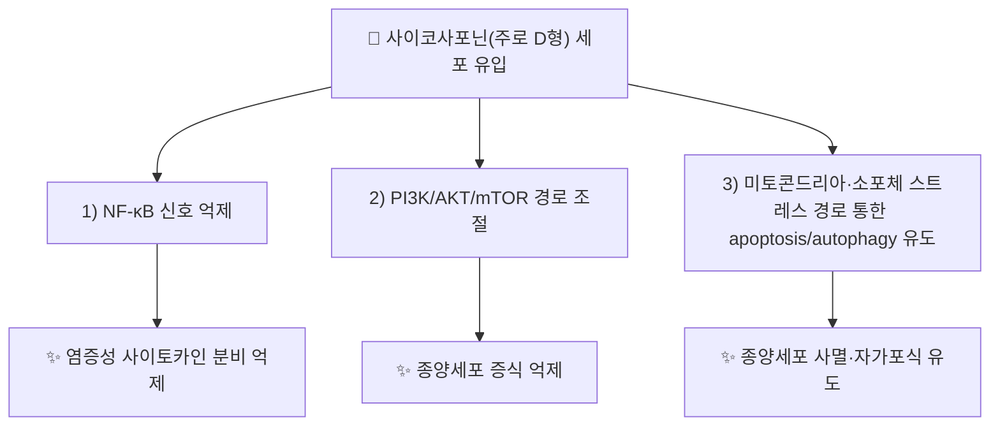

---
aliases:
  - Saikosaponin
  - 사이코사포닌
  - 시호사포닌
tags:
  - 약리성분
  - 사포닌
  - 시호
---

# 🔬 사이코사포닌 (Saikosaponin)

> **핵심 3줄 요약 (Key Summary)**:
> - 🌿 기원 본초 & 화학 계열: [[시호]](柴胡, *Bupleurum* spp.) 뿌리에 함유된 올레아난(oleanane)형 트리테르페노이드 사포닌군의 총칭. 단일 화합물이 아니라 사이코사포닌 A·C·D 등 다수 유사체(analogue)를 포괄하는 화합물군(class)입니다.
> - 🎯 핵심 분자 표적 & 조절 경로: 주로 연구된 사이코사포닌 D를 중심으로 NF-κB, PI3K/AKT/mTOR, MAPK 경로 조절 및 세포자멸(apoptosis)·자가포식(autophagy) 유도가 보고됨.
> - 🩺 주요 약리 활성: 항염증, 항종양(다양한 세포주), 면역조절 등이 실험 연구로 제시되며, 시호의 화해소양(和解少陽)·해열(解熱) 효능과 연계되는 근거로 언급됩니다.
> - ⚠️ 독성·생체이용률 한계 & 상호작용: 사이코사포닌 D는 고농도에서 심장·간 독성이 세포·동물 연구에서 보고된 바 있고 경구 생체이용률이 낮은 것으로 알려져 있어, 단일 성분 고농도 투여 결과를 전탕액(煎湯液) 복용의 저농도 노출과 동일시할 수 없습니다.

---

## 📌 목차
1. [기본 화학 정보](#1-기본-화학-정보)
2. [주요 함유 본초 및 천연 기원](#2-주요-함유-본초-및-천연-기원)
3. [분자약리 표적 & 신호전달 네트워크](#3-분자약리-표적--신호전달-네트워크)
4. [주요 질환별 약리 효능 & 분자 기전](#4-주요-질환별-약리-효능--분자-기전)
5. [한의학적 연계](#5-한의학적-연계)
6. [출처 및 학술 참고 문헌 (References)](#6-출처-및-학술-참고-문헌-references)

---

## 1. 기본 화학 정보

| 항목 | 상세 내용 |
| :--- | :--- |
| **화학 골격 분류** | 올레아난(oleanane)형 트리테르페노이드 사포닌(triterpenoid saponin) |
| **대표 유사체** | 사이코사포닌 A, 사이코사포닌 C, 사이코사포닌 D 등 |
| **사이코사포닌 A — 분자식/PubChem CID** | C₄₂H₆₈O₁₃ / [CID 167928](https://pubchem.ncbi.nlm.nih.gov/compound/167928) |
| **사이코사포닌 D — 분자식/PubChem CID** | C₄₂H₆₈O₁₃ / [CID 107793](https://pubchem.ncbi.nlm.nih.gov/compound/107793) |
| **CAS 등록 번호 (사이코사포닌 D)** | 20874-52-6 |

---

## 2. 주요 함유 본초 및 천연 기원 (Botanical Sources & Content)

| 함유 본초 (한글/한자) | 기원 식물학적 명칭 | 주요 함유 부위 | 한의학적 귀경 및 약효 특성 |
| :--- | :--- | :--- | :--- |
| [[시호]] (柴胡) | 산형과 / *Bupleurum chinense*, *B. scorzonerifolium* 등 | 뿌리 | 간(肝)·담(膽)경 귀경, 화해퇴열(和解退熱)·소간해울(疏肝解鬱) |

---

## 3. 분자약리 표적 & 신호전달 네트워크

* **항염증 기전**: 1998년 발표된 연구에서 사이코사포닌류의 생체 내·외(in vivo·in vitro) 항염증 활성이 실험적으로 확인되었습니다(PMID 9763210).
* **항종양 기전**: 사이코사포닌 D는 다양한 암세포주(간암, 신경교종, 위암 등)에서 PKM2 매개 해당과정 조절, 소포체 스트레스를 통한 자가포식·세포자멸 유도, 방사선 감수성 증대 등 다표적 항종양 기전이 다수 보고되고 있습니다(*Pharmacological Reports*, 2024 리뷰, PMID 38965200).

---

## 4. 주요 질환별 약리 효능 & 분자 기전

### 1) 항종양
* 사이코사포닌 D가 간암세포의 방사선 민감성을 높이거나, 위암세포에서 PKM2 매개 해당과정·히스톤 젖산화(lactylation)를 표적으로 진행을 억제하는 등의 기전이 최근 리뷰(2024)에서 종합적으로 정리되었습니다.
### 2) 항염증·면역조절
* NF-κB 경로 억제를 통한 사이토카인 조절 활성이 고전적 연구(1998)에서 생체 내·외 모델로 보고되었습니다.

⚠️ 내용 검토 필요: 항종양·항염증 연구는 대부분 세포주·동물모델 수준이며, 인체 대상 임상시험(RCT) 근거는 이번 검색 범위 내에서 확인되지 않았습니다.

---

## 5. 한의학적 연계

사이코사포닌은 [[시호]]의 화해소양(和解少陽)·소간해울(疏肝解鬱) 효능을 뒷받침하는 핵심 성분군으로 제시되며, [[가미귀비탕]]·[[죽여온담탕]] 등 볼트 내 기존 노트에서 시호 배합 처방의 항염증·항우울·간 보호 효능에 대한 분자약리학적 근거로 이미 언급되어 있습니다(디테르펜류와 함께 언급, [[디테르펜]] 참고).

---

## 6. 출처 및 학술 참고 문헌 (References)

1. **A systematic review of the active saikosaponins and extracts isolated from Radix Bupleuri and their applications (2016)**. *Pharmaceutical Biology*. DOI: 10.1080/13880209.2016.1262433. PMID: [27951737](https://pubmed.ncbi.nlm.nih.gov/27951737/)
   - **[연구 요약]**: 시호 유래 사이코사포닌류의 구조·약리활성 전반을 정리한 체계적 문헌 고찰. (저자명 상세는 원문 확인 필요 ⚠️)
2. **Advances in the anti-tumor mechanisms of saikosaponin D (2024)**. *Pharmacological Reports*. PMID: [38965200](https://pubmed.ncbi.nlm.nih.gov/38965200/)
   - **[연구 요약]**: 사이코사포닌 D의 다양한 암종별 항종양 분자 기전(자가포식, 세포자멸, 방사선 감수성 등)을 종합한 리뷰.
3. **In vivo and in vitro antiinflammatory activity of saikosaponins (1998)**. PMID: [9763210](https://pubmed.ncbi.nlm.nih.gov/9763210/)
   - **[연구 요약]**: 사이코사포닌류의 생체 내·외 항염증 활성을 실험적으로 규명한 고전적 연구. (저자·저널명 상세는 원문 확인 필요 ⚠️)
4. **PubChem CID 107793 (Saikosaponin D)** / **CID 167928 (Saikosaponin A)**. National Center for Biotechnology Information.
   - **[화학 데이터베이스]**: 분자식·CAS 번호 등 공인 화학 데이터.

> ⚠️ 내용 검토 필요: 1·3번 문헌의 정확한 저자명은 검색 스니펫만으로 완전히 확인되지 않아 기재하지 않았습니다. 정확한 서지 인용이 필요할 경우 PubMed 원문 확인을 권장합니다.
