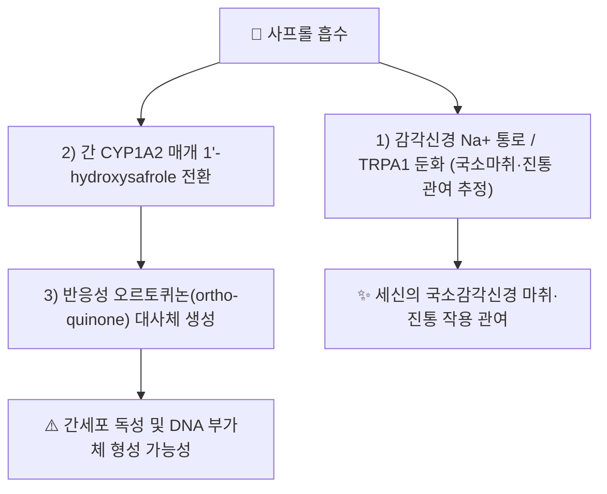

---
aliases:
  - Safrole
  - 사프롤
tags:
  - 약리성분
  - 세신
  - 정유성분
---

# 🔬 사프롤 (Safrole)

> **핵심 3줄 요약 (Key Summary)**:
> - 🌿 기원 본초 & 화학 계열: [[세신]](細辛, *Asarum* spp.) 등의 정유(精油)에 함유된 페닐프로파노이드(phenylpropanoid) 계열 벤조디옥솔 화합물. 사사프라스(Sassafras albidum) 뿌리껍질 정유의 주성분으로도 잘 알려져 있습니다.
> - 🎯 핵심 분자 표적 & 조절 경로: 감각신경의 전위의존성 나트륨 통로 및 TRPA1 채널 둔화를 통한 국소 감각신경 마취·진통 작용에 관여하는 것으로 제시되며(세신 노트 내용 연계), 간에서는 CYP1A2 등에 의해 1'-하이드록시사프롤을 거쳐 반응성 오르토퀴논(ortho-quinone) 대사체로 활성화됩니다.
> - 🩺 주요 약리 활성: [[세신]]의 국소 마취·진통·거풍산한(祛風散寒) 효능에서 [[메틸유게놀]]·[[히게나민]]과 함께 감각신경 전달 차단에 기여하는 것으로 제시됩니다.
> - ⚠️ 독성·생체이용률 한계 & 상호작용: 국제암연구소(IARC) Group 2B(인체 발암 가능물질)로 분류되며, CYP 매개 대사 활성화 산물이 간세포 독성·DNA 부가체 형성을 유발할 수 있어 고용량·장기 단독 섭취는 피해야 합니다. 세신 전탕액 중 사프롤 함량은 한약재 규격상 별도 관리 대상입니다.

---

## 📌 목차
1. [기본 화학 정보](#1-기본-화학-정보)
2. [주요 함유 본초 및 천연 기원](#2-주요-함유-본초-및-천연-기원)
3. [분자약리 표적 & 대사 활성화 경로](#3-분자약리-표적--대사-활성화-경로)
4. [독성학적 평가](#4-독성학적-평가)
5. [한의학적 연계](#5-한의학적-연계)
6. [출처 및 학술 참고 문헌 (References)](#6-출처-및-학술-참고-문헌-references)

---

## 1. 기본 화학 정보

| 항목 | 상세 내용 |
| :--- | :--- |
| **화학 골격 분류** | 페닐프로파노이드계 벤조디옥솔(benzodioxole) 정유 성분 |
| **분자식 / 분자량** | C₁₀H₁₀O₂ |
| **PubChem CID** | [5144](https://pubchem.ncbi.nlm.nih.gov/compound/Safrole) |
| **CAS 등록 번호** | 94-59-7 |

---

## 2. 주요 함유 본초 및 천연 기원 (Botanical Sources & Content)

| 함유 본초 (한글/한자) | 기원 식물학적 명칭 | 주요 함유 부위 | 한의학적 귀경 및 약효 특성 |
| :--- | :--- | :--- | :--- |
| [[세신]] (細辛) | 쥐방울덩굴과 / *Asarum sieboldii*, *A. heterotropoides* 등 | 뿌리·뿌리줄기(정유) | 폐·신·심경 귀경, 거풍산한·통규·온폐화음 |

---

## 3. 분자약리 표적 & 대사 활성화 경로

* **감각신경 차단 관여**: [[세신]] 노트에 따르면 사프롤은 [[메틸유게놀]]과 함께 전위의존성 나트륨 통로 및 감각신경 TRPA1 채널을 둔화시켜 국소 감각신경 마취 및 진통·진해 작용에 관여하는 것으로 서술되어 있습니다(세신 노트 원문 근거, 별도 임상연구 인용 없음 — ⚠️ 확인 필요).
* **간 대사 활성화 기전**: 2019년 HepaRG 세포주 연구에서 사프롤이 CYP1A2 매개 1'-수산화를 거쳐 오르토퀴논 반응성 대사체로 전환되며 세포독성을 유발함이 규명되었습니다(PMID 30865484).

---

## 4. 독성학적 평가

* **gpt delta 랫드 모델 포괄적 독성시험**: 중기(medium-term) 랫드 발암성 스크리닝 모델에서 사프롤의 유전독성·발암 관련 지표를 종합 평가한 연구가 보고되어 있습니다(PMID 22024337, *Toxicology*).
* **IARC 분류**: 사프롤은 국제암연구소(IARC) 및 미국 국가독성프로그램(NTP) 발암물질 보고서에서 Group 2B(인체 발암 가능물질, possibly carcinogenic to humans)로 분류되어 있습니다(NTP 「Report on Carcinogens, 15th Edition」, NCBI Bookshelf ID: NBK590823).

⚠️ 내용 검토 필요: 위 독성 연구는 고농도 단일성분 투여(동물·세포) 기준이며, 세신 전탕액 등 한약재 형태의 저농도·복합 성분 섭취 시의 실제 인체 위해도와는 별개로 해석해야 합니다.

---

## 5. 한의학적 연계

사프롤은 [[세신]]의 거풍산한(祛風散寒)·통규(通竅)·온폐화음(溫肺化飮) 효능에서 [[메틸유게놀]]·[[히게나민]]과 함께 언급되는 국소감각신경 마취 관련 정유 성분으로, 세신의 용량 제한(과용 시 독성 우려) 논의와 연계하여 참고할 수 있습니다.

---

## 6. 출처 및 학술 참고 문헌 (References)

1. **"Cytotoxicity of safrole in HepaRG cells: studies on the role of CYP1A2-mediated ortho-quinone metabolic activation" (2019)**. *Xenobiotica*, 49(12). DOI: [10.1080/00498254.2019.1590882](https://doi.org/10.1080/00498254.2019.1590882). PMID: [30865484](https://pubmed.ncbi.nlm.nih.gov/30865484/).
   - **[연구 요약]**: 사프롤이 간세포(HepaRG)에서 CYP1A2 매개 오르토퀴논 대사체로 활성화되어 세포독성을 유발하는 기전을 규명. (저자명 상세는 검색 스니펫만으로 확인되지 않아 기재하지 않음 ⚠️)
2. **"Comprehensive toxicity study of safrole using a medium-term animal model with gpt delta rats"**. *Toxicology*. PMID: [22024337](https://pubmed.ncbi.nlm.nih.gov/22024337/).
   - **[연구 요약]**: gpt delta 랫드를 이용한 사프롤의 유전독성·발암 관련 종합 독성평가. (저자명·정확한 발행연도는 검색 스니펫만으로 확인되지 않아 기재하지 않음 ⚠️)
3. **National Toxicology Program**. "Safrole" — *Report on Carcinogens, 15th Edition*. NCBI Bookshelf ID: [NBK590823](https://www.ncbi.nlm.nih.gov/books/NBK590823/).
   - **[정부 발암물질 보고서]**: IARC Group 2B 분류 근거 및 노출 경로 정리.
4. **PubChem CID 5144 (Safrole)**. National Center for Biotechnology Information.
   - **[화학 데이터베이스]**: 분자식·CAS 번호 등 공인 화학 데이터.

> ⚠️ 내용 검토 필요: 세신 내 사프롤의 국소마취 관여 서술은 기존 [[세신]] 노트의 원문 필기를 근거로 하며, 이를 직접 검증하는 개별 PubMed 논문은 이번 검색 범위에서 확인하지 못했습니다. 추후 정밀 확인을 권장합니다.
