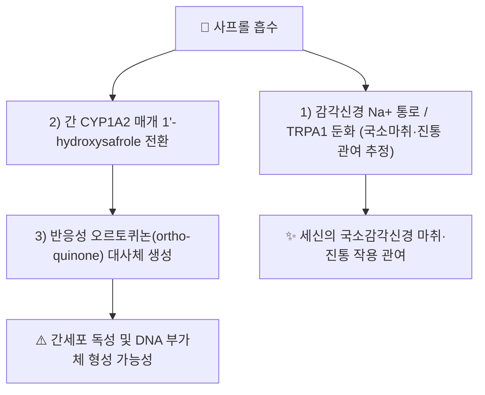

---
aliases:
  - Safrole
  - 사프롤
tags:
  - 약리성분
  - 세신
  - 정유성분
---

# 🔬 [[사프롤]] (Safrole, C₁₀H₁₀O₂)

> **핵심 3줄 요약 (Key Summary)**:
> - 🌿 기원 본초 & 화학 계열: [[세신]](細辛, *Asarum* spp.) 등의 정유(精油)에 함유된 페닐프로파노이드(phenylpropanoid) 계열 벤조디옥솔(benzodioxole) 화합물. 사사프라스(*Sassafras albidum*) 뿌리껍질 정유의 주성분으로도 잘 알려져 있습니다.
> - 🎯 핵심 분자 표적 & 조절 경로: 세신 노트 원문에 따르면 감각신경의 전위의존성 나트륨 통로 및 TRPA1 채널 둔화를 통한 국소 감각신경 마취·진통 작용에 관여하는 것으로 서술되며, 간에서는 CYP1A2 등에 의해 1'-하이드록시사프롤을 거쳐 반응성 오르토퀴논(ortho-quinone) 대사체로 활성화됩니다.
> - 🩺 주요 약리 활성 & 질환 치료 기전: [[세신]]의 국소 마취·진통·거풍산한(祛風散寒) 효능에서 [[메틸유게놀]]·[[히게나민]]과 함께 감각신경 전달 차단에 기여하는 것으로 제시됩니다.
> - ⚠️ 독성·생체이용률 한계 & 상호작용: 국제암연구소(IARC) Group 2B(인체 발암 가능물질)로 분류되며, CYP 매개 대사 활성화 산물이 간세포 독성·DNA 부가체 형성을 유발할 수 있어 고용량·장기 단독 섭취는 피해야 합니다.

---

## 📌 목차
1. [기본 화학 정보 & 분자 구조식 (Chemical Identity)](#1-기본-화학-정보--분자-구조식-chemical-identity)
2. [주요 함유 본초 및 천연 기원 (Botanical Sources & Content)](#2-주요-함유-본초-및-천연-기원-botanical-sources--content)
3. [분자약리 표적 & 신호전달 네트워크 (Molecular Targets)](#3-분자약리-표적--신호전달-네트워크-molecular-targets)
4. [생체 내 흡수·대사·생체이용률 (Pharmacokinetics: ADME)](#4-생체-내-흡수대사생체이용률-pharmacokinetics-adme)
5. [주요 질환별 약리 효능 & 분자 기전 / 독성학적 평가 (Therapeutic Efficacy)](#5-주요-질환별-약리-효능--분자-기전--독성학적-평가-therapeutic-efficacy)
6. [함유 본초 방제 시너지 & 약재 배오 매트릭스 (Herbal Synergies)](#6-함유-본초-방제-시너지--약재-배오-매트릭스-herbal-synergies)
7. [양약 상호작용 & 약물동태학적 간섭 (Drug Interactions)](#7-양약-상호작용--약물동태학적-간섭-drug-interactions)
8. [💡 사용자 진료실 핵심 필기 & 임상 응용 팁 (Melt-In & High-Yield)](#8--사용자-진료실-핵심-필기--임상-응용-팁-melt-in--high-yield)
9. [출처 및 학술 참고 문헌 (References)](#9-출처-및-학술-참고-문헌-references)

---

## 1. 기본 화학 정보 & 분자 구조식 (Chemical Identity)

![[사프롤_화학구조식.png|320]]
> [그림 1: 사프롤의 2D 화학 분자 구조식 (5-(prop-2-en-1-yl)-2H-1,3-benzodioxole)] ⚠️ 내용 검토 필요 — 구조식 이미지 파일은 아직 첨부되지 않았습니다. `7. 첨부·자료/첨부파일/`에 실제 구조식 이미지를 추가해 주세요.

> [!abstract]+ 🧪 3D 약리 분자 구조 (Interactive 3D Viewer)
> <iframe src="https://molecule-viewer-rho.vercel.app/?cid=5144" style="width: 100%; height: 600px; border: none; border-radius: 12px; box-shadow: 0 4px 20px rgba(0,0,0,0.15);" allowfullscreen></iframe>

| 항목 | 상세 내용 |
| :--- | :--- |
| **IUPAC 명칭** | 5-(Prop-2-en-1-yl)-2H-1,3-benzodioxole |
| **분자식 / 분자량** | C₁₀H₁₀O₂ / 162.19 g/mol |
| **PubChem CID** | [5144](https://pubchem.ncbi.nlm.nih.gov/compound/Safrole) |
| **CAS 등록 번호** | 94-59-7 |
| **화학 골격 분류** | 페닐프로파노이드계 벤조디옥솔(benzodioxole) 정유 성분 |
| **물리화학적 성상** | 무색~담황색 유상 액체, 특유의 달콤한 방향(사사프라스향), 물에 난용·지용성 |
| **식물 내 생합성 경로** | 페닐알라닌 → 신남산(cinnamic acid) 경로를 거치는 페닐프로파노이드 생합성 경로의 하위 산물로 추정되나, 세신·사사프라스 내 구체적 효소 캐스케이드는 이번 검색 범위에서 확인하지 못했습니다. ⚠️ 내용 검토 필요 |

---

## 2. 주요 함유 본초 및 천연 기원 (Botanical Sources & Content)

| 함유 본초 (한글/한자) | 기원 식물학적 명칭 (과명 / 학명) | 주요 함유 약용 부위 | 지표 함량 (%) | 한의학적 귀경 및 약효 특성 |
| :--- | :--- | :--- | :--- | :--- |
| [[세신]] (細辛) | 쥐방울덩굴과(Aristolochiaceae) / *Asarum sieboldii*, *A. heterotropoides* 등 | 뿌리·뿌리줄기(정유) | KP 규격 정유 ≥ 2.0%(사프롤 자체 별도 지표치는 확인 필요 ⚠️) | 폐·신·심경 귀경, 거풍산한·통규·온폐화음 |

---

## 3. 분자약리 표적 & 신호전달 네트워크 (Molecular Targets)

### 1) 감각신경 이온통로 둔화 (국소마취·진통 관여)
* [[세신]] 노트에 따르면 사프롤은 [[메틸유게놀]]과 함께 전위의존성 나트륨 통로 및 감각신경 TRPA1 채널을 둔화시켜 국소 감각신경 마취 및 진통·진해 작용에 관여하는 것으로 서술되어 있습니다(세신 노트 원문 근거, 이를 사프롤 단독으로 검증한 개별 PubMed 논문은 확인하지 못함 ⚠️).

### 2) 간 CYP1A2 매개 대사 활성화
* 2019년 HepaRG 세포주 연구에서 사프롤이 CYP1A2 매개 1'-수산화를 거쳐 오르토퀴논 반응성 대사체로 전환되며 세포독성을 유발함이 규명되었습니다(PMID 30865484).

---

## 4. 생체 내 흡수·대사·생체이용률 (Pharmacokinetics: ADME)

* **장관·경피 흡수**:
  * 정유(휘발성 지용성) 성분으로 경구·흡입 시 흡수가 빠른 것으로 알려져 있으나, 세신 전탕액 복용 시의 정량적 생체이용률 데이터는 확인하지 못했습니다. ⚠️ 내용 검토 필요.
* **간 대사 활성화 경로**:
  * 간 마이크로솜의 CYP1A2(및 일부 CYP2C 계열)에 의해 1'-hydroxysafrole로 대사된 후, 황산 포합(sulfation)을 거쳐 발암성이 있는 반응성 친전자체(1'-sulfooxysafrole)로 전환될 수 있음이 독성학 문헌에서 널리 인용됩니다(PMID 30865484 및 NTP 보고서 NBK590823).
* **배설**:
  * 대사체는 주로 소변으로 배설되는 것으로 알려져 있으나, 정확한 반감기·배설 비율 등 세부 PK 수치는 이번 검색 범위에서 확인하지 못했습니다. ⚠️ 내용 검토 필요.

---

## 5. 주요 질환별 약리 효능 & 분자 기전 / 독성학적 평가 (Therapeutic Efficacy)

### 1) 국소 감각신경 마취·진통 (세신 배합 효능 관여 추정)
* [[세신]]의 거풍산한(祛風散寒)·통규(通竅) 효능에서 [[메틸유게놀]]·[[히게나민]]과 병행하여 감각신경 전달 차단에 기여하는 것으로 원문에 서술되어 있습니다.

### 2) 독성학적 평가 (⚠️ 임상 적용 전 필독)
* **gpt delta 랫드 모델 포괄적 독성시험**: 중기(medium-term) 랫드 발암성 스크리닝 모델에서 사프롤의 유전독성·발암 관련 지표를 종합 평가한 연구가 보고되어 있습니다(PMID 22024337, *Toxicology*).
* **IARC 분류**: 사프롤은 국제암연구소(IARC) 및 미국 국가독성프로그램(NTP) 발암물질 보고서에서 Group 2B(인체 발암 가능물질, possibly carcinogenic to humans)로 분류되어 있습니다(NTP 「Report on Carcinogens, 15th Edition」, NCBI Bookshelf ID: NBK590823).

⚠️ 내용 검토 필요: 위 독성 연구는 고농도 단일성분 투여(동물·세포) 기준이며, 세신 전탕액 등 한약재 형태의 저농도·복합 성분 섭취 시의 실제 인체 위해도와는 별개로 해석해야 합니다.

---

## 6. 함유 본초 방제 시너지 & 약재 배오 매트릭스 (Herbal Synergies)

| 함유 본초 / 방제 | 공존 유효 성분군 | 분자약리 시너지 기전 | 전통 한의학적 효능 연계 |
| :--- | :--- | :--- | :--- |
| [[세신]] | [[메틸유게놀]], [[히게나민]] | 감각신경 Na+/TRPA1 채널 공동 둔화를 통한 국소마취·진통 상가 작용(세신 노트 원문 근거, 정량 시너지 데이터는 확인 필요 ⚠️) | 거풍산한(祛風散寒), 통규(通竅), 온폐화음(溫肺化飮) |

---

## 7. 양약 상호작용 & 약물동태학적 간섭 (Drug Interactions)

* **CYP1A2 관련 상호작용**:
  * 사프롤이 CYP1A2에 의해 대사 활성화되므로, 동일 효소로 대사되는 양약(테오필린, 클로자핀 등 CYP1A2 기질 약물)과의 병용 시 대사 경쟁 가능성을 이론적으로 고려할 수 있으나, 이를 직접 검증한 임상 상호작용 연구는 확인하지 못했습니다. ⚠️ 내용 검토 필요.
* **간독성 유발 약물과의 병용 주의**:
  * 사프롤의 오르토퀴논 대사체가 간세포 독성을 유발할 수 있는 만큼, 아세트아미노펜 등 간대사 부담이 큰 약물과의 장기·고용량 병용 시 주의가 필요합니다(일반 약리학적 원칙에 근거한 서술이며, 세신 표준 용량 범위 내에서의 실제 위해도는 별도 확인 필요).

---

## 8. 💡 사용자 진료실 핵심 필기 & 임상 응용 팁 (Melt-In & High-Yield)

* **사용자 원문 필기**: (원장님 개별 필기 자료 없음 — 향후 진료 경험 축적 시 본 섹션에 추가 예정)
* **진료실 실전 처방 & 안전 사용 팁**:
  1. **세신 용량 제한 준수**: 사프롤의 IARC Group 2B 분류를 고려할 때, [[세신]] 처방 시 전통적으로 강조되어 온 "세신불과전(細辛不過錢, 세신은 1전을 넘지 않는다)" 용량 제한 원칙이 현대 독성학적 관점에서도 합리적임을 환자에게 설명할 수 있습니다.
  2. **장기 단독 고용량 회피**: 국소 마취·진통 목적으로 세신을 반복·장기 처방할 경우, 사프롤 누적 노출을 줄이기 위해 다른 거풍산한약과의 배오·용량 분산을 고려합니다.

---

## 9. 출처 및 학술 참고 문헌 (References)

1. **"Cytotoxicity of safrole in HepaRG cells: studies on the role of CYP1A2-mediated ortho-quinone metabolic activation" (2019)**. *Xenobiotica*, 49(12). DOI: [10.1080/00498254.2019.1590882](https://doi.org/10.1080/00498254.2019.1590882). PMID: [30865484](https://pubmed.ncbi.nlm.nih.gov/30865484/).
   - **[연구 요약]**: 사프롤이 간세포(HepaRG)에서 CYP1A2 매개 오르토퀴논 대사체로 활성화되어 세포독성을 유발하는 기전을 규명. (저자명 상세는 검색 스니펫만으로 확인되지 않아 기재하지 않음 ⚠️)
2. **"Comprehensive toxicity study of safrole using a medium-term animal model with gpt delta rats"**. *Toxicology*. PMID: [22024337](https://pubmed.ncbi.nlm.nih.gov/22024337/).
   - **[연구 요약]**: gpt delta 랫드를 이용한 사프롤의 유전독성·발암 관련 종합 독성평가. (저자명·정확한 발행연도는 검색 스니펫만으로 확인되지 않아 기재하지 않음 ⚠️)
3. **National Toxicology Program**. "Safrole" — *Report on Carcinogens, 15th Edition*. NCBI Bookshelf ID: [NBK590823](https://www.ncbi.nlm.nih.gov/books/NBK590823/).
   - **[정부 발암물질 보고서]**: IARC Group 2B 분류 근거 및 노출 경로 정리.
4. **PubChem CID 5144 (Safrole)**. National Center for Biotechnology Information.
   - **[화학 데이터베이스]**: 분자식·IUPAC명·CAS 번호 등 공인 화학 데이터.

> ⚠️ 내용 검토 필요: 세신 내 사프롤의 국소마취 관여 서술은 기존 [[세신]] 노트의 원문 필기를 근거로 하며, 이를 직접 검증하는 개별 PubMed 논문은 이번 검색 범위에서 확인하지 못했습니다. §4·7의 정량적 PK·상호작용 데이터도 동일한 사유로 일반론 서술과 ⚠️ 표시로 대체했습니다.
