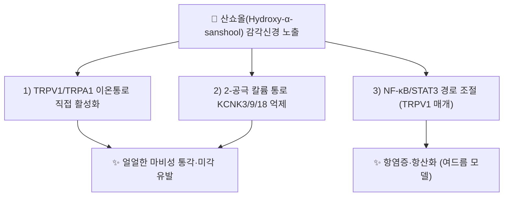

---
aliases:
  - Sanshool
  - Hydroxy-alpha-sanshool
  - Hydroxy-α-sanshool
  - 산쇼올
  - 산초올
tags:
  - 약리성분
  - 촉초
  - 화초
---

# 🔬 [[산쇼올]] (Sanshool, Hydroxy-α-sanshool 기준 C₁₆H₂₅NO₂)

> **핵심 3줄 요약 (Key Summary)**:
> - 🌿 기원 본초 & 화학 계열: [[촉초]](蜀椒)·화초(花椒, *Zanthoxylum* spp., 산초나무속) 열매(과피)에 함유된 불포화 지방산 아마이드(alkylamide)계 매운맛 성분군의 총칭. α-sanshool, β-sanshool, γ-sanshool, hydroxy-α-sanshool 등 다수 유사체를 포괄합니다.
> - 🎯 핵심 분자 표적 & 조절 경로: 감각신경의 TRPV1·TRPA1 이온통로 직접 활성화 및 2-공극 칼륨 통로(KCNK3·KCNK9·KCNK18) 억제를 통해 독특한 "얼얼한 마비성(tingling)" 감각을 유발합니다.
> - 🩺 주요 약리 활성 & 질환 치료 기전: 진통·온중산한(溫中散寒, 장간막 혈류 증가)·항염증·항산화 활성이 세포·동물 연구로 보고되며, 최근에는 여드름 염증 개선 및 대사조절(비만·인슐린저항성) 관련 연구도 진행되고 있습니다.
> - ⚠️ 독성·생체이용률 한계 & 상호작용: 대부분 세포·동물 연구 단계이며 인체 임상 데이터는 제한적입니다. 국소 고용량 노출 시 자극성 감각 이상(마비감·저림)을 유발할 수 있습니다.

---

## 📌 목차
1. [기본 화학 정보 & 분자 구조식 (Chemical Identity)](#1-기본-화학-정보--분자-구조식-chemical-identity)
2. [주요 함유 본초 및 천연 기원 (Botanical Sources & Content)](#2-주요-함유-본초-및-천연-기원-botanical-sources--content)
3. [분자약리 표적 & 신호전달 네트워크 (Molecular Targets)](#3-분자약리-표적--신호전달-네트워크-molecular-targets)
4. [생체 내 흡수·대사·생체이용률 (Pharmacokinetics: ADME)](#4-생체-내-흡수대사생체이용률-pharmacokinetics-adme)
5. [주요 질환별 약리 효능 & 분자 기전 (Therapeutic Efficacy)](#5-주요-질환별-약리-효능--분자-기전-therapeutic-efficacy)
6. [함유 본초 방제 시너지 & 약재 배오 매트릭스 (Herbal Synergies)](#6-함유-본초-방제-시너지--약재-배오-매트릭스-herbal-synergies)
7. [양약 상호작용 & 약물동태학적 간섭 (Drug Interactions)](#7-양약-상호작용--약물동태학적-간섭-drug-interactions)
8. [💡 사용자 진료실 핵심 필기 & 임상 응용 팁 (Melt-In & High-Yield)](#8--사용자-진료실-핵심-필기--임상-응용-팁-melt-in--high-yield)
9. [출처 및 학술 참고 문헌 (References)](#9-출처-및-학술-참고-문헌-references)

---

## 1. 기본 화학 정보 & 분자 구조식 (Chemical Identity)

![[산쇼올_화학구조식.png|320]]
> [그림 1: Hydroxy-α-sanshool의 2D 화학 분자 구조식] ⚠️ 내용 검토 필요 — 구조식 이미지 파일은 아직 첨부되지 않았습니다. `7. 첨부·자료/첨부파일/`에 실제 구조식 이미지를 추가해 주세요.

> [!abstract]+ 🧪 3D 약리 분자 구조 (Interactive 3D Viewer)
> <iframe src="https://molecule-viewer-rho.vercel.app/?cid=10084135" style="width: 100%; height: 600px; border: none; border-radius: 12px; box-shadow: 0 4px 20px rgba(0,0,0,0.15);" allowfullscreen></iframe>

| 항목 | 상세 내용 (Hydroxy-α-sanshool 기준) |
| :--- | :--- |
| **IUPAC 명칭** | (2E,6Z,8E,10E)-N-(2-Hydroxy-2-methylpropyl)dodeca-2,6,8,10-tetraenamide |
| **분자식 / 분자량** | C₁₆H₂₅NO₂ / 263.38 g/mol |
| **PubChem CID** | [10084135](https://pubchem.ncbi.nlm.nih.gov/compound/10084135) (Hydroxy-α-sanshool) |
| **CAS 등록 번호** | 83883-10-7 (hydroxy-α-sanshool) / 504-97-2 (α-sanshool) |
| **화학 골격 분류** | 불포화 지방산 아마이드(폴리인 아마이드, alkylamide) |
| **물리화학적 성상** | 담황색 유상 물질, 특유의 얼얼한 마비성 매운맛, 지용성 |
| **식물 내 생합성 경로** | 폴리케타이드/지방산 아마이드 생합성 경로 산물로 추정되나, 촉초 내 구체적 효소 캐스케이드는 이번 검색 범위에서 확인하지 못했습니다. ⚠️ 내용 검토 필요 |

---

## 2. 주요 함유 본초 및 천연 기원 (Botanical Sources & Content)

| 함유 본초 (한글/한자) | 기원 식물학적 명칭 (과명 / 학명) | 주요 함유 약용 부위 | 지표 함량 (%) | 한의학적 귀경 및 약효 특성 |
| :--- | :--- | :--- | :--- | :--- |
| [[촉초]] (蜀椒) | 운향과(Rutaceae) / *Zanthoxylum bungeanum* 등 | 열매(과피) | 지표 함량 별도 확인 필요 ⚠️ | 비·위·신경 귀경, 온중산한·살충지통 |

---

## 3. 분자약리 표적 & 신호전달 네트워크 (Molecular Targets)

### 1) TRPV1/TRPA1 활성화 & KCNK 이공극 칼륨통로 억제
* 2007년 발표된 연구에서 hydroxy-α-sanshool이 감각신경의 TRPV1과 TRPA1을 동시에 활성화하여 특유의 얼얼한 마비성 감각을 유발함이 규명되었습니다(PMID 17767493). 후속 연구에서는 KCNK3·KCNK9·KCNK18(2-공극 칼륨 통로)의 억제가 산쇼올의 감각 이상 효과에 주된 역할을 하는 것으로 제시되었습니다.

### 2) NF-κB/STAT3 경로 조절 (항염증·항산화)
* 2023년 연구에서는 hydroxy-α-sanshool이 TRPV1을 매개로 NF-κB/STAT3 경로를 조절하여 항염증·항산화 효과를 나타내며, 여드름 관련 염증 모델에서 효능이 보고되었습니다(*Journal of Functional Foods*, 2023).

---

## 4. 생체 내 흡수·대사·생체이용률 (Pharmacokinetics: ADME)

* **경구·구강점막 흡수**:
  * 지용성 알킬아마이드로 구강·위장관 점막을 통한 흡수가 빠른 것으로 추정되나, 정량적 생체이용률 데이터는 확인하지 못했습니다. ⚠️ 내용 검토 필요.
* **대사·배설**:
  * 불포화 지방산 아마이드 계열 화합물 특성상 지방산 β-산화와 유사한 경로로 대사될 가능성이 제시되나, 산쇼올에 특정된 CYP 대사·반감기 연구는 이번 검색 범위에서 확인하지 못했습니다. ⚠️ 내용 검토 필요.

---

## 5. 주요 질환별 약리 효능 & 분자 기전 (Therapeutic Efficacy)

### 1) 통증·감각 조절
* TRPV1/TRPA1 활성화 및 KCNK 억제를 통한 독특한 진통·마비성 감각 유발 — 촉초의 살충지통(殺蟲止痛) 효능과 연계.
### 2) 염증·피부(여드름)
* TRPV1 매개 NF-κB/STAT3 경로 조절을 통한 항염증·항산화 효과(2023년 연구).
### 3) 대사조절 (신규 연구 영역)
* 산쇼올류가 식욕·장내미생물총 조절을 통해 비만 개선에 관여할 가능성이 최신 연구(2026)에서 제시되고 있습니다.

⚠️ 내용 검토 필요: 대사조절(비만·인슐린저항성) 관련 연구는 2026년 발표된 최신 문헌으로, 임상 적용 근거로 삼기에는 아직 초기 단계(동물모델)임에 유의해야 합니다.

---

## 6. 함유 본초 방제 시너지 & 약재 배오 매트릭스 (Herbal Synergies)

| 함유 본초 / 방제 | 공존 유효 성분군 | 분자약리 시너지 기전 | 전통 한의학적 효능 연계 |
| :--- | :--- | :--- | :--- |
| [[촉초]] | 잔톡실린(Xanthoxyline), 제라니올 등 정유 성분 | TRPV1/TRPA1 활성화(산쇼올) + 방향성 정유의 국소 순환 촉진 상가 작용(정량 시너지 데이터는 확인 필요 ⚠️) | 온중산한(溫中散寒), 살충지통(殺蟲止痛) |

---

## 7. 양약 상호작용 & 약물동태학적 간섭 (Drug Interactions)

* **TRPV1 표적 약물과의 상호작용**:
  * 캡사이신 패치 등 TRPV1 표적 국소 제제와 병용 시 상가적 자극감이 발생할 수 있으나, 이를 직접 검증한 임상 상호작용 연구는 확인하지 못했습니다. ⚠️ 내용 검토 필요.
* **일반 위장관 자극성 약물과의 병용**:
  * 촉초 자체의 온열·자극성으로 인해 위장관 자극성 양약(NSAIDs 등)과 대량 병용 시 소화기 불편감이 가중될 수 있어 임상적 관찰이 권장됩니다(일반 원칙 기반 서술).

---

## 8. 💡 사용자 진료실 핵심 필기 & 임상 응용 팁 (Melt-In & High-Yield)

* **사용자 원문 필기**: (원장님 개별 필기 자료 없음 — 향후 진료 경험 축적 시 본 섹션에 추가 예정)
* **진료실 실전 처방 & 임상 응용 팁**:
  1. **온중산한 처방 활용**: 비위허한(脾胃虛寒)으로 인한 복통·설사 환자에게 [[촉초]] 배합 처방을 활용할 때, 산쇼올의 TRPV1/TRPA1 활성화를 통한 장간막 혈류 증가 기전을 환자에게 "온열감을 통한 순환 촉진"으로 설명할 수 있습니다.
  2. **실열(實熱) 체질 주의**: 산쇼올의 강한 자극성으로 인해 구강·위장관 실열이 있는 환자에게는 청열약과의 배오 또는 용량 조절이 필요합니다.

---

## 9. 출처 및 학술 참고 문헌 (References)

1. **"Hydroxy-alpha-sanshool activates TRPV1 and TRPA1 in sensory neurons" (2007)**. PMID: [17767493](https://pubmed.ncbi.nlm.nih.gov/17767493/).
   - **[연구 요약]**: hydroxy-α-sanshool이 감각신경에서 TRPV1과 TRPA1을 동시에 활성화하여 특유의 마비성 감각을 유발함을 최초로 규명. (저자명·게재 저널 상세는 검색 스니펫만으로 완전히 확인되지 않아 기재하지 않음 ⚠️)
2. **"Hydroxy-α-sanshool has anti-inflammatory and antioxidant effects and affects the NF-κB/STAT3 pathway via TRPV1 in acne" (2023)**. *Journal of Functional Foods*.
   - **[연구 요약]**: hydroxy-α-sanshool이 TRPV1 매개 NF-κB/STAT3 경로 조절을 통해 여드름 관련 염증·산화스트레스를 완화함을 보고. (저자명·DOI·PMID 상세는 검색 스니펫만으로 확인되지 않아 기재하지 않음 ⚠️)
3. **PubChem CID 10084135 (Hydroxy-alpha-Sanshool)**. National Center for Biotechnology Information.
   - **[화학 데이터베이스]**: 분자식·IUPAC명·CAS 번호 등 공인 화학 데이터.
4. **Wikipedia, "Hydroxy-α-sanshool"**.
   - **[참고]**: KCNK3/KCNK9/KCNK18 이공극 칼륨통로 억제 기전 서술 확인용 2차 자료(원 논문은 별도 확인 권장).

> ⚠️ 내용 검토 필요: 1·2번 문헌의 정확한 저자명·서지 상세(PMID 포함)는 이번 검색 범위 내에서 완전히 확인되지 않아 기재하지 않았습니다. §4·6·7의 정량적 PK·시너지·상호작용 데이터도 동일한 사유로 일반론 서술과 ⚠️ 표시로 대체했습니다.
