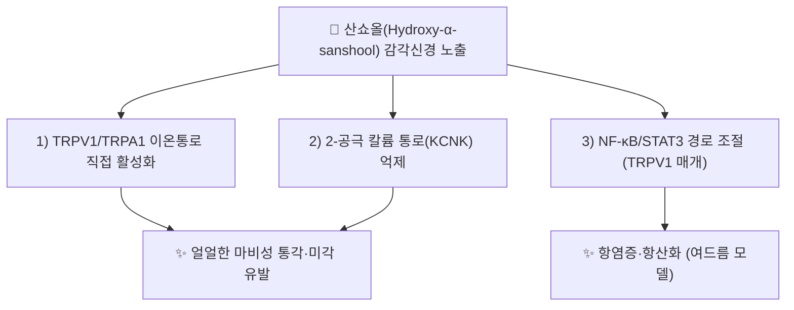

---
aliases:
  - Sanshool
  - Hydroxy-alpha-sanshool
  - Hydroxy-α-sanshool
  - 산쇼올
  - 산초올
tags:
  - 약리성분
  - 촉초
  - 화초
---

# 🔬 산쇼올 (Sanshool)

> **핵심 3줄 요약 (Key Summary)**:
> - 🌿 기원 본초 & 화학 계열: [[촉초]](蜀椒)·화초(花椒, *Zanthoxylum* spp., 산초나무속) 열매(과피)에 함유된 불포화 지방산 아마이드(alkylamide)계 매운맛 성분군의 총칭. α-sanshool, β-sanshool, γ-sanshool, hydroxy-α-sanshool 등 다수 유사체를 포괄합니다.
> - 🎯 핵심 분자 표적 & 조절 경로: 감각신경의 TRPV1·TRPA1 이온통로 직접 활성화 및 2-공극 칼륨 통로(KCNK, 예: TRAAK/TREK) 억제를 통해 독특한 "얼얼한 마비성(tingling)" 감각을 유발합니다.
> - 🩺 주요 약리 활성: 진통·온중산한(溫中散寒, 장간막 혈류 증가)·항염증·항산화 활성이 세포·동물 연구로 보고되며, 최근에는 여드름 염증 개선 및 대사조절(비만·인슐린저항성) 관련 연구도 진행되고 있습니다.
> - ⚠️ 독성·생체이용률 한계 & 상호작용: 대부분 세포·동물 연구 단계이며 인체 임상 데이터는 제한적입니다. 국소 고용량 노출 시 자극성 감각 이상(마비감·저림)을 유발할 수 있습니다.

---

## 📌 목차
1. [기본 화학 정보](#1-기본-화학-정보)
2. [주요 함유 본초 및 천연 기원](#2-주요-함유-본초-및-천연-기원)
3. [분자약리 표적 & 신호전달 네트워크](#3-분자약리-표적--신호전달-네트워크)
4. [주요 질환별 약리 효능 & 분자 기전](#4-주요-질환별-약리-효능--분자-기전)
5. [한의학적 연계](#5-한의학적-연계)
6. [출처 및 학술 참고 문헌 (References)](#6-출처-및-학술-참고-문헌-references)

---

## 1. 기본 화학 정보

| 항목 | 상세 내용 (Hydroxy-α-sanshool 기준) |
| :--- | :--- |
| **화학 골격 분류** | 불포화 지방산 아마이드(폴리인 아마이드, alkylamide) |
| **분자식** | C₁₆H₂₅NO₂ |
| **PubChem CID** | [10084135](https://pubchem.ncbi.nlm.nih.gov/compound/10084135) (Hydroxy-α-sanshool) |
| **CAS 등록 번호** | 83883-10-7 (hydroxy-α-sanshool) / 504-97-2 (α-sanshool) |

---

## 2. 주요 함유 본초 및 천연 기원 (Botanical Sources & Content)

| 함유 본초 (한글/한자) | 기원 식물학적 명칭 | 주요 함유 부위 | 한의학적 귀경 및 약효 특성 |
| :--- | :--- | :--- | :--- |
| [[촉초]] (蜀椒) | 운향과 / *Zanthoxylum bungeanum* 등 | 열매(과피) | 비·위·신경 귀경, 온중산한·살충지통 |

---

## 3. 분자약리 표적 & 신호전달 네트워크

* **감각신경 이온통로 활성화 기전**: 2007년 발표된 연구에서 hydroxy-α-sanshool이 감각신경의 TRPV1과 TRPA1을 동시에 활성화하여 특유의 얼얼한 마비성 감각을 유발함이 규명되었습니다(PMID 17767493).
* **항염증·항산화 기전**: 2023년 연구에서는 hydroxy-α-sanshool이 TRPV1을 매개로 NF-κB/STAT3 경로를 조절하여 항염증·항산화 효과를 나타내며, 여드름 관련 염증 모델에서 효능이 보고되었습니다(*Journal of Functional Foods*, 2023).

---

## 4. 주요 질환별 약리 효능 & 분자 기전

### 1) 통증·감각 조절
* TRPV1/TRPA1 활성화 및 KCNK 억제를 통한 독특한 진통·마비성 감각 유발 — 촉초의 살충지통(殺蟲止痛) 효능과 연계.
### 2) 염증·피부(여드름)
* TRPV1 매개 NF-κB/STAT3 경로 조절을 통한 항염증·항산화 효과(2023년 연구).
### 3) 대사조절 (신규 연구 영역)
* 산쇼올류가 식욕·장내미생물총 조절을 통해 비만 개선에 관여할 가능성이 최신 연구(2026)에서 제시되고 있습니다.

⚠️ 내용 검토 필요: 대사조절(비만·인슐린저항성) 관련 연구는 2026년 발표된 최신 문헌으로, 임상 적용 근거로 삼기에는 아직 초기 단계(동물모델)임에 유의해야 합니다.

---

## 5. 한의학적 연계

산쇼올은 [[촉초]]의 온중산한(溫中散寒)·살충지통(殺蟲止痛) 효능을 뒷받침하는 핵심 지표성분군으로, TRPV1/TRPA1 활성화를 통한 장간막 혈류 증가 및 진통 기전이 촉초의 전통 효능과 분자약리학적으로 연계됩니다.

---

## 6. 출처 및 학술 참고 문헌 (References)

1. **"Hydroxy-alpha-sanshool activates TRPV1 and TRPA1 in sensory neurons" (2007)**. PMID: [17767493](https://pubmed.ncbi.nlm.nih.gov/17767493/).
   - **[연구 요약]**: hydroxy-α-sanshool이 감각신경에서 TRPV1과 TRPA1을 동시에 활성화하여 특유의 마비성 감각을 유발함을 최초로 규명. (저자명·게재 저널 상세는 검색 스니펫만으로 완전히 확인되지 않아 기재하지 않음 ⚠️)
2. **"Hydroxy-α-sanshool has anti-inflammatory and antioxidant effects and affects the NF-κB/STAT3 pathway via TRPV1 in acne" (2023)**. *Journal of Functional Foods*.
   - **[연구 요약]**: hydroxy-α-sanshool이 TRPV1 매개 NF-κB/STAT3 경로 조절을 통해 여드름 관련 염증·산화스트레스를 완화함을 보고. (저자명·DOI·PMID 상세는 검색 스니펫만으로 확인되지 않아 기재하지 않음 ⚠️)
3. **PubChem CID 10084135 (Hydroxy-alpha-Sanshool)**. National Center for Biotechnology Information.
   - **[화학 데이터베이스]**: 분자식·CAS 번호 등 공인 화학 데이터.

> ⚠️ 내용 검토 필요: 1·2번 문헌의 정확한 저자명·서지 상세(PMID 포함)는 이번 검색 범위 내에서 완전히 확인되지 않아 기재하지 않았습니다. 정확한 인용이 필요할 경우 PubMed/저널 원문 확인을 권장합니다.
