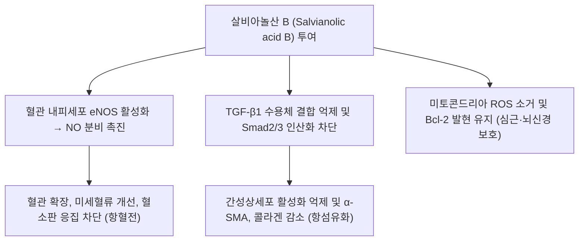

---
aliases:
  - Salvianolic acid B
  - Sal B
  - 살비아놀산B
  - 살비아놀산 B
tags:
  - 약리성분
  - 단삼
  - 페놀산
  - 활혈거어
  - 항섬유화
  - 심혈관보호
---

# 살비아놀산 B (Salvianolic Acid B)

> 핵심 요약 (Key Summary):
> 한약재 [[단삼]](Salvia miltiorrhiza)의 뿌리에서 추출되는 가장 대표적인 수용성 폴리페놀성 탄산(Lithospermic acid B) 유도체.
> 강력한 활성산소(ROS) 소거능과 함께 혈관 내피세포 eNOS 활성화를 통한 산화질소([[NO]]) 생성 촉진, 혈소판 응집 억제 및 항혈전 작용.
> [[TGF-β]]1/Smad 신호전달계를 직접 차단하여 간성상세포 활성화와 세포외 기질 축적을 막는 최고의 천연 항섬유화(Anti-fibrotic) 활성 성분.

---

## 1. 기본 화학 정보 & 분자 구조식 (Chemical Identity)

> [!abstract]+ 🧪 3D 약리 분자 구조 (Interactive 3D Viewer)
> <iframe src="https://molecule-viewer-rho.vercel.app/?cid=164676" style="width: 100%; height: 600px; border: none; border-radius: 12px; box-shadow: 0 4px 20px rgba(0,0,0,0.15);" allowfullscreen></iframe>

* **IUPAC 명칭**: (2R)-3-(3,4-dihydroxyphenyl)-2-[[(E)-3-[2-[(E)-2-(3,4-dihydroxyphenyl)ethenyl]-3,4-dihydroxyphenyl]prop-2-enoyl]oxy]propanoic acid
* **화학식 (Molecular Formula)**: $C_{36}H_{30}O_{16}$
* **분자량 (Molecular Weight)**: 718.62 g/mol
* **구조적 특성**:
  * 세 분자의 댄센수(Danshensu, 살비아산 A)와 한 분자의 카페산(Caffeic acid)이 축합된 독특한 테트라머(Tetramer) 폴리페놀 구조.
  * 단삼의 지용성 성분인 탄신논(Tanshinone)과 대비되는 **단삼의 대표 수용성(Water-soluble) 유효 지표 성분**.

---

## 2. 분자 약리 작용 및 기전 (Pharmacological MoA)

### 1) 강력한 항섬유화 작용 (TGF-$\beta$/Smad 경로 차단)
- 만성 간질환 및 신장 질환 모델에서 [[TGF-β]]1의 자가분비를 억제하고 Smad2 및 Smad3의 인산화와 핵 내 전위를 차단합니다.
- 간성상세포의 근섬유아세포성 증식을 억제하고 제1형, 제3형 콜라겐 침착을 억제하여 간경변증 및 신세뇨관 간질 섬유화를 유의하게 역전시킵니다.

### 2) 혈관 내피 보호 및 미세순환 촉진 (활혈거어)
- 혈관 내피세포의 eNOS(내피형 산화질소 합성효소) 인산화를 유도하여 [[NO]] 생성을 촉진, 혈관을 확장시키고 미세순환을 개선합니다.
- 아데노신 이인산(ADP) 및 트롬빈에 의해 유도되는 혈소판 응집을 억제하고 피브린 혈전을 용해하여 뇌경색 및 심근경색 후 재관류 손상을 완화합니다.

### 3) 뇌신경 및 심근세포 사멸 방지
- 허혈-재관류 손상 시 미토콘드리아 카스파제-3(Caspase-3) 활성화를 차단하고 항세포사멸 단백질(Bcl-2) 발현을 유지하여 신경세포 손상을 방어합니다.

---

## 3. 한의학 본초 및 처방 연계 (Phytomedicine Link)

* **기원 본초**:
  * [[단삼]](丹參): 활혈거어(活血祛瘀), 양혈소옹(凉血消癰), 통경지통(通經止痛), 청심제번(淸心除煩).
  * "일미단삼 음당사물탕(一味丹參 飮當四物湯: 단삼 한 가지만으로도 사물탕의 보혈·활혈 효능을 대신한다)"는 한의학적 평가의 주된 생화학적 근거가 살비아놀산 B입니다.
* **관련 처방 및 응용**:
  * 단삼음(丹參飮): 관상동맥경화, 협심증 심통, 위완통.
  * 관심2호방(冠心2號方): 심근허혈 및 협심증 관동맥 질환.
  * [[천왕보심단]](天王補心丹): 단삼이 배오되어 심음 부족으로 인한 심계, 불면을 안정.

---

## 4. 📚 출처 및 학술 연구 요약 (References)

1. Wang, Q., et al. (2012). "Salvianolic acid B: a review of its pharmacology, pharmacokinetics and toxicity." *Cell Biochemistry and Biophysics*, 64(2), 85-93.
   - [연구 요약] 단삼의 주성분 살비아놀산 B의 심혈관 보호, 뇌혈류 개선, 간 섬유화 억제 분자 메커니즘을 총괄 집대성한 리뷰.
2. Tao, Y. Y., et al. (2016). "Salvianolic acid B inhibits hepatic stellate cell activation and promotes apoptosis through the TGF-$\beta$1/Smad signaling pathway." *Liver International*, 36(6), 840-848.
   - [연구 요약] 살비아놀산 B가 간성상세포 활성화를 억제하고 세포사멸을 촉진하여 간 섬유화를 강력히 차단함을 증명.
