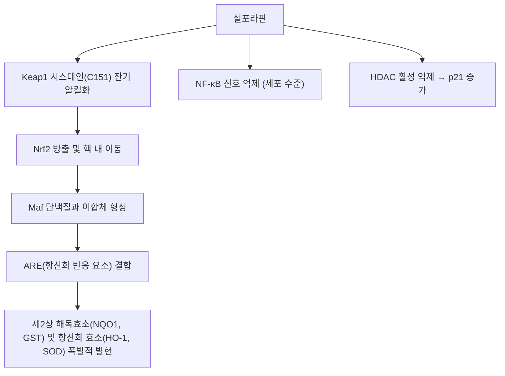

---
aliases:
  - Sulforaphane
  - SFN
  - 설포라판
tags:
  - 약리성분
  - 이소티오시아네이트
  - 나복자
---

# 🔬 설포라판 (Sulforaphane, C₆H₁₁NOS₂ / 1-isothiocyanato-4-(methylsulfinyl)butane)

> **핵심 3줄 요약 (Key Summary)**:
> - 🌿 기원 본초 & 화학 계열: 십자화과 채소(브로콜리 싹, 무씨 [[나복자]])의 글루코라파닌이 미로시나아제에 의해 가수분해되어 생성되는 천연 이소티오시아네이트. (⚠️ 무씨 나복자에서 확인된 대표 이소티오시아네이트는 글루코라페닌 유래의 sulforaphene(설포라펜)이며, 나복자의 글루코라파닌 함유는 확인하지 못했습니다. §2)
> - 🎯 핵심 분자 표적 & 조절 경로: Keap1의 시스테인 잔기 변형을 통한 [[Nrf2]] 전사인자 방출 및 생체 내 제2상 해독효소·항산화 효소의 가장 강력한 유도체. (⚠️ '가장 강력한'은 Zhang 1992 초록의 'very potent'와 다르며 확인하지 못했습니다. §3)
> - 🩺 주요 약리 활성 & 질환 치료 기전: 항암·신경보호·만성 염증 억제 및 한의 소식도체(消食導滯)·강기화담(降氣化痰)의 분자 약리 물질. (⚠️ 인체 근거는 소규모 임상시험에 한정되며 결과가 엇갈립니다. §5)
> - ⚠️ 독성·생체이용률 한계 & 상호작용: 조리(가열)로 미로시나아제가 불활성화되면 생체이용률이 크게 떨어지고(생 37% → 조리 3.4%), 개인차가 큽니다. 일부 세포 실험에서 CYP3A4 억제·CYP2D6 억제가 보고되었으나 임상 상호작용은 확인되지 않았습니다. (§4·§7)

---

## 📌 목차
1. [기본 화학 정보 & 분자 구조식 (Chemical Identity)](#1-기본-화학-정보--분자-구조식-chemical-identity)
2. [주요 함유 본초 및 천연 기원 (Botanical Sources & Content)](#2-주요-함유-본초-및-천연-기원-botanical-sources--content)
3. [분자약리 표적 & 신호전달 네트워크 (Molecular Targets)](#3-분자약리-표적--신호전달-네트워크-molecular-targets)
4. [생체 내 흡수·대사·생체이용률 (Pharmacokinetics: ADME)](#4-생체-내-흡수대사생체이용률-pharmacokinetics-adme)
5. [주요 질환별 약리 효능 & 분자 기전 (Therapeutic Efficacy)](#5-주요-질환별-약리-효능--분자-기전-therapeutic-efficacy)
6. [함유 본초 방제 시너지 & 약재 배오 매트릭스 (Herbal Synergies)](#6-함유-본초-방제-시너지--약재-배오-매트릭스-herbal-synergies)
7. [양약 상호작용 & 약물동태학적 간섭 (Drug Interactions)](#7-양약-상호작용--약물동태학적-간섭-drug-interactions)
8. [💡 사용자 진료실 핵심 필기 & 임상 응용 팁 (Melt-In & High-Yield)](#8--사용자-진료실-핵심-필기--임상-응용-팁-melt-in--high-yield)
9. [출처 및 학술 참고 문헌 (References)](#9-출처-및-학술-참고-문헌-references)

---

## 1. 기본 화학 정보 & 분자 구조식 (Chemical Identity)

> [!abstract]+ 🧪 3D 약리 분자 구조 (Interactive 3D Viewer)
> <iframe src="https://molecule-viewer-rho.vercel.app/?cid=5350" width="100%" height="450px" frameborder="0" allow="webgl" style="border-radius: 8px;"></iframe>

설포라판(Sulforaphane, SFN)은 황(Sulfur) 원자를 함유한 유기 이소티오시아네이트(Isothiocyanate) 화합물이다.

| 항목 | 상세 내용 |
| :--- | :--- |
| **IUPAC 명칭** | 1-isothiocyanato-4-(methylsulfinyl)butane (원문 표기). PubChem 등록명은 1-isothiocyanato-4-methylsulfinylbutane으로 같은 구조 |
| **분자식 / 분자량** | $C_6H_{11}NOS_2$ / 177.29 g/mol (원문 표기, PubChem 177.3) |
| **PubChem CID** | [5350](https://pubchem.ncbi.nlm.nih.gov/compound/5350) (PubChem 실측: 표제어 sulforaphane, C6H11NOS2). ⚠️ 정정: 원문 3D 뷰어의 CID 53535는 C15H11NO5S(3-[2-oxo-6-(thiophene-2-carbonyl)-1,3-benzoxazol-3-yl]propanoic acid)인 다른 화합물이었음 |
| **CAS 등록 번호** | 4478-93-7 (PubChem 이명 목록 기준, CAS 원본 대조는 못함) |
| **화학 골격 분류** | 이소티오시아네이트(–N=C=S)와 설피닐(sulfoxide)기를 함유한 유기황 화합물. 천연형은 (−)-(4R) 이성질체로 보고됨(Zhang 1992). CID 5350 레코드는 입체 표기가 없음 |
| **물리화학적 성상** | ⚠️ 내용 검토 필요 — 수용성·LogP·외관·맛은 확인하지 못함. 참고: Fahey 2015 초록은 설포라판을 농축·안정한 형태로 직접 인체에 전달하기 어렵다고 서술함 |
| **식물 내 생합성 경로** | 전구체 글루코라파닌(글루코시놀레이트)이 미로시나아제에 의해 가수분해되어 생성(아래 생성 기전). 글루코라파닌 자체의 생합성 경로는 원문에 서술 없음 ⚠️ |

* 화학식: $C_6H_{11}NOS_2$
* 분자량: 177.29 g/mol
* IUPAC명: 1-isothiocyanato-4-(methylsulfinyl)butane
* 생성 기전:
  * 식물 세포 손상 시(저작, 파쇄) 액포 내 전구체인 **글루코라파닌(Glucoraphanin)**이 세포질의 **미로시나아제(Myrosinase)** 효소와 만나 포도당이 유리되면서 설포라판으로 활성화됨.
* 기원: 브로콜리 싹, 케일, 겨자채, 십자화과 무 종자([[나복자]], Raphani Semen).
  * ⚠️ 내용 검토 필요: 브로콜리(SAGA 품종)에서의 분리·동정은 Zhang 1992로 확인됩니다. 케일·겨자채·무 종자의 설포라판 전구체 함량은 확인하지 못했습니다(§2).

---

## 2. 주요 함유 본초 및 천연 기원 (Botanical Sources & Content)

| 함유 본초 / 식품 | 기원 식물학적 명칭 (과명 / 학명) | 주요 함유 약용 부위 | 지표 함량 (%) | 한의학적 귀경 및 약효 특성 |
| :--- | :--- | :--- | :--- | :--- |
| [[나복자]] (萊菔子, Raphani Semen) | 십자화과 / *Raphanus sativus* | 종자 | ⚠️ 미확인 | 소식제창(消食除脹), 강기화담(降氣化痰). 귀경은 [[나복자]] 노트 참고 |
| 브로콜리 싹 (비한약재) | 십자화과 / *Brassica oleracea* var. *italica* | 새싹 | ⚠️ 원문에 수치 없음 | 해당 없음(식품). Zhang 1992가 SAGA 브로콜리에서 설포라판을 분리 |
| 케일·겨자채 (비한약재) | 십자화과 | ⚠️ 미확인 | ⚠️ 미확인 | 해당 없음(식품) |

* **원문 '무씨 나복자의 글루코라파닌' 서술 관련 ⚠️**: 무(*R. sativus*) 종자에서는 글루코라페닌(glucoraphenin)이 중요 성분이고 그 가수분해 이소티오시아네이트가 설포라판이 아닌 sulforaphene(설포라펜)으로 보고됩니다(Kuang 2013; Lee 2023). West 2004는 브로콜리·무 등 종자의 글루코라파닌을 정량했으나 초록에 수치가 없어 무 종자의 글루코라파닌 함량은 확인하지 못했습니다. 볼트 [[나복자]] 노트는 설포라판과 Sulforaphene를 함께 적고 있으나 이 구분은 그쪽 노트에서 다시 확인이 필요합니다.
* **함량(지표 함량 %)**: 원문에 수치 기재 없음. 문헌상 가열·조리·미로시나아제 활성 유무에 따라 실제 섭취 시 설포라판 노출이 크게 달라집니다(§4).
* **한약재 규격상의 지표 함량**: ⚠️ 내용 검토 필요 — 대한민국약전의 나복자 규격에 설포라판 함량 기준이 있는지는 확인하지 못했습니다.

---

## 3. 분자약리 표적 & 신호전달 네트워크 (Molecular Targets)

### 1) 핵심 분자 표적 (Molecular Targets)
1. **Nrf2 경로를 통한 독소 해독 및 항산화**:
   * 체내에 존재하는 화합물 중 **가장 강력한 Nrf2 전사인자 활성화제**.
   * 글루타치온-S-전이효소(GST), 헴 산소화효소-1(HO-1), NQO1의 발현을 유도하여 발암물질과 활성산소를 신속히 무독화.
   * 근거: Zhang 1992는 브로콜리에서 설포라판을 분리해 쥐 간암세포에서 퀴논 환원효소(NQO1) 유도능으로 추적했고, 아릴탄화수소 수용체 의존 1상 효소(CYP) 유도 없이 2상 효소를 선택적으로 유도하는 monofunctional inducer라고 기술했습니다. Dinkova-Kostova 2008은 Keap1/Nrf2/ARE 경로를 활성화하는 '간접 항산화제'가 세포보호 단백질(2상 효소)을 유도한다고 정리하며 설포라판을 예로 듭니다. 사람 간세포에서 GSTA1/2 mRNA가 유도되었고(Mahéo 1997), 중국 Qidong 시험에서 글루타치온 포합 배설물(벤젠 61%↑, 아크롤레인 23%↑)이 증가했습니다(Egner 2014).
   * Keap1 시스테인: 질량분석으로 C151이 설포라판에 의해 가장 쉽게 수식되는 시스테인 중 하나임이 확인되었으나(Hu 2011, 이전 질량분석 연구와 상충했던 결과를 시료 처리 방법을 바꿔 조정), Nrf2의 Keap1 의존 유비퀴틴화에 필수인 시스테인은 C273·C288로 보고되었고(Zhang DD 2003), 특정 시스테인 수식만으로는 Neh2 도메인 결합이 풀리지 않는다는 보고도 있습니다(Eggler 2005, 제목 기준). 설포라판 부가물 부위는 Hong 2005가 질량분석으로 규명했습니다.
   * ⚠️ 내용 검토 필요: '체내에 존재하는 화합물 중 가장 강력한' 활성화제라는 서술은 확인하지 못했습니다(Zhang 1992 초록은 'major and very potent' 유도제, 설포라판은 체내 화합물이 아닌 식물 유래). 'C151 알킬화'만으로 Nrf2 방출이 설명된다는 단선적 서술, Maf 이합체 형성, HO-1·SOD의 '폭발적' 발현은 초록으로 확인하지 못했습니다.
2. **NF-$\kappa$B 직접 억제 및 항염증**:
   * IKK 효소 활성을 차단하고 p65 소단위와의 직접 상호작용으로 염증성 사이토카인 생성을 차단.
   * 근거: Heiss 2001은 대식세포(RAW 264.7)에서 LPS 유도 NO·PGE2·TNF-α 분비가 줄고 iNOS·COX-2 발현이 전사 수준에서 억제되며, 설포라판이 NF-κB의 DNA 결합을 선택적으로 낮추되 IκB 분해나 핵 이동은 방해하지 않았다고 보고했습니다. Kim 2014는 TPA 자극 유방상피세포(MCF-10A)에서 IKK–NF-κB 신호와 COX-2 발현이 억제되며 표적이 NF-κB activating kinase와 ERK라고 제시했습니다. Zhu 2024는 TNFα를 준 Caco-2 세포에서 NF-κB(p65 및 IKK)와 ERK1/2 활성화가 억제되었다고 보고했습니다([[NF-κB]]).
   * ⚠️ 내용 검토 필요: 원문의 'IKK 효소 활성 차단'과 'p65와의 직접 상호작용'은 확인하지 못했습니다. 세포 종류에 따라 IκB 분해에 영향이 없다는 결과(Heiss 2001)와 IKK 신호 억제(Kim 2014, Zhu 2024)가 함께 보고되어 억제 단계가 일관되지 않으며, 티올과 결합해 NF-κB 소단위를 직접 불활성화할 '가능성'은 Heiss 2001이 가설로 제시한 수준입니다.
3. **세포자멸사 유도 및 암세포 주기 정지**:
   * 히스톤 탈아세틸화효소(HDAC)를 억제하여 종양 억제 유전자의 재발현을 유도, 암세포 사멸 촉진.
   * 근거: Myzak 2006은 마우스에 설포라판 10 μmol을 1회 경구 투여하면 6시간 뒤 결장 점막의 HDAC 활성이 유의하게 줄고 히스톤 H3·H4 아세틸화가 늘며, 식이 투여 시 회장·결장·전립선·말초혈 단핵세포에서 아세틸화 히스톤과 p21(WAF1)이 증가하고 Apc-minus 마우스의 종양 형성이 억제된다고 보고했습니다. Myzak 2007은 PC-3 전립선암 이종이식 성장이 40% 억제되었고, 사람에게 브로콜리 싹 68 g을 1회 섭취시키면 3·6시간에 말초혈 단핵세포 HDAC 활성이 유의하게 감소했다고 보고했습니다.
   * ⚠️ 내용 검토 필요: '암세포 사멸 촉진'과 '주기 정지'는 초록에서 직접 확인하지 못했습니다(확인된 것은 성장 억제와 p21 증가).

---

## 4. 생체 내 흡수·대사·생체이용률 (Pharmacokinetics: ADME)

* **장관 흡수와 조리의 영향**:
  * 건강한 남성 8명에게 브로콜리 200 g을 생으로 또는 익혀 먹인 교차시험에서 혈중·소변 설포라판 기준 생체이용률이 생 37%, 조리 3.4%였고, 최고 혈장 농도 도달 시간은 생 1.6시간, 조리 6시간이었으며 배설 반감기는 각각 2.6·2.4시간이었습니다(Vermeulen 2008). 12명 교차시험에서도 24시간 소변 이소티오시아네이트 배설이 생브로콜리 32.3%, 찐 브로콜리 10.2%였습니다(Conaway 2000).
  * 이소티오시아네이트를 직접 투여한 건강인 4명에서 혈장 농도는 투여 1시간에 최고(0.943~2.27 μmol/L)였고 반감기는 1.77±0.13시간, 8시간 누적 배설은 투여량의 58.3±2.8%였으며 청소율(369 ml/min)이 능동적 신세뇨관 분비를 시사했습니다(Ye 2002; 브로콜리 싹 이소티오시아네이트 약 200 μmol 단회 투여, 대부분 설포라판).
  * 글루코시놀레이트로 투여했을 때의 디티오카바메이트 누적 배설은 투여량의 약 17.8~19.6%였고, 이소티오시아네이트로 투여했을 때는 70.6%였습니다(Shapiro 2006).
  * 미로시나아제가 살아 있는 새싹·종자를 추출 없이 그대로 투여하면 설포라판의 생체이용률이 미로시나아제 없이 글루코라파닌만 투여한 경우보다 3~4배 높았습니다(Fahey 2015).
  * ⚠️ 내용 검토 필요: P-glycoprotein(P-gp) 기질성·장 투과 기전은 확인하지 못했습니다.
* **장내 미생물총(Microbiome) 대사 전환**:
  * 글루코시놀레이트는 사람 장내 세균에 의해 이소티오시아네이트로 전환되며, 브로콜리 200 g(조리) 섭취 후 소변 이소티오시아네이트 배설에 큰 개인차가 있었고 고배설자의 분변 세균이 글루코라파닌을 더 많이 분해했습니다(Li 2011, 23명). 당뇨 전단계 시험에서 반응군은 비활성 전구체를 설포라판으로 전환하는 데 필요한 Bacteroides 유래 전사조절인자 유전자 발현이 더 높았고 그 유전자 조합의 풍부도가 혈청 설포라판 농도와 상관되었습니다(Dwibedi 2025).
* **간 대사 및 소실 반감기**:
  * 설포라판은 글루타치온 포합 후 메르캅투르산 경로로 대사되어 설포라판-글루타치온·시스테인·N-아세틸시스테인 대사체를 만듭니다(Vanduchova 2016). 혈장 소실 반감기는 위 Ye 2002(약 1.8시간)와 Vermeulen 2008(배설 반감기 약 2.5시간)에서 확인됩니다.
  * ⚠️ 내용 검토 필요: 특정 CYP 효소에 의한 산화 대사 경로는 확인하지 못했습니다(§7).

---

## 5. 주요 질환별 약리 효능 & 분자 기전 (Therapeutic Efficacy)

### 1) 대사성 질환 (제2형 당뇨 & 전당뇨)
* 비만한 제2형 당뇨 환자에서 설포라판(농축 브로콜리 싹 추출물)이 공복 혈당과 당화혈색소(HbA1c)를 낮추었고, 간세포에서는 NRF2 핵 이동과 포도당신생 효소 발현 감소로 간 포도당 생성을 억제했습니다(Axelsson 2017).
* 당뇨 전단계 74명 무작위 시험에서 브로콜리 싹 추출물은 사전 정의한 1차 결과(공복 혈당 0.3 mmol/L 감소)를 달성하지 못했고 전체 평균 감소는 0.2 mmol/L였으며, 경도 비만·낮은 인슐린 저항성·낮은 인슐린 분비군에서 0.4 mmol/L 감소했습니다. 위장관 부작용이 있었습니다(Dwibedi 2025).

### 2) 화학예방·항암
* 재발성 전립선암 20명 2상 시험에서 설포라판 200 μmol/일 최대 20주 투여 시 PSA 50% 이상 감소는 1명뿐이어서 1차 결과는 달성되지 못했으나, PSA 배가 시간은 6.1개월에서 9.6개월로 늘었고 3등급 이상반응은 없었습니다(Alumkal 2015).
* 중국 Qidong 291명 12주 시험에서 글루코라파닌 600 μmol·설포라판 40 μmol을 매일 제공한 브로콜리 싹 음료가 벤젠(61%)·아크롤레인(23%) 메르캅투르산 배설을 늘렸으나 크로톤알데히드는 그렇지 않았습니다(Egner 2014).
* HDAC 억제와 p21 증가 등 기전 근거는 §3-3에 정리했습니다.

### 3) 호흡기 (천식)
* 중등도 천식 45명에게 설포라판 100 μmol/일을 14일 투여했을 때 60%에서 메타콜린에 의한 FEV1 감소가 평균 21% 완화되었으나 20%에서는 오히려 악화되고 나머지는 변화가 없어 반응 이질성이 컸습니다(Brown 2015). 한의학의 강기화담(降氣化痰) 개념과의 연결은 문헌으로 확인하지 못했습니다 ⚠️.

### 4) 신경발달 (자폐 스펙트럼)
* 중등도~중증 ASD 청년 44명(13~27세) 18주 이중맹검 시험에서 설포라판군의 ABC 점수가 34%, SRS 점수가 17% 개선되었고 중단 후 점수가 치료 전 수준으로 되돌아갔습니다(Singh 2014). 3~12세 어린이 57명 15주 시험에서는 1차 결과(OACIS)가 유의하지 않았고 ABC만 15주에 유의하게 개선되었습니다(Zimmerman 2021).
* ⚠️ 내용 검토 필요: 원문의 '신경보호'는 신경세포 보호 기전을 직접 보인 문헌은 확인하지 못했고, 위 자폐 행동척도 개선 결과만 확인됩니다.

### 5) 위장관·장벽 보호
* TNFα를 준 Caco-2 단층에서 글루코라파닌·설포라판이 투과성 증가와 TJ 단백질(occludin, ZO-1) 감소를 막았습니다(Zhu 2024).
* 인체 시험(89명)에서 설포라판 함유 브로콜리 싹 추출물은 *H. pylori* 감염 밀도(요소호기검사)를 줄이지 못했으나 위 점막 MDA(지질 과산화 지표)를 낮추었습니다(Chang 2015).
* ⚠️ 내용 검토 필요: 원문의 '위장관 해독'은 위 결과와 직접 대응하지 않습니다.

---

## 6. 함유 본초 방제 시너지 & 약재 배오 매트릭스 (Herbal Synergies)

### 한의학적 연계: 나복자(萊菔子)와 강기소식 (원문 §3)
한의학에서 십자화과 무의 종자인 [[나복자]](萊菔子)는 소화관의 막힌 음식물을 내리고(소식도체, 消食導滯), 가래를 삭이고 기를 내리는(강기화담, 降氣化痰) 요약이다.

| 본초 | 주요 효능 | 설포라판 매개 약리 연계 |
| :--- | :--- | :--- |
| [[나복자]] | 소식제창, 강기화담 | 설포라판 및 유기황 성분 함유, 위장관 해독 및 기관지 염증 배출 |
| [[백개자]] (원문 표기 백계자) | 온폐거담, 이기산결 | 이소티오시아네이트 계열 매개, 흉격 한담 용해 |

* ⚠️ 내용 검토 필요: 원문의 백계자 링크는 볼트에 노트가 없어 같은 효능(온폐거담·이기산결)의 [[백개자]] 노트로 바로잡았습니다. 볼트 [[백개자]] 노트의 이소티오시아네이트는 시니그린·시날빈 유래 알릴 이소티오시아네이트(AITC)이며 설포라판이 아닙니다. 위 표의 '설포라판 및 유기황 성분 함유'와 '위장관 해독 및 기관지 염증 배출'은 원문 서술로 보존하되 확인하지 못했습니다.

### 공존 성분·방제 배오 매트릭스

| 함유 본초 / 방제 | 공존 유효 성분군 | 분자약리 시너지 기전 | 전통 한의학적 효능 연계 |
| :--- | :--- | :--- | :--- |
| [[나복자]] | [[시니그린]] 등 글루코시놀레이트(볼트 나복자 노트 기준) | ⚠️ 내용 검토 필요 — 설포라판과 공존 성분의 시너지 문헌 미확인 | 소식제창, 강기화담 |
| [[삼자양친탕]] | 자소자 9g·[[백개자]] 6g·[[나복자]] 9g (볼트 처방 노트에서 구성 확인, 씨앗을 각각 살짝 볶아 부수어 달임) | ⚠️ 내용 검토 필요 — 무씨를 볶으면 미로시나아제 활성과 sulforaphene 함량이 줄었다는 연구(Lee 2023, 50°C 이상)는 있으나 삼자양친탕 전탕액의 이소티오시아네이트 잔존량은 문헌 미확인 | 자소자 강기화담·[[백개자]] 온폐거담·[[나복자]] 소식제창 (볼트 처방 노트 기준) |
| [[보화환]] | [[산사]]·[[신곡]]·반하·적복령·진피·[[나복자]] 등 (볼트 처방 노트에서 구성 확인, 나복자 6~8g 신약) | ⚠️ 내용 검토 필요 — 설포라판의 방제 기여 문헌 미확인 | 하기소식(下氣消食), 화담 |

---

## 7. 양약 상호작용 & 약물동태학적 간섭 (Drug Interactions)

* **CYP450 효소 간섭**:
  * 사람 1차 배양 간세포에서 설포라판이 GST를 유도하는 한편 CYP3A4의 mRNA와 활성을 뚜렷이 낮췄고 CYP1A2 발현은 변하지 않았습니다(Mahéo 1997, 시험관). 사람 간 절편에서는 CYP 활성이 변하지 않았고 CYP1A2/1B1 단백질은 1개 간에서만 소폭 증가했습니다(Hanlon 2008). 사람 간 마이크로솜에서 설포라판 대사체(글루타치온·시스테인·N-아세틸시스테인 포합체)는 대부분의 CYP 활성에 큰 영향이 없었고 CYP2D6만 원래 활성의 73~78%로 억제되었습니다(Vanduchova 2016).
  * ⚠️ 내용 검토 필요: 위는 모두 시험관 결과이며 임상 약물상호작용 시험은 확인하지 못했습니다. 병용 시 스타틴·항부정맥제 혈중 농도 변동 여부는 문헌 미확인입니다.
* **유사 기전 양약 병용 시 고려사항**:
  * 혈당강하제와의 병용: Axelsson 2017에서 설포라판이 마우스에서 메트포르민과 비슷한 크기로 포도당 생성·내당능을 개선했다고 기술하나 병용 임상 근거는 확인하지 못했습니다 ⚠️ (복용 간격 기준 없음).
  * 갑상선: 45명 여성 12주(84일) 시험에서 갑상선자극호르몬·유리 티록신·티로글로불린과 자가면역 상태는 변하지 않았습니다(Chartoumpekis 2019). 건강인 7일 투여 1상에서도 간·갑상선 지표의 일관된 이상은 없었습니다(Shapiro 2006).
* **안전성**: 건강한 지원자에서 브로콜리 싹 추출물 21회 투여 중 독성은 관찰되지 않았고(Shapiro 2006), 전립선암 2상에서 3등급 이상반응은 없었습니다(Alumkal 2015). 당뇨 전단계 시험에서는 위장관 부작용이 보고되었습니다(Dwibedi 2025).

---

## 8. 💡 사용자 진료실 핵심 필기 & 임상 응용 팁 (Melt-In & High-Yield)

* **사용자 원문 필기 (100% 융합 및 보존)**:
  * 기존 노트에 원장님의 수기 필기는 없었습니다. (추후 필기가 생기면 이곳에 원문 그대로 추가)
* **진료실 실전 처방 & 생체이용률 극대화 팁**:
  1. 설포라판 노출은 가열 여부에 크게 좌우됩니다(생 37% 대비 조리 3.4%, Vermeulen 2008). 볶거나 오래 끓이는 나복자 전탕액에서 설포라판이나 sulforaphene이 얼마나 남는지는 확인되지 않았으므로(§6), 브로콜리 싹 임상시험 결과를 전탕 처방의 효과로 그대로 옮기지 않도록 주의합니다.
  2. 체질별·병증별 맞춤 적용은 원문·문헌에서 확인되지 않아 기재하지 않습니다. ⚠️ 내용 검토 필요

---

## 9. 출처 및 학술 참고 문헌 (References)

1. **Zhang Y, Talalay P, Cho CG, Posner GH (1992)**. *A major inducer of anticarcinogenic protective enzymes from broccoli: isolation and elucidation of structure*. **Proc Natl Acad Sci U S A**, 89(6):2399-2403. PMID: [1549603](https://pubmed.ncbi.nlm.nih.gov/1549603/) · DOI: [10.1073/pnas.89.6.2399](https://doi.org/10.1073/pnas.89.6.2399)
   - **[연구 요약]**: 브로콜리에서 제2상 해독효소를 유도하는 주성분인 설포라판을 세계 최초로 분리 및 동정한 논문. (초록은 브로콜리(SAGA)에서 분리·동정했다고 기술하며 '최초'라는 표현은 초록에서 확인하지 못함 ⚠️)
2. **Dinkova-Kostova AT, Talalay P (2008)**. *Direct and indirect antioxidant properties of inducers of cytoprotective proteins*. **Mol Nutr Food Res**, 52 Suppl 1:S128-138. PMID: [18327872](https://pubmed.ncbi.nlm.nih.gov/18327872/) · DOI: [10.1002/mnfr.200700195](https://doi.org/10.1002/mnfr.200700195)
   - **[연구 요약]**: 설포라판의 Keap1-Nrf2 신호축을 통한 장기적 세포 보호 및 항산화 기전을 규명. (초록은 간접 항산화제의 Keap1/Nrf2/ARE 경로와 설포라판을 포함한 식물 유래 유도제를 개괄하는 종설)
3. **Zhang DD, et al. (2003)**. *Distinct cysteine residues in Keap1 are required for Keap1-dependent ubiquitination of Nrf2 and for stabilization of Nrf2 by chemopreventive agents and oxidative stress*. **Mol Cell Biol**, 23(22):8137-8151. PMID: [14585973](https://pubmed.ncbi.nlm.nih.gov/14585973/) · DOI: [10.1128/MCB.23.22.8137-8151.2003](https://doi.org/10.1128/MCB.23.22.8137-8151.2003)
   - **[연구 요약]**: Keap1의 C273·C288이 Nrf2 유비퀴틴화에 필수이며 설포라판과 산화 스트레스가 Nrf2를 Keap1 의존 분해에서 벗어나게 함. (초록 기준, 저자 표기는 제1저자만 확인)
4. **Hong F, et al. (2005)**. *Identification of sensor cysteines in human Keap1 modified by the cancer chemopreventive agent sulforaphane*. **Chem Res Toxicol**, 18(12):1917-1926. PMID: [16359182](https://pubmed.ncbi.nlm.nih.gov/16359182/) · DOI: [10.1021/tx0502138](https://doi.org/10.1021/tx0502138)
   - **[연구 요약]**: 설포라판 부가물 부위를 질량분석으로 매핑(초록 앞부분 기준).
5. **Hu C, et al. (2011)**. *Modification of keap1 cysteine residues by sulforaphane*. **Chem Res Toxicol**, 24(4):515-521. PMID: [21391649](https://pubmed.ncbi.nlm.nih.gov/21391649/) · DOI: [10.1021/tx100389r](https://doi.org/10.1021/tx100389r)
   - **[연구 요약]**: 수정한 시료 처리로 C151이 설포라판에 가장 쉽게 수식되는 시스테인 중 하나임을 확인해 상충 결과를 조정.
6. **Eggler AL, et al. (2005)**. *Modifying specific cysteines of the electrophile-sensing human Keap1 protein is insufficient to disrupt binding to the Nrf2 domain Neh2*. **Proc Natl Acad Sci U S A**, 102(29):10070-10075. PMID: [16006525](https://pubmed.ncbi.nlm.nih.gov/16006525/) · DOI: [10.1073/pnas.0502402102](https://doi.org/10.1073/pnas.0502402102)
   - **[연구 요약]**: 제목 기준 인용(초록은 읽지 않음).
7. **Heiss E, et al. (2001)**. *Nuclear factor kappa B is a molecular target for sulforaphane-mediated anti-inflammatory mechanisms*. **J Biol Chem**, 276(34):32008-32015. PMID: [11410599](https://pubmed.ncbi.nlm.nih.gov/11410599/) · DOI: [10.1074/jbc.M104794200](https://doi.org/10.1074/jbc.M104794200)
   - **[연구 요약]**: RAW 264.7 대식세포에서 NF-κB DNA 결합 감소(IκB 분해·핵 이동은 영향 없음), iNOS·COX-2 전사 억제.
8. **Kim HN, et al. (2014)**. *Sulforaphane inhibits phorbol ester-stimulated IKK-NF-κB signaling and COX-2 expression in human mammary epithelial cells by targeting NF-κB activating kinase and ERK*. **Cancer Lett**, 351(1):41-49. PMID: [24747121](https://pubmed.ncbi.nlm.nih.gov/24747121/) · DOI: [10.1016/j.canlet.2014.03.037](https://doi.org/10.1016/j.canlet.2014.03.037)
   - **[연구 요약]**: TPA 자극 MCF-10A에서 NF-κB 활성과 COX-2 발현 억제(초록 일부 기준).
9. **Zhu W, et al. (2024)**. *Glucoraphanin and sulforaphane mitigate TNFα-induced Caco-2 monolayers permeabilization and inflammation*. **Redox Biol**, 76:103359. PMID: [39298837](https://pubmed.ncbi.nlm.nih.gov/39298837/) · DOI: [10.1016/j.redox.2024.103359](https://doi.org/10.1016/j.redox.2024.103359)
   - **[연구 요약]**: Caco-2에서 NF-κB(p65·IKK)·ERK1/2 활성화와 투과성 증가·TJ 단백질 감소를 억제(세포 실험).
10. **Myzak MC, et al. (2006)**. *Sulforaphane inhibits histone deacetylase in vivo and suppresses tumorigenesis in Apc-minus mice*. **FASEB J**, 20(3):506-508. PMID: [16407454](https://pubmed.ncbi.nlm.nih.gov/16407454/) · DOI: [10.1096/fj.05-4785fje](https://doi.org/10.1096/fj.05-4785fje)
    - **[연구 요약]**: 마우스 결장 점막 HDAC 억제, 히스톤 아세틸화·p21 증가, Apc-minus 마우스 종양 억제.
11. **Myzak MC, et al. (2007)**. *Sulforaphane retards the growth of human PC-3 xenografts and inhibits HDAC activity in human subjects*. **Exp Biol Med (Maywood)**, 232(2):227-234. PMID: [17259330](https://pubmed.ncbi.nlm.nih.gov/17259330/)
    - **[연구 요약]**: PC-3 이종이식 성장 40% 억제, 브로콜리 싹 68 g 섭취 후 사람 말초혈 단핵세포 HDAC 활성 감소.
12. **Vermeulen M, et al. (2008)**. *Bioavailability and kinetics of sulforaphane in humans after consumption of cooked versus raw broccoli*. **J Agric Food Chem**, 56(22):10505-10509. PMID: [18950181](https://pubmed.ncbi.nlm.nih.gov/18950181/) · DOI: [10.1021/jf801989e](https://doi.org/10.1021/jf801989e)
    - **[연구 요약]**: 생·조리 브로콜리 교차시험. 생체이용률 37% 대 3.4%.
13. **Conaway CC, et al. (2000)**. *Disposition of glucosinolates and sulforaphane in humans after ingestion of steamed and fresh broccoli*. **Nutr Cancer**, 38(2):168-178. PMID: [11525594](https://pubmed.ncbi.nlm.nih.gov/11525594/) · DOI: [10.1207/S15327914NC382_5](https://doi.org/10.1207/S15327914NC382_5)
    - **[연구 요약]**: 24시간 소변 이소티오시아네이트 배설이 생 32.3%, 찐 브로콜리 10.2%.
14. **Ye L, et al. (2002)**. *Quantitative determination of dithiocarbamates in human plasma, serum, erythrocytes and urine: pharmacokinetics of broccoli sprout isothiocyanates in humans*. **Clin Chim Acta**, 316(1-2):43-53. PMID: [11750273](https://pubmed.ncbi.nlm.nih.gov/11750273/) · DOI: [10.1016/s0009-8981(01)00727-6](https://doi.org/10.1016/s0009-8981(01)00727-6)
    - **[연구 요약]**: 건강인 4명 단회 투여, 1시간 최고 농도, 반감기 1.77시간, 8시간 누적 배설 58.3%.
15. **Shapiro TA, et al. (2006)**. *Safety, tolerance, and metabolism of broccoli sprout glucosinolates and isothiocyanates: a clinical phase I study*. **Nutr Cancer**, 55(1):53-62. PMID: [16965241](https://pubmed.ncbi.nlm.nih.gov/16965241/) · DOI: [10.1207/s15327914nc5501_7](https://doi.org/10.1207/s15327914nc5501_7)
    - **[연구 요약]**: 건강인 7일 투여 안전성·내약성. 간·갑상선 지표에 일관된 이상 없음, 디티오카바메이트 배설 17.8~19.6%(글루코시놀레이트) 대 70.6%(이소티오시아네이트).
16. **Li F, et al. (2011)**. *Variation of glucoraphanin metabolism in vivo and ex vivo by human gut bacteria*. **Br J Nutr**, 106(3):408-416. PMID: [21342607](https://pubmed.ncbi.nlm.nih.gov/21342607/) · DOI: [10.1017/S0007114511000274](https://doi.org/10.1017/S0007114511000274)
    - **[연구 요약]**: 23명, 소변 ITC 배설의 개인차와 장내 세균의 글루코라파닌 분해 능력 차이.
17. **Fahey JW, et al. (2015)**. *Sulforaphane bioavailability from glucoraphanin-rich broccoli: control by active endogenous myrosinase*. **PLoS One**, 10(11):e0140963. PMID: [26524341](https://pubmed.ncbi.nlm.nih.gov/26524341/) · DOI: [10.1371/journal.pone.0140963](https://doi.org/10.1371/journal.pone.0140963)
    - **[연구 요약]**: 내인성 미로시나아제가 살아 있는 새싹·종자 투여 시 설포라판 생체이용률 3~4배.
18. **Mahéo K, et al. (1997)**. *Inhibition of cytochromes P-450 and induction of glutathione S-transferases by sulforaphane in primary human and rat hepatocytes*. **Cancer Res**, 57(17):3649-3652. PMID: [9288764](https://pubmed.ncbi.nlm.nih.gov/9288764/)
    - **[연구 요약]**: 사람 간세포에서 GSTA1/2 유도, CYP3A4 mRNA·활성 감소, CYP1A2 불변(시험관). DOI는 조회되지 않아 생략.
19. **Hanlon N, et al. (2008)**. *Up-regulation of the CYP1 family in rat and human liver by the aliphatic isothiocyanates erucin and sulforaphane*. **Toxicology**, 252(1-3):92-98. PMID: [18773935](https://pubmed.ncbi.nlm.nih.gov/18773935/) · DOI: [10.1016/j.tox.2008.08.002](https://doi.org/10.1016/j.tox.2008.08.002)
    - **[연구 요약]**: 사람·랫드 간 절편에서 CYP 활성 불변, CYP1A2/1B1 단백질 소폭 증가.
20. **Vanduchova A, et al. (2016)**. *Influence of sulforaphane metabolites on activities of human drug-metabolizing cytochrome P450 and determination of sulforaphane in human liver cells*. **J Med Food**, 19(12):1141-1146. PMID: [27779894](https://pubmed.ncbi.nlm.nih.gov/27779894/) · DOI: [10.1089/jmf.2016.0063](https://doi.org/10.1089/jmf.2016.0063)
    - **[연구 요약]**: 대사체는 CYP2D6만 73~78%로 억제, 나머지 CYP에는 큰 영향 없음. 설포라판의 간세포 유입 확인.
21. **Axelsson AS, et al. (2017)**. *Sulforaphane reduces hepatic glucose production and improves glucose control in patients with type 2 diabetes*. **Sci Transl Med**, 9(394):eaah4477. PMID: [28615356](https://pubmed.ncbi.nlm.nih.gov/28615356/) · DOI: [10.1126/scitranslmed.aah4477](https://doi.org/10.1126/scitranslmed.aah4477)
    - **[연구 요약]**: 간 포도당 생성 억제, 비만 제2형 당뇨 환자에서 공복 혈당·HbA1c 감소.
22. **Dwibedi C, et al. (2025)**. *Effect of broccoli sprout extract and baseline gut microbiota on fasting blood glucose in prediabetes: a randomized, placebo-controlled trial*. **Nat Microbiol**, 10(3):681-693. PMID: [39929977](https://pubmed.ncbi.nlm.nih.gov/39929977/) · DOI: [10.1038/s41564-025-01932-w](https://doi.org/10.1038/s41564-025-01932-w)
    - **[연구 요약]**: 74명, 1차 결과 미달성, 전체 0.2 mmol/L 감소, 반응군은 Bacteroides 전환 유전자 풍부.
23. **Alumkal JJ, et al. (2015)**. *A phase II study of sulforaphane-rich broccoli sprout extracts in men with recurrent prostate cancer*. **Invest New Drugs**, 33(2):480-489. PMID: [25431127](https://pubmed.ncbi.nlm.nih.gov/25431127/) · DOI: [10.1007/s10637-014-0189-z](https://doi.org/10.1007/s10637-014-0189-z)
    - **[연구 요약]**: 20명, 1차 결과 미달성, PSA 배가 시간 6.1→9.6개월, 3등급 이상반응 없음.
24. **Egner PA, et al. (2014)**. *Rapid and sustainable detoxication of airborne pollutants by broccoli sprout beverage: results of a randomized clinical trial in China*. **Cancer Prev Res (Phila)**, 7(8):813-823. PMID: [24913818](https://pubmed.ncbi.nlm.nih.gov/24913818/) · DOI: [10.1158/1940-6207.CAPR-14-0103](https://doi.org/10.1158/1940-6207.CAPR-14-0103)
    - **[연구 요약]**: 291명 12주 시험, 벤젠 메르캅투르산 배설 61%↑, 아크롤레인 23%↑.
25. **Brown RH, et al. (2015)**. *Sulforaphane improves the bronchoprotective response in asthmatics through Nrf2-mediated gene pathways*. **Respir Res**, 16(1):106. PMID: [26369337](https://pubmed.ncbi.nlm.nih.gov/26369337/) · DOI: [10.1186/s12931-015-0253-z](https://doi.org/10.1186/s12931-015-0253-z)
    - **[연구 요약]**: 천식 45명, 60%에서 기관지 수축 완화(평균 21%), 20%에서 악화.
26. **Singh K, et al. (2014)**. *Sulforaphane treatment of autism spectrum disorder (ASD)*. **Proc Natl Acad Sci U S A**, 111(43):15550-15555. PMID: [25313065](https://pubmed.ncbi.nlm.nih.gov/25313065/) · DOI: [10.1073/pnas.1416940111](https://doi.org/10.1073/pnas.1416940111)
    - **[연구 요약]**: ASD 청년 44명 18주 이중맹검, ABC 34%·SRS 17% 개선, 중단 후 악화.
27. **Zimmerman AW, et al. (2021)**. *Randomized controlled trial of sulforaphane and metabolite discovery in children with Autism Spectrum Disorder*. **Mol Autism**, 12(1):38. PMID: [34034808](https://pubmed.ncbi.nlm.nih.gov/34034808/) · DOI: [10.1186/s13229-021-00447-5](https://doi.org/10.1186/s13229-021-00447-5)
    - **[연구 요약]**: 3~12세 57명, 1차 결과(OACIS) 비유의, ABC만 15주 유의 개선. (동일 논문에 정정문 PMID 34134777이 있으나 내용은 읽지 못함)
28. **Chang YW, et al. (2015)**. *The effects of broccoli sprout extract containing sulforaphane on lipid peroxidation and Helicobacter pylori infection in the gastric mucosa*. **Gut Liver**, 9(4):486-493. PMID: [25287166](https://pubmed.ncbi.nlm.nih.gov/25287166/) · DOI: [10.5009/gnl14040](https://doi.org/10.5009/gnl14040)
    - **[연구 요약]**: *H. pylori* 밀도 불변, 위 점막 MDA 감소.
29. **Chartoumpekis DV, et al. (2019)**. *Broccoli sprout beverage is safe for thyroid hormonal and autoimmune status: results of a 12-week randomized trial*. **Food Chem Toxicol**, 126:1-6. PMID: [30735751](https://pubmed.ncbi.nlm.nih.gov/30735751/) · DOI: [10.1016/j.fct.2019.02.004](https://doi.org/10.1016/j.fct.2019.02.004)
    - **[연구 요약]**: 45명 여성 84일, 갑상선자극호르몬·유리 티록신·티로글로불린과 자가면역 상태 불변.
30. **Kuang P, et al. (2013)**. *Preparative separation and purification of sulforaphene from radish seeds by high-speed countercurrent chromatography*. **Food Chem**, 136(2):309-315. PMID: [23122063](https://pubmed.ncbi.nlm.nih.gov/23122063/) · DOI: [10.1016/j.foodchem.2012.08.042](https://doi.org/10.1016/j.foodchem.2012.08.042)
    - **[연구 요약]**: 무씨의 글루코라페닌 유래 sulforaphene 분리. (초록은 sulforaphene을 무씨의 중요 성분 글루코라페닌 유래 이소티오시아네이트로 기술)
31. **Lee TK, et al. (2023)**. *Micro-grinding-based production for sulforaphene-enriched radish seeds extract via facilitating glucosinolates-myrosinase reaction, and evaluation of its anti-adipogenic effects*. **Food Chem**, 429:136864. PMID: [37506660](https://pubmed.ncbi.nlm.nih.gov/37506660/) · DOI: [10.1016/j.foodchem.2023.136864](https://doi.org/10.1016/j.foodchem.2023.136864)
    - **[연구 요약]**: 무씨의 sulforaphene 함량이 미세 분쇄로 늘고 50°C 이상 볶음에서 함량과 미로시나아제 활성이 줄었음.
32. **West LG, et al. (2004)**. *Glucoraphanin and 4-hydroxyglucobrassicin contents in seeds of 59 cultivars of broccoli, raab, kohlrabi, radish, cauliflower, brussels sprouts, kale, and cabbage*. **J Agric Food Chem**, 52(4):916-926. PMID: [14969551](https://pubmed.ncbi.nlm.nih.gov/14969551/) · DOI: [10.1021/jf0307189](https://doi.org/10.1021/jf0307189)
    - **[연구 요약]**: 여러 십자화과 종자의 글루코라파닌 정량. (읽은 초록에 품종별 수치가 없어 무·케일 종자 함량은 확인하지 못함)
33. **데이터베이스 확인 항목**: PubChem Compound [5350](https://pubchem.ncbi.nlm.nih.gov/compound/5350)(설포라판), 원문 뷰어 CID 53535는 다른 화합물.
