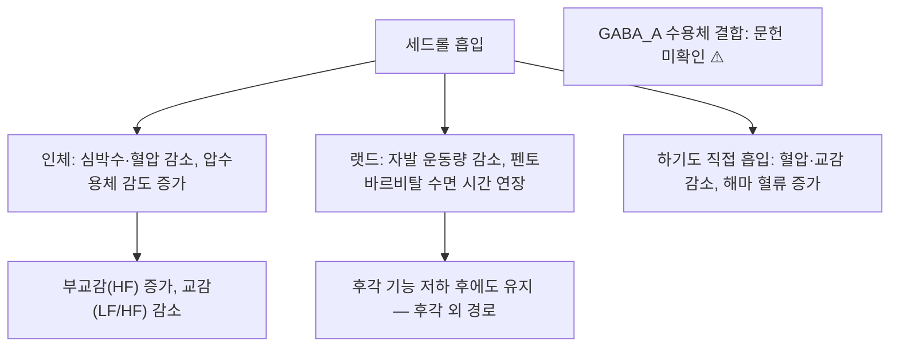

---
aliases:
  - Cedrol
  - 세드롤
tags:
  - 약리성분
  - 세스퀴테르펜알코올
  - 백자인
---

# 🔬 세드롤 (Cedrol)

> **핵심 3줄 요약 (Key Summary)**:
> - 🌿 기원 본초 & 화학 계열: [[백자인]](柏子仁, 측백나무과 *Platycladus orientalis* 종자)에 함유된 삼환성 세스퀴테르펜 알코올(Tricyclic sesquiterpene alcohol) 정유 성분. (⚠️ 백자인 종자 자체의 세드롤 함량 문헌은 확인하지 못했습니다. 문헌상 확인된 것은 *Thuja orientalis* 열매(fruit) 정유 α-세드롤 6.5%·잎 정유 20.3%입니다. §2)
> - 🎯 핵심 분자 표적: 흡입 시 후각·혈관 점막을 통해 흡수되어 중추 GABA_A 수용체 신호를 강화하고 교감신경 톤을 낮추어 진정 작용을 발휘. (⚠️ 인체 흡입에서 교감 활성 저하는 확인되나, GABA_A 수용체 결합 문헌은 찾지 못했고, 랫드에서는 후각 기능을 떨어뜨려도 진정 효과가 유지되어 '후각을 통한 작용'과도 다릅니다. §3)
> - 🩺 주요 약리 활성: 진정·수면 개선(Non-REM 수면 증가), 최근에는 DNA 손상 반응 및 MGMT 발현 조절을 통한 테모졸로마이드 항암 효과 증강 작용이 보고되며, 백자인의 양심안신(養心安神) 효능의 핵심 근거로 다뤄짐. (⚠️ 'Non-REM 수면 증가'와 '양심안신의 핵심 근거'는 확인하지 못했습니다. §3·§5)
> - ⚠️ 근거 수준: 항암 관련 병용 효과는 세포·동물 연구 단계이며, 진정 효과는 주로 흡입(방향요법) 경로의 동물·인체 행동약리 연구에 기반합니다. 사람 대상 진정 근거는 흡입 시 혈압·심박수 등 자율신경 지표 변화이며, 백자인 전탕·경구 복용의 근거가 아닙니다. 시험관에서 CYP2B6·CYP3A4를 강하게 억제하고(§7) 항암 농도에서 적혈구 용혈이 보고되었습니다.

---

## 📌 목차
1. [기본 화학 정보 & 분자 구조식 (Chemical Identity)](#1-기본-화학-정보--분자-구조식-chemical-identity)
2. [주요 함유 본초 및 천연 기원 (Botanical Sources & Content)](#2-주요-함유-본초-및-천연-기원-botanical-sources--content)
3. [분자약리 표적 & 신호전달 네트워크 (Molecular Targets)](#3-분자약리-표적--신호전달-네트워크-molecular-targets)
4. [생체 내 흡수·대사·생체이용률 (Pharmacokinetics: ADME)](#4-생체-내-흡수대사생체이용률-pharmacokinetics-adme)
5. [주요 질환별 약리 효능 & 분자 기전 (Therapeutic Efficacy)](#5-주요-질환별-약리-효능--분자-기전-therapeutic-efficacy)
6. [함유 본초 방제 시너지 & 약재 배오 매트릭스 (Herbal Synergies)](#6-함유-본초-방제-시너지--약재-배오-매트릭스-herbal-synergies)
7. [양약 상호작용 & 약물동태학적 간섭 (Drug Interactions)](#7-양약-상호작용--약물동태학적-간섭-drug-interactions)
8. [💡 사용자 진료실 핵심 필기 & 임상 응용 팁 (Melt-In & High-Yield)](#8--사용자-진료실-핵심-필기--임상-응용-팁-melt-in--high-yield)
9. [출처 및 학술 참고 문헌 (References)](#9-출처-및-학술-참고-문헌-references)

---

## 1. 기본 화학 정보 & 분자 구조식 (Chemical Identity)

> [!abstract]+ 🧪 3D 약리 분자 구조 (Interactive 3D Viewer)
> <iframe src="https://molecule-viewer-rho.vercel.app/?cid=65575" width="100%" height="450px" frameborder="0" allow="webgl" style="border-radius: 8px;"></iframe>

| 항목 | 상세 내용 |
| :--- | :--- |
| **IUPAC 명칭** | `(1S,2R,5S,7R,8R)-2,6,6,8-tetramethyltricyclo[5.3.1.01,5]undecan-8-ol` (PubChem 등록명) |
| **분자식 / 분자량** | C₁₅H₂₆O / 약 222.37 g/mol |
| **PubChem CID** | [65575](https://pubchem.ncbi.nlm.nih.gov/compound/65575) (등록명 Cedrol, C15H26O, 222.37 — PubChem에서 확인) |
| **CAS 등록 번호** | 77-53-2 — PubChem 동의어 항목 기준이며, 방향 원료 안전성 평가 논문 제목(Api 2022)에도 같은 번호가 적혀 있음. CAS 원본 대조는 못함 ⚠️ |
| **화학 골격 분류** | 세스퀴테르펜 알코올(Sesquiterpene alcohol) — 삼환성(tricyclic) 세드란(cedrane) 골격 |
| **물리화학적 성상** | 결정성 고체로 다형체(polymorph) 3종이 보고됨(Wang 2019). 국소 제제 연구에서 '물에 잘 녹지 않고 휘발성'이 적용상 한계로 언급됨(Zhang 2018). LogP·맛·열/빛 안정성은 확인하지 못함 ⚠️ |
| **식물 내 생합성 경로** | 다른 식물에서 세드롤을 만드는 세스퀴테르펜 합성효소가 보고됨(*Leucosceptrum canum* — Luo 2019; *Euphorbia fischeriana* — Zhu 2021; 제목 기준). 측백나무과 식물에서의 세드롤 생합성 경로는 확인하지 못함 ⚠️ |

* 같은 [[세스퀴테르펜]] 알코올 계열의 다른 성분으로는 단향의 [[산탈롤]]이 있습니다.

---

## 2. 주요 함유 본초 및 천연 기원 (Botanical Sources & Content)

| 함유 본초 | 기원 식물학적 명칭 | 주요 함유 부위 | 한의학적 귀경 및 약효 특성 |
| :--- | :--- | :--- | :--- |
| [[백자인]] (柏子仁) | 측백나무과 / *Platycladus orientalis* | 성숙한 종자(씨앗) | 심·신·대장경 귀경, 양심안신(養心安神)·윤장통변(潤腸通便)·익음양혈(益陰養血) |

* **기원 표기 관련 ⚠️**: 위 표의 '주요 함유 부위: 성숙한 종자'는 문헌으로 확인하지 못했습니다. 이란산 *Thuja orientalis*(측백나무의 이명)의 GC/MS 분석에서 α-세드롤은 열매(fruit) 정유의 6.5%(주성분 α-피넨 52.4%)와 잎 정유의 20.3%로 확인되었고(Nickavar 2003), 종자만 따로 분석한 결과는 찾지 못했습니다. 잎 부위는 볼트 [[측백엽]] 노트가 별도 본초로 다룹니다. *P. orientalis* 유래 세드롤 연구(Li 2026, 탈모 모델)는 함유 부위를 초록에 밝히지 않았습니다.
* **다른 기원 (문헌 확인)**: 세드롤은 백자인 외 다른 식물에서도 주로 보고됩니다. *Cedrus atlantica* 유래로 소개된 항암 연구(Chang 2020; Chien 2022), [[생강]] 유래로 소개된 류마티스 관절염·뇌허혈 연구(Zhang 2021; Bi 2024), *Cunninghamia lanceolata* var. *konishii* 목재 정유의 주성분(Xu 2025), *Pterocarpus santalinus* 정유의 13.5%(Nguyen 2024) 등입니다.
* **함량(지표 함량 %)**: 원문에 수치 기재 없음. 위 Nickavar 2003의 정유 내 비율은 정유 기준이며 약재 건조중량 기준 함량이 아닙니다. 한약재 규격상의 세드롤 지표 함량이 있는지는 확인하지 못했습니다. ⚠️ 내용 검토 필요

---

## 3. 분자약리 표적 & 신호전달 네트워크 (Molecular Targets)

### 1) 핵심 분자 표적 (Molecular Targets)
* **진정·수면 개선**: 흡입 시 후각 및 혈관 점막을 통해 흡수되어 교감신경 흥분을 억제하고 부교감신경을 안정화시켜 Non-REM 수면 구조를 개선하는 것으로 보고됩니다.
  * 근거(랫드): 세드롤에 노출된 랫드에서 누적 자발 운동량이 감소했고 펜토바르비탈 유도 수면 시간이 연장되었습니다. 카페인 처치 랫드·자발성 고혈압 랫드(SHR)·ddY 마우스에서도 비슷했습니다. 황산아연으로 후각 기능을 낮춘 랫드에서도 수면 연장 효과가 변하지 않아 저자들은 후각계가 아닌 다른 경로를 시사했습니다(Kagawa 2003).
  * 근거(인체): 건강인 26명이 세드롤 증기를 얼굴 마스크로 흡입했을 때 심박수·수축기·이완기 혈압이 대조 공기보다 유의하게 낮아지고 압수용체 감도가 증가했으며, 심박변이도의 고주파(HF, 부교감) 성분 증가와 LF/HF(교감-미주 균형) 감소가 나타났습니다(Dayawansa 2003). 노르웨이·태국·일본 여성에서 흡입 후 동공 축소율이 증가해 부교감 우세가 시사되었습니다(Yada 2007). 후두 전적출 환자에서 기관공으로 하기도에 직접 흡입해도 혈압과 교감 지표가 감소하고 부교감 지표가 증가했으며(Umeno 2008), 해마 국소 뇌혈류가 증가했습니다(Hori 2012).
  * ⚠️ 내용 검토 필요: (1) 'GABA_A 수용체 신호 강화'는 PubMed에서 세드롤과 GABA_A 결합·수용체 기전을 다룬 논문을 찾지 못했습니다(관련 GABA 논문은 세드롤 13.5%를 포함한 *P. santalinus* 정유 전체의 해마 [[GABA]] 증가로, 정유 연구입니다; Nguyen 2024). (2) '후각 점막을 통한 흡수'는 Kagawa 2003에서 후각 기능을 낮춰도 효과가 유지되어 맞지 않고, 하기도를 통한 작용(Umeno 2008)이 제안되었습니다. '혈관 점막' 경로를 직접 보인 문헌은 확인하지 못했습니다. (3) 'Non-REM 수면 구조 개선'은 위 연구들이 수면 단계를 측정하지 않아 확인하지 못했습니다. (4) 부교감 우세·교감 저하는 인체에서 확인됩니다. [[자율신경계]]([[교감신경]]·[[부교감신경]])
* **항암 보조**: 최근 연구에서 DNA 손상 반응(DDR) 조절 및 MGMT 발현 억제를 통해 교모세포종에서 테모졸로마이드(Temozolomide)의 약물 저항성을 완화하는 병용 효과가 제시됩니다.
  * 근거: 교모세포종 세포에서 세드롤과 테모졸로마이드 병용이 AKT·MAPK 경로 조절을 통해 증식을 더 강하게 억제했고 세포주기 정지·세포자멸사·DNA 손상이 병용에서 더 컸으며, 세드롤이 MGMT·MDR1·CD133 발현을 줄였습니다. 동물에서 병용이 종양 성장을 억제하고 테모졸로마이드로 인한 간 손상이 개선되었습니다(Chang 2020, *J Nat Prod*). 같은 연구진의 후속 연구에서는 세드롤 단독이 ROS·DNA 손상·세포주기 정지·Fas/FasL/Caspase-8와 Bax/Bcl-2/Caspase-9 경로의 세포자멸사를 유도했고, AKT/[[mTOR]] 경로 차단으로 테모졸로마이드 저항성을 줄였으며, 안드로겐 수용체 핵 이행 차단은 분자 도킹 기반 서술입니다(Chang 2020, *Cancer Lett*). 혈관내피세포에서는 VEGF 유도 증식·이동·관형성을 억제하고 VEGF 수용체 2(VEGFR2)와 AKT/P70S6K·[[MAPK pathway]] 인산화를 낮췄습니다(Chang 2023; [[VEGF]]).
  * ⚠️ 내용 검토 필요: 위 연구는 세포·동물 수준이며 모두 *Cedrus atlantica* 유래 세드롤로 소개되어 백자인 유래 성분의 연구가 아닙니다. 인체 항암 임상 근거는 확인하지 못했습니다.

### 2) 그 외 보고된 표적 (전임상, 참고)
* **JAK3 인산화 억제**: 생강 유래 세드롤이 관절염 동물 모델에서 JAK3 활성 포켓과 결합해 인산화를 낮추는 것으로 보고되었습니다(Zhang 2021).
* ERβ–[[NF-κB]] 신호: 세드롤이 소교세포에서 IκB·NF-κB p65 인산화와 핵 이동을 억제하고 뇌허혈 마우스에서 경색 크기를 줄였으며, ERβ 결합은 분자 도킹 기반입니다(Bi 2024).
* [[TLR4]]/MD2: 궤양성 대장염 모델에서 MD2 결합(도킹·분자동역학)과 LPS 유도 TLR4 신호 억제가 보고되었습니다(Zhao 2026).
* **5α-환원효소 2형(5αR2)**: 세드롤이 5αR2 발현을 억제하고 피부 DHT를 낮추면서 혈청 수준은 유지한 것으로 보고되었습니다(Chen 2025).

---

## 4. 생체 내 흡수·대사·생체이용률 (Pharmacokinetics: ADME)

* **경구·전탕 흡수**: 세드롤의 절대 생체이용률이 20·40·80 mg/kg에서 각각 30.30·23.68·16.11%로 보고되었습니다(Zhang 2021; 초록 기준으로 투여 경로·동물 종은 명시되지 않았고, 이 논문에는 정정문 PMID 34252280이 있음). 백자인 전탕액에서의 세드롤 잔존량과 흡수는 문헌을 찾지 못했습니다. 세드롤은 휘발성이라(Zhang 2018) 전탕·건조 과정의 손실도 확인하지 못했습니다. ⚠️ 내용 검토 필요
* **흡입 경로**: 인체 혈중 농도·흡수율 문헌은 확인하지 못했습니다. 후두 전적출 환자에서 기관공으로 하기도에 직접 흡입시켜도 자율신경 효과가 나타나(Umeno 2008), 하기도가 작용 부위 후보가 됩니다. ⚠️ 내용 검토 필요
* **경피 흡수**: 동물 실험에서 세드롤 나노에멀전의 AUC0-t가 연고의 4배(Deng 2021), 크림의 피부 AUC0-24h가 에탄올 제제의 약 3배(Zhang 2018)였고, 나노에멀전은 피부 심부로 전달되면서 혈청 DHT는 유지했습니다(Chen 2025). 국소 제제 결과이며 경구·흡입 약동학이 아닙니다.
* **장내 미생물 대사 전환**: 세드롤이 장내 미생물 조성을 바꾸는 결과는 있으나(Xu 2025; Zhao 2026) 미생물에 의한 세드롤 대사체 전환 문헌은 확인하지 못했습니다. ⚠️ 내용 검토 필요
* **간 대사 및 소실 반감기**: 세드롤을 대사하는 CYP 이성체, 제2상 포합, 소실 반감기는 확인하지 못했습니다. 세드롤이 CYP를 억제하는 결과는 §7을 참고하세요. ⚠️ 내용 검토 필요
* **P-gp 기질성**: 문헌을 찾지 못했습니다. ⚠️ 내용 검토 필요

---

## 5. 주요 질환별 약리 효능 & 분자 기전 (Therapeutic Efficacy)

### 1) 진정·자율신경 조절 (흡입, 동물·인체 생리 지표)
* 랫드·마우스 진정 효과(Kagawa 2003)와 인체 혈압·심박수·자율신경 지표 변화(Dayawansa 2003; Yada 2007; Umeno 2008; Hori 2012)는 §3에 정리했습니다.
* ⚠️ 내용 검토 필요: 수면의 질·불면증 개선을 평가한 임상 시험은 PubMed에서 확인하지 못했습니다. 위 인체 연구는 급성 흡입 시의 자율신경 지표 측정입니다.

### 2) 항종양 (전임상)
* 교모세포종(Chang 2020 두 편, Chang 2023)과 대장암 세포(HT-29 IC50 138.91 µM, CT-26 IC50 92.46 µM)에서 G0/G1 세포주기 정지·caspase 의존 세포자멸사·5-FU 병용 상승 효과가 보고되었고, 동물에서 종양 진행이 억제되었습니다(Chien 2022). 후자는 *Cedrus atlantica*에서 발견되는 성분으로 소개되었습니다.
* 인체 임상 근거는 확인하지 못했습니다. 또한 Chang 2020(*Cancer Lett*)에는 편집자 서신(Liang 2021, PMID 34637842)이 있으나 초록이 없어 내용을 읽지 못했습니다.

### 3) 신경보호·항염증·기타 (전임상)
* 6-OHDA 파킨슨병 랫드에서 10·20 mg/kg 세드롤이 운동·인지 행동 검사와 선조체 산화 지표(MDA·SOD·총 티올)를 개선했습니다(Forouzanfar 2025). 뇌허혈 마우스 모델에서 소교세포 신경염증을 억제했습니다(Bi 2024).
* DSS 유도 대장염 마우스에서 염증 억제와 장벽 회복이 보고되었고(Zhao 2026; Xu 2025), 마우스 진통·항염증 모델에서 결정 다형체 I형이 가장 강했습니다(Wang 2019).
* 탈모: *P. orientalis* 유래 세드롤이 마우스 원형탈모 모델에서 M1/M2 대식세포 극성 균형을 조절해 모발 재생을 촉진했고(Li 2026), 안드로겐성 탈모 모델에서 나노에멀전이 모낭 성장기 전환을 촉진했습니다(Chen 2025).
* 위 결과는 모두 세포·동물 수준이며 인체 임상 근거는 확인하지 못했습니다. ⚠️ 내용 검토 필요

### 4) 한의학적 연계 (원문 §4)
세드롤은 [[백자인]]의 양심안신 효능을 뒷받침하는 핵심 방향 성분으로, 심혈부족(心血不足)으로 인한 불면·심계항진(가슴 두근거림)·도한(식은땀)에 활용되는 근거로 제시됩니다.

* ⚠️ 내용 검토 필요: 위 서술에서 세드롤이 백자인 양심안신의 '핵심' 성분이라는 점과 불면([[불면증]])·심계항진·도한에 대한 세드롤 단독 근거는 확인하지 못했습니다. 진정·자율신경 연구는 정제 세드롤 흡입이며 백자인 전탕 복용이 아닙니다(§3).

---

## 6. 함유 본초 방제 시너지 & 약재 배오 매트릭스 (Herbal Synergies)

| 함유 본초 / 방제 | 공존 유효 성분군 | 분자약리 시너지 기전 | 전통 한의학적 효능 연계 |
| :--- | :--- | :--- | :--- |
| [[백자인]] | 지방유(올레산·리놀레산 등), 스테롤 — 볼트 백자인 노트 기준 | ⚠️ 내용 검토 필요 — 세드롤과 공존 성분 간 시너지 문헌 미확인 | 양심안신, 윤장통변, 익음양혈 |
| [[천왕보심단]] | [[백자인]] 30g(좌약), [[산조인]]·[[원지]]·[[당귀]]·[[단삼]] 등 (볼트 처방 노트에서 구성 확인) | ⚠️ 내용 검토 필요 — 처방 효과에 백자인의 세드롤이 기여하는지 문헌 미확인 | 심신불교·음허화왕형 불면·심계 |
| [[인숙산]] | [[백자인]] 10g(군약), 숙지황·구기자·맥문동·인삼·당귀 등 (볼트 처방 노트에서 구성 확인) | ⚠️ 내용 검토 필요 — 세드롤 기여 문헌 미확인 | 담허증·경계·불면 |
| [[오인환]] | [[백자인]] 6~10g(신약), 도인·행인·송자인·욱리인 + 진피 (볼트 처방 노트에서 구성 확인) | ⚠️ 내용 검토 필요 — 이 처방의 작용은 종자 지방유의 장관 윤활이 중심으로 서술되어 있어 세드롤 기여는 확인하지 못함 | 장조 변비, 윤장통변 |

* 위 표의 백자인 포함 처방은 볼트 `2. 약리 공부/처방/`에서 백자인이 구성에 포함된 것을 확인한 것입니다. 이 밖에 [[산조인탕]] 등은 백자인을 가감약으로 넣는 처방이라 기본 구성으로는 적지 않았습니다.

---

## 7. 양약 상호작용 & 약물동태학적 간섭 (Drug Interactions)

* **CYP450 효소 간섭**:
  * 인체 간 마이크로좀 시험관 연구에서 세드롤은 CYP2B6(부프로피온 수산화)을 경쟁적으로 강하게 억제했고(Ki 0.9 µM), [[CYP3A4]](미다졸람 수산화)도 억제했습니다(Ki 3.4 µM). CYP2C8·2C9·2C19는 약하게 억제했고 100 µM에서 CYP1A2·2A6·2D6 억제는 미미했습니다(Jeong 2014).
  * ⚠️ 내용 검토 필요: 시험관 결과이며 흡입·백자인 복용 시의 혈중 농도에서 임상적 상호작용이 나타나는지는 확인하지 못했습니다.
* **중추신경 억제제 병용**: 랫드에서 세드롤 흡입이 펜토바르비탈 수면 시간을 연장했습니다(Kagawa 2003). 진정·수면 약물과의 병용 시 진정 작용이 더해질 가능성이 이론적으로 있으나 인체 근거는 확인하지 못했습니다. ⚠️ 내용 검토 필요
* **항암제 병용**: 테모졸로마이드 병용 시 항암 효과 증강(Chang 2020, *J Nat Prod*)과 5-FU 병용 상승(Chien 2022)은 세포·동물 결과입니다. 인체 병용 안전성은 확인하지 못했습니다. ⚠️ 내용 검토 필요
* **안전성**: 항암 농도의 세드롤이 인체 적혈구에서 용혈과 eryptosis(Ca²⁺ 과부하·포스파티딜세린 노출)를 일으켰다는 시험관 보고가 있어 화학요법 유발 빈혈과의 관계가 논의되었습니다(Alajeyan 2024). 크림 국소 적용에서는 자극이 없었다고 보고되었습니다(Zhang 2018). 방향 원료로서의 안전성 평가 문서(RIFM)가 있으나(Api 2022) 초록이 없어 내용은 읽지 못했습니다. [[알레르기]]·감작 위험도는 확인하지 못했습니다. ⚠️ 내용 검토 필요
* **유사 기전 양약 병용 시 고려사항**:
  * 혈압강하제 병용: 인체 흡입에서 혈압이 낮아졌으므로(Dayawansa 2003; Umeno 2008) 병용 시 이론적으로 가산 가능성이 있으나 임상 근거는 확인하지 못했습니다. ⚠️ 내용 검토 필요
  * 벤조디아제핀 등 GABA_A 양성 조절제와의 병용: 세드롤의 GABA_A 결합이 확인되지 않아(§3) 유사 기전으로 보기 어렵습니다. ⚠️ 내용 검토 필요

---

## 8. 💡 사용자 진료실 핵심 필기 & 임상 응용 팁 (Melt-In & High-Yield)

* **사용자 원문 필기 (100% 융합 및 보존)**:
  * 기존 노트에 원장님의 수기 필기는 없었습니다. (추후 필기가 생기면 이곳에 원문 그대로 추가)
* **진료실 실전 처방 & 생체이용률 극대화 팁**:
  1. 세드롤의 진정·자율신경 근거는 정제 세드롤 흡입(동물·인체 생리 지표)이고, 항암 근거는 세포·동물 결과입니다. 백자인 전탕액의 세드롤 함량·잔존·흡수가 확인되지 않았으므로(§2·§4) 전탕 처방의 안신 근거로 그대로 옮기지 않도록 주의합니다.
  2. 체질별·병증별 적용은 원문·문헌에서 확인되지 않아 기재하지 않습니다. ⚠️ 내용 검토 필요

---

## 9. 출처 및 학술 참고 문헌 (References)

1. **Kagawa D, et al. (2003)**. *The sedative effects and mechanism of action of cedrol inhalation with behavioral pharmacological evaluation*. **Planta Med**, 69(7):637-641. PMID: [12898420](https://pubmed.ncbi.nlm.nih.gov/12898420/) · DOI: [10.1055/s-2003-41114](https://doi.org/10.1055/s-2003-41114)
   - **[연구 요약]**: 세드롤 흡입의 진정 효과 및 행동약리학적 작용 기전을 검증한 연구. 랫드·마우스에서 자발 운동량 감소, 펜토바르비탈 수면 연장, 후각 기능 저하 후에도 효과 유지.
2. **Chang KF, et al. (2020)**. *Cedrol, a Sesquiterpene Alcohol, Enhances the Anticancer Efficacy of Temozolomide in Attenuating Drug Resistance via Regulation of the DNA Damage Response and MGMT Expression*. **Journal of Natural Products**, 83(10):3021-3029. PMID: [32960603](https://pubmed.ncbi.nlm.nih.gov/32960603/) · DOI: [10.1021/acs.jnatprod.0c00580](https://doi.org/10.1021/acs.jnatprod.0c00580) · [https://pubs.acs.org/doi/10.1021/acs.jnatprod.0c00580](https://pubs.acs.org/doi/10.1021/acs.jnatprod.0c00580)
   - **[연구 요약]**: 세드롤이 DNA 손상 반응·MGMT 발현 조절을 통해 테모졸로마이드의 항암 효과를 증강시킴을 규명. 교모세포종 세포·동물, AKT·MAPK 경로, MGMT·MDR1·CD133 발현 감소.
3. **Chang KF, et al. (2020)**. *Cedrol suppresses glioblastoma progression by triggering DNA damage and blocking nuclear translocation of the androgen receptor*. **Cancer Lett**, 495:180-190. PMID: [32987140](https://pubmed.ncbi.nlm.nih.gov/32987140/) · DOI: [10.1016/j.canlet.2020.09.007](https://doi.org/10.1016/j.canlet.2020.09.007)
   - **[연구 요약]**: 세드롤 단독의 ROS·DNA 손상·세포주기 정지·세포자멸사, AKT/mTOR 차단, 분자 도킹 기반 안드로겐 수용체 표적. 이 논문에 대한 편집자 서신 Liang R (2021) *Cancer Lett* 523:148, PMID: [34637842](https://pubmed.ncbi.nlm.nih.gov/34637842/)이 있으나 내용은 읽지 못함.
4. **Dayawansa S, et al. (2003)**. *Autonomic responses during inhalation of natural fragrance of Cedrol in humans*. **Auton Neurosci**, 108(1-2):79-86. PMID: [14614968](https://pubmed.ncbi.nlm.nih.gov/14614968/) · DOI: [10.1016/j.autneu.2003.08.002](https://doi.org/10.1016/j.autneu.2003.08.002)
   - **[연구 요약]**: 건강인 26명, 세드롤 흡입 시 심박수·혈압·호흡수 감소, 부교감 지표 증가·교감 지표 감소.
5. **Yada Y, et al. (2007)**. *Overseas survey of the effect of cedrol on the autonomic nervous system in three countries*. **J Physiol Anthropol**, 26(3):349-354. PMID: [17641454](https://pubmed.ncbi.nlm.nih.gov/17641454/) · DOI: [10.2114/jpa2.26.349](https://doi.org/10.2114/jpa2.26.349)
   - **[연구 요약]**: 노르웨이·태국·일본 여성에서 세드롤 흡입 후 동공 축소율이 증가해 부교감 우세를 시사.
6. **Umeno K, et al. (2008)**. *Effects of direct cedrol inhalation into the lower airway on autonomic nervous activity in totally laryngectomized subjects*. **Br J Clin Pharmacol**, 65(2):188-196. PMID: [17953722](https://pubmed.ncbi.nlm.nih.gov/17953722/) · DOI: [10.1111/j.1365-2125.2007.02992.x](https://doi.org/10.1111/j.1365-2125.2007.02992.x)
   - **[연구 요약]**: 후두 전적출 환자에서 하기도에 직접 흡입해도 혈압·교감 지표가 감소하고 부교감 지표가 증가.
7. **Hori E, et al. (2012)**. *Effects of direct cedrol inhalation into the lower airway on brain hemodynamics in totally laryngectomized subjects*. **Auton Neurosci**, 168(1-2):88-92. PMID: [22341589](https://pubmed.ncbi.nlm.nih.gov/22341589/) · DOI: [10.1016/j.autneu.2012.01.010](https://doi.org/10.1016/j.autneu.2012.01.010)
   - **[연구 요약]**: 하기도 세드롤 흡입 시 양측 해마 국소 뇌혈류 증가.
8. **Nickavar B, et al. (2003)**. *Volatile constituents of the fruit and leaf oils of Thuja orientalis L. grown in Iran*. **Z Naturforsch C**, 58(3-4):171-172. PMID: [12710722](https://pubmed.ncbi.nlm.nih.gov/12710722/) · DOI: [10.1515/znc-2003-3-404](https://doi.org/10.1515/znc-2003-3-404)
   - **[연구 요약]**: 열매 정유(α-피넨 52.4%, α-세드롤 6.5%)와 잎 정유(α-피넨 21.9%, α-세드롤 20.3%)의 GC/MS 조성.
9. **Jeong HU, et al. (2014)**. *Inhibitory effects of cedrol, β-cedrene, and thujopsene on cytochrome P450 enzyme activities in human liver microsomes*. **J Toxicol Environ Health A**, 77(22-24):1522-1532. PMID: [25343299](https://pubmed.ncbi.nlm.nih.gov/25343299/) · DOI: [10.1080/15287394.2014.955906](https://doi.org/10.1080/15287394.2014.955906)
   - **[연구 요약]**: 세드롤이 CYP2B6(Ki 0.9 µM)·CYP3A4(Ki 3.4 µM)를 강하게 억제, 시험관.
10. **Zhang YM, et al. (2021)**. *Cedrol from Ginger Ameliorates Rheumatoid Arthritis via Reducing Inflammation and Selectively Inhibiting JAK3 Phosphorylation*. **J Agric Food Chem**, 69(18):5332-5343. PMID: [33908779](https://pubmed.ncbi.nlm.nih.gov/33908779/) · DOI: [10.1021/acs.jafc.1c00284](https://doi.org/10.1021/acs.jafc.1c00284)
    - **[연구 요약]**: 관절염 모델에서 JAK3 인산화 억제, 절대 생체이용률 30.30·23.68·16.11%(20·40·80 mg/kg). 정정문: *J Agric Food Chem* 69(28):8063, PMID: [34252280](https://pubmed.ncbi.nlm.nih.gov/34252280/).
11. **Deng Y, et al. (2021)**. *Hair Growth Promoting Activity of Cedrol Nanoemulsion in C57BL/6 Mice and Its Bioavailability*. **Molecules**, 26(6):1795. PMID: [33806773](https://pubmed.ncbi.nlm.nih.gov/33806773/) · DOI: [10.3390/molecules26061795](https://doi.org/10.3390/molecules26061795)
    - **[연구 요약]**: 나노에멀전의 AUC0-t가 연고의 4배.
12. **Zhang Y, et al. (2018)**. *Hair growth promotion effect of cedrol cream and its dermatopharmacokinetics*. **RSC Adv**, 8(73):42170-42178. PMID: [35558774](https://pubmed.ncbi.nlm.nih.gov/35558774/) · DOI: [10.1039/c8ra08667b](https://doi.org/10.1039/c8ra08667b)
    - **[연구 요약]**: 세드롤 크림의 피부 AUC0-24h가 에탄올 제제의 약 3배, 자극 없음.
13. **Chen B, et al. (2025)**. *Facile fabrication of cedrol nanoemulsions with deep transdermal delivery ability and high safety for effective androgenic alopecia treatment*. **Colloids Surf B Biointerfaces**, 245:114259. PMID: [39305552](https://pubmed.ncbi.nlm.nih.gov/39305552/) · DOI: [10.1016/j.colsurfb.2024.114259](https://doi.org/10.1016/j.colsurfb.2024.114259)
    - **[연구 요약]**: 5αR2 발현 억제, 나노에멀전의 경피 심부 전달, 피부 DHT 감소·혈청 수준 유지.
14. **Chien JH, et al. (2022)**. *Cedrol restricts the growth of colorectal cancer in vitro and in vivo by inducing cell cycle arrest and caspase-dependent apoptotic cell death*. **Int J Med Sci**, 19(13):1953-1964. PMID: [36438926](https://pubmed.ncbi.nlm.nih.gov/36438926/) · DOI: [10.7150/ijms.77719](https://doi.org/10.7150/ijms.77719)
    - **[연구 요약]**: 대장암 세포 IC50 138.91(HT-29)·92.46(CT-26) µM, G0/G1 정지, 5-FU 병용 상승.
15. **Chang KF, et al. (2023)**. *Downregulation of VEGFR2 signaling by cedrol abrogates VEGF-driven angiogenesis and proliferation of glioblastoma cells through AKT/P70S6K and MAPK/ERK1/2 pathways*. **Oncol Lett**, 26(2):342. PMID: [37427338](https://pubmed.ncbi.nlm.nih.gov/37427338/) · DOI: [10.3892/ol.2023.13928](https://doi.org/10.3892/ol.2023.13928)
    - **[연구 요약]**: HUVEC에서 VEGF 유도 증식·이동·관형성 억제, VEGFR2 인산화 감소.
16. **Bi Y, et al. (2024)**. *Cedrol attenuates acute ischemic injury through inhibition of microglia-associated neuroinflammation via ERβ-NF-κB signaling pathways*. **Brain Res Bull**, 218:111102. PMID: [39414157](https://pubmed.ncbi.nlm.nih.gov/39414157/) · DOI: [10.1016/j.brainresbull.2024.111102](https://doi.org/10.1016/j.brainresbull.2024.111102)
    - **[연구 요약]**: MCAO 마우스에서 경색 크기 감소, 소교세포 NF-κB 억제, ERβ 결합은 도킹 기반.
17. **Forouzanfar F, et al. (2025)**. *Neuroprotective effect of cedrol in a male rat model of Parkinson's disease*. **Physiol Rep**, 13(7):e70309. PMID: [40192183](https://pubmed.ncbi.nlm.nih.gov/40192183/) · DOI: [10.14814/phy2.70309](https://doi.org/10.14814/phy2.70309)
    - **[연구 요약]**: 6-OHDA 파킨슨병 랫드에서 운동·인지 행동 및 산화 지표 개선.
18. **Zhao YQ, et al. (2026)**. *Cedrol ameliorates ulcerative colitis via myeloid differentiation factor 2-mediated inflammation suppression, with barrier restoration and microbiota modulation*. **World J Gastroenterol**, 32(2):114057. PMID: [41551824](https://pubmed.ncbi.nlm.nih.gov/41551824/) · DOI: [10.3748/wjg.v32.i2.114057](https://doi.org/10.3748/wjg.v32.i2.114057)
    - **[연구 요약]**: DSS 대장염에서 염증·장벽 회복, MD2 결합(도킹)과 TLR4 신호 억제.
19. **Xu MR, et al. (2025)**. *Cedrol ameliorates inflammatory bowel disease via mitochondrial biogenesis, gut microbiota restoration, and intestinal barrier repair*. **Front Pharmacol**, 16:1619537. PMID: [41552823](https://pubmed.ncbi.nlm.nih.gov/41552823/) · DOI: [10.3389/fphar.2025.1619537](https://doi.org/10.3389/fphar.2025.1619537)
    - **[연구 요약]**: IBD 모델에서 미토콘드리아 생합성 단백질·장벽 단백질 증가, 장내 미생물 조성 변화.
20. **Li T, et al. (2026)**. *Cedrol from Platycladus orientalis (L.) Franco regulates M1/M2 polarization of macrophages and promotes hair regeneration*. **J Ethnopharmacol**, 361:121268. PMID: [41611183](https://pubmed.ncbi.nlm.nih.gov/41611183/) · DOI: [10.1016/j.jep.2026.121268](https://doi.org/10.1016/j.jep.2026.121268)
    - **[연구 요약]**: 원형탈모 마우스 모델에서 M1/M2 대식세포 극성 조절, STATs·MAPK 경로 가능성.
21. **Alajeyan IA, et al. (2024)**. *Stimulation of Calcium/NOS/CK1α Signaling by Cedrol Triggers Eryptosis and Hemolysis in Red Blood Cells*. **Yonago Acta Med**, 67(3):191-200. PMID: [39176191](https://pubmed.ncbi.nlm.nih.gov/39176191/) · DOI: [10.33160/yam.2024.08.002](https://doi.org/10.33160/yam.2024.08.002)
    - **[연구 요약]**: 항암 농도 세드롤이 인체 적혈구에서 용혈과 eryptosis를 유도(시험관).
22. **Nguyen LTH, et al. (2024)**. *Essential oil of Pterocarpus santalinus L. alleviates behavioral impairments in social defeat stress-exposed mice by regulating neurotransmission and neuroinflammation*. **Biomed Pharmacother**, 171:116164. PMID: [38242042](https://pubmed.ncbi.nlm.nih.gov/38242042/) · DOI: [10.1016/j.biopha.2024.116164](https://doi.org/10.1016/j.biopha.2024.116164)
    - **[연구 요약]**: 세드롤 13.5%를 포함한 정유의 항우울 유사 효과와 해마 GABA·5-HT 증가. 세드롤 단독 결과가 아닌 정유 전체 연구.
23. **Wang JW, et al. (2019)**. *Anti-inflammatory and analgesic activity based on polymorphism of cedrol in mice*. **Environ Toxicol Pharmacol**, 68:13-18. PMID: [30852303](https://pubmed.ncbi.nlm.nih.gov/30852303/) · DOI: [10.1016/j.etap.2019.02.005](https://doi.org/10.1016/j.etap.2019.02.005)
    - **[연구 요약]**: 세드롤 결정 다형체 3종 중 I형이 항염증·진통 활성이 가장 높음.
24. **Api AM, et al. (2022)**. *RIFM fragrance ingredient safety assessment, cedrol, CAS Registry Number 77-53-2*. **Food Chem Toxicol**, 163 Suppl 1:112998. PMID: [35405294](https://pubmed.ncbi.nlm.nih.gov/35405294/) · DOI: [10.1016/j.fct.2022.112998](https://doi.org/10.1016/j.fct.2022.112998)
    - **[연구 요약]**: 제목 기준 인용(초록 없음) — 초록이 없어 내용은 확인하지 못함.
25. **Luo F, et al. (2019)**. *Characterization of a sesquiterpene cyclase from the glandular trichomes of Leucosceptrum canum for sole production of cedrol in Escherichia coli and Nicotiana benthamiana*. **Phytochemistry**, 162:121-128. PMID: [30884256](https://pubmed.ncbi.nlm.nih.gov/30884256/) · DOI: [10.1016/j.phytochem.2019.03.009](https://doi.org/10.1016/j.phytochem.2019.03.009)
    - **[연구 요약]**: 제목 기준 인용(초록 미확인) — 다른 식물의 세드롤 합성 효소.
26. **Zhu J, et al. (2021)**. *Characterization of a Sesquiterpene Synthase Catalyzing Formation of Cedrol and Two Diastereoisomers of Tricho-Acorenol from Euphorbia fischeriana*. **J Nat Prod**, 84(6):1780-1786. PMID: [34014675](https://pubmed.ncbi.nlm.nih.gov/34014675/) · DOI: [10.1021/acs.jnatprod.1c00126](https://doi.org/10.1021/acs.jnatprod.1c00126)
    - **[연구 요약]**: 제목 기준 인용(초록 미확인) — 다른 식물의 세드롤 합성 효소.
27. **데이터베이스 확인 항목**: PubChem Compound [65575](https://pubchem.ncbi.nlm.nih.gov/compound/65575) (Cedrol, C15H26O, 222.37, 등록 IUPAC명은 §1 참조).
