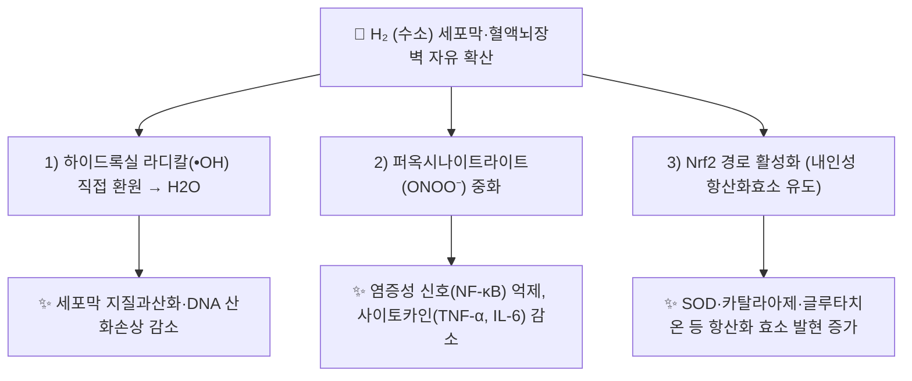

---
aliases:
  - Hydrogen
  - H2
  - 분자수소
  - 수소수
  - Molecular Hydrogen
tags:
  - 약리성분
  - 항산화
  - 기능의학
  - 산화스트레스
---

# 🔬 수소 (Hydrogen, H₂ / Molecular Hydrogen)

> **핵심 3줄 요약 (Key Summary)**:
> - 🌿 화학적 성질: 우주에서 가장 작고 가벼운 분자(H₂, 분자량 2.02 g/mol)로 세포막과 혈액뇌장벽을 자유롭게 통과하는 무색·무취 기체.
> - 🎯 핵심 기전: 2007년 Ohsawa 등이 *Nature Medicine*에 처음 보고한 **선택적 항산화제**로, 강한 세포독성을 지닌 하이드록실 라디칼(•OH)과 퍼옥시나이트라이트(ONOO⁻)만 선택적으로 중화하고, 생리적 신호전달에 필요한 슈퍼옥사이드·과산화수소·산화질소 등은 건드리지 않는 것이 특징.
> - 🩺 주요 활성 & 적용: 항염증(NF-κB 억제), Nrf2 경로를 통한 내인성 항산화효소 유도, 미토콘드리아 보호 등을 통해 허혈-재관류 손상·대사증후군 등 170여 개 질환·동물모델에서 유익 효과가 보고됨. 흡입, 수소수(음용), 수소 입욕 등으로 투여.
> - ⚠️ 근거 수준 한계: 대부분의 근거가 세포·동물 실험 및 소규모 임상 파일럿 연구 수준으로, 대규모 무작위 대조군 임상시험(RCT)에 기반한 확립된 표준 용법·용량은 아직 없음. 국내외에서 의약품이 아닌 건강기능식품·웰니스 기기(수소수 생성기 등)로 유통되는 경우가 많아 과장 광고에 유의해야 함.

---

## 📌 목차
1. [기본 화학 정보](#1-기본-화학-정보-chemical-identity)
2. [발견 배경 및 선택적 항산화 기전](#2-발견-배경-및-선택적-항산화-기전)
3. [분자약리 표적 & 신호전달 네트워크](#3-분자약리-표적--신호전달-네트워크)
4. [생체 내 투여 경로 & 약동학](#4-생체-내-투여-경로--약동학)
5. [주요 질환별 연구 현황](#5-주요-질환별-연구-현황)
6. [한의학·기능의학적 연계](#6-한의학기능의학적-연계)
7. [임상 적용 시 주의사항](#7-임상-적용-시-주의사항)
8. [출처 및 학술 참고 문헌 (References)](#8-출처-및-학술-참고-문헌-references)

---

## 1. 기본 화학 정보 (Chemical Identity)

> [!abstract]+ 🧪 3D 분자 구조 (Interactive 3D Viewer)
> <iframe src="https://molecule-viewer-rho.vercel.app/?cid=783" style="width: 100%; height: 600px; border: none; border-radius: 12px; box-shadow: 0 4px 20px rgba(0,0,0,0.15);" allowfullscreen></iframe>

| 항목 | 상세 내용 |
| :--- | :--- |
| **분자식 / 분자량** | H₂ / 2.016 g/mol |
| **PubChem CID** | [783](https://pubchem.ncbi.nlm.nih.gov/compound/783) |
| **물리적 성상** | 상온에서 무색·무취·무미의 이원자 기체, 물에 대한 용해도가 낮음(상온·1기압에서 약 1.6 ppm 포화) |
| **분자 크기 특성** | 자연계에서 가장 작은 분자로 지질막·혈액뇌장벽(BBB)을 확산으로 자유롭게 투과 |

---

## 2. 발견 배경 및 선택적 항산화 기전

2007년 일본 의과대학 오사와(Ohsawa) 등은 *Nature Medicine*에 발표한 연구에서, 수소 가스 흡입이 뇌 허혈-재관류 손상 모델에서 하이드록실 라디칼(•OH)을 선택적으로 감소시켜 신경세포를 보호한다는 사실을 처음 보고했습니다. 이 연구는 수소가 슈퍼옥사이드(O₂•⁻), 과산화수소(H₂O₂), 산화질소(NO) 등 세포 신호전달에 관여하는 활성산소종에는 반응하지 않고, 세포독성이 가장 강한 •OH와 퍼옥시나이트라이트(ONOO⁻)만 선택적으로 물로 환원시킨다는 점에서 "선택적 항산화제(selective antioxidant)"라는 개념을 제시했습니다.

---

## 3. 분자약리 표적 & 신호전달 네트워크

* **NF-κB 경로 억제**: 산화스트레스로 유발되는 염증성 전사인자 NF-κB의 핵 내 이동을 억제하여 TNF-α, IL-6 등 염증성 사이토카인 발현을 낮춘다고 보고됩니다.
* **Nrf2/HO-1 경로 활성화**: 세포 내 항산화 반응 요소(ARE)를 통해 헴산소화효소-1(HO-1), 글루타치온 합성효소 등 2차 방어 항산화 시스템을 유도하는 것으로 제안됩니다.
* **미토콘드리아 보호**: 미토콘드리아 막전위 유지 및 세포자멸사(아폽토시스) 관련 신호(Caspase-3 등) 억제 효과가 다수의 허혈-재관류 손상 모델에서 관찰되었습니다.

---

## 4. 생체 내 투여 경로 & 약동학

* **흡입(Inhalation)**: 1~4% 저농도 수소 가스를 산소와 혼합 흡입 (안전상 폭발 하한계인 4.6% 미만 유지가 원칙).
* **수소수 음용(Hydrogen-rich water)**: 수소를 포화시킨 물을 마시는 방법으로, 체내 흡수 후 호기(날숨)를 통한 배출량으로 체내 흡수를 간접 확인 가능.
* **수소 입욕·주사(수소식염수)**: 경피 흡수 또는 정맥 내 수소포화 생리식염수 주입 등 실험적 투여 경로도 연구되고 있습니다.
* **배설**: 대부분 변화 없이 호흡을 통해 폐로 배출되며, 대사되어 축적되는 독성 대사산물이 보고되지 않아 안전성이 높은 편으로 평가됩니다.

---

## 5. 주요 질환별 연구 현황

2019년 *Acta Biochimica et Biophysica Sinica*에 발표된 Tao 등의 리뷰에 따르면, 2007년 이후 수소의 유익 효과는 허혈-재관류 손상, 대사증후군, 염증성 질환, 암 등을 포함해 170여 개 이상의 질환 모델·임상 연구에서 보고되었습니다. 주요 항산화·항염증·항세포자멸사 효과 외에도 면역세포 아형 균형 조절 등 다각적 기전이 제시되고 있습니다.

⚠️ 내용 검토 필요: 대부분 소규모·파일럿 수준의 임상 연구이며, 질환별 표준화된 용량·투여 기간·장기 안전성 자료는 아직 충분히 확립되어 있지 않습니다.

---

## 6. 한의학·기능의학적 연계

* 수소 자체는 전통 본초학 체계의 약재가 아니며, 현대 기능의학·항노화 의학 영역에서 항산화·항염증 보조요법으로 활용되는 사례가 늘고 있습니다.
* 산화스트레스·만성 염증을 병리 기전으로 공유하는 한의학적 병증(어혈, 담음 등)과의 접점에서 보조적 개념으로 언급될 수 있으나, 이는 아직 학술적으로 정립된 대응 관계가 아니므로 ⚠️ 내용 검토 필요로 표기합니다.

---

## 7. 임상 적용 시 주의사항

* 시판 수소수 생성기·수소 흡입기의 실제 수소 발생 농도는 제품별 편차가 크며, 과장된 효능 광고가 많으므로 임상적 권고 시 주의가 필요합니다.
* 고농도 수소 가스는 폭발 위험이 있으므로 흡입 요법은 반드시 안전 인증된 의료기기·프로토콜 하에서만 시행해야 합니다.

---

## 8. 출처 및 학술 참고 문헌 (References)

1. **Ohsawa I, Ishikawa M, Takahashi K, et al. (2007)**. Hydrogen acts as a therapeutic antioxidant by selectively reducing cytotoxic oxygen radicals. *Nature Medicine*, 13(6), 688–694. PMID: [17486089](https://pubmed.ncbi.nlm.nih.gov/17486089/)
   - **[연구 요약]**: 수소가 하이드록실 라디칼과 퍼옥시나이트라이트만 선택적으로 환원시키는 "선택적 항산화제"임을 최초로 규명하고, 뇌 허혈-재관류 손상 모델에서 신경보호 효과를 입증한 랜드마크 논문.
2. **Tao G, Song G, Qin S. (2019)**. Molecular hydrogen: current knowledge on mechanism in alleviating free radical damage and diseases. *Acta Biochimica et Biophysica Sinica*, 51(12), 1189–1197. PMID: [31738389](https://pubmed.ncbi.nlm.nih.gov/31738389/)
   - **[연구 요약]**: 2007년 이후 축적된 수소의 항산화·항염증·항세포자멸사·미토콘드리아 보호 기전 및 170여 개 질환 모델 연구를 종합한 리뷰.
3. PubChem Compound Summary — Hydrogen (CID 783): [https://pubchem.ncbi.nlm.nih.gov/compound/783](https://pubchem.ncbi.nlm.nih.gov/compound/783)
