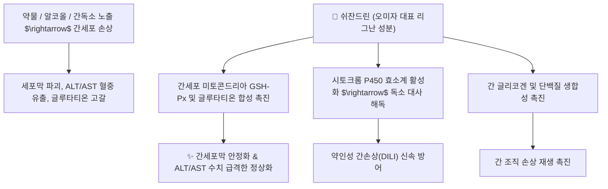

# 💊 [[쉬잔드린]] (Schisandrin)

> **핵심 요약 (Key Summary)**:
> 오미자과 오미자(*Schisandra chinensis*)의 열매에서 분리되는 대표적인 디벤조시클로옥타디엔계 리그난 지표 성분.
> 시토크롬 P450 효소계 활성화 및 글루타티온 보존을 통한 강력한 간세포 보호, 아세틸콜린에스테라아제 억제를 통한 인지 기능 개선을 발휘.
> 만성 간염(ALT/AST 강하), 신경쇠약, 만성 기침 치료의 핵심 분자 표적이자 생맥산의 익기생진(益氣生津)·수렴고삽 효능을 대변하는 핵심 성분.

---

## 📌 목차
1. [기본 화학 정보 & 분자 구조식 (Chemical Identity)](#1-기본-화학-정보--분자-구조식-chemical-identity)
2. [핵심 분자 표적 & 간세포 재생 및 해독 대사 네트워크](#2-핵심-분자-표적--간세포-재생-및-해독-대사-네트워크)
3. [중추신경계 조절: 인지 기능 증진 및 HPA축 항피로 작용](#3-중추신경계-조절-인지-기능-증진-및-hpa축-항피로-작용)
4. [호흡기 점막 보호 및 기침 반사 제어 기전](#4-호흡기-점막-보호-및-기침-반사-제어-기전)
5. [한의학적 오미자 처방 배오 연계 (생맥산 & 청상보하탕)](#5-한의학적-오미자-처방-배오-연계-생맥산--청상보하탕)
6. [출처 및 학술 참고 문헌 (References)](#6-출처-및-학술-참고-문헌-references)

---
## 1. 기본 화학 정보 & 분자 구조식 (Chemical Identity)

> [!abstract]+ 🧪 3D 약리 분자 구조 (Interactive 3D Viewer)
> <iframe src="https://molecule-viewer-rho.vercel.app/?cid=119245" style="width: 100%; height: 600px; border: none; border-radius: 12px; box-shadow: 0 4px 20px rgba(0,0,0,0.15);" allowfullscreen></iframe>

| 항목 | 상세 정보 |
| :--- | :--- |
| **화학명 (IUPAC)** | (6R,7S)-1,2,3,10,11,12-Hexamethoxy-6,7-dimethyl-5,6,7,8-tetrahydrodibenzo[a,c]cycloocten-6-ol |
| **분자식 및 분자량** | C24H32O7 / 432.51 g/mol |
| **CAS 등록번호** | 7432-28-2 (Schisandrol A) |
| **기원 본초** | 오미자과(*Schisandraceae*) [[오미자]](*Schisandra chinensis*)의 성숙한 과실 |
| **화학 분류** | 8원환을 포함하는 디벤조시클로옥타디엔(Dibenzocyclooctadiene) 골격의 리그난 |
| **공정서 규격** | 대한민국약전(KP) 기준 오미자 중 쉬잔드린 0.7% 이상 함유 필수 |

---
## 2. 핵심 분자 표적 & 간세포 재생 및 해독 대사 네트워크

* **혈청 트랜스아미나아제(ALT/AST)의 신속한 정상화**:
  * 쉬잔드린은 간세포막의 지질 과산화를 저지하고 세포막의 구조적 유동성을 보존하여 간효소의 혈중 유출을 차단합니다.
  * 간세포 내 글루타티온(GSH) 농도를 유지시키고 글루타티온 환원효소 활성을 높여 간의 해독 능력을 극대화합니다.

---
## 3. 중추신경계 조절: 인지 기능 증진 및 HPA축 항피로 작용

* **콜린성 신경계 보호 및 아세틸콜린 농도 보존**:
  * 뇌 해마 부위에서 아세틸콜린에스테라아제(AChE) 활성을 억제하여 시냅스 틈 내 아세틸콜린 농도를 높이고 시냅토파이신(Synaptophysin) 발현을 유도하여 기억력을 개선합니다.
* **스트레스 저항성(Adaptogen) 및 항불안**:
  * 만성 구속 스트레스 상황에서 혈청 코르티코스테론 상승을 억제하여 HPA축의 과민 반응을 정상화하고 주간 피로감을 해소합니다.

---
## 4. 호흡기 점막 보호 및 기침 반사 제어 기전

* **기도 평활근 이완 및 항염증**:
  * 칼슘 유입 억제를 통해 기도 평활근의 연축을 완화하고, 호산구 및 중성구의 침윤을 차단하여 기관지 점막의 과민성을 하향 안정화합니다.

---
## 5. 한의학적 오미자 처방 배오 연계 (생맥산 & 청상보하탕)

* **오미자의 신맛(酸味)과 쉬잔드린의 수렴성**:
  * 한의학에서 오미자는 폐기를 수렴하여 기침을 멈추고(斂肺止咳), 신장을 자양하여 정을 굳히는(澀精止瀉) 본초입니다.
  * 쉬잔드린의 생체막 안정화 및 에너지 대사 보존 효과는 이러한 전신 수렴 작용과 직결됩니다.
* **대표 한의 처방**:
  * **[[생맥산]] (生脈散)**: 인삼의 [[진세노사이드]], 맥문동의 루스코게닌, 오미자의 쉬잔드린이 협동하여 심근 수축력을 강화하고 하기갈(夏期渴) 탈진을 예방.
  * **[[청상보하탕]] (淸上補下湯)**: 만성 천식, 폐기종, 만성 폐쇄성 폐질환(COPD) 환자의 호흡곤란 및 만성 해수 치유.
  * **[[오자연종환]] (五子衍宗丸)**: 남성 신허 불임증에서 정자 운동성 및 정액 지표 개선.

---
## 6. 출처 및 학술 참고 문헌 (References)

* Hancke JL, Burgos RA, Ahumada F. *Schisandra chinensis* (Turcz.) Baill. *Fitoterapia*. 1999;70(5):451-471.
  * `[연구 요약]` 오미자 유래 쉬잔드린 리그난류의 간보호, 스트레스 저항성 및 신체 수행능 증진 연구 총괄.
* Giridharan VV, Thandavarayan RA, Konishi T. Amelioration of scopolamine induced cognitive dysfunction and oxidative stress by schisandrin in mice. *Food Chem Toxicol*. 2011;49(9):2483-2490.
  * `[연구 요약]` 쉬잔드린이 스코폴라민 유도 인지 장애 모델에서 콜린성 신경계와 항산화 경로를 통해 기억력을 개선함을 입증.
* 대한민국약전(KP) 제12개정 (2022). 의약품각조 제2부: 오미자 (Schisandrae Fructus) 분석 규격.
  * `[공정서 규격]` 오미자의 지표 성분으로서 쉬잔드린(Schisandrin) 0.7% 이상 함유량 HPLC 시험 기준 명시.
