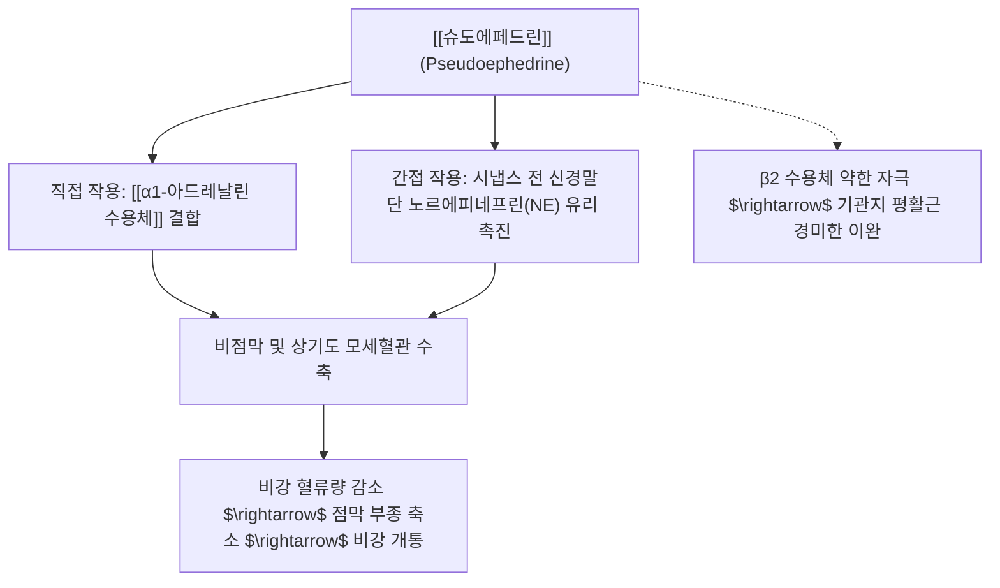

---
aliases:
  - 슈도에페드린
  - Pseudoephedrine
  - 프소이도에페드린
  - d-슈도에페드린
tags:
  - 약리성분
  - 교감신경효능제
  - 알칼로이드
  - 마황
  - 비충혈제거제
---
# 💊 [[슈도에페드린]] (Pseudoephedrine)

> **핵심 요약 (Key Summary)일반명 (Generic)화학명 (IUPAC)** | (1S,2S)-2-(methylamino)-1-phenylpropan-1-ol |
| **기원 본초** | 마황과(Ephedraceae) 초마황([[마황]], *Ephedra sinica* Stapf)의 지상경 |
| **화학식 / 분자량** | $\text{C}_{10}\text{H}_{15}\text{NO}$ / 165.23 g/mol |
| **약효 분류** | 비충혈제거제(Nasal Decongestant), 교감신경 흥분제(Sympathomimetic) |
| **생체이용률 / 반감기** | 경구 흡수율 약 95~100% / 혈중 반감기 약 5~8시간 |
| **대사 및 배설** | 간에서 10% 미만 대사, 대부분 미변화체로 신장 배설 (소변 산성화 시 배설 촉진) |

---
## 1. 기본 화학 정보 & 분자 구조식 (Chemical Identity)

> [!abstract]+ 🧪 3D 약리 분자 구조 (Interactive 3D Viewer)
> <iframe src="https://molecule-viewer-rho.vercel.app/?cid=7028" style="width: 100%; height: 600px; border: none; border-radius: 12px; box-shadow: 0 4px 20px rgba(0,0,0,0.15);" allowfullscreen></iframe>

## 2. 분자약리 작용 기전 (Mechanism of Action, MoA)

* **직접적 α1 수용체 자극**:
  * 호흡기 점막 혈관 평활근의 Gq 단백질 연결 α1 수용체에 결합 $\rightarrow$ $\text{IP}_3/\text{DAG}$ 경로 활성화 $\rightarrow$ 세포 내 칼슘 상승 $\rightarrow$ 혈관 수축.
* **간접적 교감신경 흥분 작용**:
  * 교감신경 시냅스 전 신경 말단에 흡수되어 저장 소포에서 노르에피네프린 분비를 촉진.
* **비강 저항 감소**:
  * 비갑개 점막의 정맥동 팽창을 억제하여 비강 통로를 물리적으로 넓히고 호흡 저항을 즉각 개선.

---

## 3. 임상 적응증 및 약리학적 효과

* **급만성 비염 및 부비동염(축농증)의 코막힘 완화**:
  * 혈관 수축을 통한 비점막 충혈 및 삼출액 감소.
* **이관(유스타키오관) 기능장애 및 항공성 중이염 예방**:
  * 비인강 개구부 부종 완화로 이관 통기 기능 개선.
* **감기(상기도 감염)의 비증상 치료**:
  * 코막힘, 콧물, 재채기 완화를 위해 항히스타민제 또는 진통제와의 복합제 상용.

---

## 4. 에페드린과의 비교 (Ephedrine vs Pseudoephedrine)

| 비교 항목 | [[에페드린]] (Ephedrine) | [[슈도에페드린]] (Pseudoephedrine) |
| :--- | :--- | :--- |
| **입체 이성질체** | (1R,2S) 형태 | (1S,2S) 형태 (에페드린의 부분입체이성질체) |
| **혈관 수축 강도** | 강함 (전신 혈압 상승 뚜렷) | 중간 (주로 상기도 점막 혈관 선택성 우수) |
| **중추신경 흥분(CNS)** | 강함 (불면, 불안, 초조, 식욕 억제) | 약함 (CNS 흥분 작용이 에페드린의 약 1/4 수준) |
| **주 임상 용도** | 기관지 천식, 저혈압 쇼크, 비만 치료 | 코막힘 제거제(비충혈제거제) |

---

## 5. 부작용, 금기 및 임상 주의사항

* **심혈관계 부작용**:
  * 빈맥, 혈압 상승, 심계항진. 고혈압·관상동맥질환 환자 복용 주의.
* **중추신경계 반응**:
  * 불면, 신경과민, 두통, 현훈.
* **비뇨기계 주의**:
  * 방광경부 평활근 수축으로 인한 배뇨 장애 (전립선 비대증 환자 금기).
* **약물 상호작용 (금기)**:
  * **MAO 억제제(MAOI)** 병용 금기: 급격한 고혈압 위기(Hypertensive crisis) 유발 위험.

---

## 6. 마황 방제학 및 한의 임상 연계

* **마황 내 성분 비중**:
  * 마황 총 알칼로이드 중 [[에페드린]]이 약 70~80%, [[슈도에페드린]]이 약 15~20% 함유.
* **비연(鼻淵)·비염 치료 방제의 주역**:
  * [[소청룡탕]], [[마황탕]], 갈근탕가천궁이모 등 마황 함유 처방이 비염과 코막힘에 탁월한 효과를 내는 핵심 약리 기전.
* **발한 및 이뇨 작용**:
  * 마황의 이뇨소종 효능에 슈도에페드린의 신혈관 저항 조절 기전이 기여.

---

## 7. 출처 및 학술 참고 문헌 (References)
* Brunton LL, et al. *Goodman & Gilman's: The Pharmacological Basis of Therapeutics*. 14th ed. McGraw-Hill, 2023: 180-185.
  * `[연구 요약]`: 슈도에페드린의 아드레날린 수용체 작용 기전, 비충혈 제거 약동학 및 심혈관계 안전성.
* Drew CD, et al. Comparison of the effects of pseudoephedrine and ephedrine on the nasal vasculature in man. *Br J Clin Pharmacol*. 1978;6(3):221-225.
  * `[연구 요약]`: 슈도에페드린과 에페드린의 비점막 수축능 및 중추신경계·혈압 영향 임상 약리학적 비교 연구.
