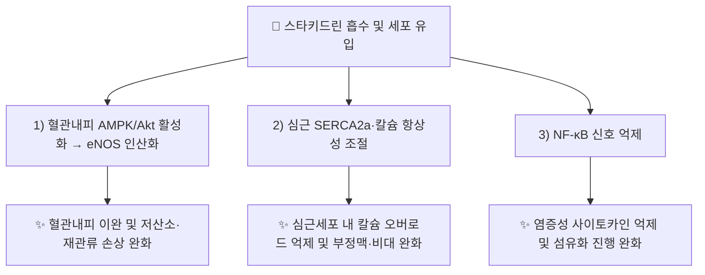

---
aliases:
  - Stachydrine
  - Proline betaine
  - N,N-Dimethyl-L-proline
  - 스타키드린
tags:
  - 약리성분
  - 알칼로이드
  - 익모초
  - 충위자
---

# 🔬 [[스타키드린]] (Stachydrine, C₇H₁₃NO₂)

> **핵심 3줄 요약 (Key Summary)**:
> - 🌿 기원 본초 & 화학 계열: [[익모초]](益母草, *Leonurus japonicus*)와 그 열매인 [[충위자]](茺蔚子)에 함유된 프롤린 유도 4급 암모늄 베타인계 알칼로이드([[레오누린]]과 함께 공존하는 대표 지표성분)입니다.
> - 🎯 핵심 분자 표적 & 조절 경로: 혈관내피 eNOS의 AMPK/Akt 인산화 경로 활성화, 심근 SERCA2a·칼슘 항상성 조절, NF-κB 억제를 통한 항염증·항섬유화 작용.
> - 🩺 주요 약리 활성 & 질환 치료 기전: 혈관내피 보호(저산소·재관류 손상 완화), 심부전·심근비대·심근섬유화 억제, 신장 보호(당뇨병성 신증 모델) — [[익모초]]·[[충위자]]의 활혈조경(活血調經)·이수소종(利水消腫) 효능의 분자적 근거 중 하나로 제시됩니다.
> - ⚠️ 독성·생체이용률 한계 & 상호작용: 대부분의 근거가 세포·동물 모델 수준이며, 4급 암모늄 베타인 구조 특성상 경구 흡수율·인체 약동학 데이터는 이번 검색 범위에서 확인되지 않았습니다.

---

## 📌 목차
1. [기본 화학 정보 & 분자 구조식 (Chemical Identity)](#1-기본-화학-정보--분자-구조식-chemical-identity)
2. [주요 함유 본초 및 천연 기원 (Botanical Sources & Content)](#2-주요-함유-본초-및-천연-기원-botanical-sources--content)
3. [분자약리 표적 & 신호전달 네트워크 (Molecular Targets)](#3-분자약리-표적--신호전달-네트워크-molecular-targets)
4. [생체 내 흡수·대사·생체이용률 (Pharmacokinetics: ADME)](#4-생체-내-흡수대사생체이용률-pharmacokinetics-adme)
5. [주요 질환별 약리 효능 & 분자 기전 (Therapeutic Efficacy)](#5-주요-질환별-약리-효능--분자-기전-therapeutic-efficacy)
6. [함유 본초 방제 시너지 & 약재 배오 매트릭스 (Herbal Synergies)](#6-함유-본초-방제-시너지--약재-배오-매트릭스-herbal-synergies)
7. [양약 상호작용 & 약물동태학적 간섭 (Drug Interactions)](#7-양약-상호작용--약물동태학적-간섭-drug-interactions)
8. [💡 사용자 진료실 핵심 필기 & 임상 응용 팁 (Melt-In & High-Yield)](#8--사용자-진료실-핵심-필기--임상-응용-팁-melt-in--high-yield)
9. [출처 및 학술 참고 문헌 (References)](#9-출처-및-학술-참고-문헌-references)

---

## 1. 기본 화학 정보 & 분자 구조식 (Chemical Identity)

![[스타키드린_화학구조식.png|320]]
> [그림 1: 스타키드린의 2D 화학 분자 구조식 (Chemical Structure)] ⚠️ 내용 검토 필요 — 구조식 이미지 파일은 아직 첨부되지 않았습니다. `7. 첨부·자료/첨부파일/`에 실제 구조식 이미지를 추가해 주세요.

> [!abstract]+ 🧪 3D 약리 분자 구조 (Interactive 3D Viewer)
> <iframe src="https://molecule-viewer-rho.vercel.app/?cid=115244" width="100%" height="450px" frameborder="0" allow="webgl" style="border-radius: 8px;"></iframe>

| 항목 | 상세 내용 |
| :--- | :--- |
| **IUPAC 명칭** | (2S)-1,1-Dimethylpyrrolidin-1-ium-2-carboxylate (N,N-Dimethyl-L-proline betaine) |
| **분자식 / 분자량** | C₇H₁₃NO₂ / 143.18 g/mol |
| **PubChem CID** | [115244](https://pubchem.ncbi.nlm.nih.gov/compound/115244) |
| **CAS 등록 번호** | 471-87-4 |
| **화학 골격 분류** | 프롤린 유래 4급 암모늄 베타인(Proline betaine) 알칼로이드 |
| **물리화학적 성상** | 백색 결정성 분말, 수용성, 양성이온(zwitterion) 구조로 중성 pH에서 안정 |
| **식물 내 생합성 경로** | L-프롤린의 N-메틸화 반응(2회)을 통해 생성되는 프롤린 베타인 경로 — *Leonurus japonicus*에서 프롤린→N-메틸프롤린→스타키드린으로 이어지는 메틸전이효소(methyltransferase) 촉매 경로가 보고되어 있습니다. |

---

## 2. 주요 함유 본초 및 천연 기원 (Botanical Sources & Content)

| 함유 본초 (한글/한자) | 기원 식물학적 명칭 (과명 / 학명) | 주요 함유 약용 부위 | 지표 함량 (%) | 한의학적 귀경 및 약효 특성 |
| :--- | :--- | :--- | :--- | :--- |
| [[익모초]] (益母草) | 꿀풀과(Lamiaceae) / *Leonurus japonicus* | 지상부 전초(꽃 필 때 채취) | ⚠️ 내용 검토 필요(정량 데이터 미확인) | 心·肝·膀胱經, 활혈조경·거어생신·이수소종 |
| [[충위자]] (茺蔚子) | 꿀풀과(Lamiaceae) / *Leonurus japonicus* | 성숙한 열매(씨앗) | ⚠️ 내용 검토 필요(정량 데이터 미확인) | 心包·肝經, 활혈조경·청간명목·이수소종 |

> 감귤류(Citrus 속) 과피, 자주개자리(alfalfa) 등에도 프롤린 베타인류가 보고되어 있으나, 본 노트는 한의학 임상과 직결되는 [[익모초]]·[[충위자]] 기원을 중심으로 정리합니다.

---

## 3. 분자약리 표적 & 신호전달 네트워크 (Molecular Targets)

### 1) 혈관내피 eNOS/AMPK/Akt 경로
* 혈관내피세포에서 AMPK 및 Akt 인산화를 매개로 eNOS를 활성화하여 혈관 이완 반응을 유도한다고 보고되어 있습니다(J Ethnopharmacol 계열 문헌, ⚠️ 세부 결합 포켓 데이터는 확인 필요).
### 2) 심근 칼슘 항상성 & SERCA2a
* 압력과부하 심부전 모델에서 심근세포 내 칼슘 오조절(calcium mishandling)을 완화하고 SERCA2a 의존 경로를 통해 소포체 스트레스를 낮추는 것으로 보고되었습니다.

---

## 4. 생체 내 흡수·대사·생체이용률 (Pharmacokinetics: ADME)

* **장관 흡수 및 배출 펌프 (P-gp) 상호작용**: ⚠️ 내용 검토 필요 — 이번 검색 범위에서 스타키드린에 특정된 P-gp 상호작용 데이터를 확인하지 못했습니다.
* **장내 미생물총(Microbiome) 대사 전환**: ⚠️ 내용 검토 필요 — 확인된 문헌 없음.
* **간 대사 및 소실 반감기**: ⚠️ 내용 검토 필요 — 4급 암모늄 베타인 구조 특성상 대사 없이 신장으로 빠르게 배설될 가능성이 제시되나(다른 베타인류 유추), 스타키드린 고유의 정량적 반감기 데이터는 확인하지 못했습니다.

---

## 5. 주요 질환별 약리 효능 & 분자 기전 (Therapeutic Efficacy)

### 1) 심혈관 질환 (심부전·심근비대·혈관내피 손상)
* 압력과부하 유발 심부전 마우스 모델에서 칼슘 오조절 완화(PMID 31626909), 저산소-재관류 손상으로부터 인간 제대정맥내피세포(HUVEC) 보호(PMID 20128052).
### 2) 신장 보호 (당뇨병성 신증)
* AMPK/mTOR 및 Nrf2/HO-1 경로 조절을 통한 자가포식·산화스트레스·세포자멸 완화 보고(Rev Bras Farmacogn, 2025년 추정).
### 3) 부인과 응용 (조기 난소부전 모델)
* 시클로포스파미드 유발 조기 난소부전 랫드 모델에서 Nrf2/HO-1 경로 활성화를 통한 산화스트레스·세포자멸 억제 보고(Clin Exp Pharmacol Physiol, 2025).

⚠️ 내용 검토 필요: 위 연구 대부분이 동물·세포 모델이며, 인체 대상 임상시험(RCT) 근거는 이번 검색 범위 내에서 확인되지 않았습니다.

---

## 6. 함유 본초 방제 시너지 & 약재 배오 매트릭스 (Herbal Synergies)

| 함유 본초 / 방제 | 공존 유효 성분군 | 분자약리 시너지 기전 | 전통 한의학적 효능 연계 |
| :--- | :--- | :--- | :--- |
| [[익모초]] | [[레오누린]], 레오누리딘, 루틴 | 구아니디노 알칼로이드-베타인 복합 자궁 평활근 수축·혈관내피 보호 상가 작용(정량적 시너지 데이터 확인 필요 ⚠️) | 활혈조경(活血調經), 거어생신(祛瘀生新) |
| [[충위자]] | [[레오누리닌]], 불포화 지방산 | 간열 목적(目赤)·어혈 병증에 대한 다표적 네트워크(구체 논문 확인 필요 ⚠️) | 청간명목(淸肝明目), 이수소종(利水消腫) |

---

## 7. 양약 상호작용 & 약물동태학적 간섭 (Drug Interactions)

* **CYP450 효소 간섭**: ⚠️ 내용 검토 필요 — 스타키드린에 특정된 CYP450 억제/유도 연구는 이번 검색 범위에서 확인하지 못했습니다.
* **심혈관계 양약과의 병용 시 고려사항**: SERCA2a·칼슘 채널 관련 기전이 보고된 만큼, 항부정맥제·칼슘채널차단제 병용 시 상호작용 가능성을 이론적으로 고려할 수 있으나, 이를 직접 검증한 병용 연구는 확인하지 못했습니다.

---

## 8. 💡 사용자 진료실 핵심 필기 & 임상 응용 팁 (Melt-In & High-Yield)

* **사용자 원문 필기**: (원장님 개별 필기 자료 없음 — 향후 진료 경험 축적 시 본 섹션에 추가 예정)
* **진료실 실전 처방 & 생체이용률 극대화 팁**:
  1. **익모초·충위자 배오 원칙**: 스타키드린 단일 성분 연구(세포·동물)와 [[익모초]]·[[충위자]] 전탕액의 복합 성분 노출은 약리학적으로 동일시할 수 없으므로, 활혈조경 임상 효능을 스타키드린 단일 기전만으로 설명하지 않도록 주의합니다.
  2. **심혈관·부인과 동반 질환 참고**: 심부전·조기 난소부전 관련 최신 기초연구는 [[익모초]] 배합 처방의 분자약리학적 근거를 보강하나, 임상 적용 시에는 변증(辨證) 기반 처방이 우선되어야 합니다.

---

## 9. 출처 및 학술 참고 문헌 (References)

1. **⚠️ 저자명 미확인 (2026년 추정)**. "Stachydrine: A Systematic Review of Its Multi-Targeted Therapeutic Potential in Cardiovascular, Oncology, Renal, Gynecological, and Inflammatory Disorders". *Drug Design, Development and Therapy*. DOI: [10.2147/DDDT.S578362](https://doi.org/10.2147/DDDT.S578362). PMID: [41847307](https://pubmed.ncbi.nlm.nih.gov/41847307/).
   - **[연구 요약]**: 스타키드린의 심혈관·종양·신장·부인과·염증 영역 다표적 약리 효능을 총괄한 최신 체계적 문헌고찰.
2. **⚠️ 저자명 미확인**. "Stachydrine, a major constituent of the Chinese herb Leonurus heterophyllus sweet, ameliorates human umbilical vein endothelial cells injury induced by anoxia-reoxygenation". PMID: [20128052](https://pubmed.ncbi.nlm.nih.gov/20128052/).
   - **[연구 요약]**: [[익모초]] 주요 성분인 스타키드린이 저산소-재관류로 유발된 인간 제대정맥내피세포 손상을 완화함을 규명 — 익모초의 활혈 효능과 직접 연관되는 기원 문헌.
3. **⚠️ 저자명 미확인**. "Stachydrine hydrochloride alleviates pressure overload-induced heart failure and calcium mishandling on mice". *Journal of Ethnopharmacology*. PMID: [31626909](https://pubmed.ncbi.nlm.nih.gov/31626909/).
   - **[연구 요약]**: 압력과부하 심부전 마우스 모델에서 스타키드린염산염이 심근세포 칼슘 오조절을 완화함을 보고.
4. **PubChem CID 115244 ((-)-Stachydrine)**; **CAS 471-87-4**. National Center for Biotechnology Information.
   - **[화학 데이터베이스]**: 분자식·CAS 번호 등 공인 화학 데이터.

> ⚠️ 내용 검토 필요: 검색 과정에서 발견된 "Stachydrine promotes angiogenesis by regulating the VEGFR2/MEK/ERK..." (*Biomed Pharmacother* 131, 2020, PMID 32920518) 논문은 **2026년 철회(Retraction, PMID 41611609)**가 확인되어 본 노트의 근거로 사용하지 않았습니다(제1원칙에 따른 검증 배제). §4의 정량적 PK 데이터, §2의 지표 함량(%) 수치는 검색 범위 내 개별 논문을 확인하지 못해 ⚠️ 표시로 대체했습니다.
