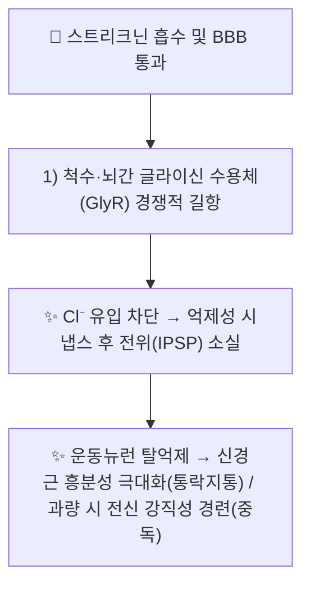

---
aliases:
  - Strychnine
  - 스트리크닌
tags:
  - 약리성분
  - 알칼로이드
  - 마전자
---

# 🔬 [[스트리크닌]] (Strychnine, C₂₁H₂₂N₂O₂)

> **핵심 3줄 요약 (Key Summary)**:
> - 🌿 기원 본초 & 화학 계열: [[마전자]](馬錢子, *Strychnos nux-vomica*)의 핵심 인돌 알칼로이드로, [[브루신]](Brucine)과 함께 KP(대한민국약전) 지표성분(스트리크닌 ≥1.20%)입니다.
> - 🎯 핵심 분자 표적 & 조절 경로: 척수·뇌간의 [[글라이신 수용체]](GlyR, 억제성 Cl⁻ 채널)에 경쟁적으로 결합하여 글라이신의 억제성 신경전달을 차단(길항)합니다.
> - 🩺 주요 약리 활성 & 질환 치료 기전: 신경근 흥분성 증대를 통한 완고한 신경마비·중풍 후유증·통락지통(通絡止痛) 효능의 분자적 근거이나, 동시에 극독성(有大毒) 경련 유발 물질입니다.
> - ⚠️ 독성·생체이용률 한계 & 상호작용: 치료 용량과 중독 용량의 폭이 매우 좁은 맹독성 물질로, 반드시 포제(炮製, 법제)를 거쳐 함량을 낮춘 포마전자(炮馬錢子) 형태로만 극미량 사용해야 합니다.

---

## 📌 목차
1. [기본 화학 정보 & 분자 구조식 (Chemical Identity)](#1-기본-화학-정보--분자-구조식-chemical-identity)
2. [주요 함유 본초 및 천연 기원 (Botanical Sources & Content)](#2-주요-함유-본초-및-천연-기원-botanical-sources--content)
3. [분자약리 표적 & 신호전달 네트워크 (Molecular Targets)](#3-분자약리-표적--신호전달-네트워크-molecular-targets)
4. [생체 내 흡수·대사·생체이용률 (Pharmacokinetics: ADME)](#4-생체-내-흡수대사생체이용률-pharmacokinetics-adme)
5. [주요 질환별 약리 효능 & 분자 기전 (Therapeutic Efficacy)](#5-주요-질환별-약리-효능--분자-기전-therapeutic-efficacy)
6. [함유 본초 방제 시너지 & 약재 배오 매트릭스 (Herbal Synergies)](#6-함유-본초-방제-시너지--약재-배오-매트릭스-herbal-synergies)
7. [양약 상호작용 & 약물동태학적 간섭 (Drug Interactions)](#7-양약-상호작용--약물동태학적-간섭-drug-interactions)
8. [💡 사용자 진료실 핵심 필기 & 임상 응용 팁 (Melt-In & High-Yield)](#8--사용자-진료실-핵심-필기--임상-응용-팁-melt-in--high-yield)
9. [출처 및 학술 참고 문헌 (References)](#9-출처-및-학술-참고-문헌-references)

---

## 1. 기본 화학 정보 & 분자 구조식 (Chemical Identity)

![[스트리크닌_화학구조식.png|320]]
> [그림 1: 스트리크닌의 2D 화학 분자 구조식 (Chemical Structure)] ⚠️ 내용 검토 필요 — 구조식 이미지 파일은 아직 첨부되지 않았습니다. `7. 첨부·자료/첨부파일/`에 실제 구조식 이미지를 추가해 주세요.

> [!abstract]+ 🧪 3D 약리 분자 구조 (Interactive 3D Viewer)
> <iframe src="https://molecule-viewer-rho.vercel.app/?cid=441071" width="100%" height="450px" frameborder="0" allow="webgl" style="border-radius: 8px;"></iframe>

| 항목 | 상세 내용 |
| :--- | :--- |
| **IUPAC 명칭** | Strychnidin-10-one |
| **분자식 / 분자량** | C₂₁H₂₂N₂O₂ / 334.4 g/mol |
| **PubChem CID** | [441071](https://pubchem.ncbi.nlm.nih.gov/compound/441071) |
| **CAS 등록 번호** | 57-24-9 |
| **화학 골격 분류** | 다환성 인돌(모노테르펜 인돌) 알칼로이드 — 스트리크노스(Strychnos)속 특이 골격 |
| **물리화학적 성상** | 무색 결정성 분말, 매우 쓴맛, 지용성이 높아 혈액-뇌 장벽(BBB) 투과가 빠름 |
| **식물 내 생합성 경로** | 트립타민(tryptamine)과 세코로가닌(secologanin)이 축합되는 모노테르펜 인돌 알칼로이드 생합성 경로(스트릭토시딘 경유)를 거쳐 생성됩니다. |

---

## 2. 주요 함유 본초 및 천연 기원 (Botanical Sources & Content)

| 함유 본초 (한글/한자) | 기원 식물학적 명칭 (과명 / 학명) | 주요 함유 약용 부위 | 지표 함량 (%) | 한의학적 귀경 및 약효 특성 |
| :--- | :--- | :--- | :--- | :--- |
| [[마전자]] (馬錢子) | 마전과(Loganiaceae) / *Strychnos nux-vomica* | 성숙한 씨(종자) | 1.20% 이상(KP 규격, 스트리크닌 기준) | 肝·脾經, 통락지통·산결소종, 有大毒 |

---

## 3. 분자약리 표적 & 신호전달 네트워크 (Molecular Targets)

### 1) 글라이신 수용체(GlyR) 경쟁적 길항
* 스트리크닌은 척수 렌쇼 세포(Renshaw cell) 회로의 억제성 글라이신 수용체(Cl⁻ 이온통로형 수용체)에 결합하여 글라이신의 결합을 경쟁적으로 차단합니다. 이는 1973년 Young과 Snyder가 방사성 표지 스트리크닌 결합 실험으로 최초로 규명한 고전적 기전입니다.
* 이 길항 작용으로 척수 반사궁의 억제가 풀리면서 신경근 흥분성이 과도하게 증가하며, 임상적으로는 완고한 신경마비의 흥분성 회복(치료 목적, 극미량)과 전신 강직성 경련(중독 목적, 과량) 양쪽으로 나타납니다.

---

## 4. 생체 내 흡수·대사·생체이용률 (Pharmacokinetics: ADME)

* **장관 흡수 및 배출 펌프 (P-gp) 상호작용**: 지용성이 높아 위장관에서 빠르게 흡수되며 혈액-뇌 장벽을 신속히 통과합니다(정성적 특성으로 보고, 정량 데이터는 ⚠️ 확인 필요).
* **간 대사**: 간 CYP450 효소(특히 CYP3A 계열로 추정)에 의해 대사되는 것으로 알려져 있으나, 본 노트 작성 시점 검색 범위에서 스트리크닌에 특정된 CYP 이소형·대사체 정량 데이터는 확인하지 못했습니다. ⚠️ 내용 검토 필요.
* **포제(법제)에 따른 함량 변화**: 모래 볶음(탕포) 또는 기름 튀김 포제를 거치면 스트리크닌 함량이 감소하여 독성이 완화되는 것으로 한의학 전통 포제 이론에서 보고됩니다(정량적 감소율은 ⚠️ 확인 필요).

---

## 5. 주요 질환별 약리 효능 & 분자 기전 (Therapeutic Efficacy)

### 1) 신경계 질환 (완고한 신경마비·중풍 후유증)
* GlyR 길항을 통한 척수 반사 흥분성 증대 기전이 안면신경마비·중풍 후유증의 마목(痲木) 개선에 응용되는 근거로 제시됩니다.
### 2) 통증·종괴 (암성 동통·산결소종)
* [[브루신]]과 함께 항염증·진통 활성이 보고되어 있으며, 브루신의 경우 미토콘드리아 카스파제 경로를 통한 간암세포주(SMMC-7721) 아폽토시스 유도가 별도로 보고되었습니다(PMID 16443926, 마전자 노트 §7 참조).

⚠️ 독성 경고: 스트리크닌은 유효 용량과 치사 용량의 안전역(therapeutic index)이 극히 좁아, 반드시 전문가의 포제·배오·용량 관리 하에서만 사용해야 합니다. 절대 생용(生用)해서는 안 됩니다.

---

## 6. 함유 본초 방제 시너지 & 약재 배오 매트릭스 (Herbal Synergies)

| 함유 본초 / 방제 | 공존 유효 성분군 | 분자약리 시너지 기전 | 전통 한의학적 효능 연계 |
| :--- | :--- | :--- | :--- |
| [[마전자]] | [[브루신]], [[이소스트리크닌]] | 브루신의 상대적으로 낮은 중추독성(스트리크닌 대비 약 1/5)이 스트리크닌의 강한 GlyR 길항과 상호 보완 | 통락지통(通絡止痛), 산결소종(散結消腫) |
| [[마전자]] + [[감초]] | [[감초산]] 계열 사포닌 | 감초 성분이 스트리크닌 알칼로이드의 흡수를 지연시켜 급격한 중독 반응을 완화(전통 배오 경험, 정량 기전 논문 확인 필요 ⚠️) | 해독(解毒), 약성 완화 |

---

## 7. 양약 상호작용 & 약물동태학적 간섭 (Drug Interactions)

* **중추신경 흥분·억제제와의 병용 금기**: GlyR 길항 기전상 다른 중추신경 흥분제와 병용 시 경련 역치가 낮아질 위험이 있어 병용을 피해야 합니다(일반 약리학적 원칙에 근거, 개별 병용 연구 확인 필요 ⚠️).
* **근이완제와의 상호작용**: 신경근 흥분성을 높이는 기전상 근이완제·항경련제의 약효를 상쇄할 가능성이 이론적으로 제시되나, 이를 직접 검증한 임상 병용 연구는 확인하지 못했습니다.

---

## 8. 💡 사용자 진료실 핵심 필기 & 임상 응용 팁 (Melt-In & High-Yield)

* **사용자 원문 필기**: (원장님 개별 필기 자료 없음 — 향후 진료 경험 축적 시 본 섹션에 추가 예정)
* **진료실 실전 처방 & 안전 사용 팁**:
  1. **반드시 포제(炮製) 후 사용**: 생마전자는 임상 사용이 금기이며, 반드시 법제를 거친 포마전자(炮馬錢子)만 극미량(1일 내복량 0.3~0.6g, 가루약 기준) 사용합니다.
  2. **절대 금기 대상**: 임산부, 소아, 고혈압, 간·신장 기능 부전, 심혈관 질환 환자에게는 사용하지 않습니다([[마전자]] 노트 §7 금기 사항 참조).

---

## 9. 출처 및 학술 참고 문헌 (References)

1. **Young AB, Snyder SH (1973)**. "Strychnine Binding Associated with Glycine Receptors of the Central Nervous System". *Proceedings of the National Academy of Sciences*, 70(10):2832-2836. DOI: [10.1073/pnas.70.10.2832](https://doi.org/10.1073/pnas.70.10.2832). PMID: [4200724](https://pubmed.ncbi.nlm.nih.gov/4200724/).
   - **[연구 요약]**: 방사성 표지 스트리크닌 결합 실험을 통해 중추신경계 글라이신 수용체와 스트리크닌 결합 부위의 상관관계를 최초로 규명한 고전적 연구.
2. **Guo R, Wang T, Zhou G, Xu M, Yu X (2018)**. "Botany, phytochemistry, pharmacology and toxicity of *Strychnos nux-vomica* L.: A review". *The American Journal of Chinese Medicine*, 46(01), 1-23. DOI: [10.1142/S0192415X1850001X](https://doi.org/10.1142/S0192415X1850001X). PMID: [29298518](https://pubmed.ncbi.nlm.nih.gov/29298518/).
   - **[연구 요약]**: 마전자의 식물학·식물화학·분자약리·독성학 프로파일을 총괄한 리뷰로, 스트리크닌의 GlyR 억제 기전과 포제 과정 중 독성 성분 전환 경로를 상세히 제시([[마전자]] 노트에서도 인용).
3. **PubChem CID 441071 (Strychnine)**; **CAS 57-24-9**. National Center for Biotechnology Information.
   - **[화학 데이터베이스]**: 분자식·CAS 번호 등 공인 화학 데이터.

> ⚠️ 내용 검토 필요: §4의 CYP450 대사 이소형, 포제 전후 정량적 함량 변화율은 검색 범위 내 개별 논문을 확인하지 못해 일반론 서술과 ⚠️ 표시로 대체했습니다. 극독성 물질인 만큼 본 노트의 모든 용량·용법 서술은 [[마전자]] 노트 및 KP 공정서 규격을 반드시 함께 참고해야 합니다.
