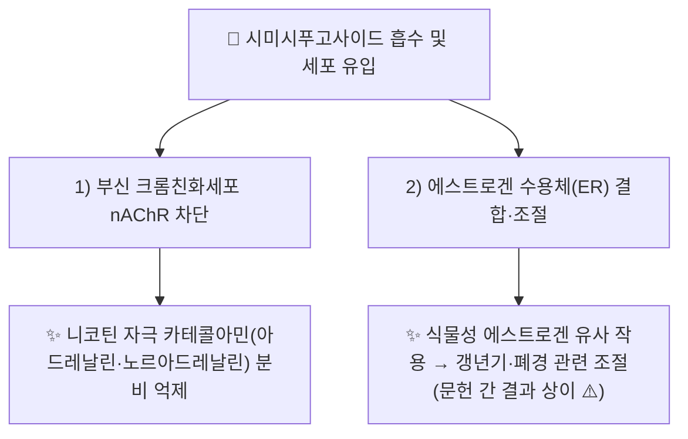

---
aliases:
  - Cimicifugoside
  - 시미시푸고사이드
tags:
  - 약리성분
  - 사포닌
  - 승마
---

# 🔬 [[시미시푸고사이드]] (Cimicifugoside, C₃₇H₅₄O₁₁)

> **핵심 3줄 요약 (Key Summary)**:
> - 🌿 기원 본초 & 화학 계열: [[승마]](升麻, *Cimicifuga* spp.) 뿌리줄기에 함유된 시클로아르탄(cycloartane)계 트리테르펜 사포닌으로, 아세테인(Acctein) 등과 함께 승마속 특이 지표성분입니다.
> - 🎯 핵심 분자 표적 & 조절 경로: 부신 크롬친화세포의 니코틴성 아세틸콜린 수용체(nAChR) 차단을 통한 카테콜아민 분비 억제, 에스트로겐 수용체(ER) 결합을 통한 식물성 에스트로겐(phytoestrogen) 유사 조절.
> - 🩺 주요 약리 활성 & 질환 치료 기전: 자율신경·카테콜아민 분비 조절, 갱년기·폐경 후 증상 관련 에스트로겐 수용체 조절 — [[승마]]의 승양거함(升陽擧陷)·발표투진(發表透疹) 효능의 분자적 근거 중 하나로 제시됩니다.
> - ⚠️ 독성·생체이용률 한계 & 상호작용: ER 결합 관련 문헌 간 결과가 일관되지 않으며(양성/음성 보고 혼재), 트리테르펜 사포닌 특유의 낮은 경구 생체이용률 문제로 인체 약동학 데이터는 확인되지 않았습니다.

---

## 📌 목차
1. [기본 화학 정보 & 분자 구조식 (Chemical Identity)](#1-기본-화학-정보--분자-구조식-chemical-identity)
2. [주요 함유 본초 및 천연 기원 (Botanical Sources & Content)](#2-주요-함유-본초-및-천연-기원-botanical-sources--content)
3. [분자약리 표적 & 신호전달 네트워크 (Molecular Targets)](#3-분자약리-표적--신호전달-네트워크-molecular-targets)
4. [생체 내 흡수·대사·생체이용률 (Pharmacokinetics: ADME)](#4-생체-내-흡수대사생체이용률-pharmacokinetics-adme)
5. [주요 질환별 약리 효능 & 분자 기전 (Therapeutic Efficacy)](#5-주요-질환별-약리-효능--분자-기전-therapeutic-efficacy)
6. [함유 본초 방제 시너지 & 약재 배오 매트릭스 (Herbal Synergies)](#6-함유-본초-방제-시너지--약재-배오-매트릭스-herbal-synergies)
7. [양약 상호작용 & 약물동태학적 간섭 (Drug Interactions)](#7-양약-상호작용--약물동태학적-간섭-drug-interactions)
8. [💡 사용자 진료실 핵심 필기 & 임상 응용 팁 (Melt-In & High-Yield)](#8--사용자-진료실-핵심-필기--임상-응용-팁-melt-in--high-yield)
9. [출처 및 학술 참고 문헌 (References)](#9-출처-및-학술-참고-문헌-references)

---

## 1. 기본 화학 정보 & 분자 구조식 (Chemical Identity)

![[시미시푸고사이드_화학구조식.png|320]]
> [그림 1: 시미시푸고사이드의 2D 화학 분자 구조식 (Chemical Structure)] ⚠️ 내용 검토 필요 — 구조식 이미지 파일은 아직 첨부되지 않았습니다. `7. 첨부·자료/첨부파일/`에 실제 구조식 이미지를 추가해 주세요.

> [!abstract]+ 🧪 3D 약리 분자 구조 (Interactive 3D Viewer)
> <iframe src="https://molecule-viewer-rho.vercel.app/?cid=441913" width="100%" height="450px" frameborder="0" allow="webgl" style="border-radius: 8px;"></iframe>

| 항목 | 상세 내용 |
| :--- | :--- |
| **IUPAC 명칭** | ⚠️ 내용 검토 필요(복잡한 다환성 사포닌 IUPAC 전체명 미확인) |
| **분자식 / 분자량** | C₃₇H₅₄O₁₁ / 약 674.8 g/mol |
| **PubChem CID** | [441913](https://pubchem.ncbi.nlm.nih.gov/compound/441913) |
| **CAS 등록 번호** | 66176-93-0 |
| **화학 골격 분류** | 시클로아르탄(cycloartane)계 트리테르펜 배당체(사포닌) |
| **물리화학적 성상** | 백색~미백색 분말, 트리테르펜 사포닌 특유의 저지용성·양친매성 |
| **식물 내 생합성 경로** | 스쿠알렌 → 시클로아르테놀 경로를 거치는 트리테르펜 생합성 경로에서 유래하는 시클로아르탄형 배당체입니다(승마속 특이 경로, 세부 효소 캐스케이드는 ⚠️ 확인 필요). |

---

## 2. 주요 함유 본초 및 천연 기원 (Botanical Sources & Content)

| 함유 본초 (한글/한자) | 기원 식물학적 명칭 (과명 / 학명) | 주요 함유 약용 부위 | 지표 함량 (%) | 한의학적 귀경 및 약효 특성 |
| :--- | :--- | :--- | :--- | :--- |
| [[승마]] (升麻) | 미나리아재비과(Ranunculaceae) / *Cimicifuga heracleifolia* 등 | 뿌리줄기(근경) | ⚠️ 내용 검토 필요(정량 데이터 미확인) | 肺·脾·胃·大腸經, 승양거함·발표투진·청열해독 |

> 서양승마(*Cimicifuga racemosa*, Black cohosh) 역시 승마속에 속하며 갱년기 증상 관련 연구가 다수 이루어진 기원 식물이나, 본 노트는 국내 임상에서 주로 사용되는 [[승마]] 기원을 중심으로 정리합니다.

---

## 3. 분자약리 표적 & 신호전달 네트워크 (Molecular Targets)

### 1) nAChR 차단을 통한 카테콜아민 분비 억제
* 소 부신 크롬친화세포(bovine adrenal chromaffin cells) 모델에서 시미시푸고사이드가 니코틴성 아세틸콜린 수용체를 차단하여 니코틴 자극에 의한 카테콜아민 분비를 억제함이 보고되었습니다(PMID 14757852).
### 2) 에스트로겐 수용체(ER) 결합
* *Cimicifuga racemosa* 함유 성분들의 시험관 내 에스트로겐 수용체 결합능을 평가한 연구가 보고되어 있으나(PMID 17340522), 해당 연구를 포함한 여러 문헌에서 승마속 사포닌의 ER 결합력에 대해 결과가 상이하게 보고되어 있어 일관된 결론은 확인되지 않았습니다. ⚠️ 내용 검토 필요.

---

## 4. 생체 내 흡수·대사·생체이용률 (Pharmacokinetics: ADME)

* **장관 흡수 및 배출 펌프 (P-gp) 상호작용**: ⚠️ 내용 검토 필요 — 트리테르펜 사포닌 계열의 일반적 저흡수율 특성은 알려져 있으나, 시미시푸고사이드 고유의 정량 데이터는 확인하지 못했습니다.
* **장내 미생물총(Microbiome) 대사 전환**: ⚠️ 내용 검토 필요 — 확인된 문헌 없음.
* **간 대사 및 소실 반감기**: ⚠️ 내용 검토 필요 — 확인된 문헌 없음.

---

## 5. 주요 질환별 약리 효능 & 분자 기전 (Therapeutic Efficacy)

### 1) 자율신경·카테콜아민 관련 조절
* 부신 크롬친화세포 모델에서의 nAChR 차단을 통한 카테콜아민 분비 억제(PMID 14757852)는 [[승마]]가 상충되는 열증(홍조·발한) 조절에 관여할 가능성을 시사하나, 직접적 임상 연계 문헌은 확인되지 않았습니다.
### 2) 갱년기·폐경 관련 증상 (식물성 에스트로겐 조절)
* 승마속 사포닌 성분의 ER 결합 관련 연구(PMID 17340522)가 존재하나, 결과가 문헌마다 상이하여 명확한 기전 결론을 내리기 어렵습니다. ⚠️ 내용 검토 필요.

⚠️ 내용 검토 필요: 위 연구들은 세포·시험관 수준이며, 인체 대상 임상시험(RCT) 근거는 이번 검색 범위 내에서 확인되지 않았습니다.

---

## 6. 함유 본초 방제 시너지 & 약재 배오 매트릭스 (Herbal Synergies)

| 함유 본초 / 방제 | 공존 유효 성분군 | 분자약리 시너지 기전 | 전통 한의학적 효능 연계 |
| :--- | :--- | :--- | :--- |
| [[승마]] | [[이소페룰산]], 페룰산, 시미시푸긴 | 사포닌-페놀산 복합체의 승양·해독 상가 작용(정량적 시너지 데이터 확인 필요 ⚠️) | 승양거함(升陽擧陷), 발표투진(發表透疹) |
| [[보중익기탕]] | [[황기]], [[인삼]], [[시호]] | 중기하함 병증에 대한 다표적 승양 네트워크(구체 논문 확인 필요 ⚠️) | 보중익기(補中益氣) |

---

## 7. 양약 상호작용 & 약물동태학적 간섭 (Drug Interactions)

* **CYP450 효소 간섭**: ⚠️ 내용 검토 필요 — 시미시푸고사이드에 특정된 CYP450 억제/유도 연구는 이번 검색 범위에서 확인하지 못했습니다.
* **호르몬 관련 양약과의 병용 시 고려사항**: ER 결합 관련 보고가 문헌 간 상이하므로, 호르몬대체요법(HRT)이나 타목시펜 등 ER 관련 약물과의 병용 시 이론적 상호작용 가능성을 신중히 고려해야 하나, 이를 직접 검증한 임상 병용 연구는 확인하지 못했습니다.

---

## 8. 💡 사용자 진료실 핵심 필기 & 임상 응용 팁 (Melt-In & High-Yield)

* **사용자 원문 필기**: (원장님 개별 필기 자료 없음 — 향후 진료 경험 축적 시 본 섹션에 추가 예정)
* **진료실 실전 처방 & 생체이용률 극대화 팁**:
  1. **전탕액 복용 원칙**: 단일 성분 세포 수준 연구와 [[승마]] 전탕액의 복합 성분 노출은 약리학적으로 동일시할 수 없으므로, 승양거함 임상 효능을 시미시푸고사이드 단일 기전만으로 설명하지 않도록 주의합니다.
  2. **ER 결합 관련 서술의 신중한 사용**: 문헌 간 결과가 상이하므로, 갱년기 환자 상담 시 "에스트로겐 유사 작용이 확립되어 있다"는 단정적 표현보다 "일부 연구에서 제시된 가설적 기전"임을 명확히 안내하는 것이 바람직합니다.

---

## 9. 출처 및 학술 참고 문헌 (References)

1. **⚠️ 저자명 미확인**. "Phytoestrogen cimicifugoside-mediated inhibition of catecholamine secretion by blocking nicotinic acetylcholine receptor in bovine adrenal chromaffin cells". PMID: [14757852](https://pubmed.ncbi.nlm.nih.gov/14757852/).
   - **[연구 요약]**: 소 부신 크롬친화세포 모델에서 시미시푸고사이드가 니코틴성 아세틸콜린 수용체 차단을 통해 카테콜아민 분비를 억제함을 규명.
2. **⚠️ 저자명 미확인**. "Studies on the endocrine effects of the contents of Cimicifuga racemosa. 2. In vitro binding of compounds to estrogen receptors". PMID: [17340522](https://pubmed.ncbi.nlm.nih.gov/17340522/).
   - **[연구 요약]**: *Cimicifuga racemosa* 함유 성분들의 시험관 내 에스트로겐 수용체 결합능을 평가 — 승마속 사포닌의 ER 관련 작용 가설의 근거 중 하나이나 결과 해석에 주의가 필요.
3. **PubChem CID 441913 (Cimicifugoside)**; **CAS 66176-93-0**. National Center for Biotechnology Information.
   - **[화학 데이터베이스]**: 분자식·CAS 번호 등 공인 화학 데이터.

> ⚠️ 내용 검토 필요: §1의 IUPAC 전체 명칭, §2·4의 정량적 함량·ADME 데이터는 검색 범위 내 개별 논문을 확인하지 못해 ⚠️ 표시로 대체했습니다. ER 결합 관련 서술은 문헌 간 상반된 보고가 있어 단정적 결론을 피하고 가설적 수준으로만 서술했습니다.
