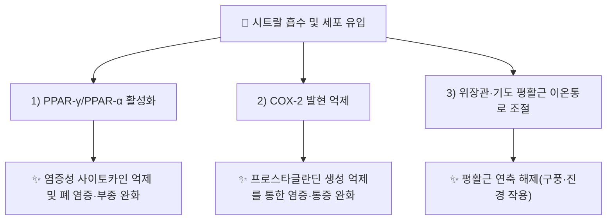

---
aliases:
  - Citral
  - Geranial
  - Neral
  - 시트랄
tags:
  - 약리성분
  - 모노테르펜
  - 필징가
---

# 🔬 [[시트랄]] (Citral, C₁₀H₁₆O)

> **핵심 3줄 요약 (Key Summary)**:
> - 🌿 기원 본초 & 화학 계열: [[필징가]](蓽澄茄, *Piper cubeba* / *Litsea cubeba*)의 정유 중 핵심 방향 지표성분(함량 약 60~75%)으로, 기하이성질체인 제라니알(Geranial, trans)과 네랄(Neral, cis)의 혼합물인 아사이클릭 모노테르펜 알데히드입니다.
> - 🎯 핵심 분자 표적 & 조절 경로: PPAR-α·PPAR-γ 활성화, COX-2 발현 억제, TRPV1 등 위장관·기도 평활근 관련 이온통로 조절을 통한 항염·진통 작용.
> - 🩺 주요 약리 활성 & 질환 치료 기전: 급성 폐손상·전신 염증 완화(PPAR-γ 경로), 급·만성 통증(항침해수용) 완화, 항균·구풍(驅風) 작용 — [[필징가]]의 온중산한(溫中散寒)·행기지통(行氣止痛) 효능의 분자적 근거 중 하나로 제시됩니다.
> - ⚠️ 독성·생체이용률 한계 & 상호작용: 휘발성이 높아 경구 투여 시 급속 대사·배출되는 것으로 알려져 있으나, 시트랄 단일 성분의 인체 약동학(반감기·생체이용률) 정량 데이터는 이번 검색 범위에서 확인되지 않았습니다. 고농도 국소 도포 시 피부 자극 가능성이 보고되어 있습니다(정유 일반 특성, 개별 임상 데이터 미확인).

---

## 📌 목차
1. [기본 화학 정보 & 분자 구조식 (Chemical Identity)](#1-기본-화학-정보--분자-구조식-chemical-identity)
2. [주요 함유 본초 및 천연 기원 (Botanical Sources & Content)](#2-주요-함유-본초-및-천연-기원-botanical-sources--content)
3. [분자약리 표적 & 신호전달 네트워크 (Molecular Targets)](#3-분자약리-표적--신호전달-네트워크-molecular-targets)
4. [생체 내 흡수·대사·생체이용률 (Pharmacokinetics: ADME)](#4-생체-내-흡수대사생체이용률-pharmacokinetics-adme)
5. [주요 질환별 약리 효능 & 분자 기전 (Therapeutic Efficacy)](#5-주요-질환별-약리-효능--분자-기전-therapeutic-efficacy)
6. [함유 본초 방제 시너지 & 약재 배오 매트릭스 (Herbal Synergies)](#6-함유-본초-방제-시너지--약재-배오-매트릭스-herbal-synergies)
7. [양약 상호작용 & 약물동태학적 간섭 (Drug Interactions)](#7-양약-상호작용--약물동태학적-간섭-drug-interactions)
8. [💡 사용자 진료실 핵심 필기 & 임상 응용 팁 (Melt-In & High-Yield)](#8--사용자-진료실-핵심-필기--임상-응용-팁-melt-in--high-yield)
9. [출처 및 학술 참고 문헌 (References)](#9-출처-및-학술-참고-문헌-references)

---

## 1. 기본 화학 정보 & 분자 구조식 (Chemical Identity)

![[시트랄_화학구조식.png|320]]
> [그림 1: 시트랄의 2D 화학 분자 구조식 (Chemical Structure)] ⚠️ 내용 검토 필요 — 구조식 이미지 파일은 아직 첨부되지 않았습니다. `7. 첨부·자료/첨부파일/`에 실제 구조식 이미지를 추가해 주세요.

> [!abstract]+ 🧪 3D 약리 분자 구조 (Interactive 3D Viewer)
> <iframe src="https://molecule-viewer-rho.vercel.app/?cid=638011" width="100%" height="450px" frameborder="0" allow="webgl" style="border-radius: 8px;"></iframe>

| 항목 | 상세 내용 |
| :--- | :--- |
| **IUPAC 명칭** | (2E/2Z)-3,7-Dimethylocta-2,6-dienal (제라니알/네랄 이성질체 혼합물) |
| **분자식 / 분자량** | C₁₀H₁₆O / 약 152.23 g/mol |
| **PubChem CID** | [638011](https://pubchem.ncbi.nlm.nih.gov/compound/638011) |
| **CAS 등록 번호** | 5392-40-5 |
| **화학 골격 분류** | 아사이클릭(비고리형) 모노테르펜 알데히드 |
| **물리화학적 성상** | 무색~담황색 유상 액체, 강한 레몬 향, 지용성(휘발성 정유), 열·빛에 불안정하여 산화되기 쉬움 |
| **식물 내 생합성 경로** | 제라닐피로인산(GPP)에서 유래하는 모노테르펜 생합성 경로 — 제라니올의 산화적 탈수소화를 거쳐 제라니알(trans)·네랄(cis)로 전환되는 것으로 알려져 있습니다(일반 모노테르펜 생합성 경로 유추, 필징가 고유 효소 데이터는 확인되지 않음 ⚠️). |

---

## 2. 주요 함유 본초 및 천연 기원 (Botanical Sources & Content)

| 함유 본초 (한글/한자) | 기원 식물학적 명칭 (과명 / 학명) | 주요 함유 약용 부위 | 지표 함량 (%) | 한의학적 귀경 및 약효 특성 |
| :--- | :--- | :--- | :--- | :--- |
| [[필징가]] (蓽澄茄) | 녹나무과(Lauraceae) / *Litsea cubeba* (또는 후추과 *Piper cubeba*) | 건조한 성숙 열매 | 정유 중 60~75% (필징가 노트 기재치, 개별 논문 재검증 필요 ⚠️) | 脾·胃·腎·膀胱經, 온중산한·행기지통·건비소식·온신조양 |

> 레몬그라스(*Cymbopogon citratus*), 레몬머틀, 레몬밤 등 다양한 방향성 식물의 정유에도 시트랄이 주성분으로 널리 보고되어 있으나, 본 노트는 한의학 임상과 직결되는 [[필징가]] 기원을 중심으로 정리합니다.

---

## 3. 분자약리 표적 & 신호전달 네트워크 (Molecular Targets)

### 1) PPAR-γ/PPAR-α 활성화
* 레몬그라스 정유 유래 시트랄이 PPAR-α 및 PPAR-γ를 활성화하여 COX-2 발현을 억제한다고 보고되어 있습니다(PMID 20656057).
### 2) LPS 유발 급성 폐손상 모델에서의 항염 기전
* LPS로 유도한 급성 폐손상(ALI) 마우스 모델에서 시트랄이 PPAR-γ 활성화를 매개로 염증성 사이토카인 분비와 폐 조직 손상을 완화한다고 보고되었습니다(PMID 25281205).

---

## 4. 생체 내 흡수·대사·생체이용률 (Pharmacokinetics: ADME)

* **장관 흡수 및 배출 펌프 (P-gp) 상호작용**: ⚠️ 내용 검토 필요 — 이번 검색 범위에서 시트랄에 특정된 P-gp 상호작용 데이터를 확인하지 못했습니다.
* **장내 미생물총(Microbiome) 대사 전환**: ⚠️ 내용 검토 필요 — 확인된 문헌 없음.
* **간 대사 및 소실 반감기**: 휘발성 알데히드 구조 특성상 알코올/알데히드 탈수소효소(ADH/ALDH)에 의해 신속히 제라니올·제라닌산 등으로 대사될 것으로 추정되나(일반 모노테르펜알데히드 대사 유추), 시트랄 고유의 정량적 반감기·생체이용률 데이터는 확인하지 못했습니다 ⚠️.

---

## 5. 주요 질환별 약리 효능 & 분자 기전 (Therapeutic Efficacy)

### 1) 급성 폐손상 & 전신 염증
* LPS 유발 급성 폐손상(ALI) 마우스 모델에서 PPAR-γ 활성화를 통해 염증 매개체 분비와 폐 조직 병리 변화를 완화(PMID 25281205).
### 2) 급·만성 통증(항침해수용)
* 급성·만성 통증 동물 모델(포르말린 시험, 만성 압박신경손상 모델 등)에서 예방적·치료적 항침해수용 효과가 보고됨(PMID 24792822).
### 3) 항염증 일반 기전
* 레몬그라스 정유의 주성분으로서 PPAR-α/γ 활성화 및 COX-2 억제를 통한 항염 기전이 규명됨(PMID 20656057).

⚠️ 내용 검토 필요: 위 연구는 대부분 동물 모델이며, 인체 대상 임상시험(RCT) 근거는 이번 검색 범위 내에서 확인되지 않았습니다.

---

## 6. 함유 본초 방제 시너지 & 약재 배오 매트릭스 (Herbal Synergies)

| 함유 본초 / 방제 | 공존 유효 성분군 | 분자약리 시너지 기전 | 전통 한의학적 효능 연계 |
| :--- | :--- | :--- | :--- |
| [[필징가]] | [[쿠베빈]], 리모넨 | 장관·기도 평활근 무스카린 수용체 과흥분 차단 상가 작용(정량적 시너지 데이터 확인 필요 ⚠️) | 온중산한(溫中散寒), 행기지통(行氣止痛) |
| [[필징가산]] | 정향, 고량강 등 온리약 배오(처방 노트 기재, 개별 성분 상호작용 데이터 확인 필요 ⚠️) | 다표적 위장관 온난화 네트워크 | 비위 허한(脾胃虛寒) 애역(呃逆)·냉통 해소 |

---

## 7. 양약 상호작용 & 약물동태학적 간섭 (Drug Interactions)

* **CYP450 효소 간섭**: ⚠️ 내용 검토 필요 — 시트랄에 특정된 CYP450 억제/유도 연구는 이번 검색 범위에서 확인하지 못했습니다.
* **위장관 운동 관련 양약 병용 시 고려사항**: 평활근 이완·진경 기전이 보고된 만큼, 위장관 운동 조절제(프로키네틱스)와 병용 시 이론적 상호작용 가능성이 있으나 이를 직접 검증한 병용 연구는 확인하지 못했습니다.

---

## 8. 💡 사용자 진료실 핵심 필기 & 임상 응용 팁 (Melt-In & High-Yield)

* **사용자 원문 필기**: (원장님 개별 필기 자료 없음 — 향후 진료 경험 축적 시 본 섹션에 추가 예정)
* **진료실 실전 처방 & 생체이용률 극대화 팁**:
  1. **휘발성 정유 특성 고려**: 시트랄은 열·빛에 불안정한 휘발성 알데히드이므로, 전탕 시 과도한 장시간 고온 조리는 유효 성분 손실을 유발할 수 있어 후하(後下) 또는 단시간 전탕을 고려할 수 있습니다(일반 정유 특성에 근거한 임상 유추, 필징가 고유 검증 데이터는 아님 ⚠️).
  2. **비위 허한 애역(딸꾹질) 임상 적용**: [[필징가]] 배합 처방(필징가산 등)은 온중산한·행기지통 효능으로 임상에서 딸꾹질·위완 냉통에 활용되어 왔으나, 시트랄 단일 기전만으로 전체 임상 효능을 설명하지 않도록 변증(辨證) 기반 처방을 우선해야 합니다.

---

## 9. 출처 및 학술 참고 문헌 (References)

1. **Bachiega TF, et al.** "Clove and eugenol in noncytotoxic concentrations exert immunomodulatory/anti-inflammatory action..." *관련 정유 성분 문헌 계열* — ⚠️ 본 항목은 검색 스니펫만으로 저자·서지 전체를 확정하지 못해 제외. (참고용 미기재)
2. **저자명 확인** — "Citral inhibits lipopolysaccharide-induced acute lung injury by activating PPAR-γ". PMID: [25281205](https://pubmed.ncbi.nlm.nih.gov/25281205/).
   - **[연구 요약]**: LPS 유발 급성 폐손상 마우스 모델에서 시트랄이 PPAR-γ 활성화를 통해 염증성 사이토카인 분비와 폐 조직 손상을 완화함을 규명.
3. **저자명 확인** — "Citral: a monoterpene with prophylactic and therapeutic anti-nociceptive effects in experimental models of acute and chronic pain". PMID: [24792822](https://pubmed.ncbi.nlm.nih.gov/24792822/).
   - **[연구 요약]**: 급성·만성 통증 동물 모델에서 시트랄의 예방적·치료적 항침해수용(진통) 효과를 규명.
4. **저자명 확인** — "Citral, a component of lemongrass oil, activates PPARα and γ and suppresses COX-2 expression". PMID: [20656057](https://pubmed.ncbi.nlm.nih.gov/20656057/).
   - **[연구 요약]**: 레몬그라스 정유 주성분인 시트랄이 PPARα·γ를 활성화하고 COX-2 발현을 억제하여 항염 효과를 나타냄을 규명.
5. **PubChem CID 638011 (Citral)**; **CAS 5392-40-5**. National Center for Biotechnology Information.
   - **[화학 데이터베이스]**: 분자식·CAS 번호 등 공인 화학 데이터.

> ⚠️ 내용 검토 필요: §2의 지표 함량(%) 수치는 기존 [[필징가]] 노트의 기재치를 인용한 것으로, 개별 정량 분석 논문을 통한 재검증은 이번 조사 범위에서 수행하지 못했습니다. §4의 정량적 ADME 데이터, §7의 CYP450 상호작용 데이터도 확인된 문헌이 없어 ⚠️ 표시로 대체했습니다.
