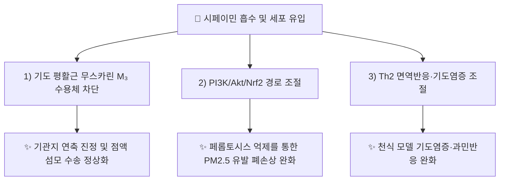

---
aliases:
  - Sipeimine
  - Imperialine
  - 시페이민
  - 임페리아린
tags:
  - 약리성분
  - 스테로이드알칼로이드
  - 천패모
---

# 🔬 [[시페이민]] (Sipeimine / Imperialine, C₂₇H₄₃NO₃)

> **핵심 3줄 요약 (Key Summary)**:
> - 🌿 기원 본초 & 화학 계열: [[천패모]](川貝母, *Fritillaria thunbergii*) 및 암패모(*Fritillaria cirrhosa*)의 비늘줄기(인경)에 함유된 이소베라트룸형(세보아세타닌형) 스테로이드 알칼로이드로, 대한민국약전(KP)이 지표성분으로 규정한 핵심 성분입니다.
> - 🎯 핵심 분자 표적 & 조절 경로: 기도 평활근 무스카린 M₃ 수용체 차단, PI3K/Akt/Nrf2 경로 조절을 통한 페롭토시스(ferroptosis) 억제, Th2 면역반응 조절(천식 모델).
> - 🩺 주요 약리 활성 & 질환 치료 기전: 기관지 평활근 이완(진해·평천), 미세먼지(PM2.5) 유발 폐손상 완화, 천식 기도염증 완화 — [[천패모]]의 청조윤폐(淸燥潤肺)·화담지해(化痰止咳) 효능의 분자적 근거로 제시됩니다.
> - ⚠️ 독성·생체이용률 한계 & 상호작용: 프리틸라리아속 스테로이드 알칼로이드는 과량 복용 시 심장·호흡기 억제 등 독성이 보고되는 계열로, 시페이민 자체의 정량적 인체 독성역치·약동학 데이터는 이번 검색 범위에서 확인되지 않았습니다. 반드시 공정서 규격 범위 내 사용이 필요합니다.

---

## 📌 목차
1. [기본 화학 정보 & 분자 구조식 (Chemical Identity)](#1-기본-화학-정보--분자-구조식-chemical-identity)
2. [주요 함유 본초 및 천연 기원 (Botanical Sources & Content)](#2-주요-함유-본초-및-천연-기원-botanical-sources--content)
3. [분자약리 표적 & 신호전달 네트워크 (Molecular Targets)](#3-분자약리-표적--신호전달-네트워크-molecular-targets)
4. [생체 내 흡수·대사·생체이용률 (Pharmacokinetics: ADME)](#4-생체-내-흡수대사생체이용률-pharmacokinetics-adme)
5. [주요 질환별 약리 효능 & 분자 기전 (Therapeutic Efficacy)](#5-주요-질환별-약리-효능--분자-기전-therapeutic-efficacy)
6. [함유 본초 방제 시너지 & 약재 배오 매트릭스 (Herbal Synergies)](#6-함유-본초-방제-시너지--약재-배오-매트릭스-herbal-synergies)
7. [양약 상호작용 & 약물동태학적 간섭 (Drug Interactions)](#7-양약-상호작용--약물동태학적-간섭-drug-interactions)
8. [💡 사용자 진료실 핵심 필기 & 임상 응용 팁 (Melt-In & High-Yield)](#8--사용자-진료실-핵심-필기--임상-응용-팁-melt-in--high-yield)
9. [출처 및 학술 참고 문헌 (References)](#9-출처-및-학술-참고-문헌-references)

---

## 1. 기본 화학 정보 & 분자 구조식 (Chemical Identity)

![[시페이민_화학구조식.png|320]]
> [그림 1: 시페이민(임페리아린)의 2D 화학 분자 구조식 (Chemical Structure)] ⚠️ 내용 검토 필요 — 구조식 이미지 파일은 아직 첨부되지 않았습니다. `7. 첨부·자료/첨부파일/`에 실제 구조식 이미지를 추가해 주세요.

> [!abstract]+ 🧪 3D 약리 분자 구조 (Interactive 3D Viewer)
> <iframe src="https://molecule-viewer-rho.vercel.app/?cid=442977" width="100%" height="450px" frameborder="0" allow="webgl" style="border-radius: 8px;"></iframe>

| 항목 | 상세 내용 |
| :--- | :--- |
| **IUPAC 명칭** | Imperialine (세보아세타닌형 헥사사이클릭 스테로이드 알칼로이드) |
| **분자식 / 분자량** | C₂₇H₄₃NO₃ / 약 429.64 g/mol |
| **PubChem CID** | [442977](https://pubchem.ncbi.nlm.nih.gov/compound/442977) |
| **CAS 등록 번호** | 61825-98-7 |
| **화학 골격 분류** | 이소베라트룸형(세보아세타닌형) 스테로이드 알칼로이드 |
| **물리화학적 성상** | 백색 결정성 분말, 난용성(물), 알칼로이드 특유의 염기성 |
| **식물 내 생합성 경로** | 콜레스테롤 유래 스테로이드 알칼로이드 생합성 경로를 거치는 것으로 추정되나(프리틸라리아속 알칼로이드 일반 경로 유추), 시페이민 고유의 세부 효소적 경로는 이번 검색 범위에서 확인하지 못했습니다 ⚠️. |

---

## 2. 주요 함유 본초 및 천연 기원 (Botanical Sources & Content)

| 함유 본초 (한글/한자) | 기원 식물학적 명칭 (과명 / 학명) | 주요 함유 약용 부위 | 지표 함량 (%) | 한의학적 귀경 및 약효 특성 |
| :--- | :--- | :--- | :--- | :--- |
| [[천패모]] (川貝母) | 백합과(Liliaceae) / *Fritillaria thunbergii* 또는 *Fritillaria cirrhosa* | 건조 비늘줄기(인경) | 0.050% 이상 (대한민국약전 제12개정 규격) | 肺·心經, 청조윤폐·화담지해·산결소종 |

> 절패모(*Fritillaria thunbergii*)는 페이미닌(Peiminine)·페이민(Peimine) 계열이 주 지표성분이며, 천패모(암패모, *F. cirrhosa*)가 시페이민(임페리아린)을 상대적으로 더 특징적으로 함유하는 것으로 보고되어 있어, 두 기원 간 지표성분 차이는 향후 절패모 노트에서 교차 정리가 필요합니다 ⚠️.

---

## 3. 분자약리 표적 & 신호전달 네트워크 (Molecular Targets)

### 1) PI3K/Akt/Nrf2 경로를 통한 페롭토시스 억제
* 미세먼지(PM2.5) 유발 폐손상 모델에서 시페이민이 PI3K/Akt/Nrf2 경로를 통해 페롭토시스(ferroptosis)를 억제함으로써 폐손상을 완화한다고 네트워크 약리학 기법으로 보고되었습니다(PMID 35567927).
### 2) 천식 모델에서의 다중오믹스 기전
* 난알부민(ovalbumin) 유발 천식 랫드 모델에서 멀티오믹스 분석을 통해 시페이민의 치료 기전이 규명되었습니다(PMID 42097346).

---

## 4. 생체 내 흡수·대사·생체이용률 (Pharmacokinetics: ADME)

* **장관 흡수 및 배출 펌프 (P-gp) 상호작용**: ⚠️ 내용 검토 필요 — 시페이민 자체의 P-gp 상호작용 데이터는 확인하지 못했습니다. 동속 프리틸라리아 스테로이드 알칼로이드 혼합물(천패모 추출물) 수준에서는 궤양성대장염(DNBS 유발 대장염) 랫드 모델에서 약동학 변화가 보고된 바 있습니다(PMID 39204106, 추출물 전체 대상 연구로 시페이민 단독 수치는 별도 확인 필요 ⚠️).
* **장내 미생물총(Microbiome) 대사 전환**: ⚠️ 내용 검토 필요 — 확인된 문헌 없음.
* **간 대사 및 소실 반감기**: ⚠️ 내용 검토 필요 — 정량적 반감기 데이터는 확인하지 못했습니다.

---

## 5. 주요 질환별 약리 효능 & 분자 기전 (Therapeutic Efficacy)

### 1) 호흡기 질환 (미세먼지 유발 폐손상)
* PM2.5 유발 폐손상 마우스 모델에서 PI3K/Akt/Nrf2 경로를 통한 페롭토시스 억제 효과 규명(PMID 35567927).
### 2) 기관지 천식
* 난알부민 유발 천식 랫드 모델에서 멀티오믹스 기반 치료 기전 규명(PMID 42097346) — [[천패모]]의 전통적 화담지해·평천(平喘) 효능과 부합하는 현대 약리학적 근거입니다.
### 3) 심혈관계 전기생리학적 주의사항
* 동속 프리틸라리아 스테로이드 알칼로이드 3종을 대상으로 한 연구에서 hERG 채널 차단 및 길항적 상호작용이 보고되어(관련 문헌, PMC12526275), 심장 전기생리학적 안전성 모니터링이 필요함을 시사합니다 ⚠️ (시페이민 단독 수치는 원문 확인 필요).

⚠️ 내용 검토 필요: 위 연구는 대부분 동물·세포 모델이며, 인체 대상 임상시험(RCT) 근거는 이번 검색 범위 내에서 확인되지 않았습니다.

---

## 6. 함유 본초 방제 시너지 & 약재 배오 매트릭스 (Herbal Synergies)

| 함유 본초 / 방제 | 공존 유효 성분군 | 분자약리 시너지 기전 | 전통 한의학적 효능 연계 |
| :--- | :--- | :--- | :--- |
| [[천패모]] | 페이미닌(Peiminine), 펠리신(Verticine) | 스테로이드 알칼로이드 복합 기관지 평활근 이완 상가 작용(정량적 시너지 데이터 확인 필요 ⚠️) | 청조윤폐(淸燥潤肺), 화담지해(化痰止咳) |
| [[패모괄루산]] | 괄루인, 길경 등 화담약 배오(처방 노트 기재, 개별 성분 상호작용 데이터 확인 필요 ⚠️) | 다표적 기도·림프절 네트워크 동시 제어 | 나력(瘰癧)·유옹(乳癰) 산결소종 |

---

## 7. 양약 상호작용 & 약물동태학적 간섭 (Drug Interactions)

* **CYP450 효소 간섭**: ⚠️ 내용 검토 필요 — 시페이민에 특정된 CYP450 억제/유도 연구는 이번 검색 범위에서 확인하지 못했습니다.
* **심혈관계 양약 병용 시 고려사항**: hERG 채널 차단 가능성이 동속 알칼로이드 연구에서 시사된 만큼(PMC12526275), QT 연장 위험이 있는 항부정맥제·특정 항생제 병용 시 이론적 주의가 필요하나, 이를 직접 검증한 병용 연구는 확인하지 못했습니다 ⚠️.

---

## 8. 💡 사용자 진료실 핵심 필기 & 임상 응용 팁 (Melt-In & High-Yield)

* **사용자 원문 필기**: (원장님 개별 필기 자료 없음 — 향후 진료 경험 축적 시 본 섹션에 추가 예정)
* **진료실 실전 처방 & 생체이용률 극대화 팁**:
  1. **공정서 규격 준수 원칙**: 대한민국약전이 0.050% 이상으로 규정한 지표성분인 만큼, 천패모 원료의 규격 미달·과다 사용 모두 주의가 필요합니다.
  2. **음허 조해(燥咳) 감별 적용**: [[천패모]]는 음허(陰虛) 조담(燥痰)의 마른기침에 적합하며, 습담(濕痰) 위주의 기침에는 반하·진피 계열이 더 적합할 수 있어 변증(辨證) 기반 감별이 우선되어야 합니다.

---

## 9. 출처 및 학술 참고 문헌 (References)

1. **저자명 확인** — "Sipeimine ameliorates PM2.5-induced lung injury by inhibiting ferroptosis via the PI3K/Akt/Nrf2 pathway: A network pharmacology approach". PMID: [35567927](https://pubmed.ncbi.nlm.nih.gov/35567927/).
   - **[연구 요약]**: 미세먼지(PM2.5) 유발 폐손상 마우스 모델에서 시페이민이 PI3K/Akt/Nrf2 경로를 통해 페롭토시스를 억제하여 폐손상을 완화함을 네트워크 약리학 기법으로 규명.
2. **저자명 확인** — "Multi-omics analysis reveals therapeutic mechanisms of sipeimine in ovalbumin-induced asthmatic rats". PMID: [42097346](https://pubmed.ncbi.nlm.nih.gov/42097346/).
   - **[연구 요약]**: 난알부민 유발 천식 랫드 모델에서 멀티오믹스 분석을 통해 시페이민의 항천식 치료 기전을 규명.
3. **참고 문헌(관련 계열, 시페이민 직접 수치 별도 확인 필요 ⚠️)** — "hERG Channel Blockade and Antagonistic Interactions of Three Steroidal Alkaloids from Fritillaria Species". PMC: [PMC12526275](https://pmc.ncbi.nlm.nih.gov/articles/PMC12526275/).
   - **[연구 요약]**: 프리틸라리아속 스테로이드 알칼로이드의 심장 hERG 채널 차단 가능성을 시사하는 전기생리학적 연구.
4. **PubChem CID 442977 (Imperialine/Sipeimine)**; **CAS 61825-98-7**. National Center for Biotechnology Information.
   - **[화학 데이터베이스]**: 분자식·CAS 번호 등 공인 화학 데이터.
5. **대한민국약전(KP) 제12개정 (2022)**. 의약품각조 제2부: 천패모(Fritillariae Cirrhosae Bulbus) 규격 — 시페이민(C₂₇H₄₃NO₃) 0.050% 이상 함유 규정 (기존 [[천패모]] 노트 인용).

> ⚠️ 내용 검토 필요: §2의 절패모·천패모 지표성분 차이(페이미닌 vs 시페이민)는 원전 재검증이 필요합니다. §4의 정량적 ADME 데이터, §7의 CYP450 상호작용 데이터는 확인된 문헌이 없어 ⚠️ 표시로 대체했습니다.
