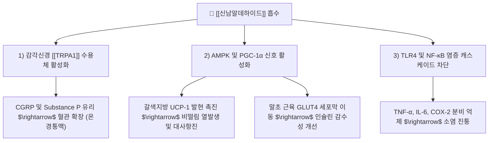

---
aliases:
  - Cinnamaldehyde
  - 신남알데하이드
  - 신남산알데히드
  - 계피알데히드
  - Cinnamic aldehyde
  - trans-Cinnamaldehyde
tags:
  - 약리/약리성분
  - 페닐프로파노이드
  - 정유성분
  - 계지
  - 육계
  - TRPA1
  - 말초순환
---

# 🔬 신남알데하이드 (Cinnamaldehyde, $C_9H_8O$ / (2E)-3-phenylprop-2-enal)

> **핵심 3줄 요약 (Key Summary)**:
> - 🌿 기원 본초 & 화학 계열: [[계지]](Cinnamomi Ramulus) 및 [[육계]](Cinnamomi Cortex) 정유(Essential Oil)의 75~90%를 차지하는 주활성 지표 성분으로, 방향족 페닐프로파노이드(Phenylpropanoid) 계열에 속함.
> - 🎯 핵심 분자 표적 & 조절 경로: 한랭 자극 감각 수용체인 [[TRPA1]] 이온 통로의 대표적 천연 효능제(Agonist)로 작용하여 CGRP 및 Substance P 유리를 촉진하고, AMPK 및 PGC-1α를 활성화하여 갈색지방(BAT) 열발생을 유도함.
> - 🩺 주요 약리 활성 & 질환 치료 기전: 말초 모세혈관 확장 및 피부 혈류 개선(온경통맥 溫經通脈, 사지 냉증·동통 완화), 지방세포 UCP-1 상향 조절을 통한 체온 상승 및 항비만 효능, 인슐린 수용체 감수성 개선 및 혈당 강하, 강력한 항균·항진균 작용.
> - ⚠️ 독성·생체이용률 한계 & 상호작용: 휘발성 정유 성분으로 장시간 전탕 시 유실률이 높으므로 후하(後下) 배려 필요, 혈소판 응집 억제 작용이 있어 항응고제·항혈소판제 병용 시 출혈 시간 연장 주의.

---

## 목차 (Table of Contents)
- [[#1. 기본 화학 정보 & 분자 구조식 (Chemical Identity)|1. 기본 화학 정보 & 분자 구조식 (Chemical Identity)]]
- [[#2. 주요 함유 본초 및 천연 기원 (Botanical Sources & Content)|2. 주요 함유 본초 및 천연 기원 (Botanical Sources & Content)]]
- [[#3. 분자약리 표적 & 신호전달 네트워크 (Molecular Targets)|3. 분자약리 표적 & 신호전달 네트워크 (Molecular Targets)]]
- [[#4. 생체 내 흡수·대사·생체이용률 (Pharmacokinetics: ADME)|4. 생체 내 흡수·대사·생체이용률 (Pharmacokinetics: ADME)]]
- [[#5. 주요 질환별 약리 효능 & 분자 기전 (Therapeutic Efficacy)|5. 주요 질환별 약리 효능 & 분자 기전 (Therapeutic Efficacy)]]
- [[#6. 함유 본초 방제 시너지 & 약재 배오 매트릭스 (Herbal Synergies)|6. 함유 본초 방제 시너지 & 약재 배오 매트릭스 (Herbal Synergies)]]
- [[#7. 양약 상호작용 & 약물동태학적 간섭 (Drug Interactions)|7. 양약 상호작용 & 약물동태학적 간섭 (Drug Interactions)]]
- [[#8. 💡 사용자 진료실 핵심 필기 & 임상 응용 팁 (Melt-In & High-Yield)|8. 💡 사용자 진료실 핵심 필기 & 임상 응용 팁 (Melt-In & High-Yield)]]
- [[#9. 출처 및 학술 참고 문헌 (References)|9. 출처 및 학술 참고 문헌 (References)]]

---

## 1. 기본 화학 정보 & 분자 구조식 (Chemical Identity)

### 1.1 분자 구조식 및 3D 뷰어

> [그림 1] PubChem 신남알데하이드(trans-Cinnamaldehyde) 2D 화학 분자 구조식 (CID: 637511)

> [!abstract]+ 🧪 3D 약리 분자 구조 (Interactive 3D Viewer)
> <iframe src="https://molecule-viewer-rho.vercel.app/?cid=637511" width="100%" height="450px" frameborder="0" allow="webgl" style="border-radius: 8px;"></iframe>

### 1.2 화학적 프로파일
| 항목 | 상세 내용 |
| :--- | :--- |
| **IUPAC 명칭** | (2E)-3-phenylprop-2-enal |
| **분자식 / 분자량** | $C_9H_8O$ / 132.16 g/mol |
| **PubChem CID** | 637511 |
| **CAS 등록 번호** | 104-55-2 (trans-form) |
| **화학 골격 분류** | 페닐프로파노이드 (Phenylpropanoid / $\alpha,\beta$-불포화 방향족 알데하이드) |
| **물리화학적 성상** | 특유의 계피 향과 단맛·매운맛을 지닌 황색의 유상 액체, 에탄올·에테르에 가용, 수용성 낮음 |
| **반응성** | 공기 중 산소에 노출 시 점진적으로 신남산(Cinnamic acid)으로 산화됨 |

---

## 2. 주요 함유 본초 및 천연 기원 (Botanical Sources & Content)

> [그림 2] 녹나무과 육계(Cinnamomum cassia)의 수피 및 계피 약재 외형

### 2.1 주요 함유 본초 매트릭스
| 함유 본초 (한글/한자) | 기원 식물학적 명칭 (과명 / 학명) | 주요 함유 약용 부위 | 지표 함량 (%) | 한의학적 귀경 및 약효 특성 |
| :--- | :--- | :--- | :--- | :--- |
| [[계지]] (桂枝) | 녹나무과(Lauraceae) / *Cinnamomum cassia* | 어린 가지(유경 幼枝) | 정유 1~2% 중 신남알데하이드 70~85% | 심(心), 폐(肺), 방광(膀胱) / 발한해기(發汗解肌), 온통경맥(溫通經脈), 통양화기(通陽化氣) |
| [[육계]] (肉桂) | 녹나무과(Lauraceae) / *Cinnamomum cassia* | 줄기껍질(간피 幹皮) | 정유 1~3% 중 신남알데하이드 75~90% | 신(腎), 비(脾), 심, 간 / 보원양(補元陽), 난비위(暖脾胃), 제한냉(除寒冷), 인화귀원(引火歸元) |
| [[계심]] (桂心) | 녹나무과(Lauraceae) / *Cinnamomum cassia* | 줄기의 내피(코르크층 제거) | 신남알데하이드 고농도 농축 | 심, 비 / 통어혈, 온경지통 |

---

## 3. 분자약리 표적 & 신호전달 네트워크 (Molecular Targets)

### 3.1 TRPA1 이온 통로 활성화와 신경혈관계 조절
* **천연 TRPA1 작용제 (Prototypical Agonist)**:
  * 신남알데하이드는 감각신경 말단의 TRPA1(Transient Receptor Potential Ankyrin 1) 이온 통로의 세포 내 시스테인 잔기와 공유 결합하여 칼슘 이온($Ca^{2+}$) 유입을 유도합니다 (Bandell et al., Neuron 2004).
* **신경인성 혈관 확장 (Neurogenic Vasodilation)**:
  * 일차 구심성 감각신경 말단에서 칼시토닌 유전자 관련 펩티드([[CGRP]]) 및 Substance P를 국소 분비시켜, 혈관 평활근의 수용체를 통해 일산화질소(NO) 생성을 유도하고 말초 세동맥을 신속히 확장시킵니다.
  * 이는 한의학에서 계지가 사지 말초로 양기(陽氣)를 뻗어나가게 하는 **온통경맥(溫通經脈)** 및 발한(發汗) 효능의 현대 분자약리학적 기전입니다.

---

## 4. 생체 내 흡수·대사·생체이용률 (Pharmacokinetics: ADME)

### 4.1 흡수 (Absorption)
* 경구 투여 시 소화관 지질막을 통해 신속하게 단순 확산으로 흡수됩니다.
* 지용성이 높아 장관 흡수율은 80% 이상으로 양호하나, 장관 점막 및 간을 통과하면서 신속한 초회 통과 대사를 받습니다.

### 4.2 대사 및 배설 (Metabolism & Elimination)
* **산화 대사 경로**:
  * 혈류 및 간에서 알데하이드 탈수소효소(ALDH)에 의해 매우 빠르게 신남산(Cinnamic acid)으로 산화됩니다.
  * 신남산은 간에서 $\beta$-산화를 거쳐 벤조산(Benzoic acid)으로 전환된 후, 글리신과 포합되어 마뇨산(Hippuric acid) 형태로 변환됩니다.
* **배설 경로**:
  * 최종 대사산물인 마뇨산 형태로 24시간 이내에 대부분(80% 이상) 소변으로 신속히 배설됩니다.
  * 모화합물(신남알데하이드)의 혈중 반감기는 수십 분 내외로 매우 짧으나, 하류 신호전달계(TRPA1 탈감작, UCP-1 발현, 혈관 확장 반응)는 수 시간 이상 지속됩니다.

---

## 5. 주요 질환별 약리 효능 & 분자 기전 (Therapeutic Efficacy)

### 5.1 지방세포 열발생 및 대사 재프로그래밍 (Metabolic Reprogramming)
* **갈색지방조직(BAT) 활성화 및 백색지방의 베이지화(Browning)**:
  * 백색 지방세포에 직접 작용하여 PKA-p38 MAPK 경로를 활성화하고, PGC-1α 및 UCP-1의 유전자 전사를 유도하여 열발생(Thermogenesis)을 촉진합니다 (Jiang et al., Metabolism 2017).
  * 한랭 노출 시 갈색지방 활성화를 도와 체온 유지 능력을 향상시킵니다 (J Ethnopharmacol 2021).

### 5.2 인슐린 감수성 개선 및 항당뇨 효능
* 골격근 및 지방 조직에서 인슐린 신호전달(IRS-1/Akt)을 자극하고 AMPK를 활성화하여, 인슐린 비의존적으로 포도당 수송체(GLUT4)의 세포막 이동을 촉진합니다. 공복 혈당과 당화혈색소(HbA1c)를 개선합니다.

### 5.3 항염증 및 혈소판 응집 억제
* 대식세포에서 LPS 유도성 TLR4 이량체화를 방해하고 NF-κB 활성을 억제하여 iNOS, COX-2 발현을 차단합니다.
* 트롬복산 $A_2$($TXA_2$) 생성을 억제하여 혈소판 응집을 방지함으로써 미세순환을 개선합니다.

---

## 6. 함유 본초 방제 시너지 & 약재 배오 매트릭스 (Herbal Synergies)

> [그림 3] 계지의 신남알데하이드와 복령, 목단피의 배오 시너지 (계지복령환 골반강 혈류 순환 네트워크)

| 처방 / 배오 조합 | 공존 본초 및 지표 성분 | 분자약리 시너지 기전 | 전통 한의학적 적응증 |
| :--- | :--- | :--- | :--- |
| **[[계지탕]]** | [[작약]]([[페오니플로린]]), [[생강]](진저롤), 감초, 대추 | 신남알데하이드의 혈관 확장과 페오니플로린의 골격근·평활근 이완이 길항·조화를 이루어 영위조화(營衛調和) 완성 | 감기 초기 오풍발열, 다한증, 복통 |
| **[[계지복령환]]** | [[복령]], [[목단피]]([[파이오놀]]), [[도인]], 작약 | 신남알데하이드의 혈류 가속과 파이오놀의 항혈전·소염 작용이 결합되어 골반강 미세순환 촉진 | 자궁근종, 자궁내막증, 난소낭종, 월경통 |
| **[[마황탕]]** | [[마황]]([[에페드린]]), 행인, 감초 | 에페드린의 기관지 확장 및 신남알데하이드의 피부 모세혈관 이완 시너지로 강력한 발한유도 | 표실무한(表實無汗), 악한발열 |
| **[[팔미지황환]] / [[우차신기환]]** | [[육계]](고농도 신남알데하이드), [[부자]], 숙지황, 산약 | 온양화기(溫陽化氣) 효능으로 신양허(腎陽虛)로 인한 하지 냉통 및 배뇨 장애 개선 | 노인성 사지 냉통, 야간뇨, 당뇨병 합병증 |

---

## 7. 양약 상호작용 & 약물동태학적 간섭 (Drug Interactions)

### 7.1 병용 주의 약물
| 양약 계열 | 대표 약물 | 상호작용 기전 및 임상 위험 |
| :--- | :--- | :--- |
| **항응고제 / 항혈소판제** | 와파린, [[아스피린]], [[에독사반]], [[클로피도그렐]] | 신남알데하이드의 혈소판 응집 억제 보조 작용으로 출혈 시간 연장 및 피하 반상출혈 위험 증가 |
| **경구 혈당강하제 / 인슐린** | [[메트포르민]], 글리메피리드, 인슐린 | 인슐린 감수성 개선 시너지로 인한 예기치 못한 저혈당 발생 가능 (혈당 모니터링) |
| **항고혈압제** | [[암로디핀]], [[로사르탄]] | 혈관 확장 시너지로 일시적인 혈압 강하 및 기립성 저혈압 주의 |

---

## 8. 💡 사용자 진료실 핵심 필기 & 임상 응용 팁 (Melt-In & High-Yield)

### 8.1 전탕 추출 시 후하(後下) 및 휘발 방지 노하우
* **정유 성분의 열적 취약성**:
  * 신남알데하이드는 끓는점이 낮고 수증기 증류 시 신속히 휘발하는 모노테르펜/방향족 정유입니다.
  * 일반적인 탕약 전탕 방식으로 2시간 동안 고온 전탕하면 원료 대비 **50~70% 이상의 신남알데하이드가 증기화되어 공기 중으로 유실**됩니다.
* **임상 전탕 팁**:
  * 육계는 반드시 조말(거친 분말)로 만들어 전탕 종료 **10~15분 전 후하(後下)**하거나, 밀폐식 압력 추출기를 사용하여 정유 환류 장치를 가동해야 특유의 시원하고 알싸한 약효를 보존할 수 있습니다.

### 8.2 냉증(Cold Intolerance) 및 만성 통증 치료 응용
* **한응기체(寒凝氣滯)성 관절통**:
  * 날씨가 흐리거나 찬 바람을 맞으면 무릎과 허리가 시리고 쑤시는 양허한성(陽虛寒性) 퇴행성 관절염 환자에게 계지·육계를 배오하여 국소 미세혈관 관류압을 회복시킵니다.
* **당뇨병성 말초신경병증(DPN)**:
  * 손발 끝이 시리고 저린 당뇨 환자에게 황기계지오물탕(黃芪桂枝五物湯)을 응용하여 감각 이상을 완화합니다.

---

## 9. 출처 및 학술 참고 문헌 (References)

### 9.1 학술 논문 및 임상 연구
1. **Bandell M, Story GM, Hwang SW, et al.** (2004). *Noxious cold ion channel TRPA1 is activated by pungent compounds and bradykinin.* **Neuron**, 41(6), 849-857. [PMID: 15046718](https://pubmed.ncbi.nlm.nih.gov/15046718/) / [DOI: 10.1016/s0896-6273(04)00150-3](https://doi.org/10.1016/s0896-6273(04)00150-3)
   - `[연구 요약]` 신남알데하이드가 유해 한랭 자극 감지 채널인 TRPA1의 천연 특이적 작용제임을 밝혀내고, 감각신경 탈분극 및 신경펩티드(CGRP) 방출을 통한 혈관 확장 기전을 규명한 랜드마크 논문.
2. **Jiang J, Emont MP, Jun H, et al.** (2017). *Cinnamaldehyde induces fat cell-autonomous thermogenesis and metabolic reprogramming.* **Metabolism: Clinical and Experimental**, 77, 58-64. [PMID: 29046261](https://pubmed.ncbi.nlm.nih.gov/29046261/) / [DOI: 10.1016/j.metabol.2017.08.006](https://doi.org/10.1016/j.metabol.2017.08.006)
   - `[연구 요약]` 신남알데하이드가 인간 및 생쥐 지방세포에 직접 작용하여 PKA 활성화를 통해 UCP-1 발현과 미토콘드리아 지방산 산화를 유도하고 대사 재프로그래밍을 촉진함을 증명한 연구.
3. **Kwon S, et al.** (2021). *Cinnamomum cassia extract promotes thermogenesis during exposure to cold via activation of brown adipose tissue.* **Journal of Ethnopharmacology**, 264, 113413. [PMID: 32980484](https://pubmed.ncbi.nlm.nih.gov/32980484/) / [DOI: 10.1016/j.jep.2020.113413](https://doi.org/10.1016/j.jep.2020.113413)
   - `[연구 요약]` 육계 추출물과 주성분 신남알데하이드가 한랭 노출 환경에서 갈색지방조직의 비떨림 열발생을 유의하게 촉진하여 체온 유지 및 에너지 소비를 향상시킴을 입증한 동물 시험.

### 9.2 규제 기관 및 공인 데이터베이스
* **대한민국약전 (KP 12개정)**: 계지(Cinnamomi Ramulus) 및 육계(Cinnamomi Cortex) 확인시험 및 순도시험 기준
* **PubChem Compound Summary**: CID 637511 (trans-Cinnamaldehyde)
